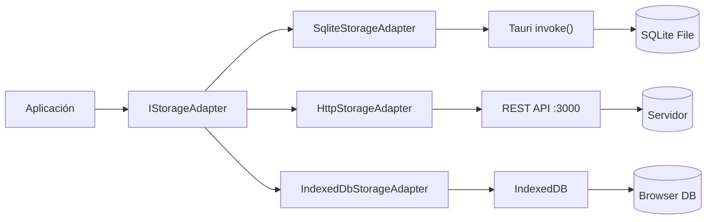

# Sistema de Almacenamiento

TPV El Haido implementa un sistema flexible de almacenamiento que permite cambiar entre diferentes backends sin modificar el código de la aplicación.

## Arquitectura



## Modos de Almacenamiento

| Modo | Adapter | Puerto | Uso Principal |
|------|---------|--------|---------------|
| `sqlite` | SqliteStorageAdapter | - | Producción (Tauri nativo) |
| `http` | HttpStorageAdapter | 3000 | Desarrollo con haido-db |
| `indexeddb` | IndexedDbStorageAdapter | - | Fallback navegador / PWA |

### SQLite (Producción)

El modo por defecto en la aplicación Tauri. Los datos se almacenan en un archivo SQLite local.

**Ventajas:**
- Máximo rendimiento
- Funciona offline
- No requiere servidor externo
- Datos persistentes y seguros

**Ubicación del archivo:**

| Sistema | Ruta |
|---------|------|
| Windows | `%APPDATA%\com.elhaido.tpv\tpv-haido.db` |
| macOS | `~/Library/Application Support/com.elhaido.tpv/tpv-haido.db` |
| Linux | `~/.config/com.elhaido.tpv/tpv-haido.db` |

### HTTP (Desarrollo)

Conecta a un servidor REST (haido-db) para facilitar el desarrollo.

**Ventajas:**
- Puedes ver/editar datos en tiempo real
- Múltiples desarrolladores pueden compartir datos
- Fácil de depurar con herramientas HTTP

**Configuración:**

```bash
# Iniciar haido-db
cd haido-db && bun run dev

# En otro terminal, iniciar frontend
bun run dev
```

### IndexedDB (Fallback)

Almacenamiento en el navegador para cuando no hay backend Tauri disponible.

**Ventajas:**
- Funciona en cualquier navegador
- Ideal para modo web/PWA
- No requiere instalación

**Limitaciones:**
- Límite de almacenamiento del navegador
- Los datos se pierden si el usuario limpia el navegador

## Interfaz IStorageAdapter

Todas las implementaciones deben cumplir esta interfaz:

```typescript
// src/services/storage-adapter.interface.ts

export type StorageResult<T> = Result<T, ResultError>;

export interface IStorageAdapter {
  // === Products ===
  getProducts(): Promise<StorageResult<Product[]>>;
  createProduct(product: Product): Promise<StorageResult<void>>;
  updateProduct(product: Product): Promise<StorageResult<void>>;
  deleteProduct(product: Product): Promise<StorageResult<void>>;

  // === Categories ===
  getCategories(): Promise<StorageResult<Category[]>>;
  createCategory(category: Category): Promise<StorageResult<void>>;
  updateCategory(category: Category): Promise<StorageResult<void>>;
  deleteCategory(category: Category): Promise<StorageResult<void>>;

  // === Orders ===
  getOrders(): Promise<StorageResult<Order[]>>;
  getOrderById(id: string): Promise<StorageResult<Order | null>>;
  createOrder(order: Order): Promise<StorageResult<void>>;
  updateOrder(order: Order): Promise<StorageResult<void>>;

  // === Customers ===
  getCustomers(): Promise<StorageResult<Customer[]>>;
  createCustomer(customer: Customer): Promise<StorageResult<void>>;
  updateCustomer(customer: Customer): Promise<StorageResult<void>>;
  deleteCustomer(customer: Customer): Promise<StorageResult<void>>;

  // === Users ===
  getUsers(): Promise<StorageResult<User[]>>;
  createUser(user: User): Promise<StorageResult<void>>;
  updateUser(user: User): Promise<StorageResult<void>>;
  deleteUser(user: User): Promise<StorageResult<void>>;

  // === Tables ===
  getTables(): Promise<StorageResult<Table[]>>;
  updateTable(table: Table): Promise<StorageResult<void>>;
}
```

## Implementación: SqliteStorageAdapter

```typescript
// src/services/sqlite-storage-adapter.ts

import { invoke } from '@tauri-apps/api/core';
import { tryCatchAsync } from '@mks2508/no-throw';
import { StorageErrorCode } from '@/lib/error-codes';
import type { IStorageAdapter, StorageResult } from './storage-adapter.interface';

export class SqliteStorageAdapter implements IStorageAdapter {
  async getProducts(): Promise<StorageResult<Product[]>> {
    return tryCatchAsync(
      async () => {
        const products = await invoke<Product[]>('get_products');
        return products;
      },
      StorageErrorCode.ReadFailed
    );
  }

  async createProduct(product: Product): Promise<StorageResult<void>> {
    return tryCatchAsync(
      async () => {
        await invoke('create_product', { product });
      },
      StorageErrorCode.WriteFailed
    );
  }

  async updateProduct(product: Product): Promise<StorageResult<void>> {
    return tryCatchAsync(
      async () => {
        await invoke('update_product', { product });
      },
      StorageErrorCode.WriteFailed
    );
  }

  async deleteProduct(product: Product): Promise<StorageResult<void>> {
    return tryCatchAsync(
      async () => {
        await invoke('delete_product', { id: product.id });
      },
      StorageErrorCode.DeleteFailed
    );
  }

  // ... resto de métodos
}
```

## Implementación: HttpStorageAdapter

```typescript
// src/services/http-storage-adapter.ts

import { tryCatchAsync } from '@mks2508/no-throw';
import { StorageErrorCode } from '@/lib/error-codes';
import type { IStorageAdapter, StorageResult } from './storage-adapter.interface';

export class HttpStorageAdapter implements IStorageAdapter {
  private baseUrl: string;

  constructor(baseUrl = 'http://localhost:3000/api') {
    this.baseUrl = baseUrl;
  }

  async getProducts(): Promise<StorageResult<Product[]>> {
    return tryCatchAsync(
      async () => {
        const response = await fetch(`${this.baseUrl}/products`);
        if (!response.ok) throw new Error('Failed to fetch');
        return response.json();
      },
      StorageErrorCode.ReadFailed
    );
  }

  async createProduct(product: Product): Promise<StorageResult<void>> {
    return tryCatchAsync(
      async () => {
        const response = await fetch(`${this.baseUrl}/products`, {
          method: 'POST',
          headers: { 'Content-Type': 'application/json' },
          body: JSON.stringify(product),
        });
        if (!response.ok) throw new Error('Failed to create');
      },
      StorageErrorCode.WriteFailed
    );
  }

  // ... resto de métodos
}
```

## Implementación: IndexedDbStorageAdapter

```typescript
// src/services/indexeddb-storage-adapter.ts

import { tryCatchAsync } from '@mks2508/no-throw';
import { StorageErrorCode } from '@/lib/error-codes';
import type { IStorageAdapter, StorageResult } from './storage-adapter.interface';

export class IndexedDbStorageAdapter implements IStorageAdapter {
  private dbName = 'tpv-haido';
  private db: IDBDatabase | null = null;

  private async getDb(): Promise<IDBDatabase> {
    if (this.db) return this.db;

    return new Promise((resolve, reject) => {
      const request = indexedDB.open(this.dbName, 1);

      request.onerror = () => reject(request.error);
      request.onsuccess = () => {
        this.db = request.result;
        resolve(this.db);
      };

      request.onupgradeneeded = (event) => {
        const db = (event.target as IDBOpenDBRequest).result;
        db.createObjectStore('products', { keyPath: 'id' });
        db.createObjectStore('categories', { keyPath: 'id' });
        db.createObjectStore('orders', { keyPath: 'id' });
        db.createObjectStore('customers', { keyPath: 'id' });
        db.createObjectStore('users', { keyPath: 'id' });
      };
    });
  }

  async getProducts(): Promise<StorageResult<Product[]>> {
    return tryCatchAsync(
      async () => {
        const db = await this.getDb();
        return new Promise((resolve, reject) => {
          const transaction = db.transaction('products', 'readonly');
          const store = transaction.objectStore('products');
          const request = store.getAll();

          request.onerror = () => reject(request.error);
          request.onsuccess = () => resolve(request.result);
        });
      },
      StorageErrorCode.ReadFailed
    );
  }

  // ... resto de métodos
}
```

## Cambiar de Modo en Runtime

El modo de almacenamiento se puede cambiar sin reiniciar la aplicación:

```typescript
// En el store
import { SqliteStorageAdapter } from '@/services/sqlite-storage-adapter';
import { HttpStorageAdapter } from '@/services/http-storage-adapter';
import { IndexedDbStorageAdapter } from '@/services/indexeddb-storage-adapter';

const useStore = create((set, get) => ({
  storageMode: 'sqlite' as StorageMode,
  storageAdapter: new SqliteStorageAdapter(),

  setStorageMode: async (mode: StorageMode) => {
    let adapter: IStorageAdapter;

    switch (mode) {
      case 'sqlite':
        adapter = new SqliteStorageAdapter();
        break;
      case 'http':
        adapter = new HttpStorageAdapter();
        break;
      case 'indexeddb':
        adapter = new IndexedDbStorageAdapter();
        break;
    }

    set({ storageMode: mode, storageAdapter: adapter });

    // Recargar datos con el nuevo adapter
    await get().loadAllData();
  },
}));
```

## Detección Automática

En el inicio de la aplicación, detectamos el mejor modo:

```typescript
async function detectStorageMode(): Promise<StorageMode> {
  // Si estamos en Tauri, usar SQLite
  if (window.__TAURI__) {
    return 'sqlite';
  }

  // Si hay servidor HTTP disponible, usarlo
  try {
    const response = await fetch('http://localhost:3000/health');
    if (response.ok) return 'http';
  } catch {
    // Servidor no disponible
  }

  // Fallback a IndexedDB
  return 'indexeddb';
}
```

## Siguiente Paso

- [AEAT Técnico](/docs/desarrollo/aeat-tecnico)
- [Comandos](/docs/desarrollo/comandos)
