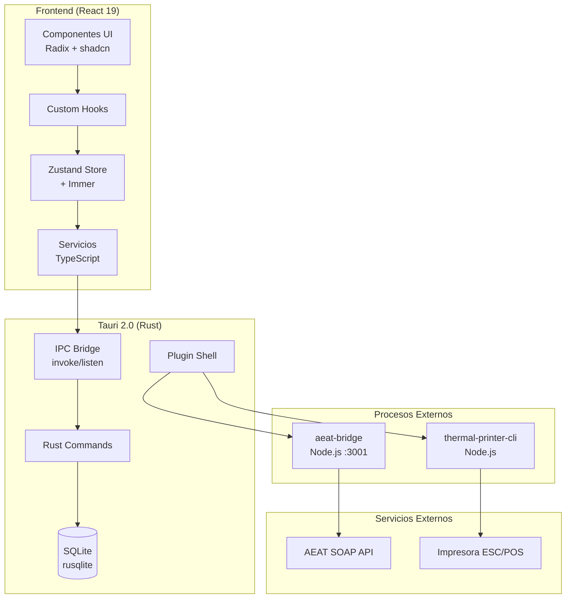
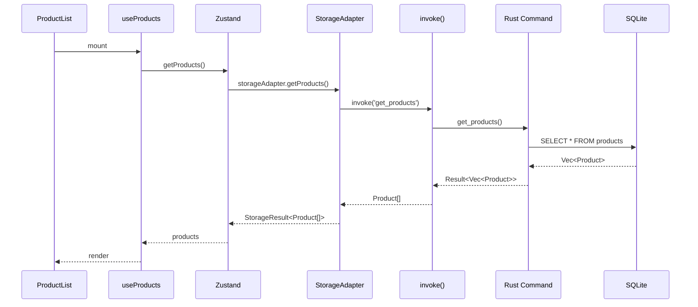
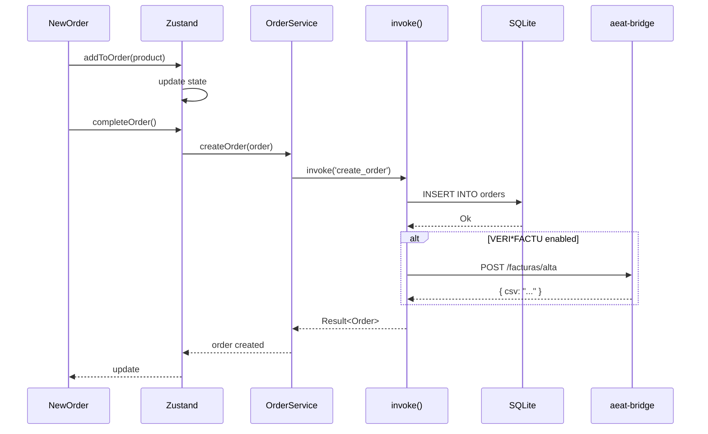
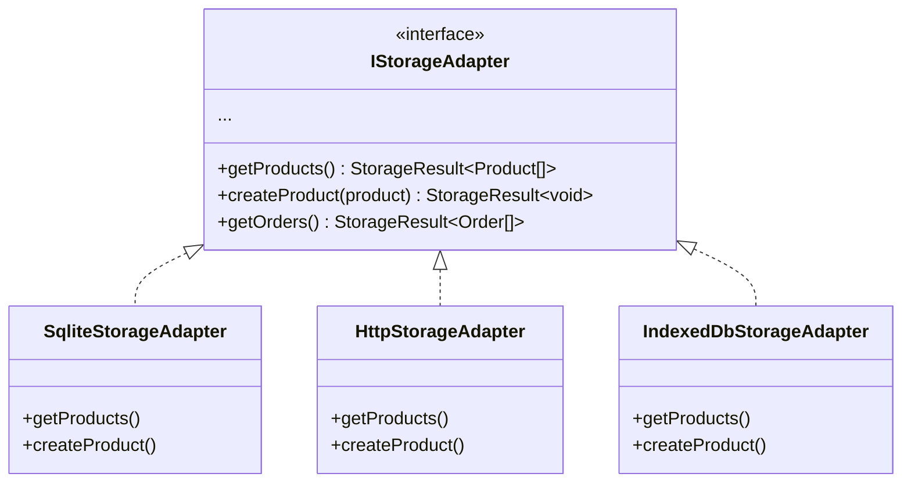

# Arquitectura

TPV El Haido sigue una arquitectura de capas con separación clara entre frontend, backend y servicios externos.

## Diagrama General



## Capas

### Frontend (React)

| Capa | Responsabilidad | Ubicación |
|------|-----------------|-----------|
| **UI** | Renderizado, interacción | `src/components/` |
| **Hooks** | Lógica de componentes | `src/hooks/` |
| **Store** | Estado global | `src/store/` |
| **Services** | Lógica de negocio | `src/services/` |
| **Models** | Tipos TypeScript | `src/models/` |

### Backend (Tauri/Rust)

| Capa | Responsabilidad | Ubicación |
|------|-----------------|-----------|
| **Commands** | API para frontend | `src-tauri/src/lib.rs` |
| **Database** | Operaciones SQLite | `src-tauri/src/database.rs` |
| **Models** | Structs Rust | `src-tauri/src/models.rs` |

### Sidecars

| Sidecar | Función | Puerto |
|---------|---------|--------|
| **aeat-bridge** | Comunicación SOAP con AEAT | 3001 |
| **thermal-printer-cli** | Impresión ESC/POS | CLI |

## Flujo de Datos

### Lectura de Productos



### Creación de Pedido



## Patrones de Arquitectura

### Strategy Pattern (Storage)

El sistema usa el patrón Strategy para abstraer el almacenamiento:



### Result Pattern (Errores)

Todas las operaciones asíncronas retornan `Result<T, E>`:

```typescript
// En lugar de:
try {
  const products = await getProducts();
} catch (e) {
  // handle error
}

// Usamos:
const result = await getProducts();
if (isErr(result)) {
  console.error(result.error.code);
} else {
  const products = result.value;
}
```

## Comunicación IPC

### Frontend → Rust

```typescript
// TypeScript
import { invoke } from '@tauri-apps/api/core';

const products = await invoke<Product[]>('get_products');
```

```rust
// Rust
#[tauri::command]
fn get_products(state: State<AppState>) -> Result<Vec<Product>, String> {
    state.db.get_products()
}
```

### Rust → Frontend (Eventos)

```rust
// Rust
app.emit("order-created", &order)?;
```

```typescript
// TypeScript
import { listen } from '@tauri-apps/api/event';

await listen('order-created', (event) => {
  console.log('New order:', event.payload);
});
```

## Base de Datos

### Schema SQLite

```sql
-- Productos
CREATE TABLE products (
    id TEXT PRIMARY KEY,
    name TEXT NOT NULL,
    price REAL NOT NULL,
    category TEXT NOT NULL,
    brand TEXT,
    icon_type TEXT,
    selected_icon TEXT,
    uploaded_image TEXT,
    stock INTEGER DEFAULT 0
);

-- Categorías
CREATE TABLE categories (
    id TEXT PRIMARY KEY,
    name TEXT NOT NULL,
    description TEXT,
    icon TEXT
);

-- Pedidos
CREATE TABLE orders (
    id TEXT PRIMARY KEY,
    date TEXT NOT NULL,
    total REAL NOT NULL,
    status TEXT DEFAULT 'inProgress',
    payment_method TEXT DEFAULT 'efectivo',
    table_number INTEGER,
    user_id TEXT
);

-- Items de pedido
CREATE TABLE order_items (
    id TEXT PRIMARY KEY,
    order_id TEXT NOT NULL,
    product_id TEXT NOT NULL,
    name TEXT NOT NULL,
    price REAL NOT NULL,
    quantity INTEGER DEFAULT 1,
    FOREIGN KEY (order_id) REFERENCES orders(id)
);
```

### Ubicación del Archivo

| Sistema | Ruta |
|---------|------|
| Windows | `%APPDATA%\com.elhaido.tpv\tpv-haido.db` |
| macOS | `~/Library/Application Support/com.elhaido.tpv/tpv-haido.db` |
| Linux | `~/.config/com.elhaido.tpv/tpv-haido.db` |

## Seguridad

### Sandboxing Tauri

Tauri aplica sandboxing por defecto:
- Acceso a sistema de archivos restringido
- Red solo a dominios permitidos
- IPC tipado entre Rust y JS

### Permisos

Configurados en `src-tauri/capabilities/`:

```json
{
  "permissions": [
    "shell:allow-spawn",
    "http:default",
    "updater:default"
  ]
}
```

## Siguiente Paso

- [Stack Tecnológico](/docs/desarrollo/stack)
- [Patrones](/docs/desarrollo/patrones)
- [Almacenamiento](/docs/desarrollo/almacenamiento)
