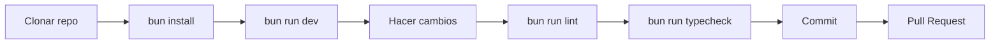

import { Cards, Card } from 'fumadocs-ui/components/card';

# Guía de Desarrollo

Bienvenido a la documentación técnica de TPV El Haido. Esta sección está dirigida a desarrolladores que quieran entender, modificar o contribuir al proyecto.

## Requisitos Previos

| Herramienta | Versión | Instalación |
|-------------|---------|-------------|
| **Node.js** | 18+ | [nodejs.org](https://nodejs.org) |
| **Bun** | 1.0+ | `curl -fsSL https://bun.sh/install \| bash` |
| **Rust** | 1.70+ | [rustup.rs](https://rustup.rs) |
| **Tauri CLI** | 2.0+ | `cargo install tauri-cli` |

## Quick Start

<Steps>

### Clonar el repositorio

```bash
git clone https://github.com/MKS2508/tpv-el-haido2.git
cd tpv-el-haido2
```

### Instalar dependencias

```bash
bun install
```

### Desarrollo (solo frontend)

```bash
bun run dev
```

Abre [http://localhost:1420](http://localhost:1420) en tu navegador.

### Desarrollo completo (Tauri + frontend)

```bash
bun run tauri dev
```

Se abrirá la aplicación de escritorio con hot-reload.

</Steps>

## Secciones de Desarrollo

<Cards>
  <Card title="Arquitectura" href="/docs/desarrollo/arquitectura">
    Diagrama de capas y flujo de datos
  </Card>
  <Card title="Stack Tecnológico" href="/docs/desarrollo/stack">
    Dependencias y versiones exactas
  </Card>
  <Card title="Patrones" href="/docs/desarrollo/patrones">
    Strategy Pattern, Result Pattern
  </Card>
  <Card title="Almacenamiento" href="/docs/desarrollo/almacenamiento">
    Storage Adapters y modos
  </Card>
  <Card title="AEAT Técnico" href="/docs/desarrollo/aeat-tecnico">
    Integración SOAP con AEAT
  </Card>
  <Card title="Comandos" href="/docs/desarrollo/comandos">
    Scripts de npm/bun
  </Card>
  <Card title="Manejo de Errores" href="/docs/desarrollo/errores">
    Códigos y Result Pattern
  </Card>
  <Card title="Plataformas" href="/docs/desarrollo/plataformas">
    Builds multiplataforma
  </Card>
</Cards>

## Estructura del Proyecto

```
tpv-el-haido2/
├── src/                    # Frontend React
│   ├── components/         # Componentes UI
│   │   ├── Sections/       # Páginas principales
│   │   └── ui/             # Componentes base (shadcn)
│   ├── hooks/              # Custom hooks
│   ├── lib/                # Utilidades y config
│   │   └── themes/         # Sistema de temas
│   ├── models/             # Interfaces TypeScript
│   ├── services/           # Lógica de negocio
│   │   └── platform/       # Abstracción de plataforma
│   ├── store/              # Estado Zustand
│   └── styles/             # CSS global
├── src-tauri/              # Backend Rust
│   ├── src/                # Código Rust
│   ├── sidecars/           # Binarios externos
│   └── icons/              # Iconos de la app
├── apps/                   # Monorepo apps
│   └── haidodocs/          # Esta documentación
└── docs/                   # Documentación legacy
```

## Alias de Importación

Usa `@/` para importar desde `src/`:

```typescript
import useStore from '@/store/store';
import type Product from '@/models/Product';
import { StorageErrorCode } from '@/lib/error-codes';
```

## Puertos de Desarrollo

| Servicio | Puerto | Descripción |
|----------|--------|-------------|
| Vite dev server | 1420 | Frontend React |
| haido-db | 3000 | API REST (desarrollo) |
| aeat-bridge | 3001 | Sidecar AEAT |

## Flujo de Trabajo



## Contribuir

1. **Fork** el repositorio
2. Crea una **rama** para tu feature: `git checkout -b feature/nueva-funcionalidad`
3. Haz tus **cambios** siguiendo las guías de estilo
4. **Lint y typecheck**: `bun run lint && bun run typecheck`
5. **Commit**: `git commit -m 'feat: añadir nueva funcionalidad'`
6. **Push**: `git push origin feature/nueva-funcionalidad`
7. Abre un **Pull Request**

### Convención de Commits

Usamos [Conventional Commits](https://www.conventionalcommits.org/):

| Prefijo | Uso |
|---------|-----|
| `feat:` | Nueva funcionalidad |
| `fix:` | Corrección de bug |
| `docs:` | Documentación |
| `style:` | Formateo, sin cambios de código |
| `refactor:` | Refactoring |
| `test:` | Tests |
| `chore:` | Mantenimiento |

## Siguiente Paso

- [Arquitectura](/docs/desarrollo/arquitectura) - Entender la estructura
- [Stack Tecnológico](/docs/desarrollo/stack) - Ver dependencias
- [Comandos](/docs/desarrollo/comandos) - Scripts disponibles
