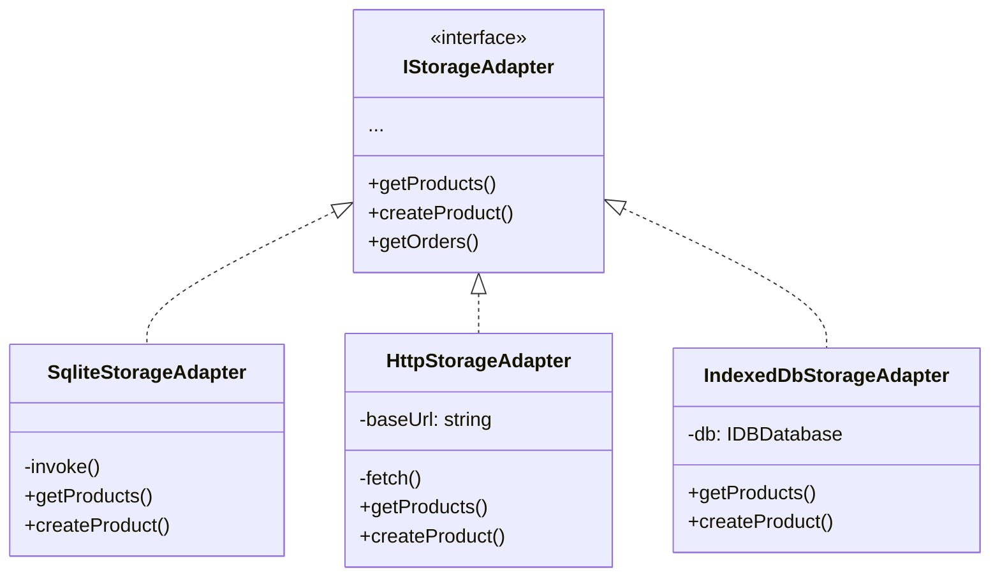

# Patrones de Diseño

TPV El Haido utiliza varios patrones de diseño para mantener el código limpio, testeable y extensible.

## Strategy Pattern (Storage Adapters)

El patrón Strategy permite intercambiar la implementación de almacenamiento sin cambiar el código del cliente.

### Problema

Necesitamos soportar múltiples backends de almacenamiento:
- SQLite (producción nativa)
- HTTP REST API (desarrollo)
- IndexedDB (fallback web)

### Solución

Definimos una interfaz común `IStorageAdapter` que todas las implementaciones deben seguir:

```typescript
// src/services/storage-adapter.interface.ts

import type { StorageResult } from '@/lib/result';
import type { Product, Category, Order, Customer } from '@/models';

export interface IStorageAdapter {
  // Products
  getProducts(): Promise<StorageResult<Product[]>>;
  createProduct(product: Product): Promise<StorageResult<void>>;
  updateProduct(product: Product): Promise<StorageResult<void>>;
  deleteProduct(product: Product): Promise<StorageResult<void>>;

  // Categories
  getCategories(): Promise<StorageResult<Category[]>>;
  createCategory(category: Category): Promise<StorageResult<void>>;
  updateCategory(category: Category): Promise<StorageResult<void>>;
  deleteCategory(category: Category): Promise<StorageResult<void>>;

  // Orders
  getOrders(): Promise<StorageResult<Order[]>>;
  createOrder(order: Order): Promise<StorageResult<void>>;
  updateOrder(order: Order): Promise<StorageResult<void>>;

  // Customers
  getCustomers(): Promise<StorageResult<Customer[]>>;
  createCustomer(customer: Customer): Promise<StorageResult<void>>;
  updateCustomer(customer: Customer): Promise<StorageResult<void>>;
  deleteCustomer(customer: Customer): Promise<StorageResult<void>>;
}
```

### Implementaciones



### Ejemplo: SqliteStorageAdapter

```typescript
// src/services/sqlite-storage-adapter.ts

import { invoke } from '@tauri-apps/api/core';
import { tryCatchAsync, type StorageResult } from '@mks2508/no-throw';
import { StorageErrorCode } from '@/lib/error-codes';
import type { IStorageAdapter } from './storage-adapter.interface';
import type { Product } from '@/models/Product';

export class SqliteStorageAdapter implements IStorageAdapter {
  async getProducts(): Promise<StorageResult<Product[]>> {
    return tryCatchAsync(
      async () => invoke<Product[]>('get_products'),
      StorageErrorCode.ReadFailed
    );
  }

  async createProduct(product: Product): Promise<StorageResult<void>> {
    return tryCatchAsync(
      async () => invoke('create_product', { product }),
      StorageErrorCode.WriteFailed
    );
  }

  // ... resto de métodos
}
```

### Uso en el Store

```typescript
// src/store/store.ts

import { create } from 'zustand';
import { immer } from 'zustand/middleware/immer';
import type { IStorageAdapter } from '@/services/storage-adapter.interface';

interface AppState {
  storageAdapter: IStorageAdapter;
  setStorageAdapter: (adapter: IStorageAdapter) => void;
  products: Product[];
  loadProducts: () => Promise<void>;
}

export const useStore = create<AppState>()(
  immer((set, get) => ({
    storageAdapter: new SqliteStorageAdapter(),

    setStorageAdapter: (adapter) => {
      set({ storageAdapter: adapter });
    },

    loadProducts: async () => {
      const result = await get().storageAdapter.getProducts();
      if (!isErr(result)) {
        set({ products: result.value });
      }
    },
  }))
);
```

## Result Pattern (Error Handling)

El Result Pattern evita el uso de excepciones, haciendo el manejo de errores explícito y tipado.

### Problema

Las excepciones en JavaScript/TypeScript:
- No son tipadas (cualquier cosa puede ser `throw`)
- Se propagan implícitamente
- Fáciles de olvidar en el `catch`

### Solución

Usamos `@mks2508/no-throw` para retornar errores como valores:

```typescript
import {
  ok,
  err,
  isOk,
  isErr,
  tryCatch,
  tryCatchAsync,
  tapErr,
  unwrapOr,
  type Result,
  type ResultError
} from '@mks2508/no-throw';
```

### Tipos Básicos

```typescript
// Un Result puede ser Ok(valor) o Err(error)
type Result<T, E = ResultError> =
  | { ok: true; value: T }
  | { ok: false; error: E };

// Un ResultError tiene código y mensaje
interface ResultError {
  code: string;
  message: string;
  cause?: unknown;
}
```

### Crear Results

```typescript
// Crear un Ok
const success = ok(42);
// { ok: true, value: 42 }

// Crear un Err
const failure = err('FAILED', 'Something went wrong');
// { ok: false, error: { code: 'FAILED', message: 'Something went wrong' } }
```

### Capturar Excepciones

```typescript
// Síncrono
const result = tryCatch(
  () => JSON.parse(invalidJson),
  'PARSE_ERROR'
);

// Asíncrono
const result = await tryCatchAsync(
  async () => fetch('/api/products'),
  'NETWORK_ERROR'
);
```

### Manejar Results

```typescript
// Verificar tipo
if (isOk(result)) {
  console.log(result.value);
}

if (isErr(result)) {
  console.error(result.error.code);
}

// Ejecutar efecto en error
tapErr(result, (error) => {
  logError(error);
});

// Valor por defecto
const products = unwrapOr(result, []);
```

### Ejemplo Completo

```typescript
import {
  tryCatchAsync,
  isErr,
  tapErr,
  unwrapOr
} from '@mks2508/no-throw';
import { StorageErrorCode } from '@/lib/error-codes';

async function loadAndDisplayProducts() {
  // Intentar cargar productos
  const result = await tryCatchAsync(
    async () => storageAdapter.getProducts(),
    StorageErrorCode.ReadFailed
  );

  // Log de errores
  tapErr(result, (error) => {
    console.error(`[${error.code}] ${error.message}`);
    notifyUser('Error cargando productos');
  });

  // Usar valor o array vacío
  const products = unwrapOr(result, []);

  // Continuar con los productos (puede ser [] si hubo error)
  renderProducts(products);
}
```

## Códigos de Error por Dominio

Organizamos los códigos de error por dominio funcional:

```typescript
// src/lib/error-codes.ts

export const StorageErrorCode = {
  ReadFailed: 'STORAGE_READ_FAILED',
  WriteFailed: 'STORAGE_WRITE_FAILED',
  DeleteFailed: 'STORAGE_DELETE_FAILED',
  NotFound: 'STORAGE_NOT_FOUND',
} as const;

export const PrinterErrorCode = {
  ConnectionFailed: 'PRINTER_CONNECTION_FAILED',
  PrintFailed: 'PRINTER_PRINT_FAILED',
  NotConfigured: 'PRINTER_NOT_CONFIGURED',
} as const;

export const OrderErrorCode = {
  CreateFailed: 'ORDER_CREATE_FAILED',
  InvalidState: 'ORDER_INVALID_STATE',
  EmptyOrder: 'ORDER_EMPTY',
} as const;

export const AuthErrorCode = {
  InvalidPin: 'AUTH_INVALID_PIN',
  UserNotFound: 'AUTH_USER_NOT_FOUND',
  SessionExpired: 'AUTH_SESSION_EXPIRED',
} as const;

export const AEATErrorCode = {
  CertExpired: 'AEAT_CERT_EXPIRED',
  CertInvalid: 'AEAT_CERT_INVALID',
  ConnectionFailed: 'AEAT_CONNECTION_FAILED',
  Rejected: 'AEAT_REJECTED',
} as const;
```

## ErrorBoundary Pattern

Para errores de renderizado, usamos ErrorBoundary con tres niveles:

```typescript
// src/components/ErrorBoundary.tsx

type ErrorLevel = 'app' | 'section' | 'component';

interface Props {
  level: ErrorLevel;
  fallback?: ReactNode;
  children: ReactNode;
}

export function ErrorBoundary({ level, fallback, children }: Props) {
  // Implementación...
}
```

### Niveles

| Nivel | Fallback | Uso |
|-------|----------|-----|
| `app` | Pantalla completa | Envuelve toda la app |
| `section` | Card con mensaje | Secciones principales |
| `component` | Inline mínimo | Componentes individuales |

### Uso

```tsx
// App level
<ErrorBoundary level="app">
  <App />
</ErrorBoundary>

// Section level
<ErrorBoundary level="section" fallback={<ErrorCard />}>
  <ProductList />
</ErrorBoundary>

// Component level
<ErrorBoundary level="component">
  <PriceDisplay price={product.price} />
</ErrorBoundary>
```

## Siguiente Paso

- [Almacenamiento](/docs/desarrollo/almacenamiento)
- [Manejo de Errores](/docs/desarrollo/errores)
