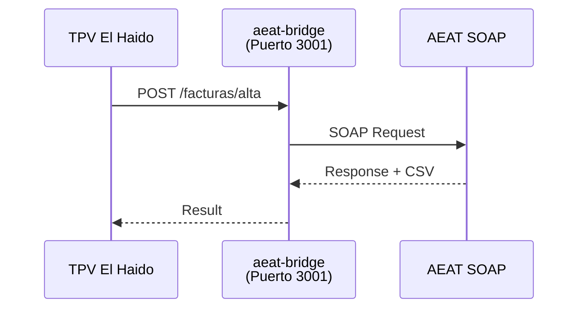

# Facturación VERI*FACTU

TPV El Haido incluye integración con el sistema VERI*FACTU de la Agencia Tributaria (AEAT) para el envío automático de facturas electrónicas.

## ¿Qué es VERI*FACTU?

VERI*FACTU es el sistema de la AEAT para verificar facturas electrónicas. Permite:

- Envío automático de facturas a la AEAT
- Verificación de facturas mediante CSV (Código Seguro de Verificación)
- Cumplimiento de la normativa española de facturación electrónica

<Callout type="warning">
  La obligatoriedad de VERI*FACTU depende del tipo y tamaño de tu negocio. Consulta con tu asesor fiscal.
</Callout>

## Configuración Inicial

<Steps>

### Acceder a Configuración

1. Ve a **Ajustes → VERI*FACTU**

### Datos del Emisor

Introduce los datos fiscales de tu negocio:

| Campo | Descripción | Ejemplo |
|-------|-------------|---------|
| **NIF** | Número de Identificación Fiscal | B12345678 |
| **Razón Social** | Nombre fiscal de la empresa | Bar El Haido S.L. |
| **Dirección** | Dirección fiscal completa | C/ Principal, 1 |
| **Código Postal** | CP de la dirección fiscal | 28001 |
| **Población** | Ciudad | Madrid |

### Serie de Factura

Configura el formato de numeración:
- **Prefijo**: Identificador de serie (ej: "TPV-", "F2024-")
- **Número inicial**: Primer número de factura

### Tipo de Factura

| Tipo | Código | Uso |
|------|--------|-----|
| **Factura completa** | F1 | Facturas con todos los datos del cliente |
| **Factura simplificada** | F2 | Tickets sin datos completos del cliente |

<Callout type="info">
  La mayoría de TPV usan **F2** (factura simplificada) para tickets de venta directa.
</Callout>

</Steps>

## Certificado Digital

Para enviar facturas a la AEAT necesitas un certificado digital válido.

### Tipos de Certificado

| Tipo | Formato | Recomendado para |
|------|---------|------------------|
| **Personal** | PFX/P12 | Autónomos |
| **Sello de empresa** | PFX/P12 | Sociedades |
| **PEM** | .crt + .key | Configuraciones avanzadas |

### Instalar Certificado

<Steps>

### Obtener certificado

1. Solicita tu certificado en [FNMT](https://www.sede.fnmt.gob.es/)
2. O usa un certificado de otra entidad autorizada
3. Exporta el certificado en formato PFX/P12 con contraseña

### Cargar en TPV El Haido

1. En **Ajustes → VERI*FACTU → Certificado**
2. Haz clic en **Cargar Certificado**
3. Selecciona el archivo PFX/P12
4. Introduce la contraseña del certificado
5. Haz clic en **Verificar**

### Confirmar instalación

Si el certificado es válido, verás:
- Nombre del titular
- Fecha de caducidad
- Estado: "Válido"

</Steps>

<Callout type="warning">
  Guarda la contraseña del certificado en un lugar seguro. Sin ella no podrás usarlo.
</Callout>

## Modos de Operación

TPV El Haido ofrece tres modos de conexión con AEAT:

| Modo | Descripción | Uso |
|------|-------------|-----|
| **Deshabilitado** | VERI*FACTU desactivado | No envía facturas a AEAT |
| **Sidecar** | Usa aeat-bridge local | Recomendado, proceso local |
| **Externo** | Servidor AEAT remoto | Multi-terminal, servidor centralizado |

### Modo Sidecar (Recomendado)

El sidecar `aeat-bridge` se ejecuta localmente en el puerto 3001:

Ventajas:
- Sin dependencia de servidor externo
- El proceso se inicia automáticamente
- Funciona offline (cola de envío)

### Modo Externo

Para conectar a un servidor AEAT Bridge centralizado:
1. Introduce la URL del servidor (ej: `https://aeat.miempresa.com`)
2. Configura las credenciales si es necesario

## Entornos

| Entorno | Descripción | URL AEAT |
|---------|-------------|----------|
| **Pruebas** | Para testing, no tiene efectos legales | Sandbox AEAT |
| **Producción** | Envío real a la AEAT | Producción AEAT |

<Callout type="error">
  **Importante**: Asegúrate de estar en modo **Producción** cuando operes de forma real. Las facturas en modo Pruebas no son válidas.
</Callout>

## Envío de Facturas

### Envío Automático

Cuando está activado:
1. Al completar un pago, se genera la factura
2. Se envía automáticamente a la AEAT
3. Se recibe el CSV de confirmación
4. El ticket incluye el CSV

### Envío Manual

Si prefieres controlar el envío:
1. Desactiva "Envío automático" en Ajustes
2. Las facturas quedan en estado "Pendiente"
3. Ve a **Facturas** para ver las pendientes
4. Selecciona y haz clic en "Enviar a AEAT"

## Panel de Facturas

### Acceder

En el menú lateral, haz clic en **Facturas** (o **AEAT**).

### Estados de Factura

| Estado | Color | Descripción |
|--------|-------|-------------|
| **Aceptada** | Verde | Enviada y aceptada por AEAT |
| **Pendiente** | Amarillo | Pendiente de envío |
| **Rechazada** | Rojo | Rechazada por AEAT (ver error) |
| **Sin facturar** | Gris | No se ha generado factura |

### Detalle de Factura

Al hacer clic en una factura verás el detalle completo:

Información disponible:
- Número de factura
- Fecha de emisión
- Datos del cliente (si los hay)
- Desglose de productos
- Desglose de IVA
- **CSV**: Código Seguro de Verificación
- Link para verificar en sede AEAT

### Verificar en AEAT

1. Copia el CSV de la factura
2. Ve a [sede.agenciatributaria.gob.es](https://sede.agenciatributaria.gob.es)
3. Busca "Verificar CSV"
4. Introduce el código
5. Verifica que los datos coinciden

## Resumen de IVA

El panel de facturas muestra:

| Tipo IVA | Base Imponible | Cuota |
|----------|----------------|-------|
| 21% | Suma de bases al 21% | IVA calculado |
| 10% | Suma de bases al 10% | IVA calculado |
| 4% | Suma de bases al 4% | IVA calculado |
| **Total** | **Suma total** | **Total IVA** |

Útil para la declaración trimestral.

## Solución de Problemas

### Factura rechazada

| Error | Causa | Solución |
|-------|-------|----------|
| NIF inválido | El NIF del emisor no es válido | Verifica el NIF en Ajustes |
| Certificado caducado | El certificado ha expirado | Renueva el certificado |
| Error de conexión | No se puede conectar a AEAT | Verifica conexión a internet |
| Factura duplicada | Ya existe una factura con ese número | Verifica la serie y numeración |

### El sidecar no responde

1. Verifica que el puerto 3001 está disponible
2. Reinicia la aplicación
3. Comprueba los logs en **Ajustes → Avanzado → Logs**

### Certificado no reconocido

1. Verifica que el formato es PFX/P12
2. Comprueba que la contraseña es correcta
3. Asegúrate de que el certificado no está revocado

## Consejos

### Numeración de facturas

- Usa un prefijo por año: "F2024-0001"
- Mantén la secuencia sin saltos
- No reutilices números de facturas anuladas

### Backup de certificados

- Guarda una copia del certificado en lugar seguro
- Anota la fecha de caducidad para renovar a tiempo
- Nunca compartas el certificado con contraseña

## Siguiente Paso

- [Personalizar Temas](/docs/guia-usuario/temas)
- [Volver a Guía de Usuario](/docs/guia-usuario)
