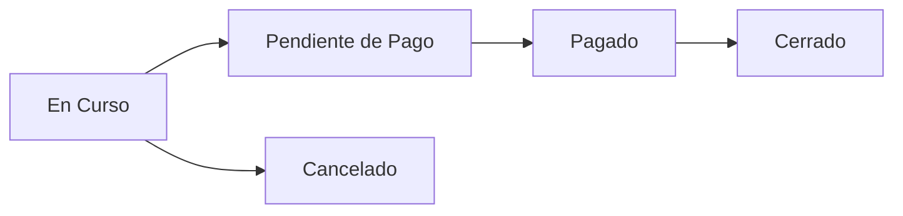

# Gestión de Pedidos

Aprende a crear, modificar y gestionar comandas en TPV El Haido.

## Crear Nueva Comanda

<Steps>

### Acceder a Nueva Comanda

En el menú lateral, haz clic en **Nueva Comanda**.

### Seleccionar Mesa (Opcional)

Si tu negocio usa mesas:
1. Verás un grid con las mesas disponibles
2. Haz clic en una mesa para asignar el pedido
3. O selecciona "Barra" / "Para llevar" si no aplica

### Añadir Productos

1. **Navega por categorías** en la barra lateral izquierda
2. **Haz clic en un producto** para añadirlo al pedido
3. El producto aparece en el resumen (panel derecho)
4. **Repite** para añadir más productos

### Revisar Pedido

En el panel de resumen verás:
- Lista de productos añadidos
- Cantidad de cada producto
- Precio por línea
- **Total del pedido**

</Steps>

## Modificar Pedido

### Cambiar Cantidades

| Acción | Cómo |
|--------|------|
| **Aumentar cantidad** | Haz clic en el botón **+** junto al producto |
| **Reducir cantidad** | Haz clic en el botón **-** |
| **Cantidad específica** | Haz clic en el número y escribe la cantidad |

### Eliminar Producto

1. Haz clic en el icono de papelera junto al producto
2. O reduce la cantidad a 0

### Añadir Nota

Para añadir instrucciones especiales (ej: "sin cebolla"):
1. Haz clic en el producto en el resumen
2. Escribe la nota en el campo de texto
3. Guarda

## Estados del Pedido

Los pedidos tienen diferentes estados:

| Estado | Descripción | Color |
|--------|-------------|-------|
| **En Curso** | Pedido activo, se pueden añadir productos | Azul |
| **Pendiente de Pago** | Listo para cobrar | Amarillo |
| **Pagado** | Pago recibido | Verde |
| **Cerrado** | Finalizado completamente | Gris |
| **Cancelado** | Pedido anulado | Rojo |

## Gestión de Mesas

### Ver Estado de Mesas

1. En **Inicio** o **Nueva Comanda**, verás el mapa de mesas
2. Cada mesa muestra su estado con colores:
   - **Verde**: Libre
   - **Rojo**: Ocupada
   - **Amarillo**: Pendiente de pago

### Cambiar Mesa

Si necesitas mover un pedido a otra mesa:
1. Abre el pedido activo
2. Haz clic en **Cambiar Mesa**
3. Selecciona la nueva mesa
4. Confirma

### Juntar Mesas

Para combinar pedidos de varias mesas:
1. Abre el pedido de la mesa principal
2. Haz clic en **Añadir Mesa**
3. Selecciona las mesas a unir
4. Los pedidos se combinan en uno solo

## Historial de Pedidos

### Acceder al Historial

1. En el menú lateral, haz clic en **Historial**
2. Verás la lista de pedidos ordenados por fecha

### Filtrar Pedidos

| Filtro | Descripción |
|--------|-------------|
| **Fecha** | Selecciona un rango de fechas |
| **Estado** | Filtra por estado (pagado, cancelado, etc.) |
| **Usuario** | Filtra por operario que creó el pedido |
| **Mesa** | Filtra por número de mesa |

### Ver Detalle

1. Haz clic en un pedido de la lista
2. Se abrirá el detalle con:
   - Productos y cantidades
   - Hora de creación
   - Método de pago
   - Usuario que lo gestionó

### Reimprimir Ticket

1. En el detalle del pedido, haz clic en **Imprimir**
2. El ticket se envía a la impresora configurada

## Operaciones Rápidas

### Repetir Pedido

Para crear un pedido idéntico a uno anterior:
1. Ve al historial
2. Abre el pedido a repetir
3. Haz clic en **Repetir Pedido**
4. Se crea una nueva comanda con los mismos productos

### Dividir Cuenta

Para dividir el pago entre varios clientes:
1. En el momento del cobro, haz clic en **Dividir**
2. Selecciona cuántas partes
3. El sistema divide el total equitativamente
4. O asigna productos específicos a cada cuenta

## Comandas en Cocina

Si usas impresora de cocina:

1. Al crear el pedido, los productos de categorías marcadas como "cocina" se envían automáticamente a la impresora de cocina
2. Puedes reenviar la comanda manualmente desde el detalle del pedido

<Callout type="info">
  Configura las categorías de cocina en **Ajustes → Impresora → Cocina**.
</Callout>

## Consejos

### Flujo eficiente

1. Familiarízate con el teclado numérico para cantidades
2. Usa la búsqueda rápida para productos
3. Configura productos favoritos para acceso rápido

### Errores comunes

| Problema | Solución |
|----------|----------|
| Producto añadido por error | Usa el botón de eliminar o reduce cantidad a 0 |
| Mesa equivocada | Usa "Cambiar Mesa" antes de cobrar |
| Precio incorrecto | Edita el producto en el catálogo |

## Siguiente Paso

- [Procesar Pagos](/docs/guia-usuario/pagos)
- [Configurar Impresora](/docs/guia-usuario/impresora)
