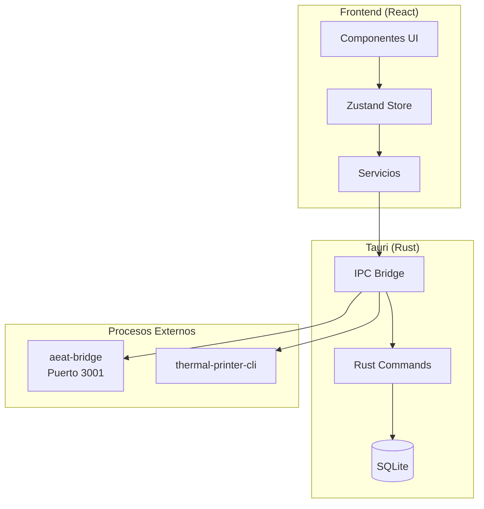

import { Cards, Card } from 'fumadocs-ui/components/card';

# TPV El Haido

**Sistema de Punto de Venta moderno para hostelería**

TPV El Haido es una aplicación de escritorio diseñada específicamente para restaurantes, bares y cafeterías. Combina una interfaz intuitiva con potentes funcionalidades de gestión y cumplimiento fiscal.

<Callout type="info">
  Disponible para **Windows**, **macOS**, **Linux** y **Raspberry Pi**.
</Callout>

## Características Principales

<Cards>
  <Card title="Gestión de Pedidos" href="/docs/guia-usuario/pedidos">
    Crea y gestiona comandas con una interfaz táctil optimizada. Asignación a mesas y control de estados en tiempo real.
  </Card>
  <Card title="Catálogo de Productos" href="/docs/guia-usuario/productos">
    CRUD completo con categorías, filtros, búsqueda y gestión de precios con IVA configurable.
  </Card>
  <Card title="Facturación VERI*FACTU" href="/docs/guia-usuario/facturacion">
    Integración completa con AEAT para facturación electrónica conforme a la normativa española.
  </Card>
  <Card title="Impresión Térmica" href="/docs/guia-usuario/impresora">
    Soporte para impresoras ESC/POS, tickets personalizables y apertura automática de cajón.
  </Card>
</Cards>

## Arquitectura



## Para Quién es TPV El Haido

| Usuario | Descripción |
|---------|-------------|
| **Hostelería** | Restaurantes, bares, cafeterías que necesitan un TPV fiable |
| **Autónomos** | Pequeños negocios que requieren cumplir con VERI*FACTU |
| **Desarrolladores** | Profesionales que quieren extender o contribuir al proyecto |

## Comenzar

<Cards>
  <Card title="Descargar" href="/docs/descarga">
    Descarga la versión para tu sistema operativo
  </Card>
  <Card title="Guía de Usuario" href="/docs/guia-usuario">
    Aprende a usar todas las funcionalidades
  </Card>
  <Card title="Desarrollo" href="/docs/desarrollo">
    Configura tu entorno de desarrollo
  </Card>
</Cards>

## Requisitos Mínimos

| Requisito | Mínimo | Recomendado |
|-----------|--------|-------------|
| **RAM** | 512 MB | 1 GB |
| **CPU** | 1 GHz (1 núcleo) | 1.5 GHz (2 núcleos) |
| **Almacenamiento** | 100 MB | 500 MB |
| **Pantalla** | 800x600 | 1024x768 o superior |

<Callout type="tip">
  TPV El Haido está optimizado para funcionar en hardware de bajo consumo como **Raspberry Pi 4/5**.
</Callout>

## Repositorio

El código fuente está disponible en GitHub:

```bash
git clone https://github.com/MKS2508/tpv-el-haido2.git
```
