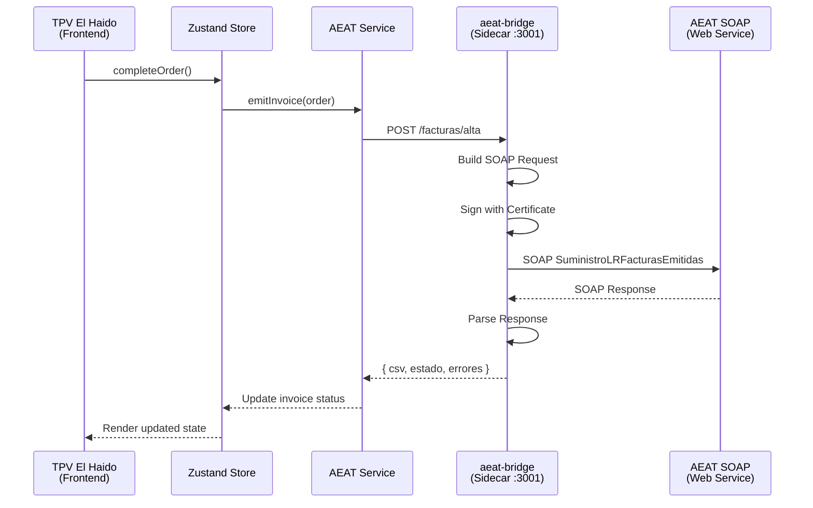
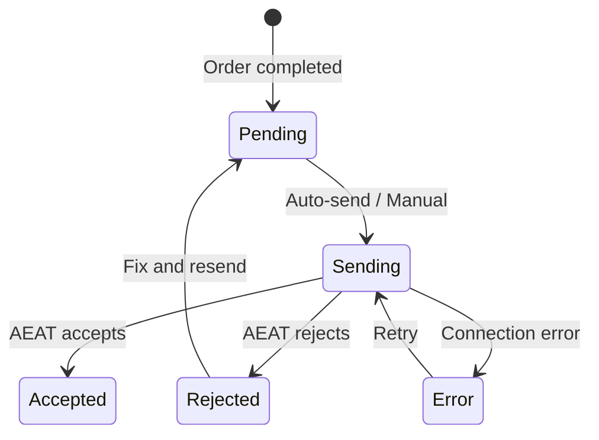

# AEAT Integration - Technical Details

Technical documentation for the integration with the Spanish Tax Agency (AEAT) VERI*FACTU system.

## Architecture



## aeat-bridge Sidecar

The `aeat-bridge` sidecar is an independent Node.js process that handles SOAP communication with AEAT.

### Structure

```
sidecars/
└── aeat-bridge/
    ├── src/
    │   ├── index.ts         # Express server
    │   ├── soap-client.ts   # SOAP client
    │   ├── certificate.ts   # Certificate handling
    │   └── types.ts         # TypeScript types
    ├── package.json
    └── tsconfig.json
```

### Endpoints

| Endpoint | Method | Description |
|----------|--------|-------------|
| `/health` | GET | Verify sidecar is active |
| `/facturas/alta` | POST | Send invoice to AEAT |
| `/facturas/anulacion` | POST | Cancel invoice |
| `/config` | GET/POST | Get/update configuration |
| `/certificate/load` | POST | Load certificate |
| `/certificate/verify` | GET | Verify current certificate |

### Request: Invoice Submission

```typescript
// POST /facturas/alta
interface AltaFacturaRequest {
  factura: {
    numeroFactura: string;
    fechaExpedicion: string;  // YYYY-MM-DD
    tipoFactura: 'F1' | 'F2';
    descripcionOperacion: string;
    importeTotal: number;
    baseImponible: number;
    cuotaRepercutida: number;
    tipoImpositivo: number;
  };
  receptor?: {
    nif: string;
    nombreRazon: string;
  };
}
```

### Response

```typescript
interface AltaFacturaResponse {
  success: boolean;
  csv?: string;              // Secure Verification Code
  estado?: 'Aceptada' | 'AceptadaConErrores' | 'Rechazada';
  errores?: Array<{
    codigo: string;
    descripcion: string;
  }>;
}
```

## AEAT Configuration

### TypeScript Types

```typescript
// src/hooks/useAEAT.ts

export type AEATMode = 'disabled' | 'sidecar' | 'external';
export type AEATEnvironment = 'test' | 'production';

export interface AEATConfig {
  mode: AEATMode;
  environment: AEATEnvironment;
  sidecarPort: number;
  externalUrl?: string;
  certificate?: AEATCertificateConfig;
  businessData: AEATBusinessData;
  autoSendInvoices: boolean;
}

export interface AEATCertificateConfig {
  type: 'pfx' | 'pem';
  path: string;
  password?: string;
}

export interface AEATBusinessData {
  nif: string;
  nombreRazon: string;
  serieFactura: string;
  tipoFactura: 'F1' | 'F2';
}
```

### Connection Modes

| Mode | Description | Configuration |
|------|-------------|---------------|
| `disabled` | VERI*FACTU disabled | No communication with AEAT |
| `sidecar` | Local aeat-bridge process | Port 3001 (default) |
| `external` | Remote AEAT Bridge server | Server URL |

### Environments

| Environment | AEAT URL | Use |
|-------------|----------|-----|
| `test` | AEAT Sandbox | Testing without legal effect |
| `production` | AEAT Production | Real invoice submission |

## SOAP Client

The sidecar uses `soap` to build and send requests:

```typescript
// sidecars/aeat-bridge/src/soap-client.ts

import * as soap from 'soap';
import * as forge from 'node-forge';

const WSDL_URLS = {
  test: 'https://www2.agenciatributaria.gob.es/static_files/common/...',
  production: 'https://www1.agenciatributaria.gob.es/...',
};

export async function sendFactura(
  factura: Factura,
  config: AEATConfig
): Promise<AEATResponse> {
  const client = await soap.createClientAsync(WSDL_URLS[config.environment]);

  // Configure certificate for signing
  client.setSecurity(
    new soap.ClientSSLSecurity(
      config.certificate.key,
      config.certificate.cert,
      { rejectUnauthorized: true }
    )
  );

  // Build invoice XML
  const request = buildSuministroRequest(factura, config.businessData);

  // Send
  const [result] = await client.SuministroLRFacturasEmitidasAsync(request);

  return parseResponse(result);
}
```

## Certificate Handling

### Supported Formats

| Format | Extension | Content |
|--------|-----------|---------|
| PFX/P12 | `.pfx`, `.p12` | Encrypted certificate + private key |
| PEM | `.crt` + `.key` | Separate certificate and key |

### Loading PFX Certificate

```typescript
// sidecars/aeat-bridge/src/certificate.ts

import * as forge from 'node-forge';
import * as fs from 'fs';

export function loadPfxCertificate(path: string, password: string) {
  const pfxBuffer = fs.readFileSync(path);
  const pfxAsn1 = forge.asn1.fromDer(pfxBuffer.toString('binary'));
  const pfx = forge.pkcs12.pkcs12FromAsn1(pfxAsn1, password);

  // Extract certificate
  const certBag = pfx.getBags({ bagType: forge.pki.oids.certBag })[
    forge.pki.oids.certBag
  ]![0];
  const cert = certBag.cert!;

  // Extract private key
  const keyBag = pfx.getBags({ bagType: forge.pki.oids.pkcs8ShroudedKeyBag })[
    forge.pki.oids.pkcs8ShroudedKeyBag
  ]![0];
  const key = keyBag.key!;

  return {
    cert: forge.pki.certificateToPem(cert),
    key: forge.pki.privateKeyToPem(key),
    subject: cert.subject.getField('CN').value,
    validTo: cert.validity.notAfter,
  };
}
```

## useAEAT Hook

```typescript
// src/hooks/useAEAT.ts

import { useStore } from '@/store/store';
import { tryCatchAsync, isErr } from '@mks2508/no-throw';
import { AEATErrorCode } from '@/lib/error-codes';

export function useAEAT() {
  const config = useStore((s) => s.aeatConfig);
  const setInvoiceStatus = useStore((s) => s.setInvoiceStatus);

  const emitInvoice = async (order: Order) => {
    if (config.mode === 'disabled') {
      return ok({ skipped: true });
    }

    const url = config.mode === 'sidecar'
      ? `http://localhost:${config.sidecarPort}`
      : config.externalUrl;

    const result = await tryCatchAsync(
      async () => {
        const response = await fetch(`${url}/facturas/alta`, {
          method: 'POST',
          headers: { 'Content-Type': 'application/json' },
          body: JSON.stringify(buildFacturaPayload(order, config)),
        });

        if (!response.ok) {
          throw new Error(`HTTP ${response.status}`);
        }

        return response.json();
      },
      AEATErrorCode.ConnectionFailed
    );

    if (isErr(result)) {
      setInvoiceStatus(order.id, 'error', result.error.message);
      return result;
    }

    const { csv, estado, errores } = result.value;

    if (estado === 'Rechazada') {
      setInvoiceStatus(order.id, 'rejected', errores?.[0]?.descripcion);
      return err(AEATErrorCode.Rejected, errores?.[0]?.descripcion ?? 'Rejected');
    }

    setInvoiceStatus(order.id, 'accepted', csv);
    return ok({ csv, estado });
  };

  return { emitInvoice, config };
}
```

## Invoice States



| State | Description | Action |
|-------|-------------|--------|
| `pending` | Pending submission | Send manually or wait for auto-send |
| `sending` | Sending to AEAT | Wait for response |
| `accepted` | Accepted by AEAT | CSV available |
| `rejected` | Rejected by AEAT | Review errors and fix |
| `error` | Communication error | Retry |

## Circuit Breaker

To avoid overwhelming AEAT in case of errors:

```typescript
class CircuitBreaker {
  private failures = 0;
  private lastFailure: Date | null = null;
  private readonly threshold = 5;
  private readonly timeout = 60000; // 1 minute

  async execute<T>(fn: () => Promise<T>): Promise<Result<T>> {
    if (this.isOpen()) {
      return err('CIRCUIT_OPEN', 'Too many failures, try later');
    }

    try {
      const result = await fn();
      this.reset();
      return ok(result);
    } catch (e) {
      this.recordFailure();
      throw e;
    }
  }

  private isOpen(): boolean {
    if (this.failures < this.threshold) return false;
    if (!this.lastFailure) return false;

    const elapsed = Date.now() - this.lastFailure.getTime();
    return elapsed < this.timeout;
  }

  private recordFailure() {
    this.failures++;
    this.lastFailure = new Date();
  }

  private reset() {
    this.failures = 0;
    this.lastFailure = null;
  }
}
```

## Next Step

- [Commands](/en/docs/development/commands)
- [Error Handling](/en/docs/development/errors)
