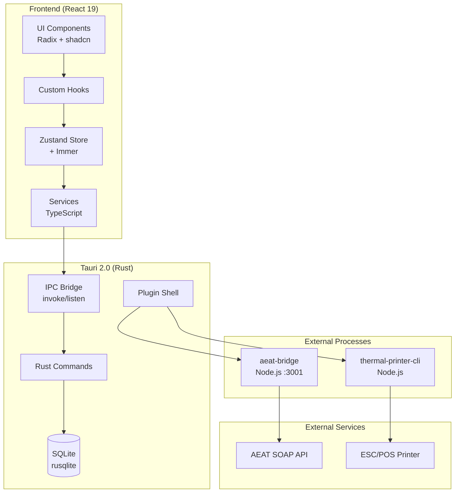
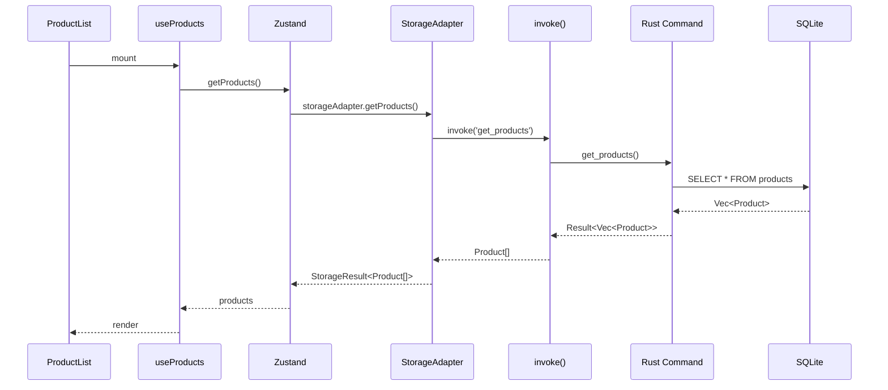
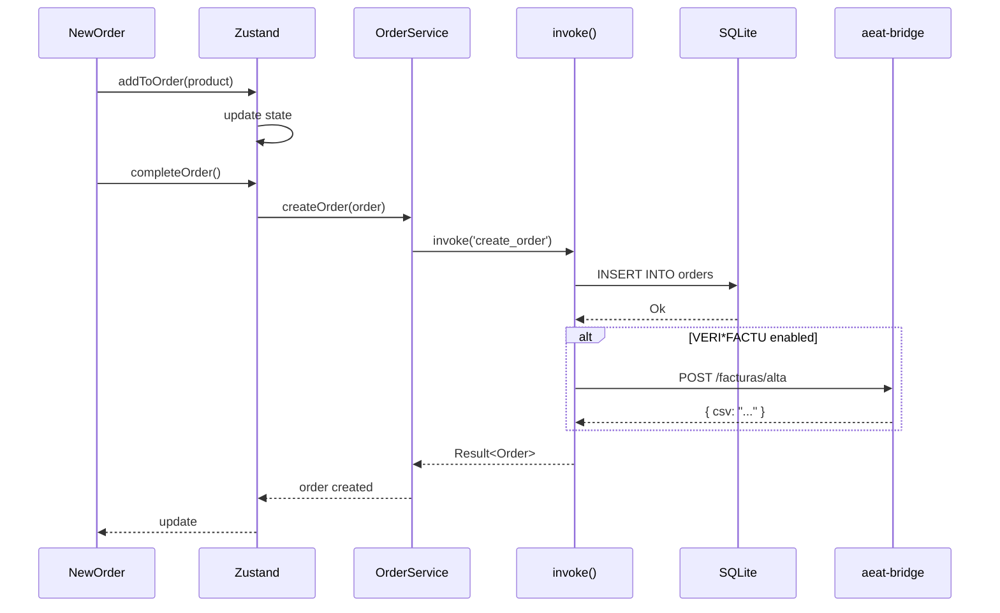
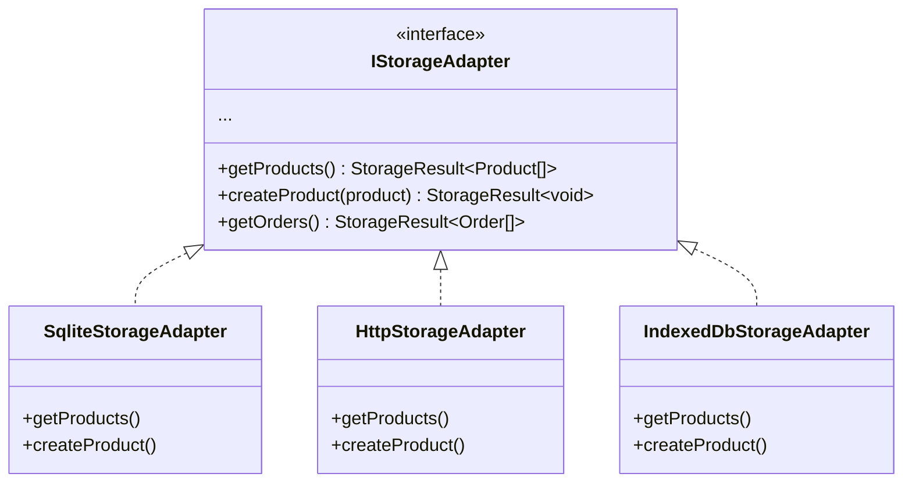

# Architecture

TPV El Haido follows a layered architecture with clear separation between frontend, backend, and external services.

## General Diagram



## Layers

### Frontend (React)

| Layer | Responsibility | Location |
|-------|----------------|----------|
| **UI** | Rendering, interaction | `src/components/` |
| **Hooks** | Component logic | `src/hooks/` |
| **Store** | Global state | `src/store/` |
| **Services** | Business logic | `src/services/` |
| **Models** | TypeScript types | `src/models/` |

### Backend (Tauri/Rust)

| Layer | Responsibility | Location |
|-------|----------------|----------|
| **Commands** | API for frontend | `src-tauri/src/lib.rs` |
| **Database** | SQLite operations | `src-tauri/src/database.rs` |
| **Models** | Rust structs | `src-tauri/src/models.rs` |

### Sidecars

| Sidecar | Function | Port |
|---------|----------|------|
| **aeat-bridge** | SOAP communication with AEAT | 3001 |
| **thermal-printer-cli** | ESC/POS printing | CLI |

## Data Flow

### Reading Products



### Creating an Order



## Architecture Patterns

### Strategy Pattern (Storage)

The system uses the Strategy pattern to abstract storage:



### Result Pattern (Errors)

All async operations return `Result<T, E>`:

```typescript
// Instead of:
try {
  const products = await getProducts();
} catch (e) {
  // handle error
}

// We use:
const result = await getProducts();
if (isErr(result)) {
  console.error(result.error.code);
} else {
  const products = result.value;
}
```

## IPC Communication

### Frontend → Rust

```typescript
// TypeScript
import { invoke } from '@tauri-apps/api/core';

const products = await invoke<Product[]>('get_products');
```

```rust
// Rust
#[tauri::command]
fn get_products(state: State<AppState>) -> Result<Vec<Product>, String> {
    state.db.get_products()
}
```

### Rust → Frontend (Events)

```rust
// Rust
app.emit("order-created", &order)?;
```

```typescript
// TypeScript
import { listen } from '@tauri-apps/api/event';

await listen('order-created', (event) => {
  console.log('New order:', event.payload);
});
```

## Database

### SQLite Schema

```sql
-- Products
CREATE TABLE products (
    id TEXT PRIMARY KEY,
    name TEXT NOT NULL,
    price REAL NOT NULL,
    category TEXT NOT NULL,
    brand TEXT,
    icon_type TEXT,
    selected_icon TEXT,
    uploaded_image TEXT,
    stock INTEGER DEFAULT 0
);

-- Categories
CREATE TABLE categories (
    id TEXT PRIMARY KEY,
    name TEXT NOT NULL,
    description TEXT,
    icon TEXT
);

-- Orders
CREATE TABLE orders (
    id TEXT PRIMARY KEY,
    date TEXT NOT NULL,
    total REAL NOT NULL,
    status TEXT DEFAULT 'inProgress',
    payment_method TEXT DEFAULT 'efectivo',
    table_number INTEGER,
    user_id TEXT
);

-- Order items
CREATE TABLE order_items (
    id TEXT PRIMARY KEY,
    order_id TEXT NOT NULL,
    product_id TEXT NOT NULL,
    name TEXT NOT NULL,
    price REAL NOT NULL,
    quantity INTEGER DEFAULT 1,
    FOREIGN KEY (order_id) REFERENCES orders(id)
);
```

### File Location

| System | Path |
|--------|------|
| Windows | `%APPDATA%\com.elhaido.tpv\tpv-haido.db` |
| macOS | `~/Library/Application Support/com.elhaido.tpv/tpv-haido.db` |
| Linux | `~/.config/com.elhaido.tpv/tpv-haido.db` |

## Security

### Tauri Sandboxing

Tauri applies sandboxing by default:
- Restricted file system access
- Network only to allowed domains
- Typed IPC between Rust and JS

### Permissions

Configured in `src-tauri/capabilities/`:

```json
{
  "permissions": [
    "shell:allow-spawn",
    "http:default",
    "updater:default"
  ]
}
```

## Next Step

- [Tech Stack](/en/docs/development/stack)
- [Patterns](/en/docs/development/patterns)
- [Storage](/en/docs/development/storage)
