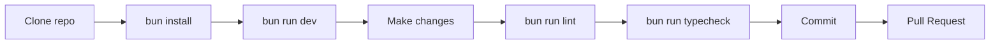

import { Cards, Card } from 'fumadocs-ui/components/card';

# Development Guide

Welcome to the technical documentation for TPV El Haido. This section is aimed at developers who want to understand, modify, or contribute to the project.

## Prerequisites

| Tool | Version | Installation |
|------|---------|--------------|
| **Node.js** | 18+ | [nodejs.org](https://nodejs.org) |
| **Bun** | 1.0+ | `curl -fsSL https://bun.sh/install \| bash` |
| **Rust** | 1.70+ | [rustup.rs](https://rustup.rs) |
| **Tauri CLI** | 2.0+ | `cargo install tauri-cli` |

## Quick Start

<Steps>

### Clone the repository

```bash
git clone https://github.com/MKS2508/tpv-el-haido2.git
cd tpv-el-haido2
```

### Install dependencies

```bash
bun install
```

### Development (frontend only)

```bash
bun run dev
```

Open [http://localhost:1420](http://localhost:1420) in your browser.

### Full development (Tauri + frontend)

```bash
bun run tauri dev
```

The desktop application opens with hot-reload.

</Steps>

## Development Sections

<Cards>
  <Card title="Architecture" href="/en/docs/development/architecture">
    Layer diagram and data flow
  </Card>
  <Card title="Tech Stack" href="/en/docs/development/stack">
    Exact dependencies and versions
  </Card>
  <Card title="Patterns" href="/en/docs/development/patterns">
    Strategy Pattern, Result Pattern
  </Card>
  <Card title="Storage" href="/en/docs/development/storage">
    Storage Adapters and modes
  </Card>
  <Card title="AEAT Technical" href="/en/docs/development/aeat-technical">
    SOAP integration with AEAT
  </Card>
  <Card title="Commands" href="/en/docs/development/commands">
    npm/bun scripts
  </Card>
  <Card title="Error Handling" href="/en/docs/development/errors">
    Codes and Result Pattern
  </Card>
  <Card title="Platforms" href="/en/docs/development/platforms">
    Multi-platform builds
  </Card>
</Cards>

## Project Structure

```
tpv-el-haido2/
├── src/                    # React Frontend
│   ├── components/         # UI Components
│   │   ├── Sections/       # Main pages
│   │   └── ui/             # Base components (shadcn)
│   ├── hooks/              # Custom hooks
│   ├── lib/                # Utilities and config
│   │   └── themes/         # Theme system
│   ├── models/             # TypeScript interfaces
│   ├── services/           # Business logic
│   │   └── platform/       # Platform abstraction
│   ├── store/              # Zustand state
│   └── styles/             # Global CSS
├── src-tauri/              # Rust Backend
│   ├── src/                # Rust code
│   ├── sidecars/           # External binaries
│   └── icons/              # App icons
├── apps/                   # Monorepo apps
│   └── haidodocs/          # This documentation
└── docs/                   # Legacy documentation
```

## Import Aliases

Use `@/` to import from `src/`:

```typescript
import useStore from '@/store/store';
import type Product from '@/models/Product';
import { StorageErrorCode } from '@/lib/error-codes';
```

## Development Ports

| Service | Port | Description |
|---------|------|-------------|
| Vite dev server | 1420 | React Frontend |
| haido-db | 3000 | REST API (development) |
| aeat-bridge | 3001 | AEAT Sidecar |

## Workflow



## Contributing

1. **Fork** the repository
2. Create a **branch** for your feature: `git checkout -b feature/new-feature`
3. Make your **changes** following style guides
4. **Lint and typecheck**: `bun run lint && bun run typecheck`
5. **Commit**: `git commit -m 'feat: add new feature'`
6. **Push**: `git push origin feature/new-feature`
7. Open a **Pull Request**

### Commit Convention

We use [Conventional Commits](https://www.conventionalcommits.org/):

| Prefix | Use |
|--------|-----|
| `feat:` | New feature |
| `fix:` | Bug fix |
| `docs:` | Documentation |
| `style:` | Formatting, no code changes |
| `refactor:` | Refactoring |
| `test:` | Tests |
| `chore:` | Maintenance |

## Next Step

- [Architecture](/en/docs/development/architecture) - Understand the structure
- [Tech Stack](/en/docs/development/stack) - View dependencies
- [Commands](/en/docs/development/commands) - Available scripts
