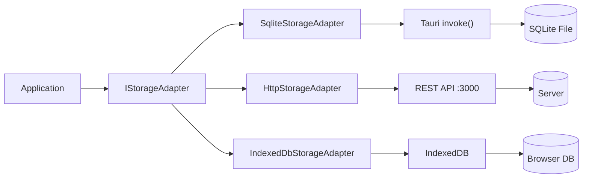

# Storage System

TPV El Haido implements a flexible storage system that allows switching between different backends without modifying application code.

## Architecture



## Storage Modes

| Mode | Adapter | Port | Main Use |
|------|---------|------|----------|
| `sqlite` | SqliteStorageAdapter | - | Production (native Tauri) |
| `http` | HttpStorageAdapter | 3000 | Development with haido-db |
| `indexeddb` | IndexedDbStorageAdapter | - | Browser fallback / PWA |

### SQLite (Production)

The default mode in the Tauri application. Data is stored in a local SQLite file.

**Advantages:**
- Maximum performance
- Works offline
- No external server required
- Persistent and secure data

**File location:**

| System | Path |
|--------|------|
| Windows | `%APPDATA%\com.elhaido.tpv\tpv-haido.db` |
| macOS | `~/Library/Application Support/com.elhaido.tpv/tpv-haido.db` |
| Linux | `~/.config/com.elhaido.tpv/tpv-haido.db` |

### HTTP (Development)

Connects to a REST server (haido-db) to facilitate development.

**Advantages:**
- You can view/edit data in real-time
- Multiple developers can share data
- Easy to debug with HTTP tools

**Configuration:**

```bash
# Start haido-db
cd haido-db && bun run dev

# In another terminal, start frontend
bun run dev
```

### IndexedDB (Fallback)

Browser storage for when there's no Tauri backend available.

**Advantages:**
- Works in any browser
- Ideal for web/PWA mode
- No installation required

**Limitations:**
- Browser storage limit
- Data is lost if user clears browser

## IStorageAdapter Interface

All implementations must fulfill this interface:

```typescript
// src/services/storage-adapter.interface.ts

export type StorageResult<T> = Result<T, ResultError>;

export interface IStorageAdapter {
  // === Products ===
  getProducts(): Promise<StorageResult<Product[]>>;
  createProduct(product: Product): Promise<StorageResult<void>>;
  updateProduct(product: Product): Promise<StorageResult<void>>;
  deleteProduct(product: Product): Promise<StorageResult<void>>;

  // === Categories ===
  getCategories(): Promise<StorageResult<Category[]>>;
  createCategory(category: Category): Promise<StorageResult<void>>;
  updateCategory(category: Category): Promise<StorageResult<void>>;
  deleteCategory(category: Category): Promise<StorageResult<void>>;

  // === Orders ===
  getOrders(): Promise<StorageResult<Order[]>>;
  getOrderById(id: string): Promise<StorageResult<Order | null>>;
  createOrder(order: Order): Promise<StorageResult<void>>;
  updateOrder(order: Order): Promise<StorageResult<void>>;

  // === Customers ===
  getCustomers(): Promise<StorageResult<Customer[]>>;
  createCustomer(customer: Customer): Promise<StorageResult<void>>;
  updateCustomer(customer: Customer): Promise<StorageResult<void>>;
  deleteCustomer(customer: Customer): Promise<StorageResult<void>>;

  // === Users ===
  getUsers(): Promise<StorageResult<User[]>>;
  createUser(user: User): Promise<StorageResult<void>>;
  updateUser(user: User): Promise<StorageResult<void>>;
  deleteUser(user: User): Promise<StorageResult<void>>;

  // === Tables ===
  getTables(): Promise<StorageResult<Table[]>>;
  updateTable(table: Table): Promise<StorageResult<void>>;
}
```

## Implementation: SqliteStorageAdapter

```typescript
// src/services/sqlite-storage-adapter.ts

import { invoke } from '@tauri-apps/api/core';
import { tryCatchAsync } from '@mks2508/no-throw';
import { StorageErrorCode } from '@/lib/error-codes';
import type { IStorageAdapter, StorageResult } from './storage-adapter.interface';

export class SqliteStorageAdapter implements IStorageAdapter {
  async getProducts(): Promise<StorageResult<Product[]>> {
    return tryCatchAsync(
      async () => {
        const products = await invoke<Product[]>('get_products');
        return products;
      },
      StorageErrorCode.ReadFailed
    );
  }

  async createProduct(product: Product): Promise<StorageResult<void>> {
    return tryCatchAsync(
      async () => {
        await invoke('create_product', { product });
      },
      StorageErrorCode.WriteFailed
    );
  }

  async updateProduct(product: Product): Promise<StorageResult<void>> {
    return tryCatchAsync(
      async () => {
        await invoke('update_product', { product });
      },
      StorageErrorCode.WriteFailed
    );
  }

  async deleteProduct(product: Product): Promise<StorageResult<void>> {
    return tryCatchAsync(
      async () => {
        await invoke('delete_product', { id: product.id });
      },
      StorageErrorCode.DeleteFailed
    );
  }

  // ... rest of methods
}
```

## Change Mode at Runtime

The storage mode can be changed without restarting the application:

```typescript
// In the store
import { SqliteStorageAdapter } from '@/services/sqlite-storage-adapter';
import { HttpStorageAdapter } from '@/services/http-storage-adapter';
import { IndexedDbStorageAdapter } from '@/services/indexeddb-storage-adapter';

const useStore = create((set, get) => ({
  storageMode: 'sqlite' as StorageMode,
  storageAdapter: new SqliteStorageAdapter(),

  setStorageMode: async (mode: StorageMode) => {
    let adapter: IStorageAdapter;

    switch (mode) {
      case 'sqlite':
        adapter = new SqliteStorageAdapter();
        break;
      case 'http':
        adapter = new HttpStorageAdapter();
        break;
      case 'indexeddb':
        adapter = new IndexedDbStorageAdapter();
        break;
    }

    set({ storageMode: mode, storageAdapter: adapter });

    // Reload data with new adapter
    await get().loadAllData();
  },
}));
```

## Automatic Detection

At application startup, we detect the best mode:

```typescript
async function detectStorageMode(): Promise<StorageMode> {
  // If we're in Tauri, use SQLite
  if (window.__TAURI__) {
    return 'sqlite';
  }

  // If HTTP server is available, use it
  try {
    const response = await fetch('http://localhost:3000/health');
    if (response.ok) return 'http';
  } catch {
    // Server not available
  }

  // Fallback to IndexedDB
  return 'indexeddb';
}
```

## Next Step

- [AEAT Technical](/en/docs/development/aeat-technical)
- [Commands](/en/docs/development/commands)
