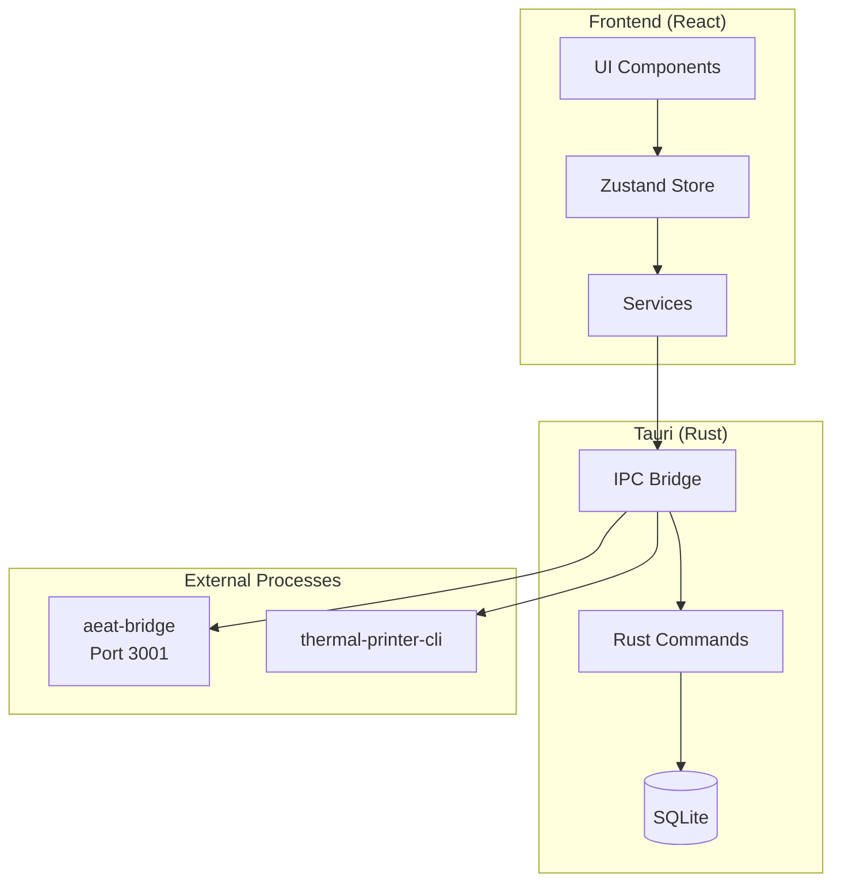

import { Cards, Card } from 'fumadocs-ui/components/card';

# TPV El Haido

**Modern Point of Sale System for Hospitality**

TPV El Haido is a desktop application specifically designed for restaurants, bars, and cafes. It combines an intuitive interface with powerful management and tax compliance features.

<Callout type="info">
  Available for **Windows**, **macOS**, **Linux** and **Raspberry Pi**.
</Callout>

## Key Features

<Cards>
  <Card title="Order Management" href="/en/docs/user-guide/orders">
    Create and manage orders with a touch-optimized interface. Table assignment and real-time status tracking.
  </Card>
  <Card title="Product Catalog" href="/en/docs/user-guide/products">
    Complete CRUD with categories, filters, search, and configurable VAT price management.
  </Card>
  <Card title="VERI*FACTU Invoicing" href="/en/docs/user-guide/invoicing">
    Full integration with AEAT for electronic invoicing compliant with Spanish regulations.
  </Card>
  <Card title="Thermal Printing" href="/en/docs/user-guide/printer">
    Support for ESC/POS printers, customizable receipts, and automatic cash drawer opening.
  </Card>
</Cards>

## Architecture



## Who is TPV El Haido For

| User | Description |
|------|-------------|
| **Hospitality** | Restaurants, bars, cafes that need a reliable POS |
| **Self-employed** | Small businesses required to comply with VERI*FACTU |
| **Developers** | Professionals who want to extend or contribute to the project |

## Get Started

<Cards>
  <Card title="Download" href="/en/docs/download">
    Download the version for your operating system
  </Card>
  <Card title="User Guide" href="/en/docs/user-guide">
    Learn to use all features
  </Card>
  <Card title="Development" href="/en/docs/development">
    Set up your development environment
  </Card>
</Cards>

## Minimum Requirements

| Requirement | Minimum | Recommended |
|-------------|---------|-------------|
| **RAM** | 512 MB | 1 GB |
| **CPU** | 1 GHz (1 core) | 1.5 GHz (2 cores) |
| **Storage** | 100 MB | 500 MB |
| **Screen** | 800x600 | 1024x768 or higher |

<Callout type="tip">
  TPV El Haido is optimized to run on low-power hardware like **Raspberry Pi 4/5**.
</Callout>

## Repository

The source code is available on GitHub:

```bash
git clone https://github.com/MKS2508/tpv-el-haido2.git
```
