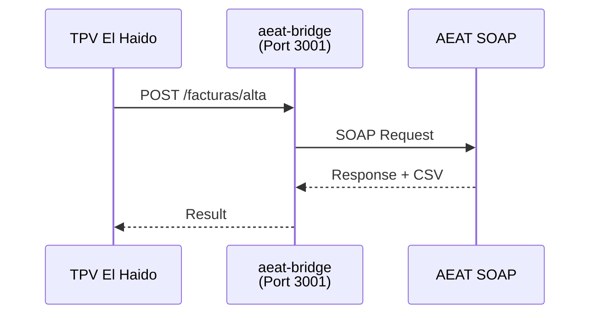

# VERI*FACTU Invoicing

TPV El Haido includes integration with the AEAT VERI*FACTU system for automatic electronic invoice submission.

## What is VERI*FACTU?

VERI*FACTU is the AEAT system for verifying electronic invoices. It allows:

- Automatic invoice submission to AEAT
- Invoice verification via CSV (Secure Verification Code)
- Compliance with Spanish electronic invoicing regulations

<Callout type="warning">
  The requirement for VERI*FACTU depends on your business type and size. Consult with your tax advisor.
</Callout>

## Initial Configuration

<Steps>

### Access Configuration

1. Go to **Settings → VERI*FACTU**

### Issuer Data

Enter your business tax details:

| Field | Description | Example |
|-------|-------------|---------|
| **Tax ID (NIF)** | Tax Identification Number | B12345678 |
| **Company Name** | Legal business name | Bar El Haido S.L. |
| **Address** | Full tax address | 1 Main Street |
| **Postal Code** | Tax address postal code | 28001 |
| **City** | City | Madrid |

### Invoice Series

Configure the numbering format:
- **Prefix**: Series identifier (e.g., "POS-", "INV2024-")
- **Starting number**: First invoice number

### Invoice Type

| Type | Code | Use |
|------|------|-----|
| **Full invoice** | F1 | Invoices with complete customer data |
| **Simplified invoice** | F2 | Receipts without complete customer data |

<Callout type="info">
  Most POS systems use **F2** (simplified invoice) for direct sales receipts.
</Callout>

</Steps>

## Digital Certificate

To send invoices to AEAT you need a valid digital certificate.

### Certificate Types

| Type | Format | Recommended for |
|------|--------|-----------------|
| **Personal** | PFX/P12 | Self-employed |
| **Company seal** | PFX/P12 | Companies |
| **PEM** | .crt + .key | Advanced configurations |

### Install Certificate

<Steps>

### Obtain certificate

1. Request your certificate from [FNMT](https://www.sede.fnmt.gob.es/)
2. Or use a certificate from another authorized entity
3. Export the certificate in PFX/P12 format with password

### Load in TPV El Haido

1. In **Settings → VERI*FACTU → Certificate**
2. Click **Load Certificate**
3. Select the PFX/P12 file
4. Enter the certificate password
5. Click **Verify**

### Confirm installation

If the certificate is valid, you'll see:
- Holder name
- Expiration date
- Status: "Valid"

</Steps>

<Callout type="warning">
  Keep the certificate password in a safe place. Without it, you won't be able to use it.
</Callout>

## Operation Modes

TPV El Haido offers three AEAT connection modes:

| Mode | Description | Use |
|------|-------------|-----|
| **Disabled** | VERI*FACTU disabled | Doesn't send invoices to AEAT |
| **Sidecar** | Uses local aeat-bridge | Recommended, local process |
| **External** | Remote AEAT server | Multi-terminal, centralized server |

### Sidecar Mode (Recommended)

The `aeat-bridge` sidecar runs locally on port 3001:

Advantages:
- No external server dependency
- Process starts automatically
- Works offline (send queue)

### External Mode

To connect to a centralized AEAT Bridge server:
1. Enter the server URL (e.g., `https://aeat.mycompany.com`)
2. Configure credentials if necessary

## Environments

| Environment | Description | AEAT URL |
|-------------|-------------|----------|
| **Test** | For testing, has no legal effect | AEAT Sandbox |
| **Production** | Real submission to AEAT | AEAT Production |

<Callout type="error">
  **Important**: Make sure you're in **Production** mode when operating for real. Test mode invoices are not valid.
</Callout>

## Invoice Submission

### Automatic Submission

When enabled:
1. Upon completing a payment, the invoice is generated
2. It's automatically sent to AEAT
3. The confirmation CSV is received
4. The receipt includes the CSV

### Manual Submission

If you prefer to control submission:
1. Disable "Automatic submission" in Settings
2. Invoices remain in "Pending" status
3. Go to **Invoices** to see pending ones
4. Select and click "Send to AEAT"

## Invoice Panel

### Access

In the side menu, click **Invoices** (or **AEAT**).

### Invoice States

| State | Color | Description |
|-------|-------|-------------|
| **Accepted** | Green | Sent and accepted by AEAT |
| **Pending** | Yellow | Pending submission |
| **Rejected** | Red | Rejected by AEAT (see error) |
| **Not invoiced** | Gray | Invoice not generated |

### Invoice Detail

Clicking an invoice shows:
- Invoice number
- Issue date
- Customer data (if any)
- Product breakdown
- VAT breakdown
- **CSV**: Secure Verification Code
- Link to verify on AEAT website

### Verify on AEAT

1. Copy the invoice CSV
2. Go to [sede.agenciatributaria.gob.es](https://sede.agenciatributaria.gob.es)
3. Search "Verify CSV"
4. Enter the code
5. Verify the data matches

## VAT Summary

The invoice panel shows:

| VAT Type | Tax Base | Tax Amount |
|----------|----------|------------|
| 21% | Sum of 21% bases | Calculated VAT |
| 10% | Sum of 10% bases | Calculated VAT |
| 4% | Sum of 4% bases | Calculated VAT |
| **Total** | **Total sum** | **Total VAT** |

Useful for quarterly tax returns.

## Troubleshooting

### Invoice rejected

| Error | Cause | Solution |
|-------|-------|----------|
| Invalid NIF | Issuer NIF is not valid | Verify NIF in Settings |
| Certificate expired | Certificate has expired | Renew certificate |
| Connection error | Can't connect to AEAT | Verify internet connection |
| Duplicate invoice | Invoice with that number already exists | Verify series and numbering |

### Sidecar not responding

1. Verify port 3001 is available
2. Restart the application
3. Check logs in **Settings → Advanced → Logs**

### Certificate not recognized

1. Verify the format is PFX/P12
2. Check the password is correct
3. Make sure the certificate is not revoked

## Tips

### Invoice numbering

- Use a prefix by year: "INV2024-0001"
- Keep the sequence without gaps
- Don't reuse numbers from cancelled invoices

### Certificate backup

- Keep a copy of the certificate in a safe place
- Note the expiration date to renew in time
- Never share the certificate with password

## Next Step

- [Customize Themes](/en/docs/user-guide/themes)
- [Back to User Guide](/en/docs/user-guide)
