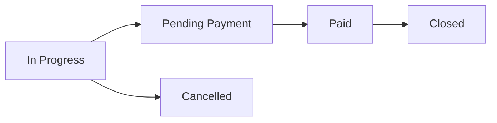

# Order Management

Learn how to create, modify, and manage orders in TPV El Haido.

## Create New Order

<Steps>

### Access New Order

In the side menu, click **New Order**.

### Select Table (Optional)

If your business uses tables:
1. You'll see a grid with available tables
2. Click a table to assign the order
3. Or select "Bar" / "Takeaway" if not applicable

### Add Products

1. **Browse categories** in the left sidebar
2. **Click a product** to add it to the order
3. The product appears in the summary (right panel)
4. **Repeat** to add more products

### Review Order

In the summary panel you'll see:
- List of added products
- Quantity of each product
- Price per line
- **Order total**

</Steps>

## Modify Order

### Change Quantities

| Action | How |
|--------|-----|
| **Increase quantity** | Click the **+** button next to the product |
| **Decrease quantity** | Click the **-** button |
| **Specific quantity** | Click the number and type the quantity |

### Remove Product

1. Click the trash icon next to the product
2. Or reduce quantity to 0

### Add Note

To add special instructions (e.g., "no onions"):
1. Click the product in the summary
2. Type the note in the text field
3. Save

## Order States

Orders have different states:

| State | Description | Color |
|-------|-------------|-------|
| **In Progress** | Active order, products can be added | Blue |
| **Pending Payment** | Ready to checkout | Yellow |
| **Paid** | Payment received | Green |
| **Closed** | Fully completed | Gray |
| **Cancelled** | Order cancelled | Red |

## Table Management

### View Table Status

1. In **Home** or **New Order**, you'll see the table map
2. Each table shows its status with colors:
   - **Green**: Available
   - **Red**: Occupied
   - **Yellow**: Pending payment

### Change Table

If you need to move an order to another table:
1. Open the active order
2. Click **Change Table**
3. Select the new table
4. Confirm

### Merge Tables

To combine orders from multiple tables:
1. Open the order from the main table
2. Click **Add Table**
3. Select the tables to merge
4. Orders are combined into one

## Order History

### Access History

1. In the side menu, click **History**
2. You'll see the list of orders sorted by date

### Filter Orders

| Filter | Description |
|--------|-------------|
| **Date** | Select a date range |
| **Status** | Filter by status (paid, cancelled, etc.) |
| **User** | Filter by operator who created the order |
| **Table** | Filter by table number |

### View Details

1. Click an order in the list
2. The detail will open with:
   - Products and quantities
   - Creation time
   - Payment method
   - User who managed it

### Reprint Receipt

1. In the order detail, click **Print**
2. The receipt is sent to the configured printer

## Quick Operations

### Repeat Order

To create an order identical to a previous one:
1. Go to history
2. Open the order to repeat
3. Click **Repeat Order**
4. A new order is created with the same products

### Split Bill

To divide payment among multiple customers:
1. At checkout time, click **Split**
2. Select how many parts
3. The system divides the total equally
4. Or assign specific products to each bill

## Kitchen Orders

If you use a kitchen printer:

1. When creating the order, products from categories marked as "kitchen" are automatically sent to the kitchen printer
2. You can resend the order manually from the order detail

<Callout type="info">
  Configure kitchen categories in **Settings → Printer → Kitchen**.
</Callout>

## Tips

### Efficient workflow

1. Get familiar with the numeric keypad for quantities
2. Use quick search for products
3. Set up favorite products for quick access

### Common errors

| Problem | Solution |
|---------|----------|
| Product added by mistake | Use delete button or reduce quantity to 0 |
| Wrong table | Use "Change Table" before checkout |
| Incorrect price | Edit the product in the catalog |

## Next Step

- [Process Payments](/en/docs/user-guide/payments)
- [Configure Printer](/en/docs/user-guide/printer)
