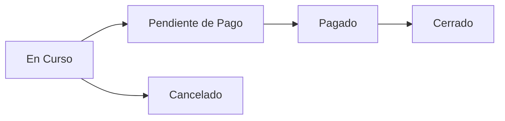
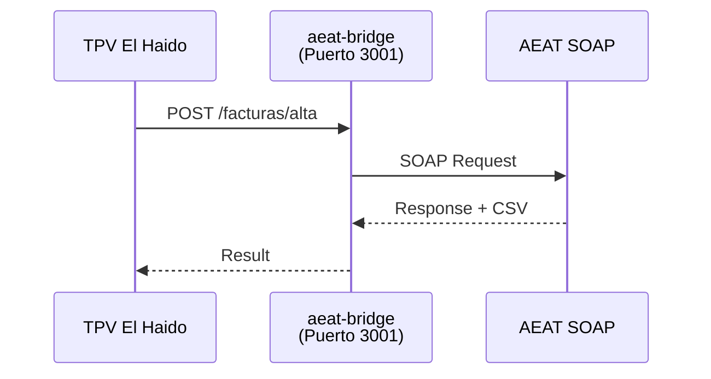

# Manual de Usuario

**TPV El Haido** - Sistema de Punto de Venta para Hostelería

Versión: 1.0.0
Fecha de generación: 2026-08-22

---

## Tabla de Contenidos

1. [Introducción](#1-introduccion)
2. [Instalación](#2-instalacion)
3. [Primeros Pasos](#3-primeros-pasos)
4. [Gestión de Pedidos](#4-gestion-de-pedidos)
5. [Gestión de Productos](#5-gestion-de-productos)
6. [Gestión de Clientes](#6-gestion-de-clientes)
7. [Procesamiento de Pagos](#7-procesamiento-de-pagos)
8. [Facturación VERI*FACTU](#8-facturacion-verifactu)
9. [Configuración de Impresora](#9-configuracion-de-impresora)
10. [Temas y Personalización](#10-temas-y-personalizacion)

---

## 1. Introducción {#1-introduccion}

# Guía de Usuario

Bienvenido a la guía de usuario de TPV El Haido. Aquí encontrarás todo lo necesario para sacar el máximo partido a tu sistema de punto de venta.

> ℹ️ **Info**
> 
> Esta guía está pensada para usuarios finales. Si eres desarrollador, consulta la **sección de desarrollo** (ver sección desarrollo).

### 1.1 Empezar

  - **Instalación**: Instala TPV El Haido en tu sistema operativo
  - **Primeros Pasos**: Configuración inicial y primera venta

### 1.2 Funcionalidades

  - **Productos**: Gestiona tu catalogo de productos y categorias
  - **Pedidos**: Crea y gestiona comandas
  - **Clientes**: Base de datos de clientes y facturacion
  - **Pagos**: Procesa pagos e imprime tickets
  - **Impresora**: Configura tu impresora termica
  - **Facturacion**: Integracion con AEAT VERI*FACTU
  - **Temas**: Personaliza la apariencia

### 1.3 Flujo de Trabajo Típico


### 1.4 Pantalla Principal

La interfaz de TPV El Haido está organizada en secciones accesibles desde el menú lateral:

| Sección | Descripción |
|---------|-------------|
| **Inicio** | Panel principal con resumen del día |
| **Nueva Comanda** | Crear pedidos y añadir productos |
| **Historial** | Ver pedidos anteriores |
| **Productos** | Gestionar catálogo |
| **Clientes** | Base de datos de clientes |
| **Facturas** | Facturas AEAT y estados |
| **Ajustes** | Configuración del sistema |

### 1.5 Soporte

Si tienes preguntas o encuentras problemas:

1. Consulta esta documentación
2. Revisa los [issues en GitHub](https://github.com/MKS2508/tpv-el-haido2/issues)
3. Abre un nuevo issue describiendo tu problema

---

## 2. Instalación {#2-instalacion}

Guía detallada para instalar TPV El Haido en tu sistema operativo.

### 2.1 Requisitos Previos

Antes de instalar, verifica que tu sistema cumple los requisitos mínimos:

| Requisito | Mínimo | Recomendado |
|-----------|--------|-------------|
| **RAM** | 512 MB | 1 GB |
| **Almacenamiento** | 100 MB | 500 MB |
| **Pantalla** | 800x600 | 1024x768+ |
| **Conexión** | Opcional | Requerida para VERI*FACTU |

### 2.2 Instalación por Sistema

##### Windows

##### Windows 10/11

**Paso 1: Descargar el instalador**

1. Ve al [Hub de Releases](https://haido.releases.mks2508.systems/releases/latest)
2. Descarga el archivo `TPV.El.Haido_x.x.x_x64-setup.exe`

**Paso 2: Ejecutar el instalador**

1. Haz doble clic en el archivo descargado
2. Si aparece Windows SmartScreen, haz clic en "Más información" → "Ejecutar de todas formas"
3. Sigue el asistente de instalación

**Paso 3: Verificar instalación**

1. Busca "TPV El Haido" en el menú de inicio
2. Haz clic para abrir la aplicación
3. Deberías ver la pantalla de login o el asistente de configuración

> ⚠️ **Warning**
> 
> **Windows SmartScreen**: Al ser una aplicación no firmada por Microsoft, Windows puede mostrar una advertencia. Esto es normal para software independiente.

##### macOS

##### macOS 11 Big Sur o superior

**Paso 1: Descargar el DMG**

1. Ve al [Hub de Releases](https://haido.releases.mks2508.systems/releases/latest)
2. Descarga el archivo correspondiente a tu Mac:
   - **Intel**: `TPV.El.Haido_x64.dmg`
   - **Apple Silicon (M1/M2/M3/M4)**: `TPV.El.Haido_aarch64.dmg`

**Paso 2: Instalar la aplicación**

1. Abre el archivo DMG descargado
2. Arrastra el icono de TPV El Haido a la carpeta "Aplicaciones"
3. Expulsa el volumen DMG

**Paso 3: Primera ejecución**

1. Abre la carpeta Aplicaciones
2. Haz clic derecho en "TPV El Haido" → "Abrir"
3. En el diálogo de seguridad, haz clic en "Abrir"

> ℹ️ **Info**
> 
> **Gatekeeper**: macOS puede bloquear la primera ejecución. Usa clic derecho → Abrir para evitar ir a Preferencias del Sistema.

##### Linux

##### Ubuntu, Debian y derivados

**Paso 1: Instalar dependencias**

```bash
sudo apt update
sudo apt install -y libwebkit2gtk-4.1-0 libgtk-3-0
```

**Paso 2: Descargar e instalar el AppImage**

```bash
# Descargar la última versión
wget https://haido.releases.mks2508.systems/api/dl/0.1.3/linux/x86_64/tpv-haido-0.1.3-linux-amd64.AppImage

# Hacer ejecutable
chmod +x tpv-haido-0.1.3-linux-amd64.AppImage

# Ejecutar
./tpv-haido-0.1.3-linux-amd64.AppImage
```

**Paso 3: Ejecutar**

```bash
# Desde terminal
./tpv-haido-0.1.3-linux-amd64.AppImage

# O buscar en el menú de aplicaciones
```

##### Alternativa: AppImage (cualquier distribución)

```bash
# Descargar
wget https://haido.releases.mks2508.systems/api/dl/0.1.3/linux/x86_64/tpv-haido-0.1.3-linux-amd64.AppImage

# Hacer ejecutable
chmod +x tpv-haido-0.1.3-linux-amd64.AppImage

# Ejecutar
./tpv-haido-0.1.3-linux-amd64.AppImage
```

##### Raspberry Pi

##### Raspberry Pi 4/5 (64-bit)

**Paso 1: Verificar sistema operativo**

```bash
# Debe mostrar aarch64
uname -m
```

> ⚠️ **Warning**
> 
> Raspberry Pi OS debe ser la versión de **64 bits**. La versión de 32 bits no es compatible.

**Paso 2: Instalar dependencias**

```bash
sudo apt update
sudo apt install -y libwebkit2gtk-4.1-0 libgtk-3-0
```

**Paso 3: Descargar e instalar**

```bash
# Descargar versión ARM64
wget https://haido.releases.mks2508.systems/api/dl/0.1.3/linux/aarch64/tpv-haido-0.1.3-linux-arm64.AppImage

# Hacer ejecutable
chmod +x tpv-haido-0.1.3-linux-arm64.AppImage

# Ejecutar
./tpv-haido-0.1.3-linux-arm64.AppImage
```

**Paso 4: Ejecutar**

```bash
./tpv-haido-0.1.3-linux-arm64.AppImage
```

##### Optimizaciones para Raspberry Pi

Para mejorar el rendimiento:

1. Usa el tema de alto contraste (menos efectos visuales)
2. Desactiva animaciones en Ajustes
3. Asigna al menos 256MB a la GPU en `raspi-config`

### 2.3 Pantalla de Configuración

Una vez instalada la aplicación, accederás al asistente de configuración o a la pantalla de ajustes:


Desde aquí puedes:
- Configurar el modo de almacenamiento
- Gestionar usuarios
- Configurar impresoras
- Ajustar la integración con AEAT

### 2.4 Validación de Licencia

Para usar todas las funcionalidades, valida tu licencia:


1. Ve a **Ajustes → Licencia**
2. Introduce tu clave de licencia
3. Haz clic en **Validar**
4. Si es válida, verás el estado "Licencia Activa"

> ℹ️ **Info**
> 
> Puedes usar la aplicación en modo demo sin licencia, pero algunas funciones estarán limitadas.

### 2.5 Solución de Problemas

##### La aplicación no abre

##### Windows

1. Verifica que tienes Windows 10 o superior
2. Intenta ejecutar como administrador
3. Revisa si hay un antivirus bloqueando la ejecución
4. Reinstala la aplicación

##### macOS

1. Ve a **Preferencias del Sistema → Seguridad y Privacidad**
2. En la pestaña General, haz clic en "Abrir de todas formas"
3. Si persiste, prueba: `xattr -cr /Applications/TPV\ El\ Haido.app`

##### Linux

1. Verifica las dependencias: `apt list --installed | grep webkit`
2. Comprueba permisos: `chmod +x /usr/bin/tpv-el-haido`
3. Ejecuta desde terminal para ver errores: `tpv-el-haido`

##### Error de base de datos

Si ves un error relacionado con SQLite:

1. Cierra la aplicación
2. Borra el archivo de base de datos:
   - **Windows**: `%APPDATA%\com.elhaido.tpv\tpv-haido.db`
   - **macOS**: `~/Library/Application Support/com.elhaido.tpv/tpv-haido.db`
   - **Linux**: `~/.config/com.elhaido.tpv/tpv-haido.db`
3. Reinicia la aplicación (se creará una nueva base de datos)

> ⚠️ **Warning**
> 
> Borrar la base de datos eliminará todos tus datos. Haz una copia de seguridad primero si es posible.

##### Problemas de rendimiento

1. Verifica que cumples los requisitos mínimos
2. Cierra otras aplicaciones pesadas
3. En Raspberry Pi, desactiva animaciones
4. Considera usar el modo de almacenamiento SQLite (más rápido)

### 2.6 Siguiente Paso

Una vez instalado, sigue con **Primeros Pasos** (ver sección primeros pasos) para configurar tu TPV.

---

## 3. Primeros Pasos {#3-primeros-pasos}

Después de instalar TPV El Haido, sigue esta guía para configurar tu sistema y realizar tu primera venta.

### 3.1 Asistente de Configuración

La primera vez que abras la aplicación, verás el asistente de configuración:

**Paso 1: Bienvenida**

El asistente te guiará a través de la configuración inicial. Haz clic en "Comenzar".

**Paso 2: Modo de Almacenamiento**

Selecciona cómo quieres guardar tus datos:

| Modo | Descripción | Recomendado para |
|------|-------------|------------------|
| **SQLite** | Base de datos local | Un solo terminal |
| **HTTP** | Servidor externo | Múltiples terminales |
| **IndexedDB** | Navegador | Modo web/demo |

> 💡 **Tip**
> 
> Para la mayoría de usuarios, **SQLite** es la mejor opción. Es rápido y no requiere configuración adicional.

**Paso 3: Crear Usuario Administrador**

1. Introduce el nombre del usuario (ej: "Admin")
2. Selecciona un avatar o sube una foto
3. Crea un PIN de 4 dígitos
4. Confirma el PIN

**Paso 4: Tema Visual**

Elige el tema que mejor se adapte a tu negocio:
- **Restaurant Professional**: Colores cálidos y elegantes
- **Modern Cafe**: Verde minimalista
- **Night Bar**: Tema oscuro con acentos
- **High Contrast**: Máxima legibilidad

**Paso 5: Completar**

Haz clic en "Finalizar" para completar la configuración.

### 3.2 Pantalla de Login

Después de la configuración, verás la pantalla de login:


1. **Selecciona tu usuario** tocando el avatar
2. **Introduce tu PIN** de 4 dígitos
3. **Accede** al panel principal

> ℹ️ **Info**
> 
> Puedes crear más usuarios desde **Ajustes → Usuarios**.

### 3.3 Dashboard Principal

Una vez dentro, verás el dashboard principal con acceso rápido a todas las funciones:


Desde aquí puedes:
- Crear nuevas comandas
- Ver el estado de las mesas
- Acceder al catálogo de productos
- Consultar el historial de ventas

### 3.4 Crear tu Primera Categoría

Antes de añadir productos, crea al menos una categoría:

**Paso 1: Ir a Productos**

1. En el menú lateral, haz clic en **Productos**
2. Haz clic en el botón **Categorías** o el icono de carpeta

**Paso 2: Crear Categoría**

1. Haz clic en **Nueva Categoría**
2. Introduce el nombre (ej: "Bebidas", "Tapas", "Postres")
3. Opcionalmente, añade una descripción
4. Selecciona un icono
5. Haz clic en **Guardar**

### 3.5 Crear tu Primer Producto

**Paso 1: Ir a Nuevo Producto**

1. En la sección **Productos**, haz clic en **Nuevo Producto**

**Paso 2: Rellenar Datos**

| Campo | Ejemplo | Descripción |
|-------|---------|-------------|
| **Nombre** | Cerveza | Nombre visible en el TPV |
| **Precio** | 2.50 | Precio sin IVA |
| **Categoría** | Bebidas | Categoría creada anteriormente |
| **IVA** | 21% | Tipo de IVA aplicable |

**Paso 3: Añadir Icono (Opcional)**

- Selecciona un icono predefinido, o
- Sube una imagen del producto

**Paso 4: Guardar**

Haz clic en **Crear Producto** para guardarlo.

### 3.6 Realizar tu Primera Venta

**Paso 1: Crear Nueva Comanda**

1. En el menú lateral, haz clic en **Nueva Comanda**
2. (Opcional) Selecciona una mesa


**Paso 2: Añadir Productos**

1. Navega por las categorías en la barra lateral
2. Haz clic en los productos para añadirlos
3. El resumen aparece en el panel derecho

**Paso 3: Ajustar Cantidades**

- **+** / **-**: Aumentar o reducir cantidad
- **Eliminar**: Quitar producto del pedido

**Paso 4: Cobrar**

1. Haz clic en el botón **Cobrar**
2. Selecciona el método de pago:
   - Efectivo
   - Tarjeta
   - Otro
3. Si es efectivo, introduce el importe recibido
4. El sistema calcula el cambio automáticamente

**Paso 5: Finalizar**

1. Haz clic en **Confirmar Pago**
2. El ticket se imprime automáticamente (si hay impresora configurada)
3. La comanda se guarda en el historial

### 3.7 Configuración Adicional

##### Impresora Térmica

Para imprimir tickets, configura tu impresora:

1. Ve a **Ajustes → Impresora**
2. Selecciona el puerto (USB/Serial)
3. Configura el ancho de papel (58mm o 80mm)
4. Haz clic en **Probar Conexión**

Más detalles en **Configurar Impresora** (ver sección impresora).

##### Facturación AEAT

Para enviar facturas a la AEAT:

1. Ve a **Ajustes → VERI*FACTU**
2. Introduce tus datos fiscales (NIF, Razón Social)
3. Configura el certificado digital
4. Activa el envío automático

Más detalles en **Facturación VERI*FACTU** (ver sección facturacion).

##### Mas Usuarios

Para añadir mas operarios:

1. Ve a **Ajustes → Usuarios**
2. Haz clic en **Nuevo Usuario**
3. Rellena nombre, avatar y PIN


### 3.8 Resumen

Has completado la configuración inicial:

- [x] Asistente de configuración completado
- [x] Usuario administrador creado
- [x] Primera categoría creada
- [x] Primer producto añadido
- [x] Primera venta realizada

> ✅ **Success**
> 
> ¡Tu TPV está listo! Explora el resto de la documentación para aprovechar todas las funcionalidades.

### 3.9 Siguiente Paso

- **Gestionar Productos** (ver sección productos) - Catálogo completo
- **Configurar Impresora** (ver sección impresora) - Tickets térmicos
- **Facturación AEAT** (ver sección facturacion) - VERI*FACTU

---

## 4. Gestión de Pedidos {#4-gestion-de-pedidos}

Aprende a crear, modificar y gestionar comandas en TPV El Haido.

### 4.1 Crear Nueva Comanda

**Paso 1: Acceder a Nueva Comanda**

En el menú lateral, haz clic en **Nueva Comanda**.

**Paso 2: Seleccionar Mesa (Opcional)**

Si tu negocio usa mesas:
1. Verás un grid con las mesas disponibles
2. Haz clic en una mesa para asignar el pedido
3. O selecciona "Barra" / "Para llevar" si no aplica

**Paso 3: Añadir Productos**


1. **Navega por categorías** en la barra lateral izquierda
2. **Haz clic en un producto** para añadirlo al pedido
3. El producto aparece en el resumen (panel derecho)
4. **Repite** para añadir más productos

**Paso 4: Revisar Pedido**

En el panel de resumen verás:
- Lista de productos añadidos
- Cantidad de cada producto
- Precio por línea
- **Total del pedido**

### 4.2 Modificar Pedido

##### Cambiar Cantidades

| Acción | Cómo |
|--------|------|
| **Aumentar cantidad** | Haz clic en el botón **+** junto al producto |
| **Reducir cantidad** | Haz clic en el botón **-** |
| **Cantidad específica** | Haz clic en el número y escribe la cantidad |

##### Eliminar Producto

1. Haz clic en el icono de papelera junto al producto
2. O reduce la cantidad a 0

##### Añadir Nota

Para añadir instrucciones especiales (ej: "sin cebolla"):
1. Haz clic en el producto en el resumen
2. Escribe la nota en el campo de texto
3. Guarda

### 4.3 Estados del Pedido

Los pedidos tienen diferentes estados:



| Estado | Descripción | Color |
|--------|-------------|-------|
| **En Curso** | Pedido activo, se pueden añadir productos | Azul |
| **Pendiente de Pago** | Listo para cobrar | Amarillo |
| **Pagado** | Pago recibido | Verde |
| **Cerrado** | Finalizado completamente | Gris |
| **Cancelado** | Pedido anulado | Rojo |

### 4.4 Gestión de Mesas

##### Ver Estado de Mesas

1. En **Inicio** o **Nueva Comanda**, verás el mapa de mesas
2. Cada mesa muestra su estado con colores:
   - **Verde**: Libre
   - **Rojo**: Ocupada
   - **Amarillo**: Pendiente de pago

##### Cambiar Mesa

Si necesitas mover un pedido a otra mesa:
1. Abre el pedido activo
2. Haz clic en **Cambiar Mesa**
3. Selecciona la nueva mesa
4. Confirma

##### Juntar Mesas

Para combinar pedidos de varias mesas:
1. Abre el pedido de la mesa principal
2. Haz clic en **Añadir Mesa**
3. Selecciona las mesas a unir
4. Los pedidos se combinan en uno solo

### 4.5 Historial de Pedidos

##### Acceder al Historial

1. En el menú lateral, haz clic en **Historial**
2. Verás la lista de pedidos ordenados por fecha


##### Filtrar Pedidos

| Filtro | Descripción |
|--------|-------------|
| **Fecha** | Selecciona un rango de fechas |
| **Estado** | Filtra por estado (pagado, cancelado, etc.) |
| **Usuario** | Filtra por operario que creó el pedido |
| **Mesa** | Filtra por número de mesa |

##### Ver Detalle

1. Haz clic en un pedido de la lista
2. Se abrirá el detalle con:
   - Productos y cantidades
   - Hora de creación
   - Método de pago
   - Usuario que lo gestionó

##### Reimprimir Ticket

1. En el detalle del pedido, haz clic en **Imprimir**
2. El ticket se envía a la impresora configurada

### 4.6 Operaciones Rápidas

##### Repetir Pedido

Para crear un pedido idéntico a uno anterior:
1. Ve al historial
2. Abre el pedido a repetir
3. Haz clic en **Repetir Pedido**
4. Se crea una nueva comanda con los mismos productos

##### Dividir Cuenta

Para dividir el pago entre varios clientes:
1. En el momento del cobro, haz clic en **Dividir**
2. Selecciona cuántas partes
3. El sistema divide el total equitativamente
4. O asigna productos específicos a cada cuenta

### 4.7 Comandas en Cocina

Si usas impresora de cocina:

1. Al crear el pedido, los productos de categorías marcadas como "cocina" se envían automáticamente a la impresora de cocina
2. Puedes reenviar la comanda manualmente desde el detalle del pedido

> ℹ️ **Info**
> 
> Configura las categorías de cocina en **Ajustes → Impresora → Cocina**.

### 4.8 Consejos

##### Flujo eficiente

1. Familiarízate con el teclado numérico para cantidades
2. Usa la búsqueda rápida para productos
3. Configura productos favoritos para acceso rápido

##### Errores comunes

| Problema | Solución |
|----------|----------|
| Producto añadido por error | Usa el botón de eliminar o reduce cantidad a 0 |
| Mesa equivocada | Usa "Cambiar Mesa" antes de cobrar |
| Precio incorrecto | Edita el producto en el catálogo |

### 4.9 Siguiente Paso

- **Procesar Pagos** (ver sección pagos)
- **Configurar Impresora** (ver sección impresora)

---

## 5. Gestión de Productos {#5-gestion-de-productos}

Aprende a gestionar tu catálogo de productos y categorías en TPV El Haido.

### 5.1 Acceder al Catálogo

1. En el menú lateral, haz clic en **Productos**
2. Verás el grid de productos con filtros y búsqueda


### 5.2 Categorías

Las categorías organizan tus productos para facilitar la navegación durante las ventas.

##### Crear Categoría

**Paso 1: Abrir gestión de categorías**

En la sección Productos, haz clic en el botón **Categorías** o el icono de carpeta.

**Paso 2: Nueva categoría**

Haz clic en **Nueva Categoría**.

**Paso 3: Rellenar datos**

| Campo | Descripción | Ejemplo |
|-------|-------------|---------|
| **Nombre** | Nombre de la categoría | "Bebidas Frías" |
| **Descripción** | Descripción opcional | "Refrescos, zumos, agua..." |
| **Icono** | Icono visual | 🍺 |

**Paso 4: Guardar**

Haz clic en **Crear** para guardar la categoría.

##### Editar Categoría

1. En la lista de categorías, haz clic en el icono de edición (lápiz)
2. Modifica los campos necesarios
3. Haz clic en **Guardar**

##### Eliminar Categoría

1. Haz clic en el icono de eliminar (papelera)
2. Confirma la eliminación

> ⚠️ **Warning**
> 
> Al eliminar una categoría, los productos asociados se moverán a "Sin categoría".

### 5.3 Productos

##### Crear Producto

**Paso 1: Abrir formulario**

En la sección Productos, haz clic en **Nuevo Producto**.

**Paso 2: Información básica**

| Campo | Descripción | Requerido |
|-------|-------------|-----------|
| **Nombre** | Nombre del producto | Sí |
| **Precio** | Precio de venta (sin IVA) | Sí |
| **Categoría** | Categoría del producto | Sí |
| **Marca** | Marca (opcional) | No |

**Paso 3: Configuración de IVA**

| Tipo | Porcentaje | Aplicación |
|------|------------|------------|
| **General** | 21% | Mayoría de productos |
| **Reducido** | 10% | Alimentación, transporte |
| **Superreducido** | 4% | Pan, leche, frutas, verduras |

**Paso 4: Imagen del producto**

Tienes dos opciones:
- **Icono predefinido**: Selecciona de la biblioteca de iconos
- **Imagen personalizada**: Sube una foto del producto

**Paso 5: Guardar**

Haz clic en **Crear Producto**.

##### Editar Producto

1. En el grid de productos, haz clic en el producto
2. Se abrirá el diálogo de edición
3. Modifica los campos necesarios
4. Haz clic en **Guardar Cambios**

##### Eliminar Producto

1. En el diálogo del producto, haz clic en **Eliminar**
2. Confirma la eliminación

> ℹ️ **Info**
> 
> Los productos eliminados no aparecerán en nuevas comandas, pero se mantienen en el historial de pedidos anteriores.

### 5.4 Búsqueda y Filtros

##### Barra de búsqueda

Escribe en la barra de búsqueda para encontrar productos por:
- Nombre
- Marca
- Categoría

##### Filtros por categoría

En la barra lateral izquierda:
1. Haz clic en una categoría para ver solo esos productos
2. Haz clic en "Todas" para ver todos los productos

##### Ordenación

Ordena los productos por:
- Nombre (A-Z, Z-A)
- Precio (menor a mayor, mayor a menor)
- Más recientes

### 5.5 Importación Masiva

Si tienes muchos productos, puedes importarlos desde un archivo:

**Paso 1: Preparar archivo CSV**

Crea un archivo CSV con las columnas:
```csv
nombre,precio,categoria,marca,iva
Coca-Cola,1.80,Bebidas,Coca-Cola,21
Café Solo,1.20,Cafés,,21
Tostada,2.50,Desayunos,,10
```

**Paso 2: Importar**

1. Ve a **Ajustes → Importar/Exportar**
2. Selecciona **Importar Productos**
3. Carga tu archivo CSV
4. Revisa la vista previa
5. Confirma la importación

### 5.6 Exportar Catálogo

Para hacer una copia de seguridad o migrar datos:

1. Ve a **Ajustes → Importar/Exportar**
2. Selecciona **Exportar Productos**
3. Elige el formato (CSV o JSON)
4. Descarga el archivo

### 5.7 Consejos

##### Organización eficiente

- Crea categorías que reflejen tu carta o menú
- Usa nombres cortos y claros
- Los productos más vendidos pueden tener un icono distintivo

##### Precios

- Introduce siempre el precio **sin IVA**
- El sistema calcula el PVP automáticamente
- Puedes cambiar precios en cualquier momento (no afecta a pedidos anteriores)

##### Imágenes

| Formato | Recomendación |
|---------|---------------|
| **Tamaño** | 200x200px mínimo |
| **Formato** | PNG o JPG |
| **Peso** | Menos de 500KB |

> 💡 **Tip**
> 
> Las imágenes cuadradas se muestran mejor en el grid de productos.

### 5.8 Siguiente Paso

- **Gestionar Pedidos** (ver sección pedidos)
- **Configurar Pagos** (ver sección pagos)

---

## 6. Gestión de Clientes {#6-gestion-de-clientes}

TPV El Haido incluye un modulo de gestion de clientes para fidelizar a tus usuarios habituales y generar facturas completas.


### 6.1 Acceder a Clientes

1. En el menu lateral, haz clic en **Clientes**
2. Veras la lista de clientes registrados

### 6.2 Crear Cliente

**Paso 1: Abrir formulario**

Haz clic en **Nuevo Cliente**.

**Paso 2: Datos basicos**

| Campo | Descripcion | Requerido |
|-------|-------------|-----------|
| **Nombre** | Nombre completo o razon social | Si |
| **NIF/CIF** | Identificacion fiscal | Para facturas |
| **Email** | Correo electronico | No |
| **Telefono** | Numero de contacto | No |

**Paso 3: Direccion fiscal**

Para facturas completas (tipo F1):

| Campo | Descripcion |
|-------|-------------|
| **Direccion** | Calle y numero |
| **Codigo Postal** | CP |
| **Poblacion** | Ciudad |
| **Provincia** | Provincia |

**Paso 4: Guardar**

Haz clic en **Crear Cliente**.

### 6.3 Buscar Clientes

##### Barra de busqueda

Busca por:
- Nombre
- NIF/CIF
- Telefono
- Email

##### Filtros

- **Todos**: Muestra todos los clientes
- **Frecuentes**: Clientes con mas de X pedidos
- **Recientes**: Ultimos clientes añadidos

### 6.4 Asignar Cliente a Pedido

**Paso 1: Durante la comanda**

1. En la pantalla de Nueva Comanda
2. Haz clic en **Asignar Cliente** (o icono de persona)
3. Busca y selecciona el cliente
4. El nombre aparece en la cabecera del pedido

**Paso 2: En el cobro**

1. Al procesar el pago
2. Puedes asignar o cambiar el cliente
3. Util para facturas con datos completos

### 6.5 Facturas para Clientes

Cuando asignas un cliente con NIF a un pedido:

- La factura incluye los datos fiscales completos
- Puede ser tipo F1 (factura completa) si el cliente tiene todos los datos
- El cliente recibe copia por email (si esta configurado)

> ℹ️ **Info**
> 
> Para generar facturas tipo F1 (completas), el cliente debe tener NIF y direccion fiscal.

### 6.6 Editar Cliente

1. Haz clic en el cliente en la lista
2. Modifica los campos necesarios
3. Haz clic en **Guardar**

### 6.7 Eliminar Cliente

1. Abre el cliente
2. Haz clic en **Eliminar**
3. Confirma la accion

> ⚠️ **Warning**
> 
> Al eliminar un cliente, los pedidos anteriores mantienen los datos fiscales pero el cliente ya no estara disponible para nuevos pedidos.

### 6.8 Historial de Cliente

Al abrir un cliente puedes ver:

- Total de pedidos realizados
- Importe total gastado
- Ultimo pedido
- Productos mas comprados

### 6.9 Exportar Clientes

Para hacer backup o migrar:

1. Ve a **Ajustes → Importar/Exportar**
2. Selecciona **Exportar Clientes**
3. Elige formato (CSV o JSON)

### 6.10 Importar Clientes

Para cargar clientes desde un archivo:

**Paso 1: Preparar CSV**

```csv
nombre,nif,email,telefono,direccion,cp,poblacion
Juan Garcia,12345678A,juan@email.com,600123456,Calle Mayor 1,28001,Madrid
Empresa SL,B12345678,info@empresa.com,910000000,Av. Principal 10,08001,Barcelona
```

**Paso 2: Importar**

1. Ve a **Ajustes → Importar/Exportar**
2. Selecciona **Importar Clientes**
3. Carga el archivo CSV
4. Revisa y confirma

### 6.11 Consejos

##### Datos fiscales

- Siempre pide el NIF si el cliente quiere factura
- Verifica que el NIF es correcto (letra de control)
- Guarda la direccion completa para facturas tipo F1

##### Organizacion

- Usa nombres consistentes (Juan Garcia vs Garcia, Juan)
- Añade el telefono para contactar si hay problemas
- El email permite enviar facturas automaticamente

### 6.12 Siguiente Paso

- **Gestionar Pedidos** (ver sección pedidos)
- **Facturacion VERI*FACTU** (ver sección facturacion)

---

## 7. Procesamiento de Pagos {#7-procesamiento-de-pagos}

Aprende a cobrar pedidos, gestionar métodos de pago e imprimir tickets.

### 7.1 Cobrar un Pedido

**Paso 1: Abrir el pedido**

Desde la pantalla de Nueva Comanda o seleccionando un pedido activo.

**Paso 2: Iniciar cobro**

Haz clic en el botón **Cobrar** (o el total del pedido).

**Paso 3: Seleccionar método de pago**

| Método | Descripción |
|--------|-------------|
| **Efectivo** | Pago en metálico |
| **Tarjeta** | Pago con tarjeta de crédito/débito |
| **Otro** | Transferencia, vales, etc. |

**Paso 4: Completar pago**

**Para efectivo:**
1. Introduce el importe recibido
2. El sistema calcula el cambio automáticamente
3. Haz clic en **Confirmar**

**Para tarjeta/otro:**
1. Haz clic en **Confirmar**
2. Procesa el pago en tu datáfono si lo tienes

**Paso 5: Ticket impreso**

Si tienes impresora configurada, el ticket se imprime automáticamente.

### 7.2 Métodos de Pago

##### Efectivo

El flujo de pago en efectivo incluye:


**Atajos de importe:**
- Botones rápidos para billetes comunes (5€, 10€, 20€, 50€)
- Campo para introducir importe exacto
- Botón "Importe exacto" para cuando el cliente paga justo

##### Tarjeta

1. Selecciona **Tarjeta** como método de pago
2. Procesa el pago en tu terminal bancario
3. Confirma en el TPV cuando el pago sea exitoso

> ℹ️ **Info**
> 
> La integración directa con datáfonos está en desarrollo. Por ahora, el cobro con tarjeta es manual.

##### Pago Mixto

Para combinar varios métodos de pago:

**Paso 1: Activar pago mixto**

En la pantalla de cobro, haz clic en **Pago Mixto**.

**Paso 2: Añadir primer método**

1. Selecciona el método (ej: Tarjeta)
2. Introduce el importe parcial
3. Haz clic en **Añadir**

**Paso 3: Añadir segundo método**

1. El resto del importe aparece pendiente
2. Selecciona otro método (ej: Efectivo)
3. Introduce el importe
4. Confirma cuando la suma cubra el total

### 7.3 Apertura de Cajón

##### Apertura automática

El cajón se abre automáticamente al:
- Completar un pago en efectivo
- Usar la función "Abrir Cajón" manual

Para activar/desactivar:
1. Ve a **Ajustes → Impresora**
2. Activa/desactiva "Abrir cajón automáticamente"

##### Apertura manual

1. En el menú de Ajustes o en la barra de herramientas
2. Haz clic en **Abrir Cajón**
3. El cajón se abre (requiere impresora compatible)

### 7.4 Tickets

##### Contenido del Ticket

Un ticket estándar incluye:

| Sección | Contenido |
|---------|-----------|
| **Cabecera** | Nombre del negocio, dirección, CIF |
| **Fecha/Hora** | Momento de la venta |
| **Productos** | Listado con cantidad, nombre, precio |
| **Impuestos** | Desglose de IVA |
| **Total** | Importe total a pagar |
| **Pago** | Método e importe pagado |
| **Pie** | Mensaje personalizado, número de ticket |

##### Personalizar Ticket

En **Ajustes → Impresora → Ticket**:

| Opción | Descripción |
|--------|-------------|
| **Logo** | Imagen en la cabecera (BMP monocromo) |
| **Nombre** | Nombre del negocio |
| **Dirección** | Dirección fiscal |
| **CIF/NIF** | Identificación fiscal |
| **Teléfono** | Contacto |
| **Mensaje pie** | Texto al final del ticket |

##### Reimprimir Ticket

1. Ve a **Historial**
2. Selecciona el pedido
3. Haz clic en **Reimprimir Ticket**

### 7.5 Devoluciones

##### Anular Pedido

Para anular un pedido antes de cerrarlo:
1. Abre el pedido
2. Haz clic en **Anular Pedido**
3. Introduce el motivo (opcional)
4. Confirma

##### Devolución Parcial

Para devolver productos específicos:
1. Ve al historial y abre el pedido
2. Haz clic en **Devolución**
3. Selecciona los productos a devolver
4. Confirma el importe a reembolsar

> ⚠️ **Warning**
> 
> Las devoluciones generan un registro para contabilidad y pueden afectar a las facturas AEAT si ya fueron enviadas.

### 7.6 Cierre de Caja

##### Realizar Cierre

Al final del turno o día:

**Paso 1: Acceder a Cierre**

Ve a **Ajustes → Caja → Cierre**.

**Paso 2: Revisar Resumen**

El sistema muestra:
- Total de ventas
- Desglose por método de pago
- Número de operaciones
- Diferencia esperado vs. real

**Paso 3: Contar Efectivo**

Introduce el efectivo contado en caja.

**Paso 4: Confirmar Cierre**

Haz clic en **Cerrar Caja** para registrar el cierre.

##### Informe de Cierre

El informe incluye:
- Ventas por categoría
- Ventas por producto
- Ventas por usuario
- Impuestos recaudados
- Métodos de pago utilizados

Puedes imprimir o exportar el informe.

### 7.7 Configuración

##### Tasa de Impuestos

En **Ajustes → General**:
- Configura el IVA por defecto (21%, 10%, 4%)
- El IVA se aplica automáticamente según la categoría del producto

##### Redondeo

Por defecto, los totales se redondean a 2 decimales. Esto es configurable en Ajustes.

### 7.8 Consejos

##### Flujo rápido

- Usa los atajos de teclado para cobrar rápidamente
- Configura botones de importe rápido para billetes comunes
- El botón "Importe exacto" acelera pagos sin cambio

##### Errores comunes

| Problema | Solución |
|----------|----------|
| Cambio incorrecto | Revisa el importe introducido |
| Ticket no impreso | Verifica conexión de impresora |
| Cajón no abre | Comprueba configuración y conexión |

### 7.9 Siguiente Paso

- **Configurar Impresora** (ver sección impresora)
- **Facturación VERI*FACTU** (ver sección facturacion)

---

## 8. Facturación VERI*FACTU {#8-facturacion-verifactu}

TPV El Haido incluye integración con el sistema VERI*FACTU de la Agencia Tributaria (AEAT) para el envío automático de facturas electrónicas.

### 8.1 ¿Qué es VERI*FACTU?

VERI*FACTU es el sistema de la AEAT para verificar facturas electrónicas. Permite:

- Envío automático de facturas a la AEAT
- Verificación de facturas mediante CSV (Código Seguro de Verificación)
- Cumplimiento de la normativa española de facturación electrónica

> ⚠️ **Warning**
> 
> La obligatoriedad de VERI*FACTU depende del tipo y tamaño de tu negocio. Consulta con tu asesor fiscal.

### 8.2 Configuración Inicial

**Paso 1: Acceder a Configuración**

1. Ve a **Ajustes → VERI*FACTU**


**Paso 2: Datos del Emisor**

Introduce los datos fiscales de tu negocio:

| Campo | Descripción | Ejemplo |
|-------|-------------|---------|
| **NIF** | Número de Identificación Fiscal | B12345678 |
| **Razón Social** | Nombre fiscal de la empresa | Bar El Haido S.L. |
| **Dirección** | Dirección fiscal completa | C/ Principal, 1 |
| **Código Postal** | CP de la dirección fiscal | 28001 |
| **Población** | Ciudad | Madrid |

**Paso 3: Serie de Factura**

Configura el formato de numeración:
- **Prefijo**: Identificador de serie (ej: "TPV-", "F2024-")
- **Número inicial**: Primer número de factura

**Paso 4: Tipo de Factura**

| Tipo | Código | Uso |
|------|--------|-----|
| **Factura completa** | F1 | Facturas con todos los datos del cliente |
| **Factura simplificada** | F2 | Tickets sin datos completos del cliente |

> ℹ️ **Info**
> 
> La mayoría de TPV usan **F2** (factura simplificada) para tickets de venta directa.

### 8.3 Certificado Digital

Para enviar facturas a la AEAT necesitas un certificado digital válido.

##### Tipos de Certificado

| Tipo | Formato | Recomendado para |
|------|---------|------------------|
| **Personal** | PFX/P12 | Autónomos |
| **Sello de empresa** | PFX/P12 | Sociedades |
| **PEM** | .crt + .key | Configuraciones avanzadas |

##### Instalar Certificado

**Paso 1: Obtener certificado**

1. Solicita tu certificado en [FNMT](https://www.sede.fnmt.gob.es/)
2. O usa un certificado de otra entidad autorizada
3. Exporta el certificado en formato PFX/P12 con contraseña

**Paso 2: Cargar en TPV El Haido**

1. En **Ajustes → VERI*FACTU → Certificado**
2. Haz clic en **Cargar Certificado**
3. Selecciona el archivo PFX/P12
4. Introduce la contraseña del certificado
5. Haz clic en **Verificar**

**Paso 3: Confirmar instalación**

Si el certificado es válido, verás:
- Nombre del titular
- Fecha de caducidad
- Estado: "Válido"

> ⚠️ **Warning**
> 
> Guarda la contraseña del certificado en un lugar seguro. Sin ella no podrás usarlo.

### 8.4 Modos de Operación

TPV El Haido ofrece tres modos de conexión con AEAT:

| Modo | Descripción | Uso |
|------|-------------|-----|
| **Deshabilitado** | VERI*FACTU desactivado | No envía facturas a AEAT |
| **Sidecar** | Usa aeat-bridge local | Recomendado, proceso local |
| **Externo** | Servidor AEAT remoto | Multi-terminal, servidor centralizado |

##### Modo Sidecar (Recomendado)

El sidecar `aeat-bridge` se ejecuta localmente en el puerto 3001:



Ventajas:
- Sin dependencia de servidor externo
- El proceso se inicia automáticamente
- Funciona offline (cola de envío)

##### Modo Externo

Para conectar a un servidor AEAT Bridge centralizado:
1. Introduce la URL del servidor (ej: `https://aeat.miempresa.com`)
2. Configura las credenciales si es necesario

### 8.5 Entornos

| Entorno | Descripción | URL AEAT |
|---------|-------------|----------|
| **Pruebas** | Para testing, no tiene efectos legales | Sandbox AEAT |
| **Producción** | Envío real a la AEAT | Producción AEAT |

> ❌ **Error**
> 
> **Importante**: Asegúrate de estar en modo **Producción** cuando operes de forma real. Las facturas en modo Pruebas no son válidas.

### 8.6 Envío de Facturas

##### Envío Automático

Cuando está activado:
1. Al completar un pago, se genera la factura
2. Se envía automáticamente a la AEAT
3. Se recibe el CSV de confirmación
4. El ticket incluye el CSV

##### Envío Manual

Si prefieres controlar el envío:
1. Desactiva "Envío automático" en Ajustes
2. Las facturas quedan en estado "Pendiente"
3. Ve a **Facturas** para ver las pendientes
4. Selecciona y haz clic en "Enviar a AEAT"

### 8.7 Panel de Facturas

##### Acceder

En el menú lateral, haz clic en **Facturas** (o **AEAT**).


##### Estados de Factura

| Estado | Color | Descripción |
|--------|-------|-------------|
| **Aceptada** | Verde | Enviada y aceptada por AEAT |
| **Pendiente** | Amarillo | Pendiente de envío |
| **Rechazada** | Rojo | Rechazada por AEAT (ver error) |
| **Sin facturar** | Gris | No se ha generado factura |

##### Detalle de Factura

Al hacer clic en una factura verás el detalle completo:


Información disponible:
- Número de factura
- Fecha de emisión
- Datos del cliente (si los hay)
- Desglose de productos
- Desglose de IVA
- **CSV**: Código Seguro de Verificación
- Link para verificar en sede AEAT

##### Verificar en AEAT

1. Copia el CSV de la factura
2. Ve a [sede.agenciatributaria.gob.es](https://sede.agenciatributaria.gob.es)
3. Busca "Verificar CSV"
4. Introduce el código
5. Verifica que los datos coinciden

### 8.8 Resumen de IVA

El panel de facturas muestra:

| Tipo IVA | Base Imponible | Cuota |
|----------|----------------|-------|
| 21% | Suma de bases al 21% | IVA calculado |
| 10% | Suma de bases al 10% | IVA calculado |
| 4% | Suma de bases al 4% | IVA calculado |
| **Total** | **Suma total** | **Total IVA** |

Útil para la declaración trimestral.

### 8.9 Solución de Problemas

##### Factura rechazada

| Error | Causa | Solución |
|-------|-------|----------|
| NIF inválido | El NIF del emisor no es válido | Verifica el NIF en Ajustes |
| Certificado caducado | El certificado ha expirado | Renueva el certificado |
| Error de conexión | No se puede conectar a AEAT | Verifica conexión a internet |
| Factura duplicada | Ya existe una factura con ese número | Verifica la serie y numeración |

##### El sidecar no responde

1. Verifica que el puerto 3001 está disponible
2. Reinicia la aplicación
3. Comprueba los logs en **Ajustes → Avanzado → Logs**

##### Certificado no reconocido

1. Verifica que el formato es PFX/P12
2. Comprueba que la contraseña es correcta
3. Asegúrate de que el certificado no está revocado

### 8.10 Consejos

##### Numeración de facturas

- Usa un prefijo por año: "F2024-0001"
- Mantén la secuencia sin saltos
- No reutilices números de facturas anuladas

##### Backup de certificados

- Guarda una copia del certificado en lugar seguro
- Anota la fecha de caducidad para renovar a tiempo
- Nunca compartas el certificado con contraseña

### 8.11 Siguiente Paso

- **Personalizar Temas** (ver sección temas)
- **Volver a Guía de Usuario** (ver sección guia usuario)

---

## 9. Configuración de Impresora {#9-configuracion-de-impresora}

Guía para configurar tu impresora térmica y poder imprimir tickets de venta.

### 9.1 Impresoras Compatibles

TPV El Haido imprime tickets a través del daemon `tickmaster` corriendo en la Raspberry Pi del bar (RPI-BAR), que habla con la impresora matricial Epson TM-U210PD por USB (Prolific PL2305) sobre `bun:ffi` + `libusb-1.0`. El TPV no habla directo con la impresora: usa HTTP por LAN/VPN hacia el daemon.

> ℹ️ **Info**
> 
> Esta guía describe la integración con tickmaster-daemon. Si necesitas configurar el daemon en la RPI, consulta el repositorio `@mks2508/tickmaster`.

### 9.2 Conexión Física

##### USB (Recomendado)

**Paso 1: Conectar la impresora**

1. Conecta el cable USB de la impresora a tu ordenador
2. Enciende la impresora
3. Espera a que el sistema operativo la detecte

**Paso 2: Identificar el puerto**

**Windows:**
- Abre "Administrador de dispositivos"
- Busca en "Puertos (COM y LPT)"
- Anota el número COM (ej: COM3)

**macOS/Linux:**
- Abre terminal
- Ejecuta: `ls /dev/tty.*` (macOS) o `ls /dev/ttyUSB*` (Linux)
- Anota el dispositivo (ej: `/dev/ttyUSB0`)

##### Red (Ethernet/WiFi)

**Paso 1: Configurar IP en la impresora**

1. Consulta el manual de tu impresora
2. Configura una IP estática (recomendado)
3. Ejemplo: `192.168.1.100`

**Paso 2: Configurar en TPV**

1. En **Ajustes → Impresora**
2. Selecciona tipo de conexión: **Red**
3. Introduce la IP y puerto (normalmente 9100)

##### Bluetooth

**Paso 1: Emparejar la impresora**

1. Pon la impresora en modo de emparejamiento
2. En tu sistema, busca dispositivos Bluetooth
3. Empareja la impresora

**Paso 2: Configurar en TPV**

1. En **Ajustes → Impresora**
2. Selecciona tipo de conexión: **Bluetooth**
3. Selecciona la impresora de la lista

> ⚠️ **Warning**
> 
> El soporte Bluetooth puede variar según el sistema operativo y modelo de impresora.

### 9.3 Configuración en TPV El Haido

**Paso 1: Acceder a Ajustes**

1. En el menú lateral, haz clic en **Ajustes**
2. Ve a la sección **Impresora**

**Paso 2: Configurar conexión**

| Campo | Descripción | Ejemplo |
|-------|-------------|---------|
| **Tipo** | USB, Red, Bluetooth | USB |
| **Puerto/IP** | Puerto COM o dirección IP | COM3, 192.168.1.100 |
| **Puerto de red** | Solo para conexión de red | 9100 |

**Paso 3: Ancho de papel**

| Ancho | Caracteres por línea | Uso común |
|-------|---------------------|-----------|
| **58mm** | ~32 caracteres | Portátiles, pequeñas |
| **80mm** | ~48 caracteres | Estándar de mostrador |

**Paso 4: Probar conexión**

Haz clic en **Probar Impresora** para imprimir un ticket de prueba.

### 9.4 Personalizar Tickets

##### Cabecera del Ticket

En **Ajustes → Impresora → Ticket**:

| Campo | Descripción |
|-------|-------------|
| **Nombre negocio** | Se muestra en grande en la cabecera |
| **Dirección** | Línea 1 de la dirección |
| **Localidad** | Ciudad y código postal |
| **CIF/NIF** | Identificación fiscal |
| **Teléfono** | Número de contacto |

##### Logo

Para añadir un logo:
1. Prepara la imagen en formato **BMP monocromo**
2. Tamaño recomendado: 384px de ancho para 80mm, 256px para 58mm
3. En Ajustes, haz clic en "Subir logo"
4. Selecciona el archivo

> 💡 **Tip**
> 
> Usa una imagen de alto contraste para mejor impresión térmica.

##### Pie del Ticket

Configura un mensaje personalizado al final del ticket:
- "¡Gracias por su visita!"
- "Síguenos en @tunegocio"
- Horario de apertura

### 9.5 Comandos Soportados

TPV El Haido usa el sidecar `thermal-printer-cli` que soporta:

| Comando | Función |
|---------|---------|
| **text** | Imprimir texto con formato |
| **cut** | Cortar papel (si la impresora lo soporta) |
| **feed** | Avanzar papel (saltos de línea) |
| **cashdrawer** | Abrir cajón portamonedas |
| **barcode** | Imprimir código de barras |
| **qr** | Imprimir código QR |
| **image** | Imprimir imagen/logo |

### 9.6 Apertura de Cajón

##### Configurar cajón

1. Conecta el cajón al puerto RJ-11 de la impresora
2. En **Ajustes → Impresora**, activa "Abrir cajón automáticamente"

##### Apertura automática

El cajón se abre automáticamente cuando:
- Se completa un pago en efectivo
- Configurable para todos los pagos o solo efectivo

##### Apertura manual

En la barra de herramientas o en Ajustes, botón **Abrir Cajón**.

### 9.7 Impresora de Cocina

Si tienes una segunda impresora para cocina:

**Paso 1: Añadir impresora de cocina**

1. En **Ajustes → Impresora → Impresoras adicionales**
2. Haz clic en **Añadir impresora**
3. Configura como "Cocina"
4. Introduce los datos de conexión

**Paso 2: Asignar categorías**

1. Ve a **Categorías**
2. Para cada categoría de comida, activa "Enviar a cocina"
3. Los productos de esas categorías se imprimirán en la impresora de cocina

### 9.8 Solución de Problemas

##### La impresora no imprime

##### Windows

1. Verifica que el puerto COM es correcto
2. Comprueba en Administrador de dispositivos que no hay errores
3. Reinstala el driver si es necesario
4. Prueba con otro cable USB

##### macOS

1. Verifica permisos: `sudo chmod 666 /dev/tty.*`
2. Comprueba que la impresora aparece en `/dev/`
3. Reinicia la impresora

##### Linux

1. Añade tu usuario al grupo dialout: `sudo usermod -a -G dialout $USER`
2. Cierra sesión y vuelve a entrar
3. Verifica permisos del dispositivo

##### Caracteres extraños

- Verifica que el ancho de papel es correcto (58mm vs 80mm)
- Comprueba la codificación (debería ser compatible con tickmaster-daemon / matriz Epson)

##### El cajón no abre

1. Verifica que el cable RJ-11 está bien conectado
2. Comprueba el voltaje del cajón (12V o 24V)
3. Algunos cajones requieren configuración específica

##### Impresión lenta

1. Usa conexión USB en lugar de red/Bluetooth
2. Reduce el tamaño del logo
3. Simplifica el diseño del ticket

### 9.9 Especificaciones Técnicas

##### Integración con tickmaster-daemon

El TPV envía peticiones HTTP al daemon `tickmaster` corriendo en la RPI, que a su vez controla la Epson TM-U210PD:

```
POST /print     - Imprimir ticket (cola del daemon)
GET  /status    - Estado de la impresora y cola
POST /open-drawer - Apertura del cajón portamonedas
```

##### Endpoint del daemon

- Default: `http://tickmaster.local:8080` (configurable en Ajustes)
- Red: Tailscale (preferido) o LAN local
- Autenticación: API key en header `X-Tickmaster-Key`

### 9.10 Siguiente Paso

- **Facturación VERI*FACTU** (ver sección facturacion)
- **Personalizar Temas** (ver sección temas)

---

## 10. Temas y Personalización {#10-temas-y-personalizacion}

TPV El Haido incluye un sistema de temas completo para adaptar la interfaz a tu negocio.

### 10.1 Temas Disponibles

La aplicación incluye 6 temas predefinidos:

| ID | Nombre | Estilo | Ideal para |
|----|--------|--------|------------|
| `amethyst-haze` | Amethyst Haze | Violeta elegante | Locales sofisticados |
| `bubble` | Bubble | Rosa vibrante | Ambiente juvenil |
| `restaurant-professional` | Restaurant Professional | Dorado cálido | Restaurantes clásicos |
| `modern-cafe` | Modern Cafe | Verde minimalista | Cafeterías modernas |
| `night-bar` | Night Bar | Oscuro con neón | Bares nocturnos |
| `accessibility-high-contrast` | High Contrast | Blanco/Negro | Máxima legibilidad |

### 10.2 Cambiar Tema

**Paso 1: Acceder a Ajustes**

1. En el menú lateral, haz clic en **Ajustes**
2. Ve a la sección **Apariencia** o **Tema**

**Paso 2: Seleccionar Tema**


1. Verás una vista previa de cada tema
2. Haz clic en el tema que prefieras
3. El cambio se aplica inmediatamente

**Paso 3: Elegir Modo**

Cada tema soporta modo claro y oscuro:
- **Claro**: Fondos claros, texto oscuro
- **Oscuro**: Fondos oscuros, texto claro
- **Sistema**: Sigue la preferencia del sistema operativo

### 10.3 Vista Previa de Temas

##### Amethyst Haze

Tema elegante con tonos violeta y púrpura.

| Propiedad | Claro | Oscuro |
|-----------|-------|--------|
| Fondo | Lavanda suave | Púrpura profundo |
| Primario | Violeta | Violeta brillante |
| Acento | Rosa | Magenta |

##### Bubble

Tema vibrante con tonos rosados y burbujas.

| Propiedad | Claro | Oscuro |
|-----------|-------|--------|
| Fondo | Rosa claro | Rosa oscuro |
| Primario | Fucsia | Rosa neón |
| Acento | Coral | Salmón |

##### Restaurant Professional

Tema clásico con tonos cálidos y dorados.

| Propiedad | Claro | Oscuro |
|-----------|-------|--------|
| Fondo | Crema | Marrón oscuro |
| Primario | Dorado | Ámbar |
| Acento | Terracota | Cobre |

##### Modern Cafe

Tema minimalista con tonos verdes y naturales.

| Propiedad | Claro | Oscuro |
|-----------|-------|--------|
| Fondo | Verde menta | Verde bosque |
| Primario | Verde esmeralda | Verde lima |
| Acento | Aguamarina | Turquesa |

##### Night Bar

Tema oscuro con acentos de neón.

| Propiedad | Claro | Oscuro |
|-----------|-------|--------|
| Fondo | Gris azulado | Negro |
| Primario | Azul eléctrico | Cian neón |
| Acento | Púrpura | Rosa neón |

##### High Contrast

Tema de alto contraste para máxima accesibilidad.

| Propiedad | Claro | Oscuro |
|-----------|-------|--------|
| Fondo | Blanco puro | Negro puro |
| Primario | Negro | Blanco |
| Acento | Azul oscuro | Amarillo |

### 10.4 Modo Claro/Oscuro

##### Cambio Manual

1. En **Ajustes → Apariencia**
2. Selecciona: **Claro**, **Oscuro** o **Sistema**

##### Cambio Rápido

- Haz clic en el icono de sol/luna en la barra superior
- O usa el atajo de teclado (si está configurado)

##### Seguir Sistema

Cuando seleccionas "Sistema":
- De día: modo claro
- De noche: modo oscuro
- Sigue la configuración de tu sistema operativo

### 10.5 Optimizaciones Táctiles

Los temas incluyen optimizaciones para pantallas táctiles:

##### Tamaños de Botón

| Elemento | Tamaño | Variable CSS |
|----------|--------|--------------|
| Estándar | 44×44px | `--touch-target-size` |
| Grande | 48×48px | `--touch-target-large` |
| Extra grande | 56×56px | `--touch-target-xl` |

Estos tamaños siguen las [Apple Human Interface Guidelines](https://developer.apple.com/design/human-interface-guidelines/).

##### Espaciado

Los temas incluyen espaciado extra entre elementos para evitar toques accidentales en pantallas táctiles.

### 10.6 Accesibilidad

##### Modo de Alto Contraste

El tema **High Contrast** está diseñado para:
- Usuarios con dificultades visuales
- Entornos con mucha luz
- Pantallas de baja calidad

##### Respeta Preferencias del Sistema

TPV El Haido detecta automáticamente:
- `prefers-reduced-motion`: Desactiva animaciones
- `prefers-contrast: high`: Activa bordes adicionales
- `prefers-color-scheme`: Modo claro/oscuro

##### Navegación por Teclado

Todos los temas mantienen:
- Focus visible para navegación por teclado
- Contraste suficiente según WCAG 2.1
- Tamaños de texto legibles

### 10.7 Variables CSS

Los temas usan variables CSS que puedes inspeccionar:

```css
:root {
  --background: ...;
  --foreground: ...;
  --primary: ...;
  --primary-foreground: ...;
  --secondary: ...;
  --accent: ...;
  --muted: ...;
  --destructive: ...;
  --border: ...;
  --ring: ...;
}
```

### 10.8 Consejos

##### Elegir el Tema Adecuado

| Tu Negocio | Tema Recomendado |
|------------|------------------|
| Restaurante clásico | Restaurant Professional |
| Cafetería moderna | Modern Cafe |
| Bar de copas | Night Bar |
| Local juvenil | Bubble |
| Accesibilidad | High Contrast |
| Elegante/boutique | Amethyst Haze |

##### Rendimiento

- En dispositivos lentos, considera usar el tema High Contrast (menos efectos)
- El modo oscuro puede ahorrar batería en pantallas OLED

##### Consistencia

- Elige un tema y mantenlo para que tu equipo se familiarice
- El modo oscuro es útil para turnos nocturnos

### 10.9 Siguiente Paso

- **Volver a Guía de Usuario** (ver sección guia usuario)
- **Desarrollo** (ver sección desarrollo) - Para desarrolladores

---


---

**Fin del Manual de Usuario**

Para más información, visita la documentación online en [https://docs.elhaido.es](https://docs.elhaido.es)

© 2026 TPV El Haido. Todos los derechos reservados.
