# TPV El Haido


## Manual de Usuario Oficial

**Sistema de Punto de Venta para Hostelería**


---

### Gestión de pedidos · Facturación electrónica · Impresión térmica

**Versión 1.0.0** | **Febrero 2026**

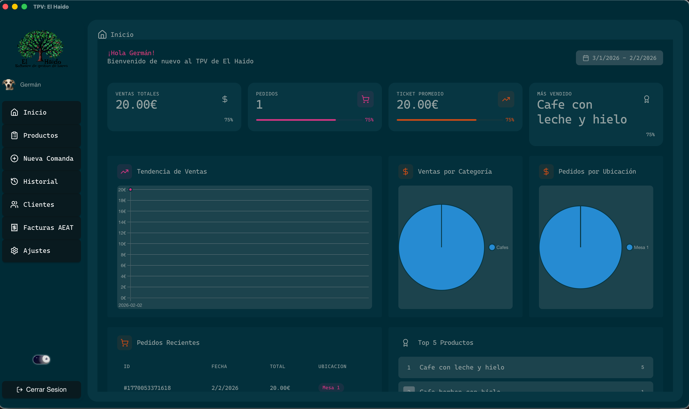

*Imagen de portada: TPV El Haido - Sistema de Punto de Venta*

***

***

## Tabla de Contenidos

1. [Introducción](#1-introducción) — Visión general y primeros pasos
2. [Instalación](#2-instalación) — Guía de instalación por sistema operativo
3. [Primeros Pasos](#3-primeros-pasos) — Configuración inicial y primera venta
4. [Gestión de Pedidos](#4-gestión-de-pedidos) — Crear, modificar y gestionar comandas
5. [Gestión de Productos](#5-gestión-de-productos) — Catálogo de productos y categorías
6. [Gestión de Clientes](#6-gestión-de-clientes) — Base de datos de clientes
7. [Procesamiento de Pagos](#7-procesamiento-de-pagos) — Cobros, tickets y cierre de caja
8. [Facturación VERI*FACTU](#8-facturación-verifactu) — Integración con la AEAT
9. [Configuración de Impresora](#9-configuración-de-impresora) — Impresoras térmicas y tickets
10. [Temas y Personalización](#10-temas-y-personalización) — Personaliza la interfaz

---

***

***

## 1. Introducción

Bienvenido a **TPV El Haido**, tu sistema de punto de venta diseñado específicamente para hostelería. Esta guía te acompañará desde la instalación hasta el dominio completo de todas las funcionalidades.

> **Nota para desarrolladores**
> Esta guía está pensada para usuarios finales. Si eres desarrollador, consulta la sección de desarrollo en la documentación online.

### 1.1 ¿Qué puedes hacer con TPV El Haido?

| Funcionalidad | Descripción |
|---------------|-------------|
| **Pedidos** | Crea comandas, gestiona mesas y cobra de forma rápida |
| **Productos** | Organiza tu catálogo con categorías, precios e imágenes |
| **Clientes** | Mantén una base de datos para facturas completas |
| **Pagos** | Efectivo, tarjeta o mixto con cálculo automático de cambio |
| **Impresión** | Tickets térmicos personalizados con tu logo |
| **Facturación** | Envío automático a la AEAT con VERI*FACTU |
| **Temas** | 6 temas visuales para adaptar la interfaz a tu negocio |

### 1.2 Flujo de trabajo típico

El uso diario de TPV El Haido sigue este flujo sencillo:

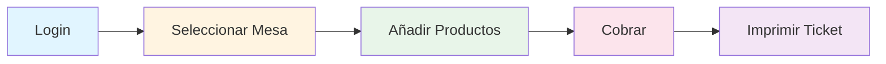
```mermaid
graph LR
    A[Login] --> B[Seleccionar Mesa]
    B --> C[Añadir Productos]
    C --> D[Cobrar]
    D --> E[Imprimir Ticket]

    style A fill:#e1f5ff
    style B fill:#fff4e1
    style C fill:#e8f5e9
    style D fill:#fce4ec
    style E fill:#f3e5f5
```

### 1.3 Pantalla principal

La interfaz está organizada en secciones accesibles desde el menú lateral:

| Sección | Icono | Descripción |
|---------|-------|-------------|
| **Inicio** | 🏠 | Panel principal con resumen del día |
| **Nueva Comanda** | ➕ | Crear pedidos y añadir productos |
| **Historial** | 📋 | Consultar pedidos anteriores |
| **Productos** | 📦 | Gestionar tu catálogo |
| **Clientes** | 👥 | Base de datos de clientes |
| **Facturas** | 📄 | Facturas AEAT y estados |
| **Ajustes** | ⚙️ | Configuración del sistema |

### 1.4 Obtener ayuda

Si tienes preguntas o encuentras problemas:

1. Abre el pannel de settings, escanea el codifo QR en la parte de problemas y sigue las instrucciones

---

***

***

## 2. Instalación

Guía paso a paso para instalar TPV El Haido en tu sistema operativo.

### 2.1 Requisitos del sistema

Antes de instalar, verifica que tu equipo cumple estos requisitos:

| Componente | Mínimo | Recomendado |
|------------|--------|-------------|
| **RAM** | 512 MB | 1 GB o más |
| **Almacenamiento** | 100 MB | 500 MB |
| **Pantalla** | 800×600 | 1024×768 o superior |
| **Internet** | Opcional | Requerido para VERI*FACTU |

### 2.2 Instalación en Windows

#### Windows 10/11 (64 bits)

**Paso 1: Descargar el instalador**

1. Accede a [GitHub Releases](https://github.com/MKS2508/tpv-el-haido2/releases/latest)
2. Descarga el archivo `TPV.El.Haido_x.x.x_x64-setup.exe`

**Paso 2: Ejecutar el instalador**

1. Haz doble clic en el archivo descargado
2. Si aparece Windows SmartScreen:
   - Haz clic en **"Más información"**
   - Luego en **"Ejecutar de todas formas"**
3. Sigue el asistente de instalación

**Paso 3: Verificar la instalación**

1. Busca "TPV El Haido" en el menú de inicio
2. Haz clic para abrir la aplicación
3. Deberías ver la pantalla de login o el asistente de configuración

> **⚠️ Windows SmartScreen**
> Al ser una aplicación no firmada por Microsoft, Windows puede mostrar una advertencia. Esto es completamente normal para software independiente y no indica ningún problema de seguridad.

### 2.3 Instalación en macOS

#### macOS 11 Big Sur o superior

**Paso 1: Descargar el DMG**

1. Accede a [GitHub Releases](https://github.com/MKS2508/tpv-el-haido2/releases/latest)
2. Descarga el archivo correspondiente a tu Mac:
   - **Mac con Intel**: `TPV.El.Haido_x64.dmg`
   - **Mac con Apple Silicon (M1/M2/M3/M4)**: `TPV.El.Haido_aarch64.dmg`

**Paso 2: Instalar la aplicación**

1. Abre el archivo DMG descargado
2. Arrastra el icono de TPV El Haido a la carpeta "Aplicaciones"
3. Expulsa el volumen DMG (clic derecho → Expulsar)

**Paso 3: Primera ejecución**

1. Abre la carpeta Aplicaciones
2. Haz **clic derecho** en "TPV El Haido"
3. Selecciona **"Abrir"** en el menú contextual
4. En el diálogo de seguridad, haz clic en **"Abrir"**

> **ℹ️ Gatekeeper de macOS**
> macOS puede bloquear la primera ejecución de aplicaciones descargadas. Usar clic derecho → Abrir evita tener que ir a Preferencias del Sistema.

### 2.4 Instalación en Linux

#### Ubuntu, Debian y derivados

**Paso 1: Instalar dependencias**

```bash
sudo apt update
sudo apt install -y libwebkit2gtk-4.1-0 libgtk-3-0
```

**Paso 2: Descargar e instalar**

```bash
# Descargar la última versión
wget https://github.com/MKS2508/tpv-el-haido2/releases/latest/download/tpv-el-haido_amd64.deb

# Instalar el paquete
sudo dpkg -i tpv-el-haido_amd64.deb

# Resolver dependencias si es necesario
sudo apt-get install -f
```

**Paso 3: Ejecutar**

```bash
# Desde terminal
tpv-el-haido

# O buscar "TPV El Haido" en el menú de aplicaciones
```

#### Alternativa: AppImage (cualquier distribución)

```bash
# Descargar
wget https://github.com/MKS2508/tpv-el-haido2/releases/latest/download/tpv-el-haido.AppImage

# Hacer ejecutable
chmod +x tpv-el-haido.AppImage

# Ejecutar
./tpv-el-haido.AppImage
```

### 2.5 Instalación en Raspberry Pi

#### Raspberry Pi 3/4/5 (64 bits) (arm)


**Paso 1: Instalar dependencias**

```bash
sudo apt update
sudo apt install -y libwebkit2gtk-4.1-0 libgtk-3-0
```

**Paso 2: Descargar e instalar**

```bash
wget https://github.com/MKS2508/tpv-el-haido2/releases/latest/download/tpv-el-haido_arm64.deb
sudo dpkg -i tpv-el-haido_arm64.deb
sudo apt-get install -f
```

**Optimizaciones recomendadas para Raspberry Pi:**

1. Usa el tema de **alto contraste** (menos efectos visuales)
2. Desactiva las animaciones en Ajustes
3. Asigna al menos 256 MB a la GPU en `raspi-config`

### 2.6 Pantalla de configuración

Una vez instalada, accederás al asistente de configuración:


*Imagen: Pantalla de Ajustes con las opciones de configuración disponibles*

### 2.7 Validación de licencia

Para acceder a todas las funcionalidades, valida tu licencia:

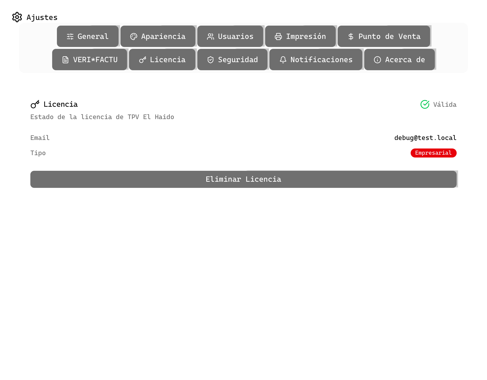

*Imagen 3: Pantalla de licencia válida con estado "Licencia Activa"*

**Pasos para validar:**

1. Ve a **Ajustes → Licencia**
2. Introduce tu clave de licencia
3. Haz clic en **Validar**
4. Si es válida, verás el estado "Licencia Activa"

### 2.8 Gestión de usuarios

Crea cuentas para cada empleado de tu negocio:

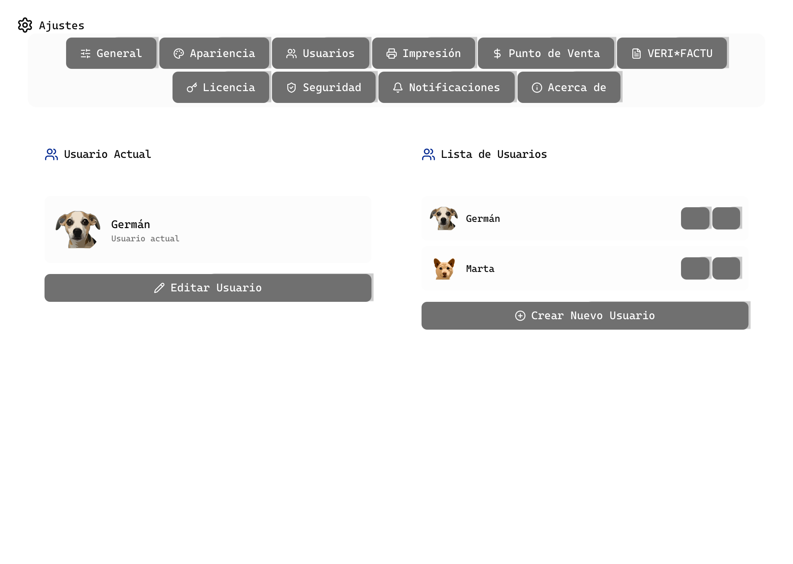

*Imagen 4: Panel de gestión de usuarios en Ajustes*

**Crear un nuevo usuario:**

1. Ve a **Ajustes → Usuarios**
2. Haz clic en **Nuevo Usuario**
3. Introduce:
   - **Nombre**: Nombre del empleado
   - **Avatar**: Selecciona una imagen
   - **PIN**: Código de 4 dígitos
   - **Rol**: Administrador o Empleado
4. Haz clic en **Guardar**

> **ℹ️ Roles de usuario**
> - **Administrador**: Acceso completo a ajustes y configuración
> - **Empleado**: Solo puede crear pedidos y ver historial propio

1. Ve a **Ajustes → Licencia**
2. Introduce tu clave de licencia
3. Haz clic en **Validar**
4. Si es válida, verás el estado "Licencia Activa"

> **ℹ️ Modo demo**
> Puedes usar la aplicación sin licencia en modo demo, pero algunas funciones estarán limitadas.

### 2.8 Solución de problemas de instalación

#### La aplicación no abre

**En Windows:**
1. Verifica que tienes Windows 10 o superior
2. Intenta ejecutar como administrador
3. Revisa si un antivirus está bloqueando la ejecución
4. Reinstala la aplicación

**En macOS:**
1. Ve a **Preferencias del Sistema → Seguridad y Privacidad**
2. En la pestaña General, haz clic en "Abrir de todas formas"
3. Si persiste, ejecuta: `xattr -cr /Applications/TPV\ El\ Haido.app`

**En Linux:**
1. Verifica las dependencias: `apt list --installed | grep webkit`
2. Comprueba permisos: `chmod +x /usr/bin/tpv-el-haido`
3. Ejecuta desde terminal para ver errores: `tpv-el-haido`

#### Error de base de datos

Si ves un error relacionado con SQLite:

1. Cierra la aplicación completamente
2. Localiza y elimina el archivo de base de datos:
   - **Windows**: `%APPDATA%\com.elhaido.tpv\tpv-haido.db`
   - **macOS**: `~/Library/Application Support/com.elhaido.tpv/tpv-haido.db`
   - **Linux**: `~/.config/com.elhaido.tpv/tpv-haido.db`
3. Reinicia la aplicación (se creará una nueva base de datos)

> **⚠️ Pérdida de datos**
> Borrar la base de datos eliminará todos tus datos. Haz una copia de seguridad primero si es posible.

---

***

***

## 3. Primeros Pasos

Después de instalar TPV El Haido, sigue esta guía para configurar tu sistema y realizar tu primera venta.

### 3.1 Asistente de configuración inicial

La primera vez que abras la aplicación, el asistente te guiará:

**Paso 1: Bienvenida**

El asistente te dará la bienvenida. Haz clic en **"Comenzar"** para iniciar.

**Paso 2: Modo de almacenamiento**

Selecciona cómo quieres guardar tus datos:

| Modo | Descripción | Cuándo usarlo |
|------|-------------|---------------|
| **SQLite** | Base de datos local en tu equipo | Un solo terminal (recomendado) |
| **HTTP** | Conexión a servidor externo | Múltiples terminales sincronizados |
| **IndexedDB** | Almacenamiento en navegador | Modo web o demostración |

> **💡 Recomendación**
> Para la mayoría de usuarios, **SQLite** es la mejor opción. Es rápido, fiable y no requiere configuración adicional.

**Paso 3: Crear usuario administrador**

1. Introduce el nombre del usuario (ejemplo: "Admin")
2. Selecciona un avatar o sube una foto
3. Crea un PIN de 4 dígitos
4. Confirma el PIN

**Paso 4: Tema visual**

Elige el tema que mejor se adapte a tu negocio:

- **Restaurant Professional**: Colores cálidos y elegantes
- **Modern Cafe**: Verde minimalista
- **Night Bar**: Tema oscuro con acentos neón
- **High Contrast**: Máxima legibilidad

**Paso 5: Completar**

Haz clic en **"Finalizar"** para completar la configuración.

### 3.2 Pantalla de login

Después de la configuración, verás la pantalla de acceso:

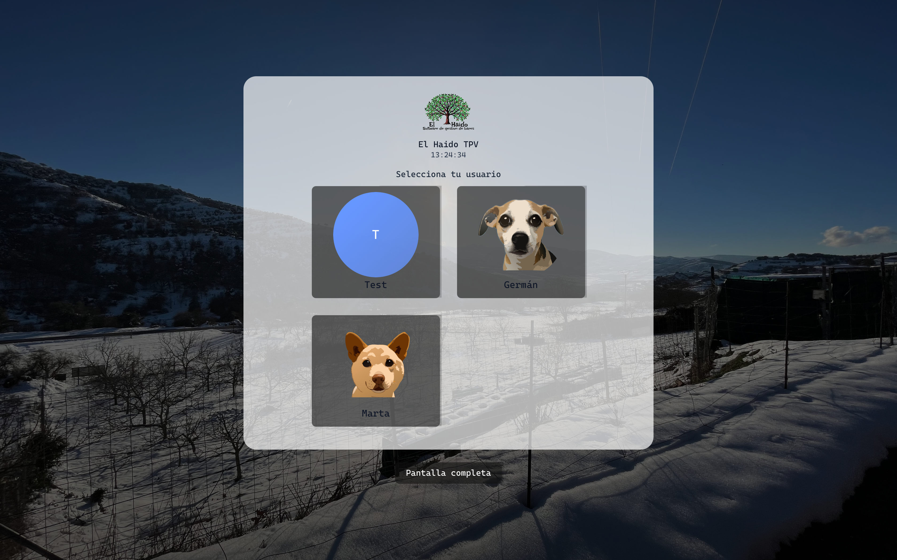

*Imagen 1: Pantalla de login con selección de usuario por avatar*

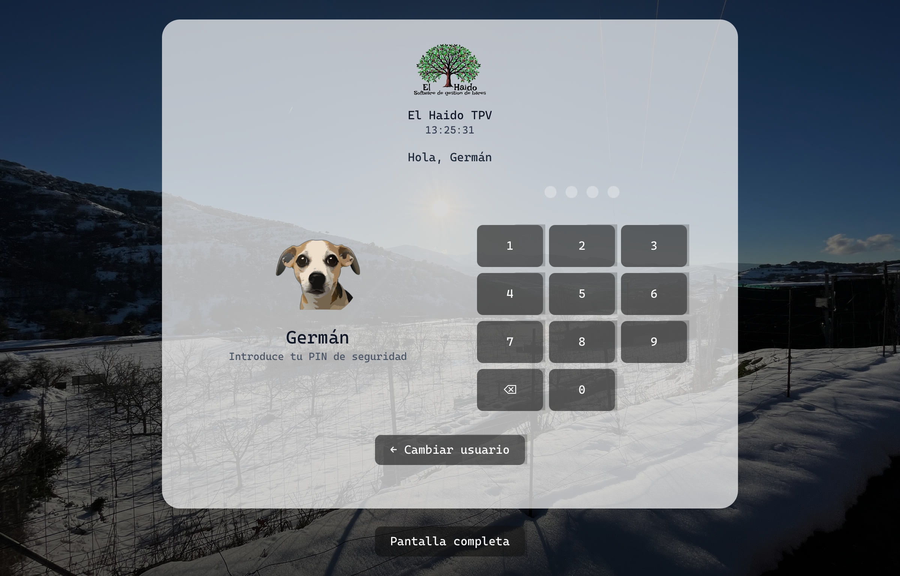

*Imagen 2: Pantalla de introducción del PIN de acceso*

**Para acceder:**

1. **Toca tu avatar** para seleccionar tu usuario
2. **Introduce tu PIN** de 4 dígitos
3. **Pulsa Enter** o el botón de acceso

> **ℹ️ Múltiples usuarios**
> Puedes crear más usuarios desde **Ajustes → Usuarios** para que cada empleado tenga su propio acceso.

### 3.3 Dashboard principal

Una vez dentro, verás el panel principal:

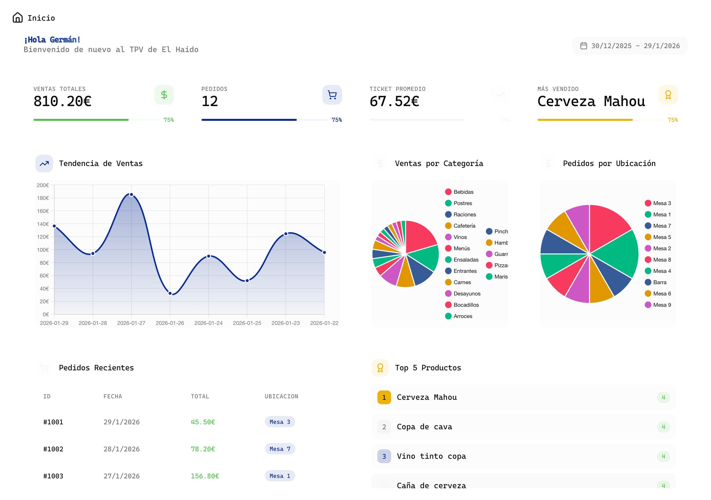

*Imagen: Dashboard principal de TPV El Haido con información del día*

Desde aquí puedes:

- Ver el resumen de ventas del día
- Crear nuevas comandas rápidamente
- Ver el estado de las mesas
- Acceder a cualquier sección del sistema

### 3.4 Crear tu primera categoría

Antes de añadir productos, necesitas al menos una categoría:

**Paso 1:** En el menú lateral, haz clic en **Productos**

**Paso 2:** Haz clic en el botón **Categorías** o el icono de carpeta

**Paso 3:** Haz clic en **Nueva Categoría**

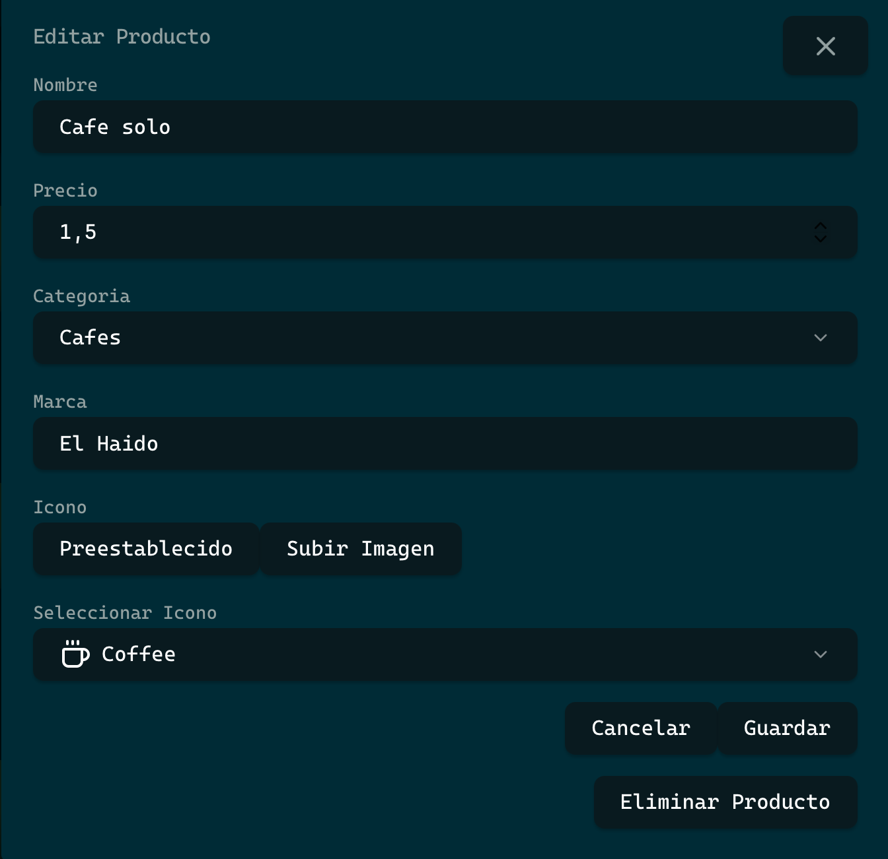

*Imagen 5: Diálogo de creación de categoría*

**Paso 4:** Rellena los datos:

| Campo | Ejemplo | Obligatorio |
|-------|---------|-------------|
| **Nombre** | Bebidas | Sí |
| **Descripción** | Refrescos, cervezas, vinos... | No |
| **Icono** | 🍺 | No |

**Paso 5:** Haz clic en **Guardar**

### 3.5 Crear tu primer producto

**Paso 1:** En la sección **Productos**, haz clic en **Nuevo Producto**

**Paso 2:** Rellena la información básica:

| Campo | Ejemplo | Descripción |
|-------|---------|-------------|
| **Nombre** | Cerveza | Nombre que verás en el TPV |
| **Precio** | 2.50 | Precio SIN IVA |
| **Categoría** | Bebidas | La categoría que creaste |
| **IVA** | 21% | Tipo impositivo aplicable |

**Paso 3:** Opcionalmente, añade una imagen o icono

**Paso 4:** Haz clic en **Crear Producto**

### 3.6 Realizar tu primera venta

**Paso 1: Crear nueva comanda**

1. En el menú lateral, haz clic en **Nueva Comanda**
2. Opcionalmente, selecciona una mesa

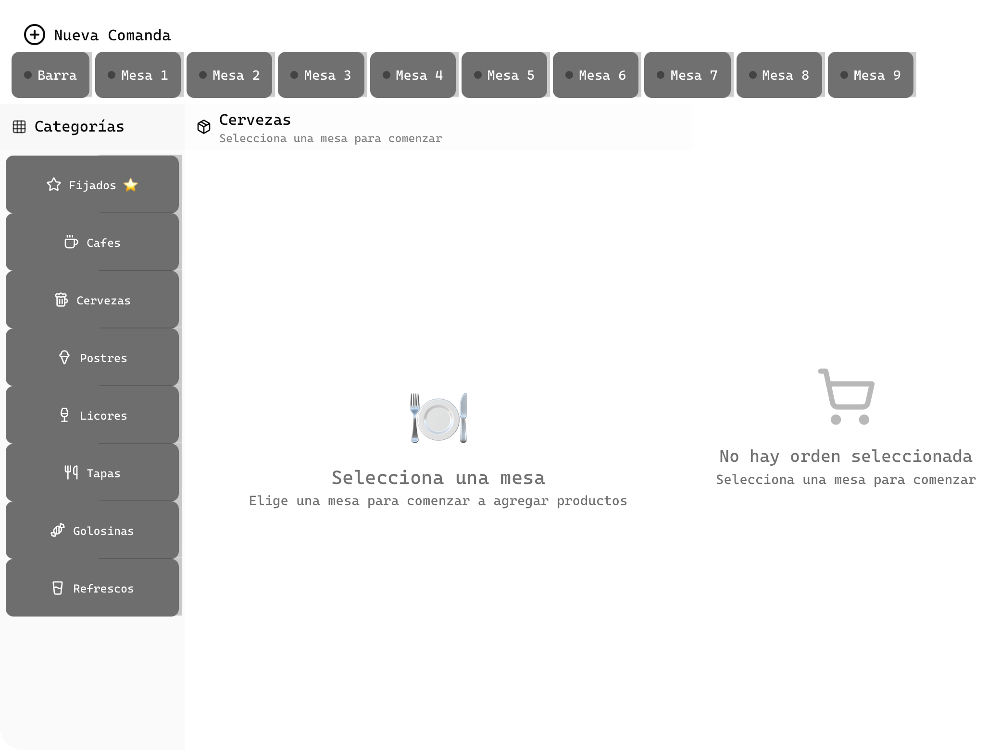

*Imagen: Pantalla de Nueva Comanda con el grid de productos*

**Paso 2: Añadir productos**

1. Navega por las categorías en la barra lateral izquierda
2. Haz clic en los productos para añadirlos
3. El resumen aparece en el panel derecho

**Paso 3: Ajustar cantidades**

- **+** aumenta la cantidad
- **-** reduce la cantidad
- **🗑️** elimina el producto

**Paso 4: Cobrar**

1. Haz clic en **Cobrar**
2. Selecciona el método de pago (Efectivo, Tarjeta, Otro)
3. Si es efectivo, introduce el importe recibido
4. El sistema calcula el cambio automáticamente
5. Haz clic en **Confirmar Pago**

**Paso 5: Ticket impreso**

El ticket se imprime automáticamente si tienes impresora configurada.

### 3.7 Resumen de configuración inicial

Has completado la configuración básica:

- [x] Asistente de configuración completado
- [x] Usuario administrador creado
- [x] Primera categoría creada
- [x] Primer producto añadido
- [x] Primera venta realizada

> **✅ ¡Listo!**
> Tu TPV está operativo. Explora el resto de la documentación para aprovechar todas las funcionalidades.

---

***

***

## 4. Gestión de Pedidos

Aprende a crear, modificar y gestionar comandas de forma eficiente.

### 4.1 Crear una nueva comanda

**Paso 1:** En el menú lateral, haz clic en **Nueva Comanda**

**Paso 2:** Si tu negocio usa mesas:
- Verás un grid con las mesas disponibles
- Haz clic en una mesa para asignar el pedido
- O selecciona "Barra" / "Para llevar"

**Paso 3:** Añade productos:


*Imagen: Pantalla de creación de comanda*

1. **Navega por categorías** en la barra lateral
2. **Haz clic en un producto** para añadirlo
3. **Repite** para añadir más productos

**Paso 4:** Revisa el resumen en el panel derecho:
- Lista de productos añadidos
- Cantidad de cada uno
- Precio por línea
- **Total del pedido**

### 4.2 Modificar un pedido

Desde el panel de resumen del pedido, puedes ajustar cada línea:

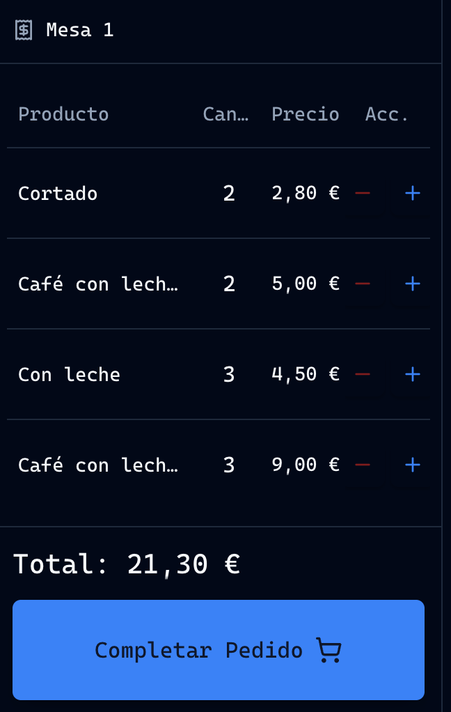

*Imagen 6: Panel de modificación de pedido con controles de cantidad*

| Acción | Cómo hacerlo |
|--------|--------------|
| **Aumentar cantidad** | Botón **+** junto al producto |
| **Reducir cantidad** | Botón **-** junto al producto |
| **Cantidad específica** | Clic en el número y escribir la cantidad |
| **Eliminar producto** | Icono de papelera o reducir a 0 |
| **Añadir nota** | Clic en el producto → escribir nota (ej: "sin cebolla") |

### 4.3 Estados del pedido

Los pedidos pasan por diferentes estados:

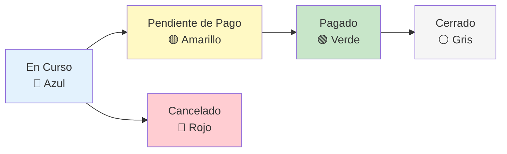
```mermaid
graph LR
    A[En Curso<br/>🔵 Azul] --> B[Pendiente de Pago<br/>🟡 Amarillo]
    B --> C[Pagado<br/>🟢 Verde]
    C --> D[Cerrado<br/>⚪ Gris]
    A --> E[Cancelado<br/>🔴 Rojo]

    style A fill:#e3f2fd
    style B fill:#fff9c4
    style C fill:#c8e6c9
    style D fill:#f5f5f5
    style E fill:#ffcdd2
```

| Estado | Descripción |
|--------|-------------|
| **En Curso** | Pedido activo, se pueden añadir/quitar productos |
| **Pendiente de Pago** | Listo para cobrar |
| **Pagado** | Pago recibido correctamente |
| **Cerrado** | Pedido finalizado completamente |
| **Cancelado** | Pedido anulado |

### 4.4 Gestión de mesas

**Ver estado de mesas:**

En Inicio o Nueva Comanda, cada mesa muestra su estado:
- **Verde**: Mesa libre
- **Rojo**: Mesa ocupada
- **Amarillo**: Pendiente de pago

**Cambiar mesa:**

1. Abre el pedido activo
2. Haz clic en **Cambiar Mesa**
3. Selecciona la nueva mesa
4. Confirma el cambio

**Juntar mesas:**

1. Abre el pedido de la mesa principal
2. Haz clic en **Añadir Mesa**
3. Selecciona las mesas a unir
4. Los pedidos se combinan automáticamente

### 4.5 Historial de pedidos

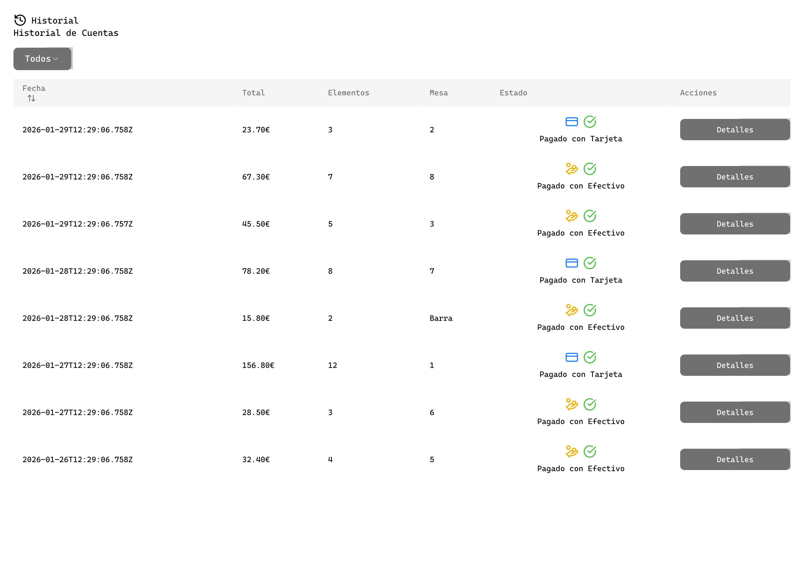

*Imagen: Historial de pedidos con opciones de filtrado*

**Acceder:** Menú lateral → **Historial**

**Filtros disponibles:**

| Filtro | Descripción |
|--------|-------------|
| **Fecha** | Selecciona un rango de fechas |
| **Estado** | Pagado, cancelado, pendiente... |
| **Usuario** | Filtra por quién creó el pedido |
| **Mesa** | Filtra por número de mesa |

**Ver detalle de un pedido:**

Haz clic en cualquier pedido para ver:
- Productos y cantidades
- Hora de creación
- Método de pago
- Usuario que lo gestionó

**Reimprimir ticket:**

En el detalle del pedido, haz clic en **Imprimir**.

### 4.6 Operaciones rápidas

**Repetir pedido:** En el historial, abre un pedido anterior y haz clic en **Repetir Pedido**. Se crea una nueva comanda con los mismos productos.

**Dividir cuenta:** Al cobrar, haz clic en **Dividir**:
- Selecciona el número de partes
- El sistema divide el total equitativamente
- O asigna productos específicos a cada cuenta

### 4.7 Comandas en cocina

Si usas impresora de cocina:

1. Los productos de categorías marcadas como "cocina" se envían automáticamente
2. Puedes reenviar manualmente desde el detalle del pedido
3. Configura las categorías en **Ajustes → Impresora → Cocina**

---

***

***

## 5. Gestión de Productos

Aprende a organizar tu catálogo de productos y categorías.

### 5.1 Acceder al catálogo

1. En el menú lateral, haz clic en **Productos**
2. Verás el grid de productos con opciones de búsqueda y filtrado

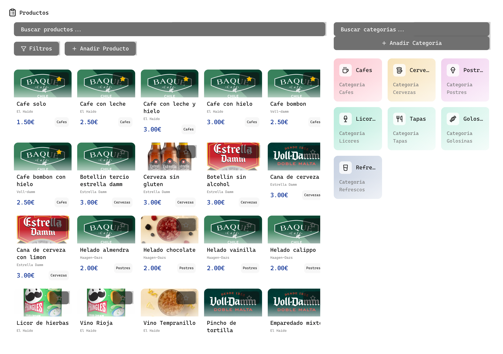

*Imagen: Catálogo de productos con vista en cuadrícula*

### 5.2 Gestión de categorías

Las categorías organizan tus productos para facilitar la navegación durante las ventas.

**Crear una categoría:**

1. En Productos, haz clic en **Categorías**
2. Haz clic en **Nueva Categoría**
3. Completa los campos:

| Campo | Descripción | Ejemplo |
|-------|-------------|---------|
| **Nombre** | Nombre de la categoría | "Bebidas Frías" |
| **Descripción** | Descripción opcional | "Refrescos, zumos, agua..." |
| **Icono** | Icono visual | 🍺 |

4. Haz clic en **Crear**

**Editar/Eliminar:**

- **Editar**: Icono de lápiz junto a la categoría
- **Eliminar**: Icono de papelera (los productos pasan a "Sin categoría")

### 5.3 Gestión de productos

**Crear un producto:**

| Campo | Descripción | Obligatorio |
|-------|-------------|-------------|
| **Nombre** | Nombre del producto | Sí |
| **Precio** | Precio de venta (SIN IVA) | Sí |
| **Categoría** | Categoría del producto | Sí |
| **Marca** | Marca del producto | No |
| **IVA** | Tipo impositivo | Sí |

**Configuración de IVA:**

| Tipo | Porcentaje | Aplicación típica |
|------|------------|-------------------|
| **General** | 21% | Mayoría de productos |
| **Reducido** | 10% | Alimentación elaborada, transporte |
| **Superreducido** | 4% | Pan, leche, frutas, verduras |

**Imagen del producto:**

Dos opciones:
1. **Icono predefinido**: Selecciona de la biblioteca
2. **Imagen personalizada**: Sube una foto (recomendado: 200×200px, PNG o JPG)

### 5.4 Búsqueda y filtros

**Barra de búsqueda:** Busca por nombre, marca o categoría

**Filtros por categoría:** Haz clic en una categoría en la barra lateral

**Ordenación:**
- Nombre (A-Z, Z-A)
- Precio (menor a mayor, mayor a menor)
- Más recientes

### 5.5 Importación y exportación

**Importar productos desde CSV:**

1. Prepara un archivo CSV con el formato:

```csv
nombre,precio,categoria,marca,iva
Coca-Cola,1.80,Bebidas,Coca-Cola,21
Café Solo,1.20,Cafés,,21
Tostada,2.50,Desayunos,,10
```

2. Ve a **Ajustes → Importar/Exportar**
3. Selecciona **Importar Productos**
4. Carga el archivo y revisa la vista previa
5. Confirma la importación

**Exportar catálogo:**

1. Ve a **Ajustes → Importar/Exportar**
2. Selecciona **Exportar Productos**
3. Elige el formato (CSV o JSON)
4. Descarga el archivo

### 5.6 Consejos para la gestión de productos

**Organización eficiente:**
- Crea categorías que reflejen tu carta o menú
- Usa nombres cortos y claros
- Los productos más vendidos pueden tener un icono distintivo

**Precios:**
- Introduce siempre el precio **SIN IVA**
- El sistema calcula el PVP automáticamente
- Cambiar precios no afecta a pedidos anteriores

**Imágenes:**
- Tamaño recomendado: 200×200px mínimo
- Formato: PNG o JPG
- Peso: menos de 500KB
- Las imágenes cuadradas se muestran mejor

---

***

***

## 6. Gestión de Clientes

Mantén una base de datos de clientes para fidelización y facturación completa.

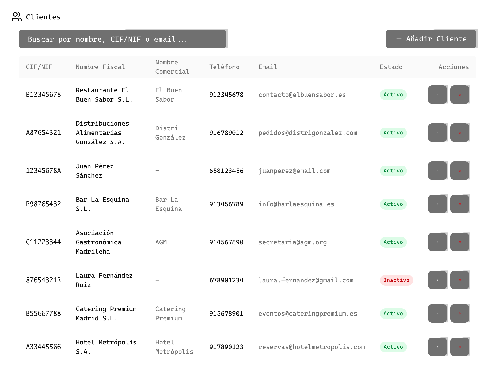

*Imagen: Pantalla de gestión de clientes*

### 6.1 Acceder a clientes

En el menú lateral, haz clic en **Clientes** para ver la lista de clientes registrados.

### 6.2 Crear un nuevo cliente

**Paso 1:** Haz clic en **Nuevo Cliente**

**Paso 2:** Completa los datos básicos:

| Campo | Descripción | Obligatorio |
|-------|-------------|-------------|
| **Nombre** | Nombre completo o razón social | Sí |
| **NIF/CIF** | Identificación fiscal | Para facturas |
| **Email** | Correo electrónico | No |
| **Teléfono** | Número de contacto | No |

**Paso 3:** Para facturas completas (tipo F1), añade la dirección fiscal:

| Campo | Descripción |
|-------|-------------|
| **Dirección** | Calle y número |
| **Código Postal** | CP |
| **Población** | Ciudad |
| **Provincia** | Provincia |

**Paso 4:** Haz clic en **Crear Cliente**

### 6.3 Buscar clientes

**Barra de búsqueda:** Busca por nombre, NIF/CIF, teléfono o email

**Filtros:**
- **Todos**: Muestra todos los clientes
- **Frecuentes**: Clientes con más de X pedidos
- **Recientes**: Últimos clientes añadidos

### 6.4 Asignar cliente a un pedido

**Durante la comanda:**
1. En Nueva Comanda, haz clic en **Asignar Cliente** (icono de persona)
2. Busca y selecciona el cliente
3. El nombre aparece en la cabecera del pedido

**En el cobro:**
1. Al procesar el pago, puedes asignar o cambiar el cliente
2. Útil para facturas con datos completos

### 6.5 Facturas para clientes

Cuando asignas un cliente con NIF a un pedido:
- La factura incluye los datos fiscales completos
- Puede ser tipo F1 (factura completa) si tiene todos los datos
- El cliente puede recibir copia por email

> **ℹ️ Facturas tipo F1**
> Para generar facturas completas (F1), el cliente debe tener NIF y dirección fiscal completa.

### 6.6 Historial del cliente

Al abrir un cliente puedes ver:
- Total de pedidos realizados
- Importe total gastado
- Último pedido
- Productos más comprados

### 6.7 Importar y exportar clientes

**Importar desde CSV:**

```csv
nombre,nif,email,telefono,direccion,cp,poblacion
Juan García,12345678A,juan@email.com,600123456,Calle Mayor 1,28001,Madrid
Empresa SL,B12345678,info@empresa.com,910000000,Av. Principal 10,08001,Barcelona
```

**Exportar:** Ve a **Ajustes → Importar/Exportar → Exportar Clientes**

---

***

***

## 7. Procesamiento de Pagos

Aprende a cobrar pedidos, gestionar métodos de pago e imprimir tickets.

### 7.1 Cobrar un pedido

**Paso 1:** Abre el pedido desde Nueva Comanda o selecciona uno activo

**Paso 2:** Haz clic en **Cobrar** (o en el total del pedido)

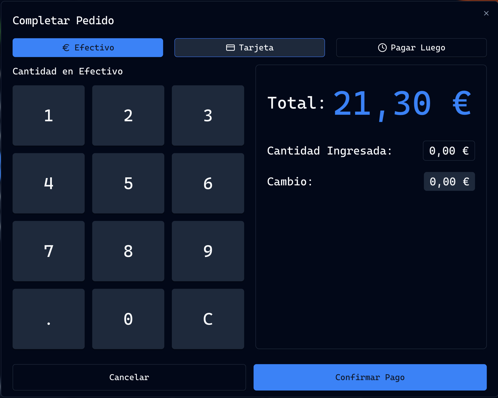

*Imagen 13: Pantalla de cobro con métodos de pago*

**Paso 3:** Selecciona el método de pago:

| Método | Descripción |
|--------|-------------|
| **Efectivo** | Pago en metálico con cálculo de cambio |
| **Tarjeta** | Pago con tarjeta de crédito/débito |
| **Otro** | Transferencia, vales, etc. |

**Paso 4:** Completa el pago:

**Para efectivo:**
1. Introduce el importe recibido
2. El sistema calcula el cambio automáticamente
3. Haz clic en **Confirmar**

**Para tarjeta:**
1. Haz clic en **Confirmar**
2. Procesa el pago en tu datáfono

**Paso 5:** El ticket se imprime automáticamente

### 7.2 Pago en efectivo

El sistema calcula automáticamente el cambio a devolver:

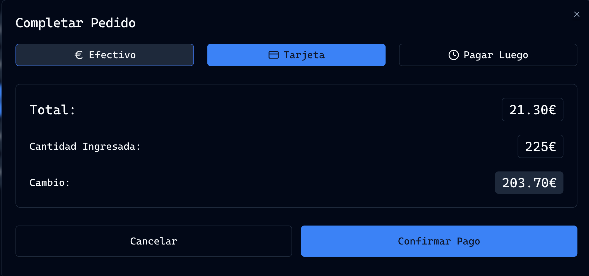

*Imagen 14: Cálculo automático de cambio en pago efectivo*


```mermaid
graph LR
    A["💰 Total: 15.50€"] --> B["💵 Cliente paga: 20.00€"]
    B --> C["💶 Cambio: 4.50€"]
    C --> D["🧾 Ticket impreso"]

    style A fill:#ffcdd2
    style B fill:#fff9c4
    style C fill:#c8e6c9
    style D fill:#e1f5fe
```

**Atajos de importe:**
- Botones rápidos para billetes (5€, 10€, 20€, 50€)
- Campo para importe exacto
- Botón "Importe exacto" cuando el cliente paga justo

### 7.3 Pago mixto

Para combinar varios métodos de pago:

1. En la pantalla de cobro, haz clic en **Pago Mixto**
2. Selecciona el primer método (ej: Tarjeta) e introduce el importe parcial
3. Haz clic en **Añadir**
4. El resto aparece pendiente
5. Selecciona otro método (ej: Efectivo) y completa
6. Confirma cuando la suma cubra el total

### 7.4 Personalizar tickets

En **Ajustes → Impresora → Ticket** puedes configurar:

| Opción | Descripción |
|--------|-------------|
| **Logo** | Imagen en la cabecera (BMP monocromo) |
| **Nombre** | Nombre del negocio |
| **Dirección** | Dirección fiscal |
| **CIF/NIF** | Identificación fiscal |
| **Teléfono** | Número de contacto |
| **Mensaje pie** | Texto personalizado al final |

### 7.5 Apertura del cajón

**Automática:** El cajón se abre al completar un pago en efectivo (configurable)

**Manual:** Botón **Abrir Cajón** en Ajustes o barra de herramientas

### 7.6 Devoluciones

**Anular pedido (antes de cerrar):**
1. Abre el pedido
2. Haz clic en **Anular Pedido**
3. Introduce el motivo (opcional)
4. Confirma

**Devolución parcial (después de cobrar):**
1. Ve al historial y abre el pedido
2. Haz clic en **Devolución**
3. Selecciona los productos a devolver
4. Confirma el importe a reembolsar

> **⚠️ Facturas AEAT**
> Las devoluciones pueden afectar a las facturas si ya fueron enviadas a la AEAT.

### 7.7 Cierre de caja

Al final del turno o día:

**Paso 1:** Ve a **Ajustes → Caja → Cierre**

**Paso 2:** Revisa el resumen:
- Total de ventas
- Desglose por método de pago
- Número de operaciones

**Paso 3:** Introduce el efectivo contado en caja

**Paso 4:** Haz clic en **Cerrar Caja**

El informe de cierre incluye ventas por categoría, por producto, por usuario e impuestos recaudados.

---

***

***

## 8. Facturación VERI*FACTU

TPV El Haido incluye integración con el sistema VERI*FACTU de la Agencia Tributaria para el envío automático de facturas electrónicas.

### 8.1 ¿Qué es VERI*FACTU?

VERI*FACTU es el sistema de la AEAT para verificar facturas electrónicas:

- **Envío automático** de facturas a la AEAT
- **Verificación** mediante CSV (Código Seguro de Verificación)
- **Cumplimiento** de la normativa española de facturación electrónica

> **⚠️ Consulta con tu asesor**
> La obligatoriedad de VERI*FACTU depende del tipo y tamaño de tu negocio. Consulta con tu asesor fiscal para determinar si te aplica.

### 8.2 Configuración inicial

**Paso 1:** Ve a **Ajustes → VERI*FACTU**

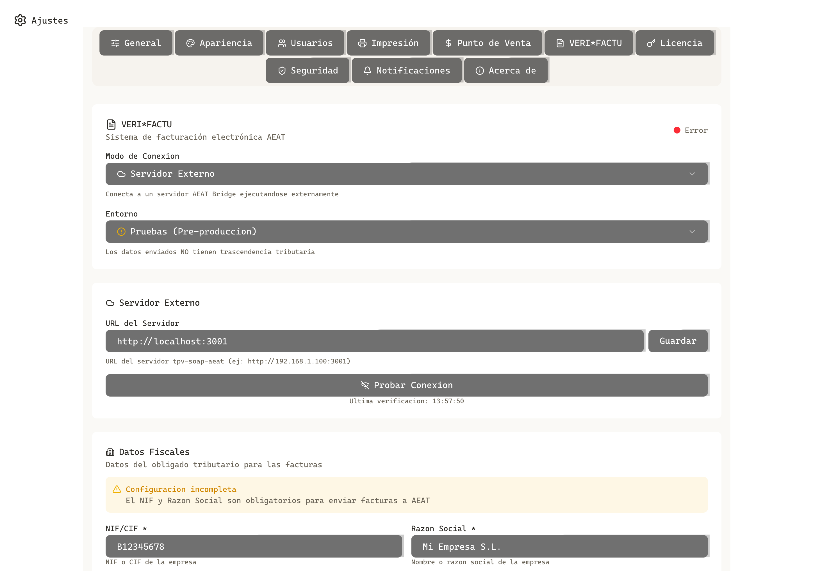

*Imagen: Configuración de VERI*FACTU en Ajustes*

**Paso 2:** Introduce los datos del emisor:

| Campo | Descripción | Ejemplo |
|-------|-------------|---------|
| **NIF** | Número de Identificación Fiscal | B12345678 |
| **Razón Social** | Nombre fiscal de la empresa | Bar El Haido S.L. |
| **Dirección** | Dirección fiscal completa | C/ Principal, 1 |
| **Código Postal** | CP de la dirección fiscal | 28001 |
| **Población** | Ciudad | Madrid |

**Paso 3:** Configura la serie de factura:

- **Prefijo**: Identificador de serie (ej: "TPV-", "F2024-")
- **Número inicial**: Primer número de factura

**Paso 4:** Selecciona el tipo de factura:

| Tipo | Código | Uso |
|------|--------|-----|
| **Factura completa** | F1 | Con todos los datos del cliente |
| **Factura simplificada** | F2 | Tickets sin datos completos del cliente |

> **ℹ️ Tipo F2**
> La mayoría de TPV usan F2 (factura simplificada) para tickets de venta directa.

### 8.3 Certificado digital

Para enviar facturas a la AEAT necesitas un certificado digital válido.

**Tipos de certificado:**

| Tipo | Formato | Recomendado para |
|------|---------|------------------|
| **Personal** | PFX/P12 | Autónomos |
| **Sello de empresa** | PFX/P12 | Sociedades |

**Instalar certificado:**

1. Obtén tu certificado en [FNMT](https://www.sede.fnmt.gob.es/) o entidad autorizada
2. Exporta en formato PFX/P12 con contraseña
3. En **Ajustes → VERI*FACTU → Certificado**, haz clic en **Cargar Certificado**
4. Selecciona el archivo PFX/P12
5. Introduce la contraseña
6. Haz clic en **Verificar**

Si es válido, verás el nombre del titular, fecha de caducidad y estado "Válido".

> **⚠️ Contraseña segura**
> Guarda la contraseña del certificado en un lugar seguro. Sin ella no podrás usarlo.

### 8.4 Modos de operación

| Modo | Descripción | Cuándo usarlo |
|------|-------------|---------------|
| **Deshabilitado** | VERI*FACTU desactivado | No envía a AEAT |
| **Sidecar** | Usa aeat-bridge local (puerto 3001) | Recomendado para un terminal |
| **Externo** | Servidor AEAT remoto | Multi-terminal, servidor centralizado |

**Modo Sidecar (Recomendado):**
- El proceso se ejecuta localmente
- Se inicia automáticamente
- Funciona offline (cola de envío)

### 8.5 Entornos

| Entorno | Descripción |
|---------|-------------|
| **Pruebas** | Para testing, no tiene efectos legales |
| **Producción** | Envío real a la AEAT |

> **❌ Importante**
> Asegúrate de estar en modo **Producción** cuando operes de forma real. Las facturas en modo Pruebas no son válidas fiscalmente.

### 8.6 Panel de facturas

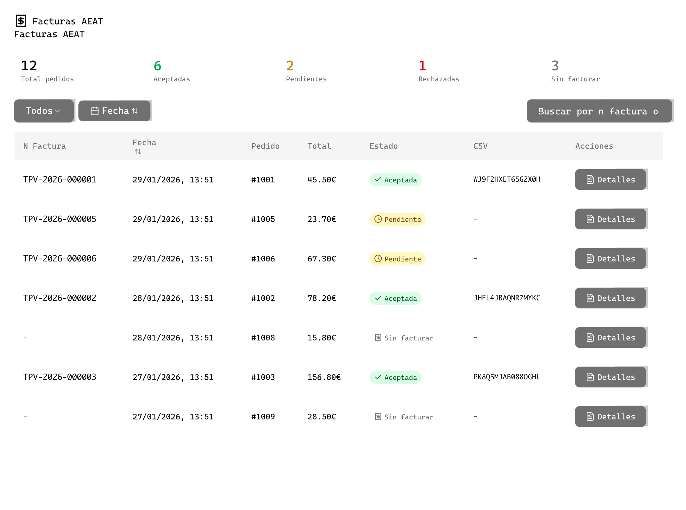

*Imagen: Panel de facturas AEAT*

**Acceder:** Menú lateral → **Facturas** (o **AEAT**)

**Estados de factura:**

| Estado | Color | Significado |
|--------|-------|-------------|
| **Aceptada** | 🟢 Verde | Enviada y aceptada por AEAT |
| **Pendiente** | 🟡 Amarillo | Pendiente de envío |
| **Rechazada** | 🔴 Rojo | Rechazada por AEAT (ver error) |
| **Sin facturar** | ⚪ Gris | No se ha generado factura |

**Detalle de factura:**

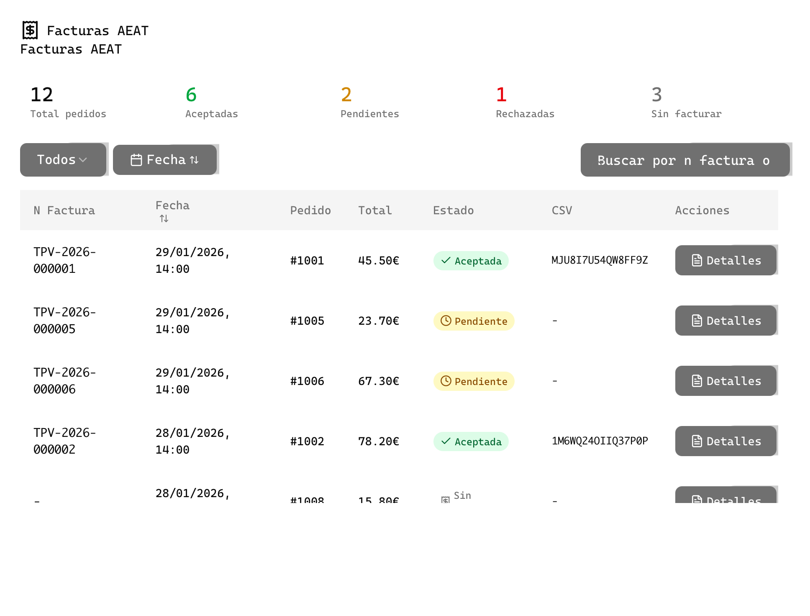

*Imagen 10: Detalle de factura con CSV de verificación*

Información disponible:
- Número de factura
- Fecha de emisión
- Datos del cliente
- Desglose de productos e IVA
- **CSV**: Código Seguro de Verificación
- Link para verificar en sede AEAT

### 8.7 Verificación de facturas

Verifica que tus facturas han sido correctamente enviadas a la AEAT:

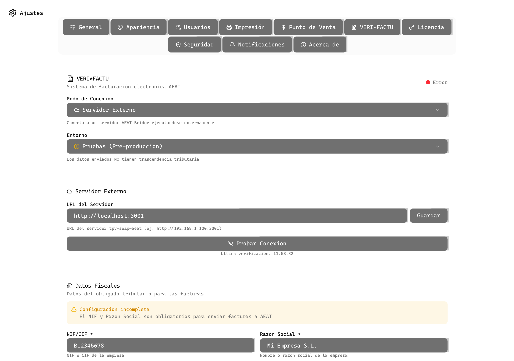

*Imagen 11: Pantalla de verificación con CSV*

**Códigos de estado en el detalle:**

| Código | Significado |
|--------|-------------|
| **CSV correcto** | Factura enviada y validada por AEAT |
| **Pendiente** | Esperando envío o respuesta de AEAT |
| **Error** | Rechazada - revisa los datos del emisor |
- Número de factura
- Fecha de emisión
- Datos del cliente
- Desglose de productos e IVA
- **CSV**: Código Seguro de Verificación
- Link para verificar en sede AEAT

### 8.7 Solución de problemas

| Error | Causa | Solución |
|-------|-------|----------|
| NIF inválido | El NIF del emisor no es válido | Verifica el NIF en Ajustes |
| Certificado caducado | El certificado ha expirado | Renueva el certificado |
| Error de conexión | No se puede conectar a AEAT | Verifica conexión a internet |
| Factura duplicada | Ya existe factura con ese número | Verifica serie y numeración |

---

***

***

## 9. Configuración de Impresora

Guía para configurar tu impresora térmica y poder imprimir tickets de venta.

### 9.1 Impresoras compatibles

TPV El Haido soporta cualquier impresora compatible con el protocolo **ESC/POS**:

| Marca | Modelos probados |
|-------|------------------|
| **Epson** | TM-T20, TM-T88, TM-T82 |
| **Star** | TSP100, TSP650, mPOP |
| **Bixolon** | SRP-330, SRP-350 |
| **Sewoo** | LK-TL200, LK-TL320 |
| **Genéricas** | Impresoras USB/Serial 58mm, 80mm |

> **ℹ️ Compatibilidad**
> La mayoría de impresoras térmicas de TPV usan el estándar ESC/POS y son compatibles.

### 9.2 Conexión USB (Recomendado)

**Paso 1: Conectar la impresora**

1. Conecta el cable USB de la impresora a tu ordenador
2. Enciende la impresora
3. Espera a que el sistema la detecte

**Paso 2: Identificar el puerto**

**Windows:**
- Abre "Administrador de dispositivos"
- Busca en "Puertos (COM y LPT)"
- Anota el número COM (ej: COM3)

**macOS/Linux:**
```bash
# macOS
ls /dev/tty.*

# Linux
ls /dev/ttyUSB*
```
Anota el dispositivo (ej: `/dev/ttyUSB0`)

### 9.3 Conexión por Red (Ethernet/WiFi)

**Paso 1:** Configura una IP estática en la impresora (consulta el manual)

**Paso 2:** En **Ajustes → Impresora**:
- Tipo de conexión: **Red**
- IP: (ej: 192.168.1.100)
- Puerto: 9100 (estándar)

### 9.4 Configuración en TPV El Haido

**Paso 1:** En el menú lateral, ve a **Ajustes → Impresora**

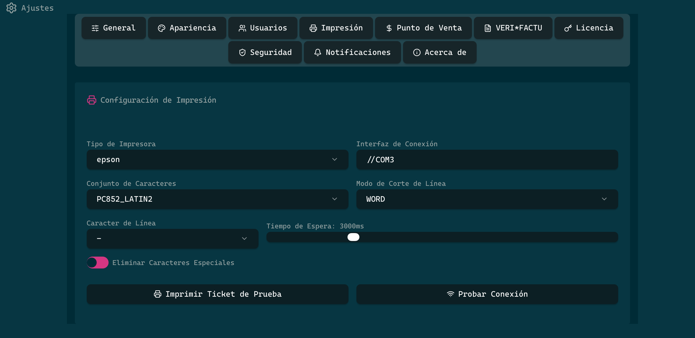

*Imagen 18: Configuración de impresora en Ajustes*

**Paso 2:** Configura la conexión:

| Campo | Descripción | Ejemplo |
|-------|-------------|---------|
| **Tipo** | USB, Red, Bluetooth | USB |
| **Puerto/IP** | Puerto COM o dirección IP | COM3, 192.168.1.100 |
| **Puerto de red** | Solo para conexión de red | 9100 |

**Paso 3:** Selecciona el ancho de papel:

| Ancho | Caracteres por línea | Uso común |
|-------|----------------------|-----------|
| **58mm** | ~32 caracteres | Portátiles, pequeñas |
| **80mm** | ~48 caracteres | Estándar de mostrador |

**Paso 4:** Haz clic en **Probar Impresora** para imprimir un ticket de prueba

### 9.5 Personalizar tickets

En **Ajustes → Impresora → Ticket**:

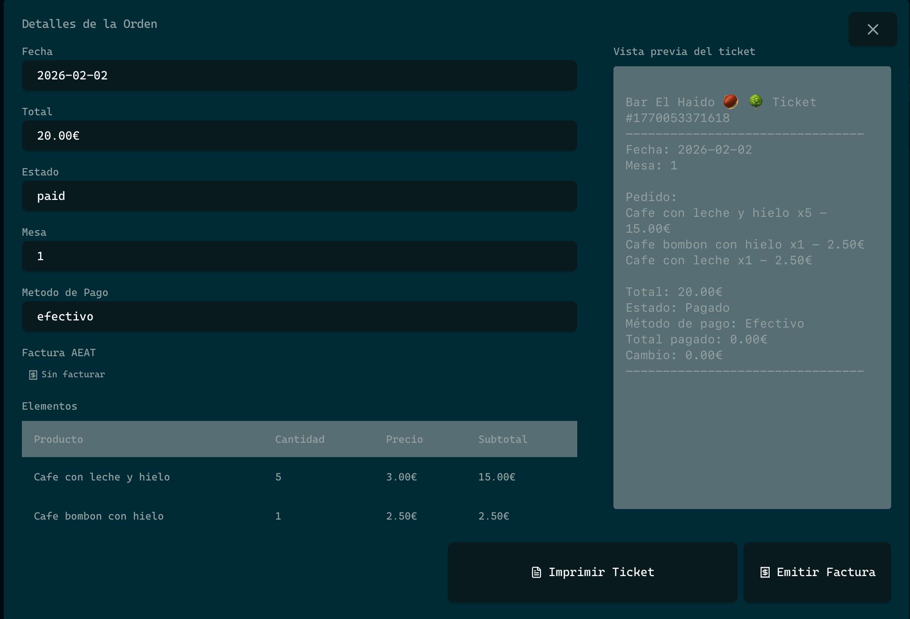

*Imagen 19: Ejemplo de ticket impreso de 80mm*

| Campo | Descripción |
|-------|-------------|
| **Nombre negocio** | Se muestra en grande en la cabecera |
| **Dirección** | Línea de dirección |
| **Localidad** | Ciudad y código postal |
| **CIF/NIF** | Identificación fiscal |
| **Teléfono** | Número de contacto |
| **Mensaje pie** | Texto al final (ej: "¡Gracias por su visita!") |

**Añadir logo:**

1. Prepara la imagen en formato **BMP monocromo**
2. Tamaño: 384px de ancho para 80mm, 256px para 58mm
3. Haz clic en "Subir logo" y selecciona el archivo

> **💡 Mejor impresión**
> Usa una imagen de alto contraste para mejor calidad en impresión térmica.

### 9.6 Apertura del cajón portamonedas

**Configurar:**
1. Conecta el cajón al puerto RJ-11 de la impresora
2. En **Ajustes → Impresora**, activa "Abrir cajón automáticamente"

**Apertura automática:** Al completar pagos en efectivo

**Apertura manual:** Botón **Abrir Cajón** en la barra de herramientas

### 9.7 Impresora de cocina

Si tienes una segunda impresora para cocina:

1. En **Ajustes → Impresora → Impresoras adicionales**
2. Haz clic en **Añadir impresora** y configura como "Cocina"
3. En **Categorías**, activa "Enviar a cocina" para las categorías de comida

### 9.8 Solución de problemas

**La impresora no imprime:**

| Sistema | Solución |
|---------|----------|
| **Windows** | Verifica puerto COM, reinstala driver, prueba otro cable |
| **macOS** | Ejecuta: `sudo chmod 666 /dev/tty.*` |
| **Linux** | Añade usuario al grupo dialout: `sudo usermod -a -G dialout $USER` |

**Caracteres extraños:** Verifica que el ancho de papel (58mm/80mm) es correcto

**El cajón no abre:** Verifica cable RJ-11 y voltaje del cajón (12V o 24V)

---

***

***

## 10. Temas y Personalización

TPV El Haido incluye un sistema de temas completo para adaptar la interfaz a tu negocio.

### 10.1 Temas disponibles

La aplicación incluye 6 temas predefinidos:

| Tema | Estilo | Ideal para |
|------|--------|------------|
| **Amethyst Haze** | Violeta elegante | Locales sofisticados |
| **Bubble** | Rosa vibrante | Ambiente juvenil |
| **Restaurant Professional** | Dorado cálido | Restaurantes clásicos |
| **Modern Cafe** | Verde minimalista | Cafeterías modernas |
| **Night Bar** | Oscuro con neón | Bares nocturnos |
| **High Contrast** | Blanco/Negro | Máxima legibilidad |

### 10.2 Cambiar tema

**Paso 1:** Ve a **Ajustes → Apariencia** (o **Tema**)


*Imagen: Selector de temas disponibles*

**Paso 2:** Haz clic en el tema que prefieras (el cambio se aplica inmediatamente)

**Paso 3:** Elige el modo:
- **Claro**: Fondos claros, texto oscuro
- **Oscuro**: Fondos oscuros, texto claro
- **Sistema**: Sigue la preferencia del sistema operativo

### 10.3 Vista previa de temas

**Amethyst Haze** — Tema elegante con tonos violeta y púrpura

| Propiedad | Modo claro | Modo oscuro |
|-----------|------------|-------------|
| Fondo | Lavanda suave | Púrpura profundo |
| Primario | Violeta | Violeta brillante |
| Acento | Rosa | Magenta |

**Restaurant Professional** — Tema clásico con tonos cálidos y dorados

| Propiedad | Modo claro | Modo oscuro |
|-----------|------------|-------------|
| Fondo | Crema | Marrón oscuro |
| Primario | Dorado | Ámbar |
| Acento | Terracota | Cobre |

**Night Bar** — Tema oscuro con acentos de neón

| Propiedad | Modo claro | Modo oscuro |
|-----------|------------|-------------|
| Fondo | Gris azulado | Negro |
| Primario | Azul eléctrico | Cian neón |
| Acento | Púrpura | Rosa neón |

**High Contrast** — Tema de alto contraste para máxima accesibilidad

| Propiedad | Modo claro | Modo oscuro |
|-----------|------------|-------------|
| Fondo | Blanco puro | Negro puro |
| Primario | Negro | Blanco |
| Acento | Azul oscuro | Amarillo |

### 10.4 Optimizaciones táctiles

Todos los temas incluyen optimizaciones para pantallas táctiles:

- **Tamaños de botón**: Mínimo 44×44px siguiendo las guías de Apple
- **Espaciado extra**: Para evitar toques accidentales
- **Áreas de toque amplias**: Facilitan el uso con el dedo

### 10.5 Accesibilidad

**Modo de alto contraste:** Para usuarios con dificultades visuales, entornos con mucha luz o pantallas de baja calidad.

**Preferencias del sistema detectadas:**
- `prefers-reduced-motion`: Desactiva animaciones
- `prefers-contrast: high`: Activa bordes adicionales
- `prefers-color-scheme`: Modo claro/oscuro automático

### 10.6 Recomendaciones por tipo de negocio

| Tu negocio | Tema recomendado |
|------------|------------------|
| Restaurante clásico | Restaurant Professional |
| Cafetería moderna | Modern Cafe |
| Bar de copas | Night Bar |
| Local juvenil | Bubble |
| Accesibilidad | High Contrast |
| Elegante/boutique | Amethyst Haze |

**Consejos adicionales:**

- En dispositivos lentos, usa High Contrast (menos efectos)
- El modo oscuro puede ahorrar batería en pantallas OLED
- Elige un tema y mantenlo para que tu equipo se familiarice
- El modo oscuro es útil para turnos nocturnos

---

***

***

## 11. Información del Sistema

Consulta la información de tu instalación y versión del software.

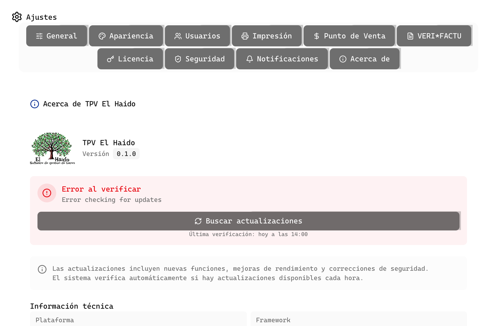

*Imagen 12: Pantalla "Acerca de" con información del sistema*

**Información disponible:**

| Campo | Descripción |
|-------|-------------|
| **Versión** | Número de versión instalada |
| **Licencia** | Estado y tipo de licencia |
| **Fingerprint** | Identificador único del equipo |
| **Enlaces** | Documentación, soporte, GitHub |

**Actualizaciones:**

El sistema busca actualizaciones automáticamente al iniciar. Para actualizar manualmente:

1. Ve a **Ajustes → Acerca de**
2. Haz clic en **Buscar actualizaciones**
3. Si hay una nueva versión, sigue el asistente

**Copiar fingerprint:**

El fingerprint es útil para:
- Generar nuevas licencias
- Soporte técnico
- Identificar el equipo

---

***

***

## Anexo: Atajos de teclado

| Atajo | Acción |
|-------|--------|
| `Ctrl/Cmd + N` | Nueva comanda |
| `Ctrl/Cmd + P` | Imprimir ticket |
| `Esc` | Cerrar diálogo actual |
| `Enter` | Confirmar acción |
| `Tab` | Navegar entre campos |

---


# ¡Gracias por usar TPV El Haido!


**TPV El Haido v1.0.0**

© 2026 TPV El Haido.  Marcos Asensio. Todos los derechos reservados.

