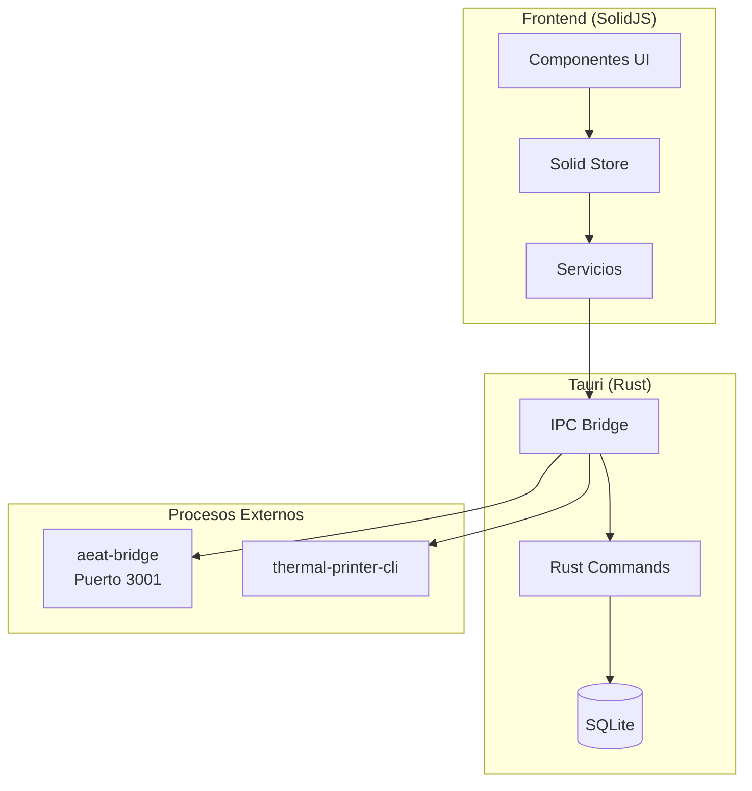
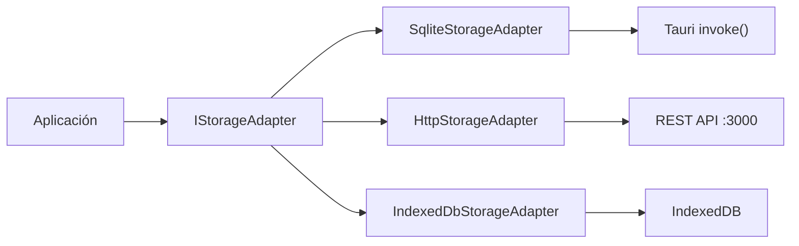
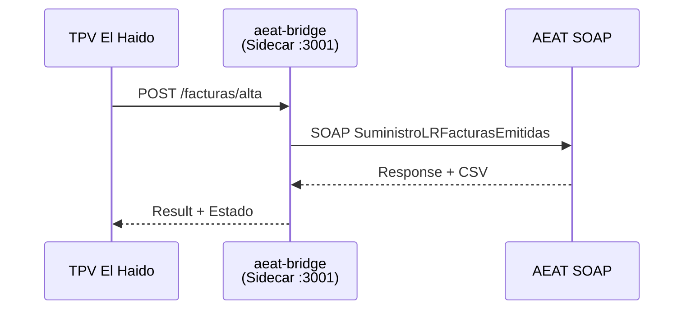

# TPV El Haido - Documentación Técnica

Sistema TPV (Terminal Punto de Venta) de escritorio para hostelería. Construido con Tauri, SolidJS y SQLite.

---

## Índice

- [1. Arquitectura](#1-arquitectura)
- [2. Stack Tecnológico](#2-stack-tecnológico)
- [3. Estructura del Proyecto](#3-estructura-del-proyecto)
- [4. Plataformas Soportadas](#4-plataformas-soportadas)
- [5. Sistema de Almacenamiento](#5-sistema-de-almacenamiento)
- [6. Integración AEAT VERI*FACTU](#6-integración-aeat-verifactu)
- [7. Impresión Térmica](#7-impresión-térmica)
- [8. Sistema de Temas](#8-sistema-de-temas)
- [9. Optimizaciones](#9-optimizaciones)
- [10. Desarrollo](#10-desarrollo)
- [11. Manejo de Errores](#11-manejo-de-errores)

---

## 1. Arquitectura



### Patrones Utilizados

| Patrón | Ubicación | Propósito |
|--------|-----------|-----------|
| Strategy | `storage-adapter.interface.ts` | Intercambio de backends de almacenamiento |
| Result | `@mks2508/no-throw` | Manejo de errores sin excepciones |
| Store | `store/` | Estado global reactivo con SolidJS |

---

## 2. Stack Tecnológico

### Frontend

| Dependencia | Versión | Uso |
|-------------|---------|-----|
| solid-js | 1.9.5 | Framework UI reactivo |
| @kobalte/core | 0.13.9 | Componentes accesibles |
| tailwindcss | 4.1.18 | Estilos utilitarios |
| @motionone/solid | 10.13.2 | Animaciones |
| @tanstack/solid-virtual | 3.13.6 | Virtualización de listas |
| lucide-solid | 0.563.0 | Iconos |

### Backend

| Dependencia | Versión | Uso |
|-------------|---------|-----|
| tauri | 2.0 | Framework desktop |
| rusqlite | 0.31 | Base de datos SQLite |
| serde | 1.x | Serialización JSON |

### Plugins Tauri

| Plugin | Versión | Función |
|--------|---------|---------|
| tauri-plugin-shell | 2.3.4 | Ejecución de sidecars |
| tauri-plugin-http | 2.5.6 | Peticiones HTTP |
| tauri-plugin-updater | 2.9.0 | Auto-actualización |
| tauri-plugin-process | 2.3.1 | Control de procesos |

### Build Tools

| Herramienta | Versión | Uso |
|-------------|---------|-----|
| vite | 7.3.1 | Bundler y dev server |
| typescript | 5.9.3 | Type checking |
| biome | 2.3.13 | Linter y formatter |
| oxlint | 1.42.0 | Linter adicional |

---

## 3. Estructura del Proyecto

```
src/
├── assets/           # Fuentes e iconos
├── components/       # Componentes UI
│   ├── Onboarding/   # Flujo de configuración inicial
│   ├── Sections/     # Secciones principales (Home, Products, NewOrder...)
│   └── ui/           # Componentes base (shadcn/kobalte)
├── data/             # Datos estáticos
├── hooks/            # Hooks de SolidJS (useResponsive, etc.)
├── lib/              # Utilidades y configuración
│   └── themes/       # Sistema de temas
├── models/           # Interfaces TypeScript
├── services/         # Lógica de negocio y adaptadores
│   └── platform/     # Abstracción de plataforma
├── store/            # Estado global
├── styles/           # CSS global y optimizaciones
├── types/            # Tipos adicionales
└── utils/            # Funciones auxiliares

src-tauri/
├── src/              # Código Rust
├── sidecars/         # Binarios externos
└── icons/            # Iconos de la app
```

---

## 4. Plataformas Soportadas

| Plataforma | Target | Arquitectura |
|------------|--------|--------------|
| Windows | `x86_64-pc-windows-msvc` | x64 |
| macOS Intel | `x86_64-apple-darwin` | x64 |
| macOS Apple Silicon | `aarch64-apple-darwin` | ARM64 |
| Linux | `x86_64-unknown-linux-gnu` | x64 |
| Linux ARM | `aarch64-unknown-linux-gnu` | ARM64 |
| Raspberry Pi | `aarch64-unknown-linux-gnu` | ARM64 |

### Requisitos Mínimos

- **RAM**: 512MB
- **Disco**: 100MB
- **Pantalla**: 640x480 (optimizado para 1024x768+)

---

## 5. Sistema de Almacenamiento



### Modos de Almacenamiento

| Modo | Adapter | Uso |
|------|---------|-----|
| `sqlite` | SqliteStorageAdapter | Producción (Tauri) |
| `http` | HttpStorageAdapter | Desarrollo con haido-db |
| `indexeddb` | IndexedDbStorageAdapter | Fallback navegador |

### Interfaz IStorageAdapter

```typescript
interface IStorageAdapter {
  // CRUD Products
  getProducts(): Promise<StorageResult<Product[]>>;
  createProduct(product: Product): Promise<StorageResult<void>>;
  updateProduct(product: Product): Promise<StorageResult<void>>;
  deleteProduct(product: Product): Promise<StorageResult<void>>;

  // CRUD Categories, Orders, Customers, Tables...
  // ...mismo patrón
}
```

Todos los métodos retornan `StorageResult<T>` (patrón Result).

---

## 6. Integración AEAT VERI*FACTU

Sistema de facturación electrónica conforme a la normativa española.



### Modos de Conexión

| Modo | Descripción |
|------|-------------|
| `disabled` | VERI*FACTU desactivado |
| `sidecar` | aeat-bridge local (puerto 3001) |
| `external` | Servidor AEAT Bridge remoto |

### Certificados Soportados

| Tipo | Formato | Uso |
|------|---------|-----|
| Personal | PFX/P12 | Autónomos, pequeños negocios |
| Sello de empresa | PFX/P12 | Empresas |
| PEM | cert + key | Alternativo |

### Configuración

```typescript
interface AEATConfig {
  mode: 'disabled' | 'external' | 'sidecar';
  environment: 'test' | 'production';
  sidecarPort: number;  // default: 3001
  certificate?: AEATCertificateConfig;
  businessData: {
    nif: string;
    nombreRazon: string;
    serieFactura: string;  // ej: "TPV-"
    tipoFactura: 'F1' | 'F2';
  };
  autoSendInvoices: boolean;
}
```

---

## 7. Impresión Térmica

Sidecar `thermal-printer-cli` para impresión ESC/POS.

### Impresoras Compatibles

Cualquier impresora térmica compatible con ESC/POS:
- Epson TM-T20, TM-T88
- Star TSP100, TSP650
- Bixolon SRP-330
- Genéricas USB/Serial 58mm, 80mm

### Comandos Soportados

| Comando | Función |
|---------|---------|
| text | Imprimir texto |
| cut | Cortar papel |
| feed | Avanzar papel |
| cashdrawer | Abrir cajón |
| barcode | Código de barras |
| qr | Código QR |

---

## 8. Sistema de Temas

6 temas predefinidos con soporte light/dark.

| ID | Nombre | Estilo |
|----|--------|--------|
| `amethyst-haze` | Amethyst Haze | Violeta elegante |
| `bubble` | Bubble | Rosa vibrante |
| `restaurant-professional` | Restaurant Professional | Dorado cálido |
| `modern-cafe` | Modern Cafe | Verde minimalista |
| `night-bar` | Night Bar | Oscuro con neón |
| `accessibility-high-contrast` | High Contrast | B/N accesible |

### Variables CSS Principales

```css
:root {
  --background: ...;
  --foreground: ...;
  --primary: ...;
  --primary-foreground: ...;
  --secondary: ...;
  --accent: ...;
  --muted: ...;
  --destructive: ...;
  --border: ...;
  --ring: ...;
}
```

### Estructura ThemeConfig

```typescript
interface ThemeConfig {
  id: string;
  name: string;
  category: 'custom' | 'restaurant' | 'cafe' | 'bar' | 'accessibility';
  colors: { light: Colors; dark: Colors };
  touchOptimizations: {
    buttonMinSize: string;
    touchSpacing: string;
    rippleEffects: boolean;
  };
}
```

---

## 9. Optimizaciones

### Touch Targets (Apple HIG)

| Elemento | Tamaño mínimo | Variable CSS |
|----------|---------------|--------------|
| Estándar | 44×44px (2.75rem) | `--touch-target-size` |
| Grande | 48×48px (3rem) | `--touch-target-large` |
| Extra grande | 56×56px (3.5rem) | `--touch-target-xl` |

### Breakpoints Responsive

| Nombre | Rango | Uso |
|--------|-------|-----|
| mobile | < 640px | Móviles |
| tablet | 640-767px | Tablets pequeñas |
| laptop | 768-1023px | Tablets/laptops |
| desktop | 1024-1279px | Escritorio |
| largeDesktop | 1280-1535px | Monitores grandes |
| ultraWide | ≥ 1920px | Pantallas grandes |

### Hook useResponsive

```typescript
const {
  width,
  height,
  isMobile,
  isTablet,
  isDesktop,
  breakpoint,
  isTouch
} = useResponsive();
```

### Accesibilidad

- `prefers-reduced-motion`: Desactiva animaciones
- `prefers-contrast: high`: Bordes adicionales
- Focus visible para navegación por teclado

---

## 10. Desarrollo

### Comandos

```bash
# Desarrollo frontend (Vite :1420)
bun run dev

# Desarrollo completo (Tauri + frontend)
bun run tauri:dev

# Build producción
bun run build           # Solo frontend
bun run tauri build     # App completa

# Build Raspberry Pi
bun run deploy:rpi

# Linting
bun run lint            # Biome check
bun run lint:fix        # Biome fix
bun run check           # Biome + Oxlint

# Type checking
bun run typecheck       # tsgo (rápido)
bun run typecheck:tsc   # tsc (completo)

# Datos de prueba
bun run seed            # Poblar DB
bun run seed:clear      # Limpiar y poblar
```

### Alias de Importación

```typescript
// @ = src/
import useStore from '@/store/store';
import type Product from '@/models/Product';
import { StorageErrorCode } from '@/lib/error-codes';
```

### Puerto de Desarrollo

| Servicio | Puerto |
|----------|--------|
| Vite dev server | 1420 |
| haido-db (dev) | 3000 |
| aeat-bridge | 3001 |

---

## 11. Manejo de Errores

Patrón Result con `@mks2508/no-throw`. Sin excepciones.

### Códigos de Error por Dominio

| Dominio | Prefijo | Ejemplo |
|---------|---------|---------|
| Storage | `STORAGE_` | `STORAGE_READ_FAILED` |
| Printer | `PRINTER_` | `PRINTER_CONNECTION_FAILED` |
| Order | `ORDER_` | `ORDER_CREATE_FAILED` |
| Product | `PRODUCT_` | `PRODUCT_LOAD_FAILED` |
| Category | `CATEGORY_` | `CATEGORY_DELETE_FAILED` |
| Customer | `CUSTOMER_` | `CUSTOMER_NOT_FOUND` |
| Auth | `AUTH_` | `AUTH_INVALID_PIN` |
| Network | `NETWORK_` | `NETWORK_TIMEOUT` |
| AEAT | `AEAT_` | `AEAT_CERT_EXPIRED` |

### Uso del Patrón Result

```typescript
import { tryCatchAsync, isErr, tapErr } from '@mks2508/no-throw';
import { StorageErrorCode } from '@/lib/error-codes';

const result = await tryCatchAsync(
  async () => storageAdapter.getProducts(),
  StorageErrorCode.ReadFailed
);

// Manejar error
tapErr(result, (error) => {
  console.error(`[${error.code}]`, error.message);
});

// Usar valor
if (!isErr(result)) {
  const products = result.value;
}
```

### ErrorBoundary

Tres niveles de granularidad:

| Nivel | Uso | Fallback |
|-------|-----|----------|
| `app` | Envuelve toda la app | Pantalla completa de error |
| `section` | Secciones principales | Card con mensaje |
| `component` | Componentes críticos | Inline mínimo |

```tsx
<ErrorBoundary level="section" fallback={<ErrorCard />}>
  <ProductList />
</ErrorBoundary>
```

---

## Licencia

Propietario - El Haido
