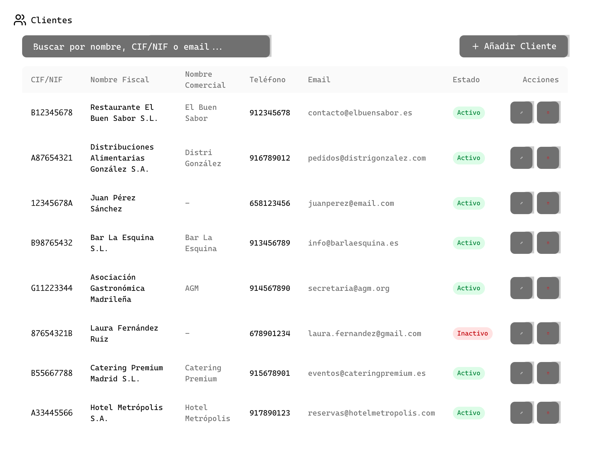
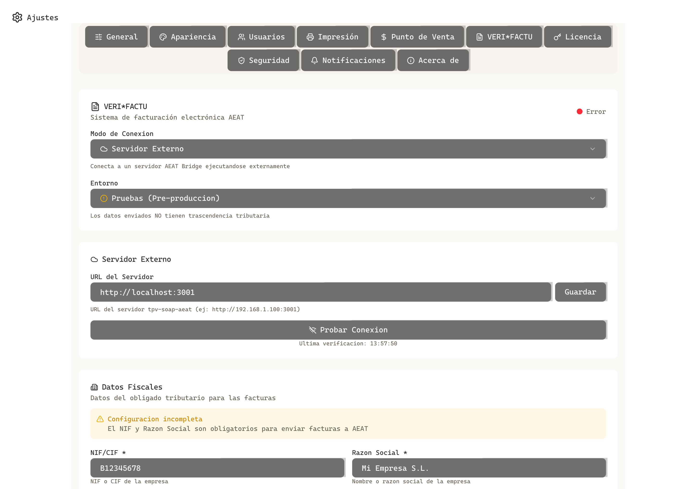

# DOCUMENTO DE JUSTIFICACION KIT DIGITAL
## TPV El Haido

---

**Empresa:** [Nombre de la empresa beneficiaria]
**NIF:** [NIF de la empresa]
**Fecha:** [Fecha de presentación]
**Versión del software:** [X.X.X]

---

## 1. IDENTIFICACION DEL SOFTWARE

| Campo | Valor |
|-------|-------|
| **Nombre comercial** | TPV El Haido |
| **Versión** | [X.X.X] |
| **Desarrollador** | [Nombre del desarrollador] |
| **Tecnología** | Tauri + SolidJS + TypeScript |
| **Plataforma** | Windows / macOS / Linux |
| **Base de datos** | SQLite / HTTP REST API / IndexedDB |

---

## 2. FUNCIONALIDADES IMPLEMENTADAS

### 2.1 CONTROL DE ACCESO (LOGIN)

**Descripción:**
Sistema de autenticación mediante PIN personal de 4 dígitos con selección de operario por perfil con foto. Control de sesiones por usuario.

**Características:**
- Pantalla de selección de usuario con avatares personalizados
- Autenticación segura mediante PIN de 4 dígitos
- Registro de sesión activa
- Cierre de sesión controlado

**Captura de pantalla:**

*Pantalla de inicio de sesión con selección de operario*

---

### 2.2 GESTION DE OPERARIOS/USUARIOS

**Descripción:**
Módulo completo de gestión de usuarios del sistema con alta, baja y modificación de operarios.

**Características:**
- Listado de usuarios con avatar y nombre
- Alta de nuevos usuarios
- Modificación de datos existentes
- Eliminación de usuarios
- Asignación de PIN de acceso personal
- Perfiles con imagen personalizada

**Captura de pantalla:**

*Panel de administración de usuarios en Ajustes*

---

### 2.3 GESTION DE ARTICULOS/PRODUCTOS

**Descripción:**
Catálogo completo de productos con organización por categorías, gestión de precios y búsqueda avanzada.

**Características:**
- Grid visual de productos con iconos/imágenes
- Organización por categorías y marcas
- Gestión de precios con IVA configurable
- Búsqueda y filtrado avanzado
- Alta, baja y modificación de productos
- Gestión de categorías

**Captura de pantalla:**

*Catálogo de productos con filtros y categorías*

---

### 2.4 GESTION DE CLIENTES

**Descripción:**
Módulo de gestión de clientes con datos fiscales completos para facturación.

**Características:**
- Listado de clientes con búsqueda
- Alta, baja y modificación de clientes
- Campos fiscales: CIF/NIF, Nombre fiscal, Nombre comercial
- Datos de contacto: Dirección, Código Postal, Población, Teléfono, Email
- Estado activo/inactivo

**Captura de pantalla:**

*Gestión de clientes con datos fiscales*

---

### 2.5 GESTION DE PEDIDOS/COMANDAS

**Descripción:**
Sistema de gestión de pedidos en tiempo real con asignación a mesas y control de estados.

**Características:**
- Creación de nuevas comandas
- Asignación a mesas
- Añadir/quitar productos del pedido
- Cálculo automático de totales
- Estados de pedido (en curso, pagado, cerrado)
- Historial de pedidos

**Captura de pantalla:**

*Pantalla de nueva comanda con productos y resumen*

---

### 2.6 HISTORIAL DE PEDIDOS

**Descripción:**
Registro histórico de todas las operaciones de venta realizadas.

**Características:**
- Listado cronológico de pedidos
- Filtrado por fecha
- Detalle de cada pedido
- Información de usuario que realizó la venta
- Totales y desglose de productos

**Captura de pantalla:**

*Historial de pedidos con filtros y detalles*

---

### 2.7 FACTURACION

**Descripción:**
Sistema de facturación con listado de facturas, estados y desglose de impuestos.

**Características:**
- Listado de facturas con filtros por estado
- Estados: Aceptadas, Pendientes, Rechazadas, Sin facturar
- Desglose automático de IVA por tramos
- Número de factura y fecha
- Total y base imponible
- CSV (Código Seguro de Verificación)

**Captura de pantalla:**

*Panel de facturas AEAT con estadísticas y listado*

---

### 2.8 INTEGRACION CON AEAT (VERI*FACTU)

**Descripción:**
Integración completa con el sistema VERI*FACTU de la Agencia Tributaria para el envío automático de facturas electrónicas.

**Características:**
- Configuración de datos fiscales del emisor (NIF, Razón Social)
- Gestión de certificados digitales
- Selección de entorno (Producción/Pruebas)
- Modos de operación: Deshabilitado, Externo, Sidecar
- Envío automático a AEAT
- CSV (Código Seguro de Verificación) en cada factura
- Verificación directa en sede AEAT
- Estados de respuesta AEAT

**Capturas de pantalla:**

*Panel de configuración VERI*FACTU en Ajustes*

*Detalle de factura con CSV y desglose de IVA*

---

### 2.9 SISTEMA DE ACTUALIZACIONES

**Descripción:**
Sistema integrado de detección y aplicación de actualizaciones del software.

**Características:**
- Detección automática de nuevas versiones
- Notificación al usuario
- Notas de versión (changelog)
- Descarga integrada con barra de progreso
- Instalación automática

**Captura de pantalla:**

*Diálogo de actualización disponible*

---

### 2.10 AJUSTES DEL SISTEMA

**Descripción:**
Panel completo de configuración del sistema.

**Características:**
- Gestión de usuarios
- Configuración de impresora térmica
- Configuración VERI*FACTU/AEAT
- Tema claro/oscuro
- Modo de almacenamiento
- Tasa de IVA configurable

**Captura de pantalla:**

*Panel de ajustes del sistema*

---

## 3. DATOS TECNICOS

### 3.1 Arquitectura

| Componente | Tecnología |
|------------|------------|
| **Frontend** | SolidJS + TypeScript + Vite |
| **UI Components** | Kobalte + Tailwind CSS |
| **Estado** | SolidJS Store con Immer |
| **Backend** | Tauri (Rust) |
| **Base de datos** | SQLite / HTTP REST API / IndexedDB |

### 3.2 Integraciones

| Sistema | Descripción |
|---------|-------------|
| **AEAT VERI*FACTU** | Envío de facturas electrónicas |
| **Impresora térmica** | Impresión de tickets ESC/POS |

### 3.3 Seguridad

- Autenticación por PIN personal
- Control de sesiones
- Certificados digitales para AEAT
- Datos almacenados localmente

---

## 4. CUMPLIMIENTO DE REQUISITOS

| Requisito Kit Digital | Estado | Evidencia |
|-----------------------|--------|-----------|
| Control de acceso (Login) | ✅ Cumple | Sección 2.1 |
| Gestión de operarios | ✅ Cumple | Sección 2.2 |
| Gestión de artículos | ✅ Cumple | Sección 2.3 |
| Gestión de clientes | ✅ Cumple | Sección 2.4 |
| Gestión de pedidos | ✅ Cumple | Sección 2.5 |
| Historial de operaciones | ✅ Cumple | Sección 2.6 |
| Facturación | ✅ Cumple | Sección 2.7 |
| Integración AEAT | ✅ Cumple | Sección 2.8 |
| Actualizaciones | ✅ Cumple | Sección 2.9 |

---

## 5. ANEXOS

### 5.1 Listado de capturas de pantalla

| # | Archivo | Descripción |
|---|---------|-------------|
| 1 | `01_login.png` | Pantalla de login |
| 2 | `02_settings_usuarios.png` | Gestión de usuarios |
| 3 | `03_products.png` | Catálogo de productos |
| 4 | `04_customers.png` | Gestión de clientes |
| 5 | `05_newOrder.png` | Nueva comanda |
| 6 | `06_orderHistory.png` | Historial de pedidos |
| 7 | `07_aeatInvoices.png` | Facturas AEAT |
| 8 | `08_settings_verifactu.png` | Configuración VERI*FACTU |
| 9 | `09_aeatInvoices_detail.png` | Detalle de factura |
| 10 | `10_updateChecker.png` | Actualizador |
| 11 | `11_settings.png` | Panel de ajustes |

---

**Documento generado para la justificación del Kit Digital**
**TPV El Haido - Sistema de Punto de Venta**
