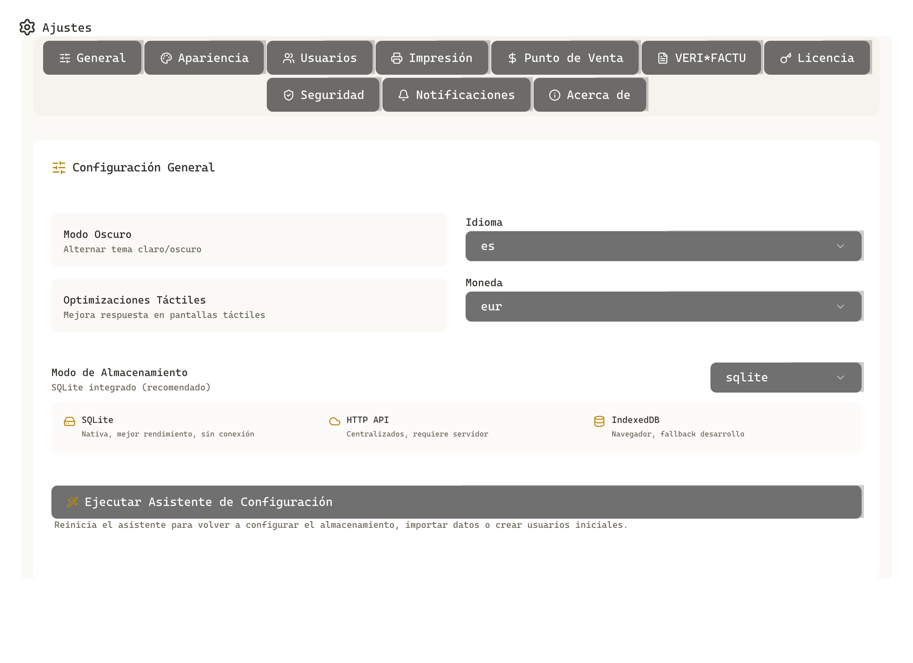
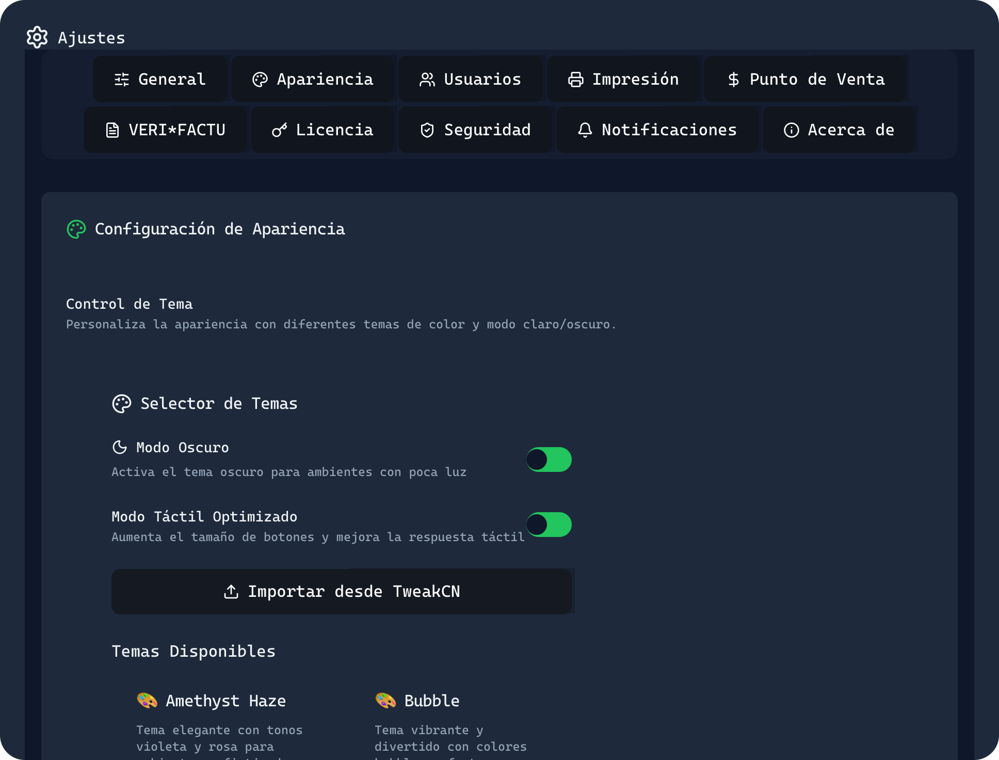

# DOCUMENTO DE JUSTIFICACION KIT DIGITAL
## TPV El Haido

---

**Fecha:** 29-01-2026
**Versión del software:** [0.1.3]

> [edit 2026-08-22: drift fixed post-submission, no resubmission needed — versión y stack térmico actualizados retroactivamente para mantener coherencia con releases reales (v0.1.3 publicado). Capabilities corregidas al stack real (tickmaster-daemon HTTP, protocolo matricial Epson TM-U210PD)]


---

## 1. IDENTIFICACION DEL SOFTWARE

| Campo | Valor |
|-------|-------|
| **Nombre comercial** | TPV El Haido |
| **Versión** | [X.X.X] |
| **Desarrollador** | [Nombre del desarrollador] |
| **Tecnología** | Tauri + SolidJS + TypeScript |
| **Plataforma** | Windows / macOS / Linux |
| **Base de datos** | SQLite / HTTP REST API / IndexedDB |

---

## 2. FUNCIONALIDADES IMPLEMENTADAS

### 2.1 CONTROL DE ACCESO (LOGIN)

**Descripción:**
Sistema de autenticación mediante PIN personal de 4 dígitos con selección de operario por perfil con foto. Control de sesiones por usuario.

**Características:**
- Pantalla de selección de usuario con avatares personalizados
- Autenticación segura mediante PIN de 4 dígitos
- Registro de sesión activa
- Cierre de sesión controlado

**Captura de pantalla:**


*Pantalla de inicio de sesión con selección de operario y PIN*

---

### 2.2 GESTION DE OPERARIOS/USUARIOS

**Descripción:**
Módulo completo de gestión de usuarios del sistema con alta, baja y modificación de operarios.

**Características:**
- Listado de usuarios con avatar y nombre
- Alta de nuevos usuarios
- Modificación de datos existentes
- Eliminación de usuarios
- Asignación de PIN de acceso personal
- Perfiles con imagen personalizada

**Captura de pantalla:**


*Panel de administración de usuarios en Ajustes*

---

### 2.3 GESTION DE ARTICULOS/PRODUCTOS

**Descripción:**
Catálogo completo de productos con organización por categorías, gestión de precios y búsqueda avanzada.

**Características:**
- Grid visual de productos con iconos/imágenes
- Organización por categorías y marcas
- Gestión de precios con IVA configurable
- Búsqueda y filtrado avanzado
- Alta, baja y modificación de productos
- Gestión de categorías

**Captura de pantalla:**


*Catálogo de productos con filtros y categorías*

---

### 2.4 GESTION DE CLIENTES

**Descripción:**
Módulo de gestión de clientes con datos fiscales completos para facturación.

**Características:**
- Listado de clientes con búsqueda
- Alta, baja y modificación de clientes
- Campos fiscales: CIF/NIF, Nombre fiscal, Nombre comercial
- Datos de contacto: Dirección, Código Postal, Población, Teléfono, Email
- Estado activo/inactivo

**Captura de pantalla:**


*Gestión de clientes con datos fiscales*

---

### 2.5 GESTION DE PEDIDOS/COMANDAS

**Descripción:**
Sistema de gestión de pedidos en tiempo real con asignación a mesas y control de estados.

**Características:**
- Creación de nuevas comandas
- Asignación a mesas
- Añadir/quitar productos del pedido
- Cálculo automático de totales
- Estados de pedido (en curso, pagado, cerrado)
- Historial de pedidos

**Captura de pantalla:**


*Pantalla de nueva comanda con productos y resumen*

---

### 2.6 HISTORIAL DE PEDIDOS

**Descripción:**
Registro histórico de todas las operaciones de venta realizadas.

**Características:**
- Listado cronológico de pedidos
- Filtrado por fecha
- Detalle de cada pedido
- Información de usuario que realizó la venta
- Totales y desglose de productos

**Captura de pantalla:**


*Historial de pedidos con filtros y detalles*

---

### 2.7 FACTURACION

**Descripción:**
Sistema de facturación con listado de facturas, estados y desglose de impuestos.

**Características:**
- Listado de facturas con filtros por estado
- Estados: Aceptadas, Pendientes, Rechazadas, Sin facturar
- Desglose automático de IVA por tramos
- Número de factura y fecha
- Total y base imponible
- CSV (Código Seguro de Verificación)

**Captura de pantalla:**


*Panel de facturas AEAT con estadísticas y listado*

---

### 2.8 INTEGRACION CON AEAT (VERI*FACTU)

**Descripción:**
Integración completa con el sistema VERI*FACTU de la Agencia Tributaria para el envío automático de facturas electrónicas.

**Características:**
- Configuración de datos fiscales del emisor (NIF, Razón Social)
- Gestión de certificados digitales
- Selección de entorno (Producción/Pruebas)
- Modos de operación: Deshabilitado, Externo, Sidecar
- Envío automático a AEAT
- CSV (Código Seguro de Verificación) en cada factura
- Verificación directa en sede AEAT
- Estados de respuesta AEAT

**Capturas de pantalla:**


*Panel de configuración VERI*FACTU en Ajustes*


*Detalle de factura con CSV y desglose de IVA*

---

### 2.9 SISTEMA DE ACTUALIZACIONES

**Descripción:**
Sistema integrado de detección y aplicación de actualizaciones del software, accesible desde el panel de Ajustes.

**Características:**
- Panel "Acerca de" con versión actual instalada
- Detección automática de nuevas versiones
- Búsqueda manual de actualizaciones
- Estado visual: actualizado / actualización disponible / error
- Notificación al usuario con notas de versión (changelog)
- Descarga integrada con barra de progreso y porcentaje
- Instalación automática con reinicio
- Información técnica del sistema (plataforma, framework)

**Captura de pantalla:**


*Panel "Acerca de" en Ajustes mostrando versión actual y estado de actualizaciones*

---

### 2.10 AJUSTES DEL SISTEMA

**Descripción:**
Panel completo de configuración del sistema.

**Características:**
- Gestión de usuarios
- Configuración de impresora térmica
- Configuración VERI*FACTU/AEAT
- Tema claro/oscuro
- Modo de almacenamiento
- Tasa de IVA configurable

**Captura de pantalla:**



*Panel de ajustes del sistema*

---

## 3. CARACTERISTICAS TECNICAS AVANZADAS

### 3.1 MULTIPLATAFORMA

TPV El Haido está diseñado para funcionar en múltiples plataformas y dispositivos:

| Plataforma | Soporte | Notas |
|------------|---------|-------|
| **Windows** | ✅ Nativo | Windows 10/11 (x64) |
| **macOS** | ✅ Nativo | macOS 11+ (Intel y Apple Silicon) |
| **Linux** | ✅ Nativo | Ubuntu, Debian, Fedora (x64, ARM64) |
| **Raspberry Pi** | ✅ Nativo | Raspberry Pi 4/5 (ARM64) - Ideal para quioscos |
| **Web/PWA** | ✅ Compatible | Funciona como aplicación web progresiva |
| **Android** | 🔄 Planificado | Vía Tauri Mobile (en desarrollo) |
| **iOS** | 🔄 Planificado | Vía Tauri Mobile (en desarrollo) |

**Ventajas de la arquitectura multiplataforma:**
- Un único código fuente para todas las plataformas
- Experiencia de usuario consistente en todos los dispositivos
- Actualizaciones simultáneas en todas las versiones
- Reducción de costes de mantenimiento

---

### 3.2 OPTIMIZADO PARA BAJOS RECURSOS

El sistema está optimizado para funcionar eficientemente en hardware de gama baja:

| Requisito | Mínimo | Recomendado |
|-----------|--------|-------------|
| **RAM** | 512 MB | 1 GB |
| **CPU** | 1 GHz (1 núcleo) | 1.5 GHz (2 núcleos) |
| **Almacenamiento** | 100 MB | 500 MB |
| **Pantalla** | 800x600 | 1024x768 o superior |

**Tecnologías de optimización:**
- **SolidJS**: Framework reactivo sin Virtual DOM, 3x más rápido que React
- **Tauri**: Backend en Rust, consume 10x menos memoria que Electron
- **SQLite**: Base de datos embebida, sin servidor externo
- **Vite**: Build tool ultrarrápido con tree-shaking agresivo
- **Lazy Loading**: Carga diferida de componentes pesados

**Ideal para:**
- Terminales POS económicos
- Raspberry Pi como punto de venta
- Tablets Android de gama baja
- Equipos antiguos reciclados

---

### 3.3 SISTEMA DE TEMAS Y PERSONALIZACION

Sistema completo de personalización visual para adaptar la interfaz a la identidad del negocio:

**Temas predefinidos:**
- Amethyst Haze (violeta elegante)
- Bubble (vibrante y moderno)
- Zinc (profesional neutro)
- Y más temas disponibles...

**Características de personalización:**
- **Modo claro/oscuro**: Cambio automático o manual
- **Colores personalizables**: Primario, secundario, acentos
- **Tipografía configurable**: Tamaño y familia de fuentes
- **Optimizaciones táctiles**: Botones grandes para uso con pantalla táctil

**Captura de pantalla:**



*Selector de temas con vista previa en tiempo real*

---

### 3.4 OPTIMIZACIONES PARA PANTALLAS TACTILES

Diseñado siguiendo las guías de Apple Human Interface Guidelines (HIG):

| Elemento | Tamaño mínimo | Descripción |
|----------|---------------|-------------|
| **Botones principales** | 44x44 px | Objetivo táctil mínimo recomendado |
| **Botones de acción** | 48x48 px | Acciones primarias (pagar, añadir) |
| **Botones críticos** | 56x56 px | Acciones importantes (confirmar pago) |
| **Espaciado entre elementos** | 8-16 px | Evita toques accidentales |

**Adaptación por tamaño de pantalla:**
- Tablets POS pequeñas (10"-12")
- Displays POS medianos (13"-17")
- Displays POS grandes (18"-21")
- Monitores de escritorio (22"+)

---

### 3.5 MODOS DE ALMACENAMIENTO

Flexibilidad total para adaptarse a diferentes escenarios de uso:

| Modo | Descripción | Caso de uso |
|------|-------------|-------------|
| **SQLite** | Base de datos local integrada | Uso standalone, máximo rendimiento |
| **HTTP API** | Conexión a servidor externo | Múltiples terminales sincronizados |
| **IndexedDB** | Almacenamiento del navegador | Modo web/PWA |

**Características:**
- Cambio de modo en caliente (sin reiniciar)
- Migración automática de datos entre modos
- Funcionamiento offline con sincronización posterior
- Backup automático de datos locales

---

### 3.6 STACK TECNOLOGICO 

| Componente | Tecnología | Versión | Descripción |
|------------|------------|---------|-------------|
| **Framework UI** | SolidJS | 1.9+ | Reactividad granular, máximo rendimiento |
| **Lenguaje** | TypeScript | 5.9+ | Tipado estático, menos errores |
| **Backend nativo** | Tauri (Rust) | 2.0+ | Seguro, rápido, ligero |
| **Estilos** | Tailwind CSS | 4.0+ | Utility-first, diseño responsive |
| **Build tool** | Vite | 7.0+ | HMR instantáneo, builds optimizados |
| **Componentes UI** | Kobalte | 0.13+ | Accesibles, sin estilos por defecto |
| **Animaciones** | Motion One | 10.0+ | Animaciones fluidas de 60fps |

**Beneficios del stack:**
- **Rendimiento**: Tiempos de respuesta < 16ms (60fps)
- **Mantenibilidad**: Código tipado y modular
- **Seguridad**: Rust elimina errores de memoria
- **Futuro**: Tecnologías en activo desarrollo

---

### 3.7 IMPRESION DE TICKETS TERMICOS

Soporte completo para impresoras térmicas de punto de venta:

**Protocolos soportados:**
- tickmaster-daemon (HTTP a RPI por LAN/VPN, broker sobre Epson TM-U210PD)
- USB directo
- Red (Ethernet/WiFi)
- Bluetooth (en desarrollo)

**Características:**
- Diseño de tickets personalizable
- Logos y códigos QR
- Apertura automática de cajón
- Corte automático de papel
- Múltiples impresoras simultáneas

---

### 3.8 ARQUITECTURA TECNICA

```
┌─────────────────────────────────────────────────────────────┐
│                    TPV El Haido                             │
├─────────────────────────────────────────────────────────────┤
│  ┌─────────────┐  ┌─────────────┐  ┌─────────────────────┐  │
│  │   SolidJS   │  │  Tailwind   │  │     Kobalte UI      │  │
│  │  Frontend   │  │    CSS 4    │  │    Components       │  │
│  └──────┬──────┘  └──────┬──────┘  └──────────┬──────────┘  │
│         │                │                     │            │
│  ┌──────┴────────────────┴─────────────────────┴──────────┐ │
│  │                    Tauri Bridge                        │ │
│  │              (IPC Rust ↔ JS)                           │ │
│  └──────┬────────────────┬─────────────────────┬──────────┘ │
│         │                │                     │            │
│  ┌──────┴──────┐  ┌──────┴──────┐  ┌──────────┴──────────┐  │
│  │   SQLite    │  │   AEAT      │  │   Thermal Printer   │  │
│  │  Database   │  │  Sidecar    │  │      Sidecar        │  │
│  └─────────────┘  └─────────────┘  └─────────────────────┘  │
└─────────────────────────────────────────────────────────────┘
```

---

### 3.9 INTEGRACIONES

| Sistema | Descripción | Estado |
|---------|-------------|--------|
| **AEAT VERI*FACTU** | Facturación electrónica obligatoria |
| **Impresión térmica** | Tickets vía tickmaster-daemon (HTTP) |
| **Cajón portamonedas** | Apertura automática |
| **Lector de códigos** | Escáner de barras | 
---

### 3.10 SEGURIDAD

| Característica | Descripción |
|----------------|-------------|
| **Autenticación** | PIN personal de 4 dígitos por operario |
| **Sesiones** | Control de sesión con cierre automático |
| **Datos locales** | Información almacenada localmente, sin cloud |
| **Certificados** | Soporte para certificados digitales (AEAT) |
| **Actualizaciones** | Firmadas digitalmente (Ed25519) |
| **Sandbox** | Aislamiento de procesos (Tauri) |

---
