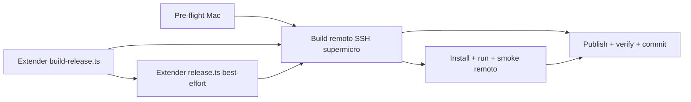

# Plan: TR-07 — Build Linux nativo en supermicro-pcbar + install + publish al hub

## TL;DR

Extender `scripts/build-release.ts` (y, best-effort, `scripts/release.ts`) con soporte
`linux-x64`, correr el build **nativo** por SSH en `supermicro-pcbar.vpn.mks2508.local`
(CachyOS/Arch, no cross-compile), instalar+arrancar el AppImage ahí, firmarlo con la
minisign key existente, y publicarlo en `haido.releases.mks2508.systems`. Mismo playbook
que 0.4.0.D (Windows) pero Linux, con una diferencia clave de diseño: la passphrase de
signing se resuelve en el Mac (Bitwarden ya configurado ahí) y solo viaja al remoto como
`TAURI_SIGNING_PRIVATE_KEY_PASSWORD` — evita replicar el bloqueador #4 de Windows
(mismatch de encoding `bw unlock` en PowerShell). Verificación: hub responde 200 en
`/api/updates/linux/x86_64/0.0.0` con JSON del release recién subido.

## DAG de milestones



## Contexto verificado

- **Hub healthy, sin release linux previo** (verificado ahora mismo, no es snapshot de
  memoria):
  ```
  curl https://haido.releases.mks2508.systems/api/health → 200
  curl https://haido.releases.mks2508.systems/api/updates/linux/x86_64/0.0.0 → 204
  ```
  204 = no hay release `linux/x86_64` en el proyecto `haido` todavía. Sin riesgo de
  colisión de versión (`0.1.0`) porque la key de unicidad en el hub es
  `(project, version, target, arch)` y `darwin`/`windows` 0.1.0 ya existen pero `linux` no.

- **`scripts/build-release.ts`** (`/Volumes/KODAK1TB/REPOS y PROYECTOS/tauri/tpv-el-haido2/scripts/build-release.ts`):
  - `ReleaseTarget` type (línea 56) NO incluye `linux-x64`.
  - `BUILD_TARGETS` (líneas 147-176) solo tiene `macos-arm64`, `macos-x64`, `windows-x64`.
  - `ALL_TARGETS` (línea 199) idem.
  - `validateTargetForCurrentPlatform` (líneas 731-761) bloquea `windows-x64` en darwin y
    `macos-*` en windows, pero NO tiene guard para `linux-x64` — si se corre este target
    desde el Mac sin querer, intentaría cross-compilar y fallaría tarde con un error de
    linker confuso en vez de un mensaje claro.
  - `resolveInstaller` (líneas 841-862) excluye `.sig` y `.zip` del match — relevante para
    el caso AppImage (ver Riesgos, artifactExt == installerExt es posible aquí).

- **`scripts/release.ts`** (`/Volumes/KODAK1TB/REPOS y PROYECTOS/tauri/tpv-el-haido2/scripts/release.ts`):
  - `ALL_RELEASE_TARGETS` (línea 71) y `mapTargetToServer` (líneas 131-142) no incluyen
    linux.
  - `discoverArtifacts` (líneas 805-866) tiene su **propio** mapa de extensiones hardcoded
    (líneas 823-827), **desacoplado** de `BUILD_TARGETS` de `build-release.ts` — hoy dice
    `'windows-x64': '.nsis.zip'`, que es la extensión **incorrecta** ya confirmada por el
    playbook de Windows (progress-log 0.4.0.D: Tauri 2.10 con `createUpdaterArtifacts`
    firma `-setup.exe` directo, sin el wrapper `.nsis.zip`; el publish de Windows se hizo
    con bypass curl multipart, no con `release.ts publish`). **Esta desincronización entre
    los dos scripts es la causa raíz del bug de Windows y es probable que se repita para
    Linux** — se trata como riesgo esperado, no como sorpresa.

- **`src-tauri/tauri.conf.json`**: `bundle.targets: "all"` (línea 39) ya cubre Linux
  (Tauri 2 resuelve `"all"` a todos los formatos válidos del host — en Linux: appimage +
  deb + rpm si el toolchain está presente). `bundle.linux.deb.depends: []` (línea 52-56)
  ya existe. **No hace falta editar `tauri.conf.json` para esta tarea.** El pubkey
  (línea 60) no se toca (constraint del TR).

- **AEAT sidecar cross-compile**: `scripts/build-aeat-sidecar.ts` detecta la plataforma
  actual (líneas 62-73) y en la máquina remota (Linux x64 nativo) usará
  `getCurrentPlatformTarget() → 'linux-x64'` — **NO es cross-compile en este caso, es
  build nativo** (el binario objetivo coincide con el host). Produce
  `aeat-bridge-x86_64-unknown-linux-gnu` (línea 56-60). PERO: `AEAT_PROJECT_PATHS`
  (líneas 26-29) busca `../../tpv-soap-aeat` (sibling del repo) o `/Users/mks/tpv-soap-aeat`
  (hardcoded a macOS, no existe en Linux — `$HOME` ahí es `/home/mks`). **El repo
  `tpv-soap-aeat` casi seguro NO está clonado en `supermicro-pcbar`** — hay que llevarlo
  (tar + scp, mismo patrón que Windows) y correr `bun install` dentro ANTES del build,
  porque `bun build --compile` no instala dependencias.
  `scripts/prebuild-sidecars.ts` (líneas 79-86) **traga el error** si el sidecar build
  falla ("⚠️ Build failed (continuing without sidecar)") — si esto pasa, `tauri build`
  fallará más tarde en el paso de `externalBin` con un mensaje que no apunta a la causa
  real. Hay que verificar el sidecar ANTES de lanzar el build completo, no confiar en que
  el prebuild lo resuelva solo.

- **Sidecar binario Linux NO está gitignored por patrón**: `.gitignore` línea 48 ignora
  explícitamente `src-tauri/sidecars/aeat-bridge-x86_64-pc-windows-msvc.exe` (por nombre
  literal), y `aeat-bridge-aarch64-apple-darwin` **está trackeado en git** (`git ls-files`
  lo confirma). No hay wildcard que cubra `aeat-bridge-x86_64-unknown-linux-gnu` — si el
  executor hace `git add -A` en vez de stage explícito, ese binario (varios MB) se
  colaría en el commit. Ver Prohibiciones.

- **Private key local confirmada**: `tauri-keys/tpv-el-haido.key` existe en el Mac
  (262 bytes, permisos `-rw-------`), `*.key` está gitignored globalmente (línea 40 de
  `.gitignore`, excepto `*.key.pub`) — no trackeado (`git ls-files tauri-keys/` solo
  devuelve el `.pub`).

- **Versión app**: `tauri.conf.json` → `"version": "0.1.0"`. Mismo valor que darwin/windows
  ya publicados — sin colisión porque el target difiere (ver arriba).

- **Precedente Windows (0.4.0.D, progress-log)**: 5 bloqueadores — PATH npm/bun (fix ya en
  repo, commit `e3b732d`), tsgo cast (fix ya en repo, `27b8e05`), icon.ico bundle (fix ya
  en repo, `10145d8`), passphrase encoding en `bw unlock` vía PowerShell (mitigado en este
  plan resolviendo la passphrase en el Mac, no en el remoto), SSH disconnect matando el
  build (mitigado con `setsid`/`nohup`/`disown` en M4). El publish final se hizo con curl
  multipart bypass porque `release.ts` esperaba `.nsis.zip` y Tauri generó `-setup.exe`
  directo — **se asume que Linux tendrá el mismo tipo de mismatch** hasta que se demuestre
  lo contrario en M4.

## M1 — Pre-flight (Mac)

### Cambios

Ninguno (solo verificación, sin tocar archivos). Criterio de cierre: confirmar que las
lecturas de "Contexto verificado" siguen siendo ciertas al momento de ejecutar (el hub
pudo caerse entre la escritura de este plan y la ejecución).

```bash
curl -s -o /dev/null -w "hub health: %{http_code}\n" --max-time 6 \
  https://haido.releases.mks2508.systems/api/health
# ESPERADO: 200

curl -s -o /dev/null -w "linux release check: %{http_code}\n" --max-time 6 \
  "https://haido.releases.mks2508.systems/api/updates/linux/x86_64/0.0.0"
# ESPERADO: 204 (si ya hay 200, alguien publicó antes — investigar antes de seguir)

ls -la tauri-keys/tpv-el-haido.key
# ESPERADO: existe, -rw-------, 262 bytes

git status
# ESPERADO: limpio o solo cambios de .claude/ — abort si hay cambios sin commitear en
# scripts/build-release.ts o scripts/release.ts de otra sesión

TERM=xterm-256color ssh -o ConnectTimeout=6 mks@supermicro-pcbar.vpn.mks2508.local 'echo REACHABLE'
# ESPERADO: "REACHABLE". Si falla (timeout, terminfo, DNS): reportar y esperar a que
# waxin ejecute los comandos SSH manualmente guiado por el executor (ver TR, sección
# "Suggested executor agent")
```

## M2 — Extender `scripts/build-release.ts` con target `linux-x64`

### Interfaces

```diff-signatures
- export type ReleaseTarget = 'macos-arm64' | 'macos-x64' | 'windows-x64';
+ export type ReleaseTarget = 'macos-arm64' | 'macos-x64' | 'windows-x64' | 'linux-x64';
```

### Cambios

- `scripts/build-release.ts:56` — añadir `'linux-x64'` al union type `ReleaseTarget`.

- `scripts/build-release.ts:176` (justo antes de `} as const;` que cierra `BUILD_TARGETS`)
  — insertar entrada nueva:

  ```ts
    'linux-x64': {
      label: 'linux-x64',
      triple: 'x86_64-unknown-linux-gnu',
      bundleSubdir: 'appimage',
      // HIPÓTESIS a confirmar en M4 con un build real: Tauri 2.10 con
      // createUpdaterArtifacts=true generó -setup.exe SIN wrapper .zip para Windows
      // (ver 0.4.0.D). Se asume que hace lo mismo con AppImage: .AppImage crudo +
      // .AppImage.sig, sin el wrapper .AppImage.tar.gz de versiones anteriores de Tauri.
      // Si el build real produce .AppImage.tar.gz, corregir este valor Y replicar el
      // fix en el checkout local (ver M4 paso de verificación de bundle real).
      artifactExt: '.AppImage',
      updaterPlatformKey: 'linux-x86_64',
      installerSubdir: 'appimage',
      installerExt: '.AppImage',
    },
  ```

  Nota: con esta hipótesis, `artifactExt === installerExt` — el AppImage es un único
  archivo que sirve de OTA bundle y de installer humano a la vez (a diferencia de
  macOS `.app.tar.gz` vs `.dmg`). `copyArtifacts` (línea 977) hará dos `cpSync` al mismo
  `destPath` (redundante pero inofensivo — no hace falta tocar `copyArtifacts` para esto,
  sería refactor no pedido). Si en M4 se confirma `.AppImage.tar.gz` como OTA bundle real,
  entonces `installerExt` sí sería distinto (`.AppImage` puro) y el comportamiento vuelve
  al patrón normal de macOS/Windows sin cambios adicionales de código.

- `scripts/build-release.ts:199` — añadir `'linux-x64'` a `ALL_TARGETS`:
  ```ts
  const ALL_TARGETS: ReleaseTarget[] = ['macos-arm64', 'macos-x64', 'windows-x64', 'linux-x64'];
  ```

- `scripts/build-release.ts:255-258` (bloque `Targets:` del help text) — añadir línea:
  ```
    linux-x64     Linux x64 (x86_64-unknown-linux-gnu)
  ```

- `scripts/build-release.ts:734-735` — añadir `const isLinux = process.platform === 'linux';`
  junto a `isWindows`/`isDarwin`.

- `scripts/build-release.ts:749` (después del bloque `if (target.label === 'windows-x64' ...)`,
  antes del bloque `macos-*` en windows) — insertar guard nuevo:
  ```ts
    if (target.label === 'linux-x64' && !isLinux) {
      return err(
        resultError(
          'CROSS_COMPILE_NOT_SUPPORTED',
          [
            `Target "${target.label}" (${target.triple}) requires running on a Linux host.`,
            'This script does NOT set up a cross-compile toolchain automatically.',
            'Run this on the target Linux machine directly (e.g. supermicro-pcbar via SSH).',
          ].join(' '),
        ),
      );
    }
  ```

### Verify M2

```bash
bun run scripts/build-release.ts --help | grep linux-x64
# ESPERADO: 1 línea con "linux-x64"

bun run typecheck 2>&1 | tail -20
# ESPERADO: sin errores de tipo nuevos (el union type debe seguir siendo exhaustivo)
```

## M3 — Extender `scripts/release.ts` con target `linux-x64` (best-effort)

No bloquear si el bundle real no matchea la hipótesis de M2 — documentar el mismatch y
usar el bypass curl de M6 (idéntico patrón al de Windows).

### Cambios

- `scripts/release.ts:71` — añadir `'linux-x64'` a `ALL_RELEASE_TARGETS`.

- `scripts/release.ts:131-142` (`mapTargetToServer`) — añadir entrada:
  ```ts
  'linux-x64': { serverTarget: 'linux', serverArch: 'x86_64' },
  ```
  (`serverTarget: 'linux'` porque el endpoint de updates usa
  `{{target}}/{{arch}}` de Tauri y el TR pide verificar exactamente
  `/api/updates/linux/x86_64/...` — coherente con `darwin`/`windows` ya usados).

- `scripts/release.ts:164` (help text `--target`) — añadir `linux-x64` a la lista.

- `scripts/release.ts:823-827` (`discoverArtifacts`, mapa de extensiones) — añadir:
  ```ts
  'linux-x64': '.AppImage',
  ```
  **Debe coincidir exactamente con `artifactExt` de `BUILD_TARGETS['linux-x64']` en
  `build-release.ts` una vez confirmado en M4** — si M4 corrige la hipótesis, corregir
  aquí también en el mismo pase (ambos scripts tienen mapas de extensión
  independientes/desacoplados, es la causa raíz del bug de Windows, ver Contexto).

### Verify M3

```bash
bun run scripts/release.ts --help | grep linux-x64
# ESPERADO: 1 línea con "linux-x64"
```

## M4 — Build remoto en `supermicro-pcbar` (SSH no-interactivo)

Estimación dominada por tiempo real de compilación/descarga (no por "pensar" del
executor) — cargo release build de un Tauri app en i7-9700 8-core puede tardar
10-25 min en frío, deps de sistema + `bun install` del AEAT sidecar sibling repo
suman otros 10-15 min. Usar `TERM=xterm-256color` en TODOS los comandos SSH (el
`TERM=xterm-ghostty` local rompe sesiones no interactivas en CachyOS).

### Cambios (en la remota, no en este repo — no versionados aquí salvo lo indicado)

1. **Deps de sistema** — verificar antes de instalar, no asumir:
   ```bash
   TERM=xterm-256color ssh mks@supermicro-pcbar.vpn.mks2508.local '
     for pkg in webkit2gtk-4.1 base-devel curl wget file openssl \
                appmenu-gtk-module libappindicator-gtk3 librsvg fuse2 patchelf; do
       pacman -Qi "$pkg" >/dev/null 2>&1 && echo "OK  $pkg" || echo "MISSING $pkg"
     done
     rustup --version 2>/dev/null || rustc --version 2>/dev/null || echo "MISSING rust toolchain"
     bun --version 2>/dev/null || echo "MISSING bun"
     sudo -n true 2>/dev/null && echo "SUDO: passwordless OK" || echo "SUDO: pide password — instalar deps requiere a waxin interactivo en la máquina, no por SSH sin pty"
   '
   ```
   Si `sudo` pide password, `sudo pacman -S ...` por SSH sin pty se cuelga hasta el
   timeout (o falla con "a terminal is required") — en ese caso, waxin instala los
   paquetes faltantes interactivo y el executor continúa desde el siguiente paso.
   Si falta `bun`, instalarlo con el instalador oficial (no está en repos Arch):
   ```bash
   TERM=xterm-256color ssh mks@supermicro-pcbar.vpn.mks2508.local 'curl -fsSL https://bun.sh/install | bash'
   ```
   `fuse2` es necesario porque el bundler de Tauri descarga `linuxdeploy`/`appimagetool`
   (ellos mismos son AppImages) para construir el AppImage final, y el propio AppImage
   resultante también necesita FUSE para montarse al ejecutarlo en M5 (fallback si no hay
   FUSE: `--appimage-extract-and-run` / env `APPIMAGE_EXTRACT_AND_RUN=1`). `patchelf` no
   está confirmado como hard requirement de Tauri 2 en Arch — verificar con
   `pacman -Ss webkit2gtk` el nombre real del paquete antes de instalar (puede haber
   cambiado de `webkit2gtk-4.1` a otra versión en repos CachyOS).
   Instalar solo lo que falte: `sudo pacman -S --needed <lista-de-MISSING>`.

2. **Clonar/actualizar el repo principal**:
   ```bash
   TERM=xterm-256color ssh mks@supermicro-pcbar.vpn.mks2508.local '
     [ -d ~/tpv-el-haido2 ] && (cd ~/tpv-el-haido2 && git pull) \
       || git clone https://github.com/MKS2508/tpv-el-haido2.git ~/tpv-el-haido2
   '
   ```
   Si el repo es privado y la remota no tiene `gh`/credenciales configuradas, el clone por
   HTTPS fallará con 401/403 — no asumir que hay auth lista. Fallback (mismo patrón que el
   sidecar AEAT): empaquetar el checkout del Mac y mandarlo por scp, excluyendo lo pesado
   e irrelevante:
   ```bash
   tar --exclude=node_modules --exclude=target --exclude=dist --exclude=.git \
       -czf /tmp/tpv-el-haido2.tar.gz -C "$(dirname "$(pwd)")" "$(basename "$(pwd)")"
   scp /tmp/tpv-el-haido2.tar.gz mks@supermicro-pcbar.vpn.mks2508.local:~/
   TERM=xterm-256color ssh mks@supermicro-pcbar.vpn.mks2508.local \
     'mkdir -p ~/tpv-el-haido2 && tar -xzf ~/tpv-el-haido2.tar.gz -C ~/tpv-el-haido2 --strip-components=1'
   ```

3. **AEAT sidecar sibling repo** (según R3, lo más común es que NO exista todavía en la
   remota — confirmar primero, no asumir):
   ```bash
   TERM=xterm-256color ssh mks@supermicro-pcbar.vpn.mks2508.local '[ -d ~/tpv-soap-aeat ] && echo EXISTS || echo MISSING'
   # Si MISSING, tar+scp desde Mac (mismo patrón que Windows 0.4.0.D):
   tar -czf /tmp/tpv-soap-aeat.tar.gz -C "$(dirname "$(pwd)")" tpv-soap-aeat
   scp /tmp/tpv-soap-aeat.tar.gz mks@supermicro-pcbar.vpn.mks2508.local:~/
   TERM=xterm-256color ssh mks@supermicro-pcbar.vpn.mks2508.local '
     tar -xzf ~/tpv-soap-aeat.tar.gz -C ~/ && cd ~/tpv-soap-aeat && bun install
   '
   ```
   `bun install` es obligatorio ANTES del build del sidecar — `bun build --compile` no
   resuelve dependencias, solo compila.

4. **scp de la private key** (NO como env var — al path que `locatePrivateKeyFile` busca
   primero, `<repo>/tauri-keys/<name>.key`):
   ```bash
   scp "tauri-keys/tpv-el-haido.key" \
     mks@supermicro-pcbar.vpn.mks2508.local:~/tpv-el-haido2/tauri-keys/tpv-el-haido.key
   TERM=xterm-256color ssh mks@supermicro-pcbar.vpn.mks2508.local 'chmod 600 ~/tpv-el-haido2/tauri-keys/tpv-el-haido.key'
   ```

5-7. **Resolver passphrase, copiar scripts editados y lanzar el build detached — TODO
   en una sola invocación Bash.** Motivo: el estado de shell (`$PASSPHRASE`) NO persiste
   entre llamadas Bash separadas del executor, igual que en una sesión de terminal normal
   entre comandos independientes. Además, la passphrase real contiene un `"` literal y
   caracteres no-ASCII (`·`, ver progress-log 0.4.0.D bloqueador #4) — cualquier
   re-quoting adicional (anidarla en un `sh -c '...'`, cambiar comillas dobles por
   simples a mitad de camino) la corrompe silenciosamente y produce `Wrong password for
   that key` sin más contexto. Para eliminar ese riesgo de raíz, se codifica en base64
   ANTES de que viaje por ninguna capa de quoting — base64 no tiene comillas ni espacios,
   así que es seguro interpolarla en cualquier nivel de anidamiento:

   Si el vault está `locked` y el Bash del executor no tiene TTY interactivo, `bw unlock
   --raw` se queda esperando el prompt hasta el timeout — en ese caso, waxin corre
   `bw unlock --raw` en su propia terminal y exporta el `BW_SESSION` resultante para que
   el executor lo use (`export BW_SESSION=<token>` antes de este bloque).

   ```bash
   BW_STATUS=$(bw status | python3 -c "import json,sys;print(json.load(sys.stdin)['status'])")
   [ "$BW_STATUS" = "locked" ] && [ -z "$BW_SESSION" ] && export BW_SESSION=$(bw unlock --raw)
   PASSPHRASE=$(bw get item HAIDO --raw | python3 -c "
   import json,sys
   d=json.load(sys.stdin)
   f=[x['value'] for x in d.get('fields',[]) if x['name']=='PASSPHRASE']
   print(f[0] if f else '')
   ")
   [ -z "$PASSPHRASE" ] && echo "ABORT: passphrase vacía" && exit 1
   PASSPHRASE_B64=$(printf '%s' "$PASSPHRASE" | base64 | tr -d '\n')

   scp scripts/build-release.ts \
     mks@supermicro-pcbar.vpn.mks2508.local:~/tpv-el-haido2/scripts/build-release.ts
   scp scripts/release.ts \
     mks@supermicro-pcbar.vpn.mks2508.local:~/tpv-el-haido2/scripts/release.ts

   TERM=xterm-256color ssh mks@supermicro-pcbar.vpn.mks2508.local bash -s <<REMOTE
   set -e
   cd ~/tpv-el-haido2
   export TAURI_SIGNING_PRIVATE_KEY_PASSWORD=\$(echo '$PASSPHRASE_B64' | base64 -d)
   setsid nohup sh -c 'bun install && bun run scripts/build-release.ts --target linux-x64' \
     > ~/tauri-build.log 2>&1 < /dev/null &
   disown
   echo \$! > ~/tauri-build.pid
   echo "BUILD STARTED, PID: \$(cat ~/tauri-build.pid)"
   REMOTE
   ```

   **El delimitador `REMOTE` de cierre debe ir en columna 0** (sin indentación) al
   ejecutar este bloque de verdad — la indentación que se ve aquí es solo la del list
   item de este documento markdown, copiarla literal rompe el heredoc (no cierra).

   Notas de la heredoc (`<<REMOTE` sin comillas en el delimitador, a propósito): `$PASSPHRASE_B64`
   se expande en el Mac (variable local, valor seguro post-base64) ANTES de enviarse;
   todo lo que lleva `\$` (`\$(echo ...)`, `\$!`, `\$(cat ...)`) se evalúa en la remota. El
   `export` queda dentro del mismo proceso `bash -s` que lanza `setsid nohup sh -c '...'`,
   así que `TAURI_SIGNING_PRIVATE_KEY_PASSWORD` SÍ es visible para el `bun run` interno
   (hereda el entorno del padre). Toda la cadena `bun install && bun run ...` vive dentro
   del mismo `sh -c '...'` con `> ~/tauri-build.log 2>&1 < /dev/null` aplicado al conjunto
   — así el `ssh` retorna de inmediato (no se queda colgado esperando a que cierren los
   file descriptors de `bun install`, que si no, mataría el build a los ~120s del timeout
   del Bash tool del executor, reproduciendo el bloqueador #5 de Windows en vez de
   evitarlo).

   Poll de progreso (repetible, no bloquea la sesión SSH original):
   ```bash
   TERM=xterm-256color ssh mks@supermicro-pcbar.vpn.mks2508.local \
     'tail -40 ~/tauri-build.log; kill -0 $(cat ~/tauri-build.pid) 2>/dev/null && echo RUNNING || echo FINISHED'
   ```

8. **Checkpoint OBLIGATORIO — confirmar el bundle real antes de seguir** (esto resuelve
   la hipótesis de artifactExt de M2/M3, no asumir):
   ```bash
   TERM=xterm-256color ssh mks@supermicro-pcbar.vpn.mks2508.local \
     'ls -la ~/tpv-el-haido2/src-tauri/target/x86_64-unknown-linux-gnu/release/bundle/appimage/'
   ```
   Si aparece `.AppImage.tar.gz` en vez de `.AppImage` crudo: corregir `artifactExt` en
   `scripts/build-release.ts` (local Y remoto, ambos deben quedar iguales) y en
   `scripts/release.ts:discoverArtifacts`, re-lanzar solo el paso de `copyArtifacts`/build
   si hace falta. Si `bundle.targets: "all"` falló por falta de toolchain rpm (deb/rpm
   pueden fallar el bundle DESPUÉS de que appimage ya compiló bien): reintentar acotado a
   appimage — verificar el flag exacto con
   `ssh ... 'cd ~/tpv-el-haido2 && bun run tauri build --help | grep -i bundle'` antes de
   asumir `--bundles appimage` (la sintaxis exacta puede variar entre versiones del CLI).

9. **Verificar firma**:
   ```bash
   TERM=xterm-256color ssh mks@supermicro-pcbar.vpn.mks2508.local \
     'ls -la ~/tpv-el-haido2/src-tauri/target/x86_64-unknown-linux-gnu/release/bundle/appimage/*.sig && \
      cat ~/tpv-el-haido2/src-tauri/target/x86_64-unknown-linux-gnu/release/bundle/appimage/*.sig | wc -c'
   # ESPERADO: archivo .sig existe, contenido > 0 bytes (firma minisign real, no vacía)
   ```

### Verify M4

- `~/tauri-build.log` en la remota termina con `"All targets built successfully."` (log
  de `build-release.ts`) o, si se usó `bun run tauri build` directo como fallback, exit
  code 0 del proceso.
- `releases/0.1.0/linux-x64/` en la remota contiene el artefacto canónico
  (`tpv-haido-0.1.0-linux-x64<ext-confirmada>`) + `.sig`. **Solo si se usó
  `build-release.ts`** (que hace `copyArtifacts` a esa ruta). Si se usó el fallback
  directo `bun run tauri build --target x86_64-unknown-linux-gnu` (sin el script), esa
  carpeta NO existe — los artefactos quedan en
  `src-tauri/target/x86_64-unknown-linux-gnu/release/bundle/appimage/` con el naming
  verboso de Tauri, y M5/M6 deben apuntar ahí y renombrar a canonical a mano
  (`tpv-haido-0.1.0-linux-x64<ext>`) antes de publicar.
- Gap conocido, no bloqueante: si `~/tpv-soap-aeat` no pudo clonarse/instalarse, el AEAT
  sidecar no se incluirá en el bundle (`externalBin` en `tauri.conf.json` referencia
  `sidecars/aeat-bridge` — si falta, `tauri build` puede fallar duro en vez de continuar
  sin él; en ese caso documentar como gap y decidir en el momento si vale la pena
  bypassear `externalBin` temporalmente vs resolver el sidecar — priorizar tener ALGO
  firmado esta sesión).

## M5 — Instalar y correr en `supermicro-pcbar`

### Cambios

Ninguno en este repo — solo estado en la máquina remota.

1. **Preparar el binario ejecutable**:
   ```bash
   TERM=xterm-256color ssh mks@supermicro-pcbar.vpn.mks2508.local '
     APPIMAGE=$(ls ~/tpv-el-haido2/releases/0.1.0/linux-x64/*.AppImage 2>/dev/null | head -1)
     chmod +x "$APPIMAGE"
     echo "$APPIMAGE"
   '
   ```

2. **Entorno gráfico — COSMIC es Wayland, una sesión SSH pelada no tiene
   `WAYLAND_DISPLAY`/`XDG_RUNTIME_DIR`.** Resolver el entorno de la sesión gráfica activa
   del usuario `mks` antes de lanzar:
   ```bash
   TERM=xterm-256color ssh mks@supermicro-pcbar.vpn.mks2508.local '
     UID_MKS=$(id -u mks)
     ls "/run/user/$UID_MKS" 2>/dev/null
     loginctl list-sessions
   '
   ```
   Con `XDG_RUNTIME_DIR=/run/user/<uid>` y `WAYLAND_DISPLAY` (normalmente `wayland-0`)
   detectados, lanzar — `$(id -u)` se resuelve DENTRO de la sesión SSH (remota), no en el
   Mac, porque ahí es donde importa el UID de `mks`:
   ```bash
   TERM=xterm-256color ssh mks@supermicro-pcbar.vpn.mks2508.local '
     APPIMAGE=$(ls ~/tpv-el-haido2/releases/0.1.0/linux-x64/*.AppImage | head -1)
     XDG_RUNTIME_DIR=/run/user/$(id -u) WAYLAND_DISPLAY=wayland-0 \
       setsid nohup "$APPIMAGE" > ~/tpv-haido-run.log 2>&1 < /dev/null &
     disown
     echo $! > ~/tpv-haido.pid
   '
   ```
   Si no hay sesión gráfica activa detectable por SSH (nadie logueado en COSMIC), este
   paso NO puede confirmarse headless — coordinar con waxin para lanzarlo con acceso GUI
   directo a la máquina (físico o remote desktop, si está configurado para esta máquina;
   no asumir RDP/RustDesk sin confirmar que aplica aquí, esa infra documentada en
   dotfiles es para `pc.mks2508.systems`, máquina distinta). Fallback sin FUSE: añadir
   `APPIMAGE_EXTRACT_AND_RUN=1` al comando si el AppImage no monta.

3. **Smoke headless (lo único verificable 100% por SSH sin GUI)**:
   ```bash
   TERM=xterm-256color ssh mks@supermicro-pcbar.vpn.mks2508.local '
     sleep 3
     kill -0 $(cat ~/tpv-haido.pid) 2>/dev/null && echo "PROCESS ALIVE" || echo "PROCESS DIED — ver ~/tpv-haido-run.log"
     ls -la ~/.config/com.elhaido.tpv/tpv-haido.db 2>/dev/null || echo "DB NOT CREATED YET"
   '
   ```

### Verify M5

- Proceso vivo 3s después del arranque (no crash inmediato).
- `~/.config/com.elhaido.tpv/tpv-haido.db` existe y tiene tamaño > 0 (DB inicializada =
  el backend Rust corrió `init_database` con éxito).
- Smoke funcional de UI (crear producto/orden) — **best-effort, requiere GUI**: si el
  executor no tiene acceso gráfico, reportarlo como pendiente de verificación manual por
  waxin, NO bloquear el resto del plan por esto.
- License: dado que 0.4.0.A (hardening del fallback) sigue "next" en el roadmap, el
  fallback hardcoded (`admin@haido.local` / `HAI-MASTER-DEV-KEY-2026`) sigue activo — la
  activación de licencia debería funcionar sin setear env vars. Si falla, es señal de que
  algo más cambió y merece investigación, no un gap esperado.

## M6 — Publish al hub + verificación + commit (canonical)

### Cambios

- `scripts/build-release.ts` — commit de los cambios de M2 (con el `artifactExt` YA
  corregido si M4 lo ajustó).
- `scripts/release.ts` — commit de los cambios de M3 (idem, extensión sincronizada).
- Ningún cambio a `roadmap.spec.yml` ni `docs/progress-log.md` (constraint explícito del
  TR — doc sync lo hace axon después, en un solo pase).

### Pasos

1. **Traer artefactos a Mac**:
   ```bash
   mkdir -p /tmp/haido-linux-release
   scp mks@supermicro-pcbar.vpn.mks2508.local:"~/tpv-el-haido2/releases/0.1.0/linux-x64/*" \
     /tmp/haido-linux-release/
   ls -la /tmp/haido-linux-release/
   # ESPERADO: artefacto canónico + .sig
   ```

2. **Intentar publish vía script** (si M3 sobrevivió al build real):
   ```bash
   bun run scripts/release.ts auth status
   # Si expirado/no logueado: bun run scripts/release.ts auth login
   bun run scripts/release.ts publish --target linux-x64 --slug haido --skip-build \
     --notes "Initial Linux production release (AppImage + OTA) — supermicro-pcbar"
   ```

3. **Fallback curl multipart** (si `discoverArtifacts` no matchea el artefacto real —
   mismo patrón que Windows 0.4.0.D):
   ```bash
   TOKEN=$(python3 -c "import json;print(json.load(open('$HOME/.config/release-hub/token.json'))['access_token'])")
   ARTIFACT=$(ls /tmp/haido-linux-release/*.AppImage 2>/dev/null | grep -v '\.sig$' | head -1)
   SIG=$(cat "${ARTIFACT}.sig")
   curl -X POST https://admin.releases.mks2508.systems/api/admin/projects/haido/releases \
     -H "Authorization: Bearer $TOKEN" \
     -F "version=0.1.0" \
     -F "target=linux" \
     -F "arch=x86_64" \
     -F "signature=$SIG" \
     -F "notes=Initial Linux production release (AppImage + OTA) — supermicro-pcbar" \
     -F "binary=@${ARTIFACT}"
   # ESPERADO: 201 con JSON {"release": {...}}
   ```

4. **Verificar endpoint de updates**:
   ```bash
   curl -s https://haido.releases.mks2508.systems/api/updates/linux/x86_64/0.0.0 | python3 -m json.tool
   # ESPERADO: 200, JSON con version=0.1.0, url apuntando al artefacto, signature no vacía
   ```

5. **Verificar download URL**:
   ```bash
   curl -sI https://haido.releases.mks2508.systems/api/dl/0.1.0/linux/x86_64/<canonical-filename> | head -1
   # ESPERADO: HTTP/2 200 (ajustar filename exacto al reportado por el paso 4)
   ```

6. **Commit** (solo los 2 archivos de código, staging explícito — ver Prohibiciones):
   ```bash
   git add scripts/build-release.ts scripts/release.ts
   git status
   # ESPERADO: exactamente esos 2 archivos staged, nada más (sin binarios de sidecar,
   # sin releases/, sin tauri-keys/)
   git commit -m "$(cat <<'EOF'
   feat-phase(unscoped): add linux-x64 release target [#TR-07]

   <technical>
   - scripts/build-release.ts: add 'linux-x64' to ReleaseTarget union, BUILD_TARGETS map
     (triple x86_64-unknown-linux-gnu, appimage bundle), ALL_TARGETS, help text, and a
     validateTargetForCurrentPlatform guard against cross-compiling from non-linux hosts
   - scripts/release.ts: add 'linux-x64' to ALL_RELEASE_TARGETS, mapTargetToServer
     (serverTarget: linux, serverArch: x86_64), discoverArtifacts extension map, help text
   - Verified end-to-end against a native build on supermicro-pcbar (CachyOS x86_64):
     signed AppImage published to haido.releases.mks2508.systems
   </technical>

   <changelog>
   ## [Feature] Linux x64 release target
   - TPV El Haido now builds and publishes for Linux x64 (AppImage) alongside macOS/Windows
   - First Linux production release live at haido.releases.mks2508.systems
   </changelog>
   EOF
   )"
   ```

### Verify M6

- `curl .../api/updates/linux/x86_64/0.0.0` → 200 con JSON válido.
- `curl -I .../api/dl/...` → 200.
- `git log -1 --stat` muestra exactamente `scripts/build-release.ts` + `scripts/release.ts`
  (ningún binario, ningún archivo bajo `releases/`).
- App corriendo en `supermicro-pcbar` (proceso vivo, DB inicializada — de M5).

## Files

```files-tree
scripts/
  build-release.ts    [edit]
  release.ts           [edit]
src-tauri/
  tauri.conf.json      [read-only — verificado, sin cambios necesarios]
docs/progress-log.md   [read-only — NO tocar, doc sync lo hace axon después]
roadmap.spec.yml       [read-only — NO tocar, numeración de phase pendiente]
```

## Milestones (claude tasks)

| # | Subject | Estimate | addBlockedBy | role |
|---|---|---|---|---|
| M1 | M1 — Pre-flight Mac (hub health, key presente, SSH reachable) | 15m | — | — |
| M2 | M2 — Extender build-release.ts con target linux-x64 | 30m | — | — |
| M3 | M3 — Extender release.ts con target linux-x64 (best-effort) | 25m | M2 | — |
| M4 | M4 — Build remoto en supermicro-pcbar vía SSH (deps, sidecar, key, build detached) | 90m | M1, M2, M3 | — |
| M5 | M5 — Instalar + correr + smoke en supermicro-pcbar | 30m | M4 | — |
| M6 | M6 — Publish al hub + verificación + commit | 40m | M4, M5 | **canonical** |

**Metadata común a todas las milestones**:
- `roadmapItemId: "TR-07"`
- `phase: "pending"` — numeración pendiente (candidato `0.4.2` o reapertura `0.3.0`,
  decisión explícitamente diferida por el TR a después de esta ejecución)
- `tags: ["TR-07", "milestone:M<n>", "phase:pending", "category:feature"]`
- `category: "feature"`
- `priority: "critical"`

**Metadata específica de M6 (canonical)**:
- `role: "canonical"`

Nota de paralelización: M1 y M2 son disjuntos en archivos (M1 no toca nada) y pueden
correr en paralelo. M3 depende de M2 porque necesita mirroreear la extensión de
artefacto elegida. M4 es el cuello de botella real — depende de los tres anteriores
porque necesita el código final Y la confirmación de que el remoto es alcanzable.

## Git context

- Rama sugerida: `main` — este repo trabaja directamente en `main`, sin feature branches
  (confirmado en planes previos TR-02/TR-03, mismo patrón que usa `bun run commit` /
  commits directos documentados en progress-log).
- Commit prefix: `feat-phase(unscoped)` — **desviación explícita** de la convención
  `feat-phase(<phase-id>)` usada en TR-03 (`0.4.0.C`): el TR declara la numeración de fase
  como pendiente de decidir post-ejecución (candidato `0.4.2` o reapertura de `0.3.0`), y
  el propio TR prohíbe tocar `roadmap.spec.yml` durante la ejecución. Fabricar un número
  de fase aquí violaría esa decisión diferida; `unscoped` deja el gap visible en vez de
  esconderlo.
- Tag para hook: `[#TR-07]` — incluir en el commit único de M6 (y en cualquier commit
  intermedio si el executor decide trocear, aunque la estrategia es `single`).
- Estrategia: `single` — un solo commit al final (M6), DESPUÉS de que el build remoto haya
  validado empíricamente que el código de M2/M3 funciona (no se commitea código sin
  verificar contra un build real, por disciplina — ver CLAUDE.md "cambios quirúrgicos").

> El hook `post-tool-use-bash` de `@mks-agentics/task-sync` lee el tag `[#TR-07]` del
> mensaje de commit y popula las UDAs `gitcommit` + `gitcommits` + `gitcommitscount` en TW
> (si dual mode activo en el repo). Si NO hay TW (FS only), el tag es noop — el commit
> sigue siendo válido.

## Riesgos / blockers

| # | Riesgo | Mitigación |
|---|---|---|
| R1 | `artifactExt` real de Tauri 2.10 para AppImage no es `.AppImage` sino `.AppImage.tar.gz` (hipótesis no confirmada, ver Contexto) | M4 paso 8 es checkpoint obligatorio con `ls` real antes de seguir — corregir en ambos scripts + local si hace falta |
| R2 | `release.ts` tiene su propio mapa de extensiones desacoplado de `build-release.ts` — mismo bug de raíz que rompió Windows (`.nsis.zip` hardcoded vs `-setup.exe` real) | M6 tiene bypass curl multipart listo como plan B, no bloquea publish |
| R3 | `tpv-soap-aeat` no clonado en la remota → AEAT sidecar falta → `tauri build` puede fallar duro en `externalBin` | M4 paso 3 clona vía tar+scp + `bun install` explícito ANTES del build principal, no delega en `prebuild` (que traga errores silenciosamente) |
| R4 | Deps de sistema Arch/CachyOS con nombre distinto al esperado (`webkit2gtk-4.1` puede haber cambiado de nombre en repos CachyOS) | M4 paso 1 verifica con `pacman -Qi`/`pacman -Ss` antes de instalar, no asume |
| R5 | `bundle.targets: "all"` intenta también `.deb`/`.rpm` — puede fallar el bundle DESPUÉS de que appimage ya compiló bien, por falta de `rpmbuild` u otro toolchain | M4 paso 8 tiene fallback a build acotado (`--bundles appimage`, sintaxis exacta a confirmar con `--help` en la remota) |
| R6 | COSMIC es Wayland — lanzar el AppImage por SSH puro no tiene `WAYLAND_DISPLAY`/`XDG_RUNTIME_DIR` | M5 detecta la sesión activa vía `/run/user/<uid>` y `loginctl`; si no hay sesión gráfica activa, coordinar con waxin para GUI directo |
| R7 | AppImage sin FUSE no monta (`fuse2` puede faltar en CachyOS) | M4 verifica `fuse2` en el chequeo de deps; fallback `APPIMAGE_EXTRACT_AND_RUN=1` |
| R8 | Sandbox del executor sin ruta de red a la tailnet (`100.64.0.11`) | M1 verifica reachability con `ssh -o ConnectTimeout=6` como primer paso — si falla, reportar y esperar a waxin para ejecutar los comandos SSH manualmente |
| R9 | 0.4.0.A (hardening del license fallback) sigue sin implementar | Gap conocido y aceptado — el fallback hardcoded sigue activo, no debería romper el smoke de M5, pero si la licencia falla igual es señal de otra causa |
| R10 | Binario del sidecar AEAT linux (`aeat-bridge-x86_64-unknown-linux-gnu`) no está cubierto por ningún patrón de `.gitignore` | Prohibición explícita de `git add -A`/`git add .` en M6 — solo stage de los 2 archivos de script |

## Prohibiciones

- NO editar `roadmap.spec.yml` ni `docs/progress-log.md` — el TR lo prohíbe explícitamente
  durante la ejecución (doc sync es un pase posterior de axon).
- NO regenerar la minisign key ni tocar `plugins.updater.pubkey` en `tauri.conf.json`.
- NO commitear `tauri-keys/tpv-el-haido.key` (privada) en ningún checkout, local ni remoto
  — ya gitignored por patrón `*.key`, no forzar con `git add -f`.
- NO usar `git add -A` / `git add .` en M6 — solo `git add scripts/build-release.ts
  scripts/release.ts` explícito (ver R10: el sidecar binario linux y `releases/` no están
  cubiertos por wildcards de `.gitignore` para todos los casos, y `releases/` local está
  gitignored pero conviene no arriesgar).
- NO tocar la máquina `RPI-BAR` (Raspberry Pi, prevista para 0.5.0/printer — otra máquina,
  fuera de scope).
- NO editar `src-tauri/tauri.conf.json` — ya verificado que `bundle.targets: "all"` cubre
  Linux sin cambios.
- NO bloquear el resto del plan si el smoke de UI (crear producto/orden) no es verificable
  por falta de acceso gráfico — reportar como pendiente manual, seguir con M6.

## Verificación

- M2: `bun run scripts/build-release.ts --help | grep linux-x64` → 1 match.
- M3: `bun run scripts/release.ts --help | grep linux-x64` → 1 match.
- M4: `ls releases/0.1.0/linux-x64/` en la remota → artefacto canónico + `.sig` no vacío.
- M5: proceso vivo 3s post-arranque + `~/.config/com.elhaido.tpv/tpv-haido.db` existe.
- M6 (e2e): `curl https://haido.releases.mks2508.systems/api/updates/linux/x86_64/0.0.0`
  → 200 con JSON del release; `curl -I` del `/api/dl/...` → 200; `git log -1 --stat` solo
  toca los 2 scripts.
