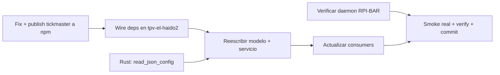

# Plan: TR-08 — Integrar impresión térmica real vía SDK `tickmaster`

## TL;DR

Reemplazar el stub muerto (`thermal-printer.service.ts` + `ThermalPrinter.ts`, sidecar
`thermal-printer-cli` que nunca existió) por `@mks2508/tickmaster-sdk` contra el daemon HTTP
en RPI-BAR. **Desviación importante respecto al TR**: la distribución del paquete NO es
trivial como asumía la opción 1 del TR — verificado empíricamente (ver Contexto) que
`packages/sdk/src/client.ts` importa un tipo desde `@tickmaster/daemon/app` (paquete
`private`, nunca publicado) y que `packages/sdk/package.json` usa protocolos
`workspace:*`/`catalog:` que **rompen `bun install` en CUALQUIER consumidor externo**,
sea `file:` o npm. Arreglar esto requiere un cambio pequeño y mecánico (~25 líneas, sin
cambio de comportamiento en runtime — **verificado compilando de verdad con `tsc --strict
--skipLibCheck`** contra el `@elysiajs/eden` real instalado en tickmaster, no solo
razonado: la primera versión del fix que se me ocurrió, "quitar el genérico sin más", NO
compilaba; la versión final del plan sí, exit 0) en `tickmaster/packages/sdk/`. Una vez
arreglado, **recomiendo
publicar a npm** (no `file:`) — evita rutas absolutas que romperían los builds nativos en
`supermicro-pcbar`/Windows que TR-07/0.4.0.D ya establecieron (clone + `bun install` en
cada host), y sigue el precedente ya usado de `@mks2508/auth-oidc-elysia`. El TR
pre-autoriza al decomposer a decidir esto sin preguntar salvo "cambios de código no
triviales" — mi valoración es que el fix SÍ califica como trivial (mecánico, type-only,
cero cambio de comportamiento), lo documento con evidencia completa para que quede
auditable si waxin no está de acuerdo.

Además del TR original se descubrió (grep, ver Contexto): el path de impresión REAL en
producción es `NewOrder.tsx::handleTicketPrintingComplete` (NO `TauriPlatformService`,
que está completamente muerto — cero callers), y `printerSettings.json` **nunca se ha
escrito** (`writeJsonConfig` exportado pero jamás invocado) — la config de impresora hoy
vive solo en memoria y se resetea cada arranque. Esto amplía el alcance de Phase C más
allá de lo que el TR listó explícitamente.

Verificación final: ticket físico saliendo de la Epson TM-U210PD vía RPI-BAR, desde una
orden real en la app.

## DAG de milestones



## Contexto verificado

### Superficie del SDK tickmaster (`/Users/mks/tickmaster`, verificado ahora)

- `packages/core/src/ticket/models.ts`: `ITicket { items, logo?, ivaRate?, pago?, cabecera?,
  pie?, meta? }`. `ITicketLine { nombre, cantidad, precioUnitario }` (precio con impuestos
  incluidos). `ITicketPago { metodo, entregado?, cambio? }` — si se omite `cambio` y hay
  `entregado`, `computeTotals()` lo calcula (`cambio = entregado - total`).
- `packages/sdk/src/sdk.ts`: `createTickmaster({ baseUrl, token }) → { tickets, printer,
  drawer, documents, raw }`.
- `packages/sdk/src/resources/tickets.resource.ts`: `tm.tickets.safe.print(ticket, {
  columns?, totalLabel?, openDrawer? }) → Promise<Result<IPrintResult, TickmasterSdkError>>`
  (variante `.safe` = Result, patrón no-throw; variante sin `.safe` lanza). `IPrintResult =
  { printed: number }`.
- `packages/sdk/src/resources/printer.resource.ts`: `tm.printer.safe.status() →
  Result<IPrinterStatus>` con `{ connected, online, paperOut, paperNearEnd, coverOpen,
  error }`.
- `packages/sdk/src/resources/drawer.resource.ts`: `tm.drawer.safe.open() →
  Result<{opened:boolean}>`.
- `packages/core/src/ticket/toDocument.ts`: `ticketToDocument()` ya usa `DEFAULT_COLUMNS`
  si no se pasan `columns` — tpv-el-haido2 NO necesita gestionar el ancho de papel.

### Bloqueador de distribución — verificado empíricamente, no es hipótesis

1. `packages/sdk/src/client.ts:6` — `import type { TickmasterApp } from
   '@tickmaster/daemon/app'`, usado solo para tipar `treaty<TickmasterApp>(...)` dentro de
   `createGateway()` (línea ~109). `@tickmaster/daemon` es `"private": true` en su
   `package.json`, y en `packages/sdk/package.json` está como `devDependencies` (línea 20),
   **no** `dependencies` — nunca se publicaría ni con `npm publish` ni sería instalable vía
   un `file:` externo con `bun install`.
2. `packages/sdk/package.json` (`dependencies`): `"@elysiajs/eden": "catalog:"`, `"elysia":
   "catalog:"`, `"@mks2508/tickmaster-core": "workspace:*"` — los protocolos `catalog:` y
   `workspace:*` solo son válidos DENTRO del workspace bun de tickmaster.
3. **Test real, hecho en el scratchpad de esta sesión** (no en el repo, sin tocar código):
   creé un consumidor `bun` externo con `"@mks2508/tickmaster-sdk":
   "file:/Users/mks/tickmaster/packages/sdk"` como única dependencia. `bun install` **falla
   duro** (`error: Workspace dependency "@tickmaster/daemon" not found` +
   `@mks2508/tickmaster-core@workspace:* failed to resolve` + `@elysiajs/eden@catalog:
   failed to resolve` + `elysia@catalog: failed to resolve`), y **no se crea `node_modules`
   en absoluto** — el install completo aborta, no es un warning aislado. Confirmé además
   con paquetes de prueba aislados (`@fake/sdk2` → `@fake/core`) que:
   - Bun SÍ intenta resolver `devDependencies` de un paquete `file:`-linkeado (no solo
     `dependencies`), así que quitar `@tickmaster/daemon` de `dependencies` no basta si
     sigue en `devDependencies`.
   - Un `file:` relativo dentro del `package.json` del paquete linkeado (`"file:../core"`)
     se resuelve relativo al **consumidor**, no al paquete que lo declara — no sirve para
     que `sdk` apunte a su propio sibling `core`.
   - Un `overrides` en el consumidor apuntando a `file:<ruta-absoluta>` para forzar la
     resolución de `@fake/core` **falló** con un error de bun ("Could not find package.json
     for file:... dependency") pese a que el path existía — posible bug de esta build
     canary de bun (`v1.4.0-canary.1`), no fiable como mecanismo.
   - Una dependencia hermana declarada como `file:` en el **consumidor** (`@fake/core`) NO
     se usa para satisfacer una referencia anidada con semver plano dentro de `@fake/sdk2`
     — bun siempre golpea el registry npm para especificadores no-`file:`/no-`workspace:`,
     ignorando lo que ya está instalado localmente.

   **Conclusión**: el ÚNICO camino que funciona sin tocar tickmaster sería hardcodear un
   `file:` **absoluto** dentro del propio `packages/sdk/package.json` de tickmaster — lo
   cual ensucia ese repo con una ruta específica de esta máquina (`/Users/mks/tickmaster`),
   rompe en cualquier otra máquina/CI, y es exactamente el tipo de fragilidad que el TR ya
   advertía sobre la opción 2. Esto aplica **por igual a la opción file: y a la opción
   npm-publish tal como estaba el código** — el fix de `client.ts` es un prerrequisito
   común a ambas, no algo específico de "elegir npm en vez de file:".

4. `packages/sdk/src/internal/map-error.ts:10` — `mapTreatyError()` ya recibe una interfaz
   ESTRUCTURAL propia (`ITreatyResultLike { data, error, status, response }`), documentada
   explícitamente como "a proposito NO es `Treaty.TreatyResponse<...>` de Eden" para no
   filtrar tipos de Eden/daemon. Esto da la plantilla del fix real (ver M2): NO basta con
   quitar el genérico `<TickmasterApp>` de `treaty()` sin más — **verificado con un `tsc
   --strict --skipLibCheck` real** (scratchpad de esta sesión, contra el `@elysiajs/eden`
   instalado en tickmaster) que `treaty(baseUrl, {...})` sin genérico rompe la compilación:
   `client.printer.info.get()` da `TS2339: Property 'info' does not exist` — Eden Treaty
   sin tipo de ruta colapsa a una función callable con index signature, no a algo con
   propiedades anidadas navegables. El fix verificado que SÍ compila limpio (mismo `tsc`,
   exit 0): castear el cliente una vez, en la creación, a un tipo estructural local
   mínimo con solo las 5 rutas que `client.ts` usa, devolviendo `ITreatyResultLike` (la
   MISMA interfaz que `mapTreatyError` ya espera) — ver diff exacto en M2.

### tpv-el-haido2 ya soporta importar `.ts` crudo de node_modules (verificado)

`tsconfig.json` de tpv-el-haido2 ya tiene `"moduleResolution": "bundler"` y
`"allowImportingTsExtensions": true` (además de `"skipLibCheck": true`) — necesarios
porque ambos paquetes tickmaster publican `main`/`types` apuntando a `.ts` con imports
`from './archivo.ts'` (extensión explícita). No hace falta tocar el tsconfig del proyecto
en M3.

### Precedente de publish en el scope `@mks2508`

`@mks2508/no-throw`, `@mks2508/better-logger`, `@mks2508/auth-oidc-elysia` ya están
publicados y en uso (confirmado por líneas de `dependencies` ya presentes en
`package.json` de tpv-el-haido2 y en `CLAUDE.md`/memoria de sesión: "mismo patrón que
`@mks2508/auth-oidc-elysia` en 0.4.1.A"). El scope npm ya existe y tiene auth configurada
en esta máquina (asumido, verificar con `npm whoami` en M2 antes de publicar).

### Dead code descubierto (no estaba en el TR, cambia el alcance de Phase C)

- `src/services/platform/TauriPlatformService.ts:69-83` (`printTicket`/`printReceipt`) —
  **cero callers**: `grep -rn "\.printTicket(\|\.printReceipt("` en todo `src/` solo
  encuentra las definiciones en `PlatformService.ts`/`TauriPlatformService.ts`/
  `WebPlatformService.ts`, ningún componente los invoca.
- El path de impresión REAL es `src/components/Sections/NewOrder.tsx:94-121`
  (`handleTicketPrintingComplete`), que llama `connectToThermalPrinter()` (de
  `src/assets/utils/utils.ts:33`) + `printer.printOrder(order)` + `printer.disconnect()` —
  **completamente independiente** de `TauriPlatformService`.
- `src/services/thermal-printer.service.ts:123` (`writeJsonConfig`) — exportada, **cero
  callers** (`grep -rn "writeJsonConfig" src/` solo la definición). `printerSettings.json`
  nunca se ha escrito en ningún run real de la app.
- `src/store/store.ts` — `thermalPrinterOptions` **no está** en la lista de claves
  persistidas a `localStorage` (a diferencia de `taxRate`, `autoOpenCashDrawer`, etc. —
  todas usan `debouncedLocalStorageSet`). `App.tsx:284-293` la inicializa con un objeto
  hardcodeado cada vez que `store.state.thermalPrinterOptions` es `null` — que es SIEMPRE
  en un arranque fresco. Los cambios que el usuario hace en Settings se pierden al
  reiniciar la app.
- `src-tauri/src/lib.rs:215-230` — `write_json_config(app, config: Value)` es genérico
  (recibe cualquier JSON), escribe a `{app_data_dir}/printerSettings.json`. **No existe
  comando de lectura** — hay que añadir `read_json_config` (Phase B... realmente Phase C,
  ver M4) simétrico.
- `src/lib/error-codes.ts:14-20` — `PrinterErrorCode` ya tiene los 5 códigos que hacen
  falta (`ConnectionFailed`, `PrintFailed`, `CashDrawerFailed`, `ConfigError`,
  `TestFailed`) — no hace falta ninguno nuevo, confirmado.
- `src/store/store.ts:148-155` — `taxRate` es **porcentaje** (`21`, no `0.21`), default
  `21`, persistido en `localStorage['tpv-tax-rate']`. `orderToTicket` necesita dividir
  entre 100 para `ITicket.ivaRate` (fracción).
- `package.json:60` — `@mks2508/no-throw` en tpv-el-haido2 está en `^0.2.0`; tickmaster usa
  `^0.3.7`. Verificado que ambos exportan la misma superficie (`ok/err/isErr/Result/
  ResultError/tryCatchAsync/ErrorCode`) — bump de bajo riesgo, gate = `bun run typecheck`.

## M1 — Verificar daemon en RPI-BAR

Sin acceso SSH desde este entorno — este milestone lo ejecuta el executor con acceso real
a la tailnet. No toca código de este repo.

### Cambios

Ninguno. Solo verificación.

### Pasos

```bash
tailscale status | grep -i rpi-bar
# ESPERADO: hostname exacto en la tailnet (probablemente rpi-bar.vpn.mks2508.local o
# similar) — NO asumir, usar el que devuelva este comando en el resto del plan.

curl -sf --max-time 5 http://<rpi-bar-hostname>:9100/health
# ESPERADO 200: daemon nuevo ya corriendo, saltar deploy.
# Si falla: comprobar qué systemd unit está activa:
ssh root@<rpi-bar-hostname> 'systemctl is-active tickmaster-daemon escpos-daemon 2>&1'
```

Si `tickmaster-daemon` NO está activo y hay que desplegarlo (`apps/daemon/README.md`
sección Deploy, ya documentada en tickmaster — comandos exactos: `bun run --cwd
apps/daemon build` + `scp` + `systemd swap`): **STOP, no lo hagas en este pase**. El TR
prohíbe forzar el swap si `escpos-daemon` sigue activo sin que waxin lo sepa (blast radius
sobre hardware de producción real). Reporta el estado encontrado y separa "deploy del
daemon" como acción explícita que espera confirmación, antes de seguir a M7.

El token (`TICKMASTER_TOKEN`) se genera en la Pi y no sale de ahí — pídele a waxin que lo
pegue en un canal seguro (Bitwarden / mensaje directo), NUNCA lo escribas en un archivo
versionado de este repo ni en el log de esta sesión.

### Verify M1

- Hostname real de RPI-BAR confirmado y anotado para M7.
- `curl .../health` → 200, o estado del deploy documentado si no.
- Token obtenido por un canal fuera de este repo (no en el plan, no en el report).

## M2 — Fix + publish `@mks2508/tickmaster-{core,sdk}` a npm (toca `/Users/mks/tickmaster`)

Ver Contexto para la evidencia completa de por qué este paso es necesario independientemente
de si se hubiera elegido `file:`. Cambio mecánico, type-only, sin alterar comportamiento del
daemon ni de `packages/core`.

### Interfaces

```diff-signatures
- import type { TickmasterApp } from '@tickmaster/daemon/app'
- ...
- let cachedClient: Promise<ReturnType<typeof treaty<TickmasterApp>>> | null = null
- ...
- treaty<TickmasterApp>(baseUrl, { headers: {...}, fetcher })
+ /** ITreatyResultLike con `data` tipado por ruta, en vez de `unknown` a secas — así los
+  *  5 `return ok(res.data)` de createGateway() siguen compilando contra las firmas
+  *  precisas de IGateway (Result<IPrinterInfo, ...>, Result<IPrintResult, ...>, etc.)
+  *  sin tocar esas 5 líneas. */
+ type IRouteResult<T> = Omit<ITreatyResultLike, 'data'> & { readonly data: T | null }
+
+ /** Tipo estructural local: las 5 rutas que este cliente usa, nada más. */
+ type LocalDaemonClient = {
+   printer: {
+     info: { get(): Promise<IRouteResult<IPrinterInfo>> }
+     status: { get(): Promise<IRouteResult<IPrinterStatus>> }
+     jobs: {
+       post(body: unknown): Promise<IRouteResult<IPrintResult>>
+       raw: { post(body: unknown): Promise<IRouteResult<IPrintResult>> }
+     }
+     drawer: { post(): Promise<IRouteResult<{ opened: boolean }>> }
+   }
+ }
+ let cachedClient: Promise<LocalDaemonClient> | null = null
+ ...
+ treaty(baseUrl, { headers: {...}, fetcher }) as unknown as LocalDaemonClient
```

**Verificado con `tsc --strict --skipLibCheck` real** (no solo razonado): quitar el
genérico `<TickmasterApp>` SIN reemplazo rompe la compilación (`Property 'info' does not
exist` en `client.printer.info.get()` — Eden Treaty sin tipo de ruta colapsa a una función
callable, no navegable por propiedades). El fix probado con ese `tsc` (exit 0) castea el
cliente a un tipo local con `data: unknown` — suficiente para navegar las rutas, pero
**insuficiente para las 5 líneas `return ok(res.data)` de `createGateway()`**, que están
contextualmente chequeadas contra las firmas precisas de `IGateway`
(`Result<IPrinterInfo, ...>`, `Result<IPrintResult, ...>`, etc.): `ok(unknown)` no es
asignable a `Result<IPrinterInfo, ...>`. El tipo final de arriba (`IRouteResult<T>`)
parametriza `data` por ruta en vez de dejarlo en `unknown` — sigue siendo asignable a
`ITreatyResultLike` (que `mapTreatyError()` consume, con `data: unknown`), y tras el guard
existente `if (res.data === null) return err(unreachable())`, `res.data` narrowea a `T`
limpio. Con esto las 5 líneas de `createGateway()` compilan **sin tocarlas**, que es la
afirmación real (no solo "las rutas se navegan").

### Cambios (repo `/Users/mks/tickmaster`)

- `packages/sdk/src/client.ts:6` — eliminar:
  ```ts
  import type { TickmasterApp } from '@tickmaster/daemon/app'
  ```
- `packages/sdk/src/client.ts` (junto a `import { mapTreatyError } from
  './internal/map-error.ts'`, ~línea 9) — importar también el tipo:
  ```ts
  import type { ITreatyResultLike } from './internal/map-error.ts'
  ```
  (exportar `ITreatyResultLike` desde `map-error.ts` si no lo está ya — confirmar con
  `grep "export.*ITreatyResultLike" packages/sdk/src/internal/map-error.ts`, hoy tiene
  `export interface ITreatyResultLike` en la línea 10, ya exportada, no requiere cambio ahí)

- `packages/sdk/src/client.ts` — añadir los tipos locales (antes de `createGateway`, tras
  los imports; `IPrinterInfo`/`IPrinterStatus` ya están importados en las líneas 3-5,
  `IPrintResult` ya está definido localmente en este mismo archivo — sin imports nuevos):
  ```ts
  /** ITreatyResultLike con `data` tipado por ruta en vez de `unknown` a secas — así los 5
   *  `return ok(res.data)` de createGateway() siguen compilando contra las firmas precisas
   *  de IGateway sin tocar esas 5 líneas. */
  type IRouteResult<T> = Omit<ITreatyResultLike, 'data'> & { readonly data: T | null }

  /** Tipo estructural local: solo las 5 rutas que este cliente usa. */
  type LocalDaemonClient = {
    printer: {
      info: { get(): Promise<IRouteResult<IPrinterInfo>> }
      status: { get(): Promise<IRouteResult<IPrinterStatus>> }
      jobs: {
        post(body: unknown): Promise<IRouteResult<IPrintResult>>
        raw: { post(body: unknown): Promise<IRouteResult<IPrintResult>> }
      }
      drawer: { post(): Promise<IRouteResult<{ opened: boolean }>> }
    }
  }
  ```

- `packages/sdk/src/client.ts` (línea del `let cachedClient`, ~105) — cambiar tipo:
  ```ts
  let cachedClient: Promise<LocalDaemonClient> | null = null
  ```

- `packages/sdk/src/client.ts` (dentro de `getClient`, ~109) — quitar el genérico y castear:
  ```ts
  treaty(baseUrl, {
    headers: { authorization: `Bearer ${config.token}` },
    fetcher,
  }) as unknown as LocalDaemonClient
  ```
  (antes: `treaty<TickmasterApp>(baseUrl, { ... })`)

- Las 5 llamadas dentro de `createGateway()` (`client.printer.info.get()`,
  `client.printer.status.get()`, `client.printer.jobs.post(...)`,
  `client.printer.jobs.raw.post(...)`, `client.printer.drawer.post()`) **no cambian** —
  siguen compilando igual: `mapTreatyError(res)` sigue recibiendo algo asignable a
  `ITreatyResultLike` (`IRouteResult<T>` lo es, con `data: T | null` en vez de `unknown`),
  y `return ok(res.data)`/`return ok(res.value)` en cada método siguen typando contra las
  firmas precisas de `IGateway` porque `res.data` ya viene narrowed a `T` tras el guard
  `if (res.data === null) return err(unreachable())` que cada método ya tiene.

- `packages/sdk/package.json` — `devDependencies`: quitar `"@tickmaster/daemon":
  "workspace:*"` (queda solo `bun-types`).
- `packages/sdk/package.json` — `dependencies`, cambiar los 3 especificadores no
  resolubles fuera del workspace:
  ```json
  "dependencies": {
    "@elysiajs/eden": "1.4.9",
    "@mks2508/no-throw": "^0.3.7",
    "@mks2508/tickmaster-core": "^0.3.0",
    "elysia": "1.4.29"
  }
  ```
  (`@elysiajs/eden`/`elysia` son paquetes públicos reales — `catalog:` era solo el shorthand
  interno de bun para fijar versión en todo el workspace, la versión pineada YA es la
  correcta, `1.4.9`/`1.4.29` confirmadas en `package.json` raíz de tickmaster).

### Verify M2 (dentro de tickmaster, antes de publicar)

```bash
cd /Users/mks/tickmaster
bun install
# ESPERADO: sin errores de "workspace dependency not found" (regresión: bun debe seguir
# linkeando @mks2508/tickmaster-core LOCAL vía el propio glob de workspace aunque el
# especificador ya no diga workspace:* — si en cambio empieza a intentar bajarlo del
# registry, es una señal de que hace falta revisar el orden de publish más abajo).

bun run --cwd packages/sdk typecheck
bun run --cwd packages/sdk test
# ESPERADO: ambos verdes, sin referencias a @tickmaster/daemon.

grep -rn "@tickmaster/daemon" packages/sdk/
# ESPERADO: sin resultados.
```

### Publish (orden importa: core primero)

```bash
cd /Users/mks/tickmaster
npm whoami
# ESPERADO: logueado con el usuario/org @mks2508 (si no, `npm login` primero — fuera del
# alcance de este plan hacerlo por ti, es credencial de waxin)

cd packages/core && npm publish --access public
# ESPERADO: @mks2508/tickmaster-core@0.3.0 publicado (primera vez, sin bump necesario —
# hoy da 404, confirmado en el TR).

cd ../sdk && npm publish --access public
# ESPERADO: @mks2508/tickmaster-sdk@0.2.0 publicado, ahora resolviendo
# @mks2508/tickmaster-core@^0.3.0 desde el registry real.

npm view @mks2508/tickmaster-sdk version
npm view @mks2508/tickmaster-core version
# ESPERADO: 0.2.0 / 0.3.0 respectivamente, ya no 404.
```

No versionar/commitear nada de este paso en tpv-el-haido2 — es trabajo en el OTRO repo. Si
waxin quiere el commit correspondiente en tickmaster, es una decisión suya al revisar este
report (fuera del `commit-strategy: single` de ESTE plan, que solo cubre tpv-el-haido2).

### Verify M2 (post-publish)

- `npm view @mks2508/tickmaster-sdk` y `npm view @mks2508/tickmaster-core` devuelven
  metadata real (no 404).
- `bun install`/`typecheck`/`test` dentro de tickmaster siguen verdes tras el cambio (no se
  rompió el desarrollo interno del propio repo).

## M3 — Wire dependencias en tpv-el-haido2

Depende de M2 (necesita los paquetes publicados y resolubles).

### Cambios

- `package.json:60` — bump:
  ```json
  "@mks2508/no-throw": "^0.3.7",
  ```
- `package.json` (bloque `dependencies`, alfabético junto a los `@mks2508/*` existentes) —
  añadir:
  ```json
  "@mks2508/tickmaster-core": "^0.3.0",
  "@mks2508/tickmaster-sdk": "^0.2.0",
  ```

### Verify M3

```bash
bun install
bun run typecheck
# ESPERADO: sin errores nuevos. Si el bump de no-throw rompe algo, es señal de un breaking
# change real entre 0.2.0→0.3.7 — investigar el diff puntual antes de seguir (no bloquear
# el resto del plan si el breaking change es aislado y arreglable en el mismo pase).
```

## M4 — Rust: comando `read_json_config` (simétrico a `write_json_config`)

Sin dependencias de M2/M3 — puede correr en paralelo.

### Interfaces

```diff-signatures
  #[tauri::command]
  async fn write_json_config(app: tauri::AppHandle, config: Value) -> Result<String, String> { ... }

+ #[tauri::command]
+ async fn read_json_config(app: tauri::AppHandle) -> Result<Option<Value>, String> { ... }
```

### Cambios

- `src-tauri/src/lib.rs` (después de `write_json_config`, línea 230) — insertar:
  ```rust
  #[tauri::command]
  async fn read_json_config(app: tauri::AppHandle) -> Result<Option<Value>, String> {
      let app_dir = app.path().app_data_dir().map_err(|e| format!("Failed to get app directory: {}", e))?;
      let config_path = app_dir.join("printerSettings.json");

      if !config_path.exists() {
          return Ok(None);
      }

      let content = fs::read_to_string(&config_path)
          .map_err(|e| format!("Failed to read config: {}", e))?;
      let value: Value = serde_json::from_str(&content)
          .map_err(|e| format!("Failed to parse config: {}", e))?;

      Ok(Some(value))
  }
  ```
- `src-tauri/src/lib.rs:485` (lista `invoke_handler`, justo después de `write_json_config,`)
  — añadir `read_json_config,`.

### Verify M4

```bash
cd src-tauri && cargo check
# ESPERADO: compila sin warnings nuevos.
```

## M5 — Reescribir modelo + servicio

Depende de M3 (paquete npm disponible) y M4 (comando Rust disponible).

### Interfaces

```diff-signatures
- export enum PrinterTypes { EPSON, TANCA, STAR, DARUMA }
- export enum BreakLine { NONE, CHARACTER, WORD }
- export enum CharacterSet { ... 34 variantes ... }
- export interface ThermalPrinterServiceOptions { type?, interface, characterSet?, ... }
- export default class ThermalPrinterService { isConnected(), printText(), printImage(),
-   cutPaper(), openCashDrawer(), printOrder(order), disconnect() }
+ export interface TickmasterPrinterConfig { readonly baseUrl: string; readonly token: string }

- export async function runThermalPrinterCommand(printSequence: string): Promise<string>
- export async function openCashDrawerOnly(): Promise<string>
- export async function writeJsonConfig(config: ThermalPrinterServiceOptions): Promise<void>
+ export function orderToTicket(order: Order, ivaRatePercent: number): ITicket
+ export async function printOrder(order: Order, config: TickmasterPrinterConfig, ivaRatePercent: number): Promise<PrinterResult<IPrintResult>>
+ export async function printTestTicket(config: TickmasterPrinterConfig): Promise<PrinterResult<IPrintResult>>
+ export async function testConnection(config: TickmasterPrinterConfig): Promise<PrinterResult<IPrinterStatus>>
+ export async function openDrawer(config: TickmasterPrinterConfig): Promise<PrinterResult<{ opened: boolean }>>
+ export async function savePrinterConfig(config: TickmasterPrinterConfig): Promise<PrinterResult<void>>
+ export async function loadPrinterConfig(): Promise<PrinterResult<TickmasterPrinterConfig | null>>
```

### Mapeo `Order` → `ITicket` (decisiones explícitas, sin dejar nada abierto)

| Campo `Order` | Campo `ITicket` | Nota |
|---|---|---|
| `items[].name` | `items[].nombre` | — |
| `items[].quantity` | `items[].cantidad` | — |
| `items[].price` | `items[].precioUnitario` | ya incluye impuestos, igual que `ITicketLine` espera |
| `id` | `meta.Ticket` = `"#${id}"` | `meta` es el slot diseñado para esto (docstring de `ITicket.meta` en core: "numero correlativo, mesa, camarero va en meta") |
| `tableNumber` | `meta.Mesa` | `=== 0 ? 'Barra' : String(tableNumber)`, mismo criterio que `renderTicketPreview` existente |
| `date` | `meta.Fecha` | — |
| `paymentMethod` | `pago.metodo` | solo si `status === 'paid'` |
| `totalPaid` | `pago.entregado` | solo si `status === 'paid'` |
| — | `pago.cambio` | **NO se envía** — se omite a propósito y se deja que `computeTotals()` de core lo derive de `entregado - total` (single source of truth; si `order.change` (calculado en tpv) y el cambio derivado por core llegan a divergir en un smoke real, es señal de un bug de redondeo/descuento en otro sitio, no algo a silenciar aquí) |
| — | `cabecera` = `'BAR EL HAIDO'` | fijo, un solo string |
| — | `pie` = `'¡Gracias por su visita!'` | fijo, igual que el texto actual de `TauriPlatformService.formatOrderForPrint` |
| `total` | — (NO se envía) | intencional: `ITicket` no lleva total, `computeTotals()` lo deriva sumando `items`. Si un smoke real muestra un total distinto al de `order.total`, investigar descuentos/redondeo — no es bug de este mapeo, es una discrepancia a resolver aparte |
| `ticketPath`, `itemCount`, `status`, `aeat` | — | omitidos, no tienen slot en `ITicket` y no son necesarios para imprimir |
| — | `logo` | omitido — no hay asset de logo pixel-art hoy, no inventar uno fuera de scope |
| taxRate del store (no está en `Order`) | `ivaRate` | pasado como segundo parámetro `ivaRatePercent` (número, 0-100, viene de `store.state.taxRate`) → `ivaRatePercent > 0 ? ivaRatePercent / 100 : undefined` |

### Cambios

- `src/models/ThermalPrinter.ts` — **reemplazo completo del contenido** (DELETE >
  deprecated: cero de los campos viejos sobreviven, el daemon ya gestiona ESC/POS del lado
  servidor — `characterSet`/`breakLine`/`lineCharacter`/`timeout` no tienen equivalente
  cliente-side en la arquitectura nueva):
  ```ts
  /** Config del daemon tickmaster (RPI-BAR): URL base HTTP + token bearer. */
  export interface TickmasterPrinterConfig {
    readonly baseUrl: string;
    readonly token: string;
  }
  ```

- `src/services/thermal-printer.service.ts` — **reemplazo completo**:
  ```ts
  import { invoke } from '@tauri-apps/api/core';
  import { err, isErr, ok, tryCatchAsync } from '@mks2508/no-throw';
  import {
    createTickmaster,
    type IPrinterStatus,
    type IPrintResult,
    type ITicket,
  } from '@mks2508/tickmaster-sdk';
  import { PrinterErrorCode, type PrinterResultError } from '@/lib/error-codes';
  import type Order from '@/models/Order';
  import type { TickmasterPrinterConfig } from '@/models/ThermalPrinter';
  import type { Result } from '@mks2508/no-throw';

  export type PrinterResult<T> = Result<T, PrinterResultError>;

  function buildClient(config: TickmasterPrinterConfig) {
    return createTickmaster({ baseUrl: config.baseUrl, token: config.token });
  }

  export function orderToTicket(order: Order, ivaRatePercent: number): ITicket {
    return {
      cabecera: 'BAR EL HAIDO',
      meta: {
        Ticket: `#${order.id}`,
        Mesa: order.tableNumber === 0 ? 'Barra' : String(order.tableNumber),
        Fecha: order.date,
      },
      items: order.items.map((item) => ({
        nombre: item.name,
        cantidad: item.quantity,
        precioUnitario: item.price,
      })),
      ivaRate: ivaRatePercent > 0 ? ivaRatePercent / 100 : undefined,
      pago:
        order.status === 'paid'
          ? { metodo: order.paymentMethod, entregado: order.totalPaid }
          : undefined,
      pie: '¡Gracias por su visita!',
    };
  }

  export async function printOrder(
    order: Order,
    config: TickmasterPrinterConfig,
    ivaRatePercent: number
  ): Promise<PrinterResult<IPrintResult>> {
    const tm = buildClient(config);
    const result = await tm.tickets.safe.print(orderToTicket(order, ivaRatePercent));
    if (isErr(result)) {
      return err({ code: PrinterErrorCode.PrintFailed, message: result.error.message });
    }
    return ok(result.value);
  }

  export async function printTestTicket(
    config: TickmasterPrinterConfig
  ): Promise<PrinterResult<IPrintResult>> {
    const tm = buildClient(config);
    const result = await tm.tickets.safe.print({
      cabecera: 'BAR EL HAIDO',
      items: [{ nombre: 'Ticket de prueba', cantidad: 1, precioUnitario: 1 }],
      pie: 'Prueba de impresión OK',
    });
    if (isErr(result)) {
      return err({ code: PrinterErrorCode.TestFailed, message: result.error.message });
    }
    return ok(result.value);
  }

  export async function testConnection(
    config: TickmasterPrinterConfig
  ): Promise<PrinterResult<IPrinterStatus>> {
    const tm = buildClient(config);
    const result = await tm.printer.safe.status();
    if (isErr(result)) {
      return err({ code: PrinterErrorCode.ConnectionFailed, message: result.error.message });
    }
    return ok(result.value);
  }

  export async function openDrawer(
    config: TickmasterPrinterConfig
  ): Promise<PrinterResult<{ opened: boolean }>> {
    const tm = buildClient(config);
    const result = await tm.drawer.safe.open();
    if (isErr(result)) {
      return err({ code: PrinterErrorCode.CashDrawerFailed, message: result.error.message });
    }
    return ok(result.value);
  }

  // IMPORTANTE: nunca loguear `config` (contiene el token del daemon) — el bug del
  // servicio viejo (`console.log('Saving thermal printer configuration:', config)`) NO se
  // replica aquí.
  export async function savePrinterConfig(
    config: TickmasterPrinterConfig
  ): Promise<PrinterResult<void>> {
    const result = await tryCatchAsync(
      async () => invoke('write_json_config', { config }),
      PrinterErrorCode.ConfigError
    );
    return isErr(result)
      ? err({ code: PrinterErrorCode.ConfigError, message: result.error.message })
      : ok(undefined);
  }

  export async function loadPrinterConfig(): Promise<PrinterResult<TickmasterPrinterConfig | null>> {
    const result = await tryCatchAsync(
      async () => invoke<Record<string, unknown> | null>('read_json_config'),
      PrinterErrorCode.ConfigError
    );
    if (isErr(result)) {
      return err({ code: PrinterErrorCode.ConfigError, message: result.error.message });
    }
    const raw = result.value;
    if (raw === null) return ok(null);
    if (typeof raw.baseUrl !== 'string' || typeof raw.token !== 'string') {
      return err({
        code: PrinterErrorCode.ConfigError,
        message: 'printerSettings.json: falta baseUrl/token o tiene forma inválida',
      });
    }
    return ok({ baseUrl: raw.baseUrl, token: raw.token });
  }
  ```

### Verify M5

```bash
bun run typecheck
# ESPERADO: sin errores en los 2 archivos reescritos. (Los CONSUMERS de M6 todavía no
# están actualizados — es normal que typecheck falle en ELLOS hasta M6, pero
# thermal-printer.service.ts + ThermalPrinter.ts deben quedar limpios ya en M5.)
```

## M6 — Actualizar consumers

Depende de M5.

### Cambios

- `src/assets/utils/utils.ts` — eliminar `connectToThermalPrinter` (líneas 33-48) y su
  import de `@/models/ThermalPrinter.ts` (línea 4, `ThermalPrinterService` /
  `ThermalPrinterServiceOptions`). **Mantener `renderTicketPreview`** (líneas 6-31) —
  confirmado consumer real en `src/components/Sections/OrderHistory.tsx:717`, sin relación
  con el backend de impresión, fuera de scope de este TR.

- `src/services/platform/TauriPlatformService.ts` — reemplazar `formatOrderForPrint`
  (líneas 25-67) + `printTicket`/`printReceipt` (líneas 69-83). Este path está confirmado
  sin callers reales (ver Contexto) — se mantiene solo por conformidad de interfaz
  `PlatformService`, con `ivaRatePercent = 0` porque esta clase no tiene acceso al store:
  ```ts
  import { isErr } from '@mks2508/no-throw';
  import { loadPrinterConfig, printOrder } from '@/services/thermal-printer.service';
  // ...
  async printTicket(order: Order): Promise<void> {
    // Sin callers hoy (verificado: cero referencias a platformService.printTicket en
    // components — el path real de impresión vive en NewOrder.tsx, que sí tiene acceso a
    // store.state.taxRate). Se mantiene por conformidad de interfaz; ivaRate=0 (sin
    // desglose) al no tener acceso al store desde esta capa.
    const configResult = await loadPrinterConfig();
    if (isErr(configResult) || configResult.value === null) {
      throw new Error('Impresora no configurada. Ve a Ajustes > Impresión.');
    }
    const result = await printOrder(order, configResult.value, 0);
    if (isErr(result)) throw new Error(result.error.message);
  }

  async printReceipt(order: Order): Promise<void> {
    return this.printTicket(order);
  }
  ```
  Eliminar el import de `runThermalPrinterCommand` (línea 6).

- `src/components/Sections/NewOrder.tsx` — reescribir `handleTicketPrintingComplete`
  (líneas 94-121), el path REAL de impresión:
  ```ts
  import { isErr } from '@mks2508/no-throw';
  import { printOrder } from '@/services/thermal-printer.service';
  // quitar: import { connectToThermalPrinter } from '@/assets/utils/utils';
  // quitar: import type { ThermalPrinterServiceOptions } from '@/models/ThermalPrinter';

  const handleTicketPrintingComplete = async (shouldPrintTicket: boolean) => {
    if (!shouldPrintTicket) return;
    const config = store.state.thermalPrinterOptions;
    if (!config || !store.state.selectedOrder) {
      toast({
        title: 'Impresora no configurada',
        description: 'Configura la impresora en Ajustes antes de imprimir.',
        duration: 3000,
      });
      return;
    }
    const result = await printOrder(store.state.selectedOrder, config, store.state.taxRate);
    if (isErr(result)) {
      log.error('Error al imprimir ticket', new Error(result.error.message));
      toast({
        title: 'Error al imprimir ticket',
        description: result.error.message,
        duration: 3000,
      });
    } else {
      toast({ title: 'Ticket impreso', description: 'Ticket impreso con exito.', duration: 3000 });
    }
  };
  ```

- `src/store/store.ts` — `import type { ThermalPrinterServiceOptions } from
  '@/models/ThermalPrinter'` (línea 11) → `import type { TickmasterPrinterConfig } from
  '@/models/ThermalPrinter'`. Línea 66 (`thermalPrinterOptions:
  ThermalPrinterServiceOptions | null`) → `TickmasterPrinterConfig | null`. Línea 236-237
  (`setThermalPrinterOptions`) → parámetro `TickmasterPrinterConfig | null`.

- `src/App.tsx` — quitar import de `PrinterTypes, CharacterSet, BreakLine` (líneas 44-49,
  dejar solo `type ThermalPrinterServiceOptions` → `type TickmasterPrinterConfig`).
  Reemplazar el bloque de init hardcodeado (líneas 284-293):
  ```ts
  // antes: store.setThermalPrinterOptions({ type: PrinterTypes.EPSON, interface: '//COM3', ... })
  if (!store.state.thermalPrinterOptions) {
    const configResult = await loadPrinterConfig();
    if (!isErr(configResult) && configResult.value) {
      store.setThermalPrinterOptions(configResult.value);
    }
    // si es null (primera vez, sin configurar aún): queda `null`, la UI de Settings debe
    // mostrar los campos vacíos, no un objeto inventado.
  }
  ```
  **Verificar que la función contenedora de este bloque ya es `async`** (varias funciones de
  init en `App.tsx` lo son, p.ej. `checkLicense`) — si no lo es, envolver en una IIFE async o
  mover a un `onMount`/`createEffect` async existente. Añadir imports:
  `import { loadPrinterConfig } from '@/services/thermal-printer.service'` y `import {
  isErr } from '@mks2508/no-throw'`.

- `src/components/Sections/SettingsPanel.tsx` — imports (líneas 81-83): reemplazar
  `openCashDrawerOnly, runThermalPrinterCommand` por `openDrawer, printTestTicket,
  testConnection` de `thermal-printer.service.ts`. Línea 74: `type
  ThermalPrinterServiceOptions` → `type TickmasterPrinterConfig`. Reescribir
  `handlePrintTestTicket` (258-281) y `handleTestConnection` (283-302) para usar
  `printTestTicket(props.thermalPrinterOptions)` / `testConnection(...)`, devolviendo `{
  ok: boolean; message: string }` en vez del string parseado con `.indexOf` (decisión: dado
  que `ThermalPrinterSettings.tsx` se reescribe casi entero en este mismo milestone, el
  costo de modernizar el contrato es marginal y evita falsos positivos del matching por
  substring que tenía el código viejo). Reescribir el handler `openCashDrawer` (852-869)
  para usar `openDrawer(props.thermalPrinterOptions)` con manejo de `Result`.

- `src/components/ThermalPrinterSettings.tsx` — reescritura mayoritaria. Quitar imports de
  `BreakLine, CharacterSet, PrinterTypes` (líneas 15-20) y todos los campos/`Select`
  asociados (tipo de impresora, conjunto de caracteres, modo de corte, caracter de línea,
  timeout slider, switch de caracteres especiales — líneas 62-173). Props nuevas:
  ```ts
  interface ThermalPrinterSettingsProps {
    options: TickmasterPrinterConfig | null;
    onSave: (config: TickmasterPrinterConfig) => Promise<void>;
    onPrintTestTicket: () => Promise<{ ok: boolean; message: string }>;
    onTestConnection: () => Promise<{ ok: boolean; message: string }>;
  }
  ```
  Dos campos: `Input` para `baseUrl` (placeholder
  `http://rpi-bar.vpn.mks2508.local:9100`) e `Input type="password"` para `token`. Buffer
  local con `createSignal` para no escribir a disco por cada tecla — botón explícito
  "Guardar" que llama `props.onSave({ baseUrl, token })` (decisión: evita el bug de "cada
  tecla dispara un `write_json_config`" que tendría un wiring directo `onOptionsChange` →
  save). Mantener los 2 botones existentes (Imprimir Ticket de Prueba / Probar Conexión) y
  sus diálogos, adaptando el consumo de resultado a `{ ok, message }` en vez de
  `.indexOf('Error')`/`.indexOf('true')`.

### Verify M6

```bash
bun run typecheck
bun run lint:fix
bun run build
# Los 3 deben pasar limpio — protocolo obligatorio del CLAUDE.md antes de pedir prueba al
# usuario.
grep -rn "ThermalPrinterServiceOptions\|PrinterTypes\|CharacterSet\|BreakLine\|thermal-printer-cli\|runThermalPrinterCommand\|connectToThermalPrinter\|openCashDrawerOnly" src/
# ESPERADO: sin resultados (cero referencias al stub viejo).
```

## M7 — Smoke real + verify + commit (canonical)

Depende de M1 (daemon confirmado vivo) y M6 (código listo).

### Pasos

1. Configurar la impresora en la UI (Ajustes > Impresión) con el `baseUrl`/`token` reales
   de RPI-BAR (obtenidos en M1, nunca escritos en este repo).
2. Pre-check obligatorio (evita gastar un ticket en vano — pedido explícito del TR):
   botón "Probar Conexión" → `testConnection()` → verificar `paperOut: false` antes de
   imprimir.
3. Crear una orden de prueba real en la app (Tauri dev o build), completar el pago,
   confirmar impresión.
4. **Criterio de cierre: ticket físico saliendo de la Epson TM-U210PD.** No un mock, no un
   200 del daemon — recordar que un 200 de `POST /printer/jobs` solo significa "aceptado en
   el buffer de 1KB", no "impreso" (ver Riesgos R7).
   Verificar también que el bloque `Pago`/`Entregado`/`Cambio` aparece impreso cuando la
   orden está `paid` — `orderToTicket()` solo lo incluye si `order.status === 'paid'` en el
   momento exacto en que `handleTicketPrintingComplete` corre; no se verificó en esta
   sesión si el diálogo de pago garantiza ese orden (¿`store.state.selectedOrder.status`
   ya es `'paid'` cuando el usuario confirma imprimir, o todavía `'unpaid'`?). Si el ticket
   sale sin esa sección, es la señal — investigar el timing del diálogo de pago en
   `NewOrder.tsx`/`ConfirmPaymentDialog.tsx` antes de dar la M7 por cerrada.
5. Probar apertura de cajón portamonedas desde el botón de Settings.
6. Reiniciar la app y confirmar que la config de impresora persiste (verifica que M6/App.tsx
   + `loadPrinterConfig` funcionan de punta a punta — antes NUNCA persistía).

### Commit (canonical)

```bash
git add package.json src-tauri/src/lib.rs src/models/ThermalPrinter.ts \
  src/services/thermal-printer.service.ts src/assets/utils/utils.ts \
  src/services/platform/TauriPlatformService.ts \
  src/components/ThermalPrinterSettings.tsx src/components/Sections/SettingsPanel.tsx \
  src/components/Sections/NewOrder.tsx src/App.tsx src/store/store.ts
git status
# ESPERADO: exactamente esos archivos + bun.lockb/bun.lock actualizado por el bump de
# dependencias, nada de tickmaster (otro repo, commit aparte si waxin lo pide).

git commit -m "$(cat <<'EOF'
feat-phase(0.5.0): thermal printer via tickmaster SDK, replace dead sidecar stub [#TR-08]

<technical>
- src/services/thermal-printer.service.ts: full rewrite, @mks2508/tickmaster-sdk against
  RPI-BAR daemon (Result pattern, PrinterErrorCode reused). orderToTicket() maps Order to
  ITicket (meta.Ticket/Mesa/Fecha, ivaRate from store.taxRate/100, pago.entregado lets core
  derive cambio).
- src/models/ThermalPrinter.ts: stub class + ESC/POS enums deleted, replaced by
  TickmasterPrinterConfig { baseUrl, token }.
- src-tauri/src/lib.rs: add read_json_config (symmetric to existing write_json_config) —
  printerSettings.json now actually round-trips (never persisted before this).
- src/components/Sections/NewOrder.tsx: real print path (handleTicketPrintingComplete)
  rewired off the dead connectToThermalPrinter()/ThermalPrinterService stub.
- src/services/platform/TauriPlatformService.printTicket/printReceipt: confirmed zero
  callers, kept for interface conformance only, wired to the new service.
- Dependency bump: @mks2508/no-throw 0.2.0 -> 0.3.7 to match tickmaster-sdk's requirement.
- Prerequisite fix in tickmaster (separate repo, not in this commit): removed the
  @tickmaster/daemon type-only import from packages/sdk/src/client.ts and replaced
  workspace:*/catalog: specifiers with real semver, then published
  @mks2508/tickmaster-core@0.3.0 + @mks2508/tickmaster-sdk@0.2.0 to npm.
</technical>

<changelog>
## [Feature] Thermal printer integration (0.5.0)
- Real ticket printing on the Epson TM-U210PD via the tickmaster daemon on RPI-BAR
- Cash drawer opens for real (previous stub always returned false/no-op)
- Printer config (daemon URL + token) now persists across app restarts
</changelog>
EOF
)"
```

### Verify M7 (end-to-end)

- Ticket físico impreso correctamente (texto legible, totales correctos, sin caracteres
  corruptos).
- Cajón portamonedas abre.
- Config sobrevive a reinicio de la app.
- `git log -1 --stat` toca exactamente los archivos listados arriba, nada de `tickmaster/`.
- Sin secrets (token) en ningún archivo trackeado ni en el mensaje de commit.

## Files

```files-tree
tpv-el-haido2/
  package.json                                    [edit] — deps tickmaster + bump no-throw
  src-tauri/
    src/lib.rs                                     [edit] — read_json_config
  src/
    models/ThermalPrinter.ts                       [edit] — reemplazo completo
    services/
      thermal-printer.service.ts                   [edit] — reemplazo completo
      platform/TauriPlatformService.ts              [edit] — printTicket/printReceipt
    assets/utils/utils.ts                           [edit] — quitar connectToThermalPrinter
    components/
      ThermalPrinterSettings.tsx                    [edit] — reescritura mayoritaria
      Sections/SettingsPanel.tsx                    [edit] — handlers reescritos
      Sections/NewOrder.tsx                         [edit] — path real de impresión
    store/store.ts                                  [edit] — tipo TickmasterPrinterConfig
    App.tsx                                         [edit] — init carga config de disco

/Users/mks/tickmaster/  (repo externo — SOLO M2 lo toca)
  packages/sdk/
    src/client.ts                                   [edit] — quitar import type daemon
    package.json                                    [edit] — deps: semver real
```

## Milestones (claude tasks)

| # | Subject | Estimate | addBlockedBy | role |
|---|---|---|---|---|
| M1 | M1 — Verificar daemon RPI-BAR (SSH/curl, sin código) | 25m | — | — |
| M2 | M2 — Fix + publish tickmaster-core/sdk a npm (repo externo) | 45m | — | — |
| M3 | M3 — Wire dependencias en tpv-el-haido2 (package.json, no-throw bump) | 20m | M2 | — |
| M4 | M4 — Rust: read_json_config command | 15m | — | — |
| M5 | M5 — Reescribir modelo + servicio (thermal-printer.service.ts, ThermalPrinter.ts) | 75m | M3, M4 | — |
| M6 | M6 — Actualizar consumers (TauriPlatformService, NewOrder, SettingsPanel, ThermalPrinterSettings, App, utils) | 60m | M5 | — |
| M7 | M7 — Smoke real + verify + commit | 40m | M1, M6 | **canonical** |

**Metadata común a todas las milestones**:
- `roadmapItemId: "TR-08"`
- `phase: "0.5.0"`
- `tags: ["TR-08", "milestone:M<n>", "phase:0.5.0", "category:feature"]`
- `category: "feature"`
- `priority: "high"`

**Metadata específica de M7 (canonical)**:
- `role: "canonical"`

Nota de paralelización: M1 (verificación RPi, sin tocar código), M2 (repo externo
tickmaster) y M4 (Rust, archivo aislado) son disjuntos entre sí — pueden correr en
paralelo. M3 depende de M2 porque necesita los paquetes ya publicados. M5 es el primer
punto de convergencia real (necesita M3+M4). Estimado total ~4h40m + tiempo de hardware en
M7 (más que las "2-3h sin troubleshooting" del TR original — la diferencia es
íntegramente el fix de distribución de M2, no anticipado por el TR, documentado con
evidencia en Contexto).

## Git context

- Rama sugerida: `main` — este repo trabaja directamente en `main`, sin feature branches
  (confirmado en planes previos TR-02/TR-03/TR-07, mismo patrón).
- Commit prefix: `feat-phase(0.5.0)` — `0.5.0` ya existe en `roadmap.spec.yml` (status
  `deferred`, goal "Thermal printer integration"), este TR lo revive. A diferencia de
  TR-07 (que usó `unscoped` por numeración de fase genuinamente indecisa), aquí el número
  de fase padre ya está fijado en el spec — no hace falta inventar nada.
- Tag para hook: `[#TR-08]` — incluir en el commit único de M7.
- Estrategia: `single` — un solo commit en tpv-el-haido2 al final (M7), después del smoke
  real. El trabajo de M2 en tickmaster es un repo distinto, commit/publish separado, fuera
  de esta estrategia (ver M2).

> El hook `post-tool-use-bash` de `@mks-agentics/task-sync` lee el tag `[#TR-08]` del
> mensaje de commit y popula las UDAs `gitcommit` + `gitcommits` + `gitcommitscount` en TW
> (si dual mode activo en el repo). Si NO hay TW (FS only), el tag es noop.

## Riesgos / blockers

| # | Riesgo | Mitigación |
|---|---|---|
| R1 | Hostname real de RPI-BAR en la tailnet no confirmado | M1 primer paso: `tailscale status`, no asumir el nombre del TR |
| R2 | Token del daemon no accesible sin tocar la Pi (por diseño) | Pedir a waxin por canal seguro fuera de este repo, nunca en archivos versionados ni en el log de sesión |
| R3 | `escpos-daemon` (viejo) puede seguir activo en RPI-BAR — conflicto USB si ambos corren | M1: si se encuentra activo, NO forzar el swap sin que waxin lo confirme — blast radius sobre hardware de producción real del bar |
| R4 | `TICKMASTER_MAX_JOB_BYTES` (64KB) + buffer físico de 1KB — tickets muy largos o con logo pueden fallar o truncarse silenciosamente | No responsabilidad de este TR arreglarlo; documentar si aparece en el smoke de M7 |
| R5 | **200 de `POST /printer/jobs` significa "aceptado en el buffer de 1KB", NO "impreso"** (daemon README: buffer de 1KB, un ticket puede fallar a mitad si se acaba el papel después del 200) | M7 hace `testConnection()`/`printer.safe.status()` (paperOut check) ANTES de imprimir — mitiga el caso más común, no lo elimina del todo (condición de carrera física residual, aceptada) |
| R6 | Distribución del paquete (ver Contexto) — el fix de `client.ts`/`package.json` en tickmaster toca OTRO repo, decisión tomada por el decomposer sin confirmar con waxin (el TR pre-autoriza esto salvo "cambios no triviales"; mi valoración es que sí califica como trivial — mecánico, type-only, ~10 líneas) | Evidencia completa en Contexto, verificable por waxin al revisar el report antes de mergear; si no está de acuerdo, M2 es el único milestone a revertir/rehacer, no afecta M1/M3-M7 en su forma |
| R7 | `@mks2508/no-throw` bump 0.2.0→0.3.7 podría tener breaking changes no detectados en la exploración superficial de esta sesión | M3 gate: `bun run typecheck` — si falla, investigar el diff puntual antes de seguir |
| R8 | Vite/esbuild consumiendo TS crudo desde `node_modules` (ambos paquetes tickmaster publican `main`/`types` apuntando a `.ts`, no a `.js`/`.d.ts` compilados) — posible fricción con `optimizeDeps`/`server.fs.allow` en dev | Riesgo bajo (esbuild transpila `.ts` nativamente sin importar la ubicación); si aparece, `optimizeDeps.exclude` o `vite-tsconfig-paths` son el fix estándar, no bloquea M5/M6 |
| R9 | `packages/sdk/node_modules/@tickmaster/daemon` (symlink verificado en esta sesión) deja de existir si alguien limpia `node_modules` en tickmaster ANTES de que M2 elimine la referencia | Mitigado por el propio M2 — tras el fix, `client.ts` ya no depende de ese symlink en absoluto |
| R10 | `printerSettings.json` nunca se ha escrito en ningún run real — no hay migración de datos que hacer, pero tampoco hay ningún dato viejo que validar/limpiar | Confirmado en Contexto, no bloquea nada, solo evita perder tiempo buscando un migration path que no hace falta |

## Prohibiciones

- NO forzar el swap `escpos-daemon` → `tickmaster-daemon` en RPI-BAR sin confirmación
  explícita de waxin si M1 encuentra el daemon viejo todavía activo.
- NO hardcodear el token del daemon en ningún archivo versionado, commit, ni en este plan
  ni en el report de ejecución — placeholder `<REDACTED>` si hace falta mencionarlo.
- NO loguear (`console.log`/logger) el objeto `TickmasterPrinterConfig` completo en ningún
  punto del código nuevo (contiene el token) — el bug del servicio viejo no se replica.
- NO tocar `apps/daemon/` ni `packages/core/src/` de tickmaster salvo lo explícitamente
  descrito en M2 (`packages/sdk/src/client.ts` + `packages/sdk/package.json` únicamente).
- NO editar `roadmap.spec.yml` ni `docs/progress-log.md` — doc sync es un pase posterior,
  fuera de este plan (mismo patrón que TR-07).
- NO usar `git add -A`/`git add .` en M7 — stage explícito de la lista exacta de archivos.
- NO wireear `autoOpenCashDrawer` a un trigger automático en el flujo de checkout — el
  toggle existe en Settings pero hoy no dispara nada automáticamente (gap preexistente,
  fuera de scope de este TR, no inventar comportamiento nuevo no pedido).

## Verificación

- M2: `npm view @mks2508/tickmaster-sdk version` / `@mks2508/tickmaster-core version` → no
  404, devuelven `0.2.0`/`0.3.0`.
- M3: `bun run typecheck` limpio tras el wiring de dependencias.
- M4: `cargo check` limpio con `read_json_config` registrado.
- M5: `bun run typecheck` limpio en `thermal-printer.service.ts`/`ThermalPrinter.ts`
  aislados.
- M6: `bun run typecheck && bun run lint:fix && bun run build` los 3 verdes (protocolo
  obligatorio de CLAUDE.md), grep de referencias al stub viejo → sin resultados.
- M7 (e2e): ticket físico impreso desde una orden real, cajón abre, config persiste a
  reinicio, `git log -1 --stat` toca exactamente los archivos de tpv-el-haido2 listados.
