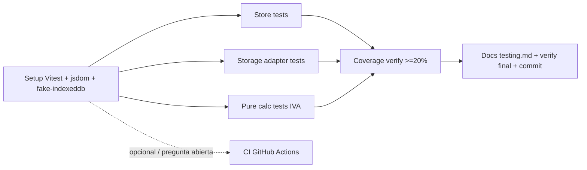

# Plan: TR-10 — Test coverage baseline (0.7.0)

## TL;DR

Vitest **no está instalado** (contradice TKT-06, que asumía "Vitest configurado — ver
CLAUDE.md REGLA 15"; esa regla no existe en el CLAUDE.md actual, es una referencia stale).
Setup desde cero: `vitest` + `jsdom` + `fake-indexeddb` + `@vitest/coverage-v8`, wireado en
`vite.config.ts` vía `defineConfig` de `vitest/config`. Tests reales sobre 3 superficies
seguras (no tocadas por TR-08 mid-edit): `store.ts` (acciones de order), storage adapters
(SQLite mockeando `invoke`, IndexedDB con `fake-indexeddb`), y cálculo puro de IVA en
`invoice-builder.service.ts`. Meta 20% coverage, no más. CI queda como milestone opcional
con pregunta abierta sobre D1 (ver sección dedicada) — no se ejecuta sin decisión de waxin.

## DAG de milestones



## Contexto verificado

- **Vitest NO instalado**: `bun.lock` tiene 0 matches para `vitest`, `node_modules/.bin/`
  no tiene binario `vitest`. `grep -rn "vitest\|REGLA 15" CLAUDE.md` → 0 resultados. El
  ticket TKT-06 (línea 23: "Vitest configurado (ver CLAUDE.md - REGLA 15)") describe un
  estado que no existe hoy — flag como gap, no bloquea el plan.
- **`vite.config.ts`** (61 líneas) no tiene bloque `test:`. Import actual:
  `import { defineConfig } from "vite"` (línea 1) — debe cambiar a `vitest/config` para que
  TypeScript tipe el campo `test` sin `@ts-expect-error`.
- **`package.json`** no tiene scripts `test` ni `test:coverage`. `devDependencies` no
  incluye `vitest`, `jsdom`, `fake-indexeddb` ni `@vitest/coverage-v8`.
- **Registry check** (npm view, hoy): `vitest@4.1.11` declara peer
  `vite: "^6.0.0 || ^7.0.0 || ^8.0.0"` — compatible con `vite@8.0.7` instalado.
  `@vitest/coverage-v8@4.1.11` (misma major, resuelve junto). `jsdom@30.0.1`,
  `fake-indexeddb@6.2.5` últimas estables. Instalar sin pinning agresivo:
  `bun add -D vitest @vitest/coverage-v8 jsdom fake-indexeddb`.
- **`src/store/store.ts` es seguro de testear**: `git diff --stat` muestra solo 11
  inserciones / 5 eliminaciones — un rename de tipo (`ThermalPrinterServiceOptions` →
  `TickmasterPrinterConfig`, TR-08) + reformateo de 2 llamadas multi-línea. Ninguna lógica
  de negocio tocada. Acciones core confirmadas por lectura completa (763 líneas):
  `addToOrder(orderId, item)` (L611), `removeFromOrder(orderId, productId)` (L643),
  `handleTableChange(tableId)` (L463), `handleCompleteOrder(order)` (L552),
  `closeOrder(orderId)` (L590), `setStorageMode(mode)` (L387).
- **`src/services/thermal-printer.service.ts` y `src/models/ThermalPrinter.ts` están
  mid-edit sin commitear** (TR-08): `git diff --stat` → 230 líneas cambiadas en el service,
  327 eliminadas en el modelo. **Excluidos de este plan** por instrucción explícita del TR.
- **`src/services/invoice-builder.service.ts` NO está tocado por TR-08** (no aparece en
  `git status`) — candidato seguro. Contiene `calculateTaxBreakdown(total, taxRate=21)`
  (L125) y `calculateMultipleTaxBreakdown(items)` (L146), ambas puras. También
  `validateOrder(order)` (L171) y `validateBusinessData(data)` (L203), puras salvo
  lectura de `order`/`businessData` pasados por parámetro (no leen `localStorage` ni
  `Date.now()` en su lógica de validación — solo `generateInvoiceNumber`/
  `peekNextInvoiceNumber` tocan `localStorage`, no se testean en este plan por ser menos
  valiosas para el 20% objetivo).
- **`IndexedDbStorageAdapter` (`src/services/indexeddb-storage-adapter.ts`) llama
  `indexedDB.open()` en su constructor** (L27→L81). jsdom **no implementa IndexedDB**
  (decisión explícita del proyecto jsdom). `store.ts` instancia las 3 adapters a nivel de
  módulo (`const indexedDbAdapter = new IndexedDbStorageAdapter()`, L91) — **importar
  `store.ts` sin polyfill revienta con `ReferenceError: indexedDB is not defined`**. Fix:
  `fake-indexeddb/auto` importado en `vitest.setup.ts`, cargado ANTES de cualquier import
  de `store.ts` vía `test.setupFiles`.
- **Modo de storage por defecto en entorno de test resuelve a `'indexeddb'`**, no
  `'sqlite'`: `isTauri()` (`src/services/platform/PlatformDetector.ts`) chequea
  `'__TAURI_INTERNALS__' in window` — false en jsdom. `getInitialStorageMode()`
  (`store.ts` L106-125) solo devuelve `'sqlite'` si `inTauri` es true; con
  `config.storage.defaultMode` en `'sqlite'` (default de `src/lib/config.ts:84`, sin
  `VITE_STORAGE_MODE`) pero `inTauri=false`, cae al fallback final
  `return inTauri ? 'sqlite' : 'indexeddb'` → `'indexeddb'`. Confirmado por trace manual
  del código, no supuesto.
- **Auditoría no bloquea la mayoría de tests de store**: `getAuditContext()` (`store.ts`
  L198-203) devuelve `null` si `state.selectedUser` es `null` (estado inicial). Todas las
  llamadas a `audit.logX(...)` en las acciones de order están guardadas por
  `if (ctx) void audit.logX(...)` — mientras los tests no llamen `setSelectedUser(...)`,
  el audit path (que sí llama `invoke()` de Tauri vía `audit.service.ts`) queda inerte y
  **no hace falta mockear `@tauri-apps/api/core` para los tests de store**, solo para los
  de `SqliteStorageAdapter`.
- **`useStore()` es singleton sin reset export** (`store.ts` L750-763,
  `createRoot(() => { store = createAppStore(); })`). No hay forma de recrearlo sin tocar
  producción. Estrategia de test: `beforeEach` resetea los slices relevantes con los
  setters existentes (`setActiveOrders([])`, etc.) e IDs de order únicos por test — no se
  toca `store.ts` para añadir un reset hook (cambio quirúrgico, no forzar refactor no
  pedido).
- **`tsconfig.json`** (`include: ["src"]`) incluye los tests co-localizados
  `src/**/*.test.ts` en el scope de `bun run typecheck` (tsgo). No hay `types: ["vitest/globals"]`
  configurado → los tests deben importar `describe/it/expect/vi/beforeEach` explícitamente
  de `'vitest'`, no usar globals implícitos (evita tocar `tsconfig.json`).
- **`biome.json`** (`files.includes: ["**", ...]`) ya cubre `src/**/*.test.ts` sin cambios
  — `bun run lint` los lintea automáticamente.
- **`docs/development/` no existe** — se crea en M6.
- **`roadmap.spec.yml:226-231`**: fase `"0.7.0"` existe, `status: queued`, `priority: low`,
  sin sub-fases (no hay `0.7.0.A/B/...`). No se toca este archivo (doc sync lo hace axon
  después).

### Nota CI / D1 — pregunta abierta, NO resuelta unilateralmente

- **Hallazgo adicional no mencionado en el TR**: el repo YA tiene 2 workflows de GitHub
  Actions activos — `.github/workflows/linux-x64-deploy.yml` y `rpi-deploy.yml`
  (`git log` confirma última modificación **2026-01-27**, commits "add Docker and Linux
  x64 build support" / "add OTA auto-update support" / "migrate to native ARM64 GitHub
  Actions runners"). Ambos son workflows de **build + deploy** reales (triggers en
  `push`/`tags`/`pull_request`, instalan toolchain Rust, compilan Tauri).
- **D1** (`docs/decisions/r1-deployment-architecture-2026-05-09.md:32-44`, lockeada
  **2026-05-09**, ~3.5 meses después de esos workflows): *"Auto-updater Tauri y
  distribución de binarios NO usarán GitHub Releases ni GitHub Actions"*. Rationale
  explícito: eliminar SPOF (GitHub caído → TPV no actualizable), control total del
  release process, stack unificado en Coolify.
- **La ambigüedad real**: el texto literal de D1 excluye "GitHub Actions" sin cualificar
  — no dice "GitHub Actions para releases/distribución" explícitamente, aunque todo el
  rationale (SPOF de *updates*, no de *tests*) sugiere que el scope pretendido era
  distribución, no CI de desarrollo. Un workflow que solo corra `bun run test` en push
  (sin build, sin publish, sin tocar `updates.mks2508.systems`) no reintroduce el SPOF de
  actualización — pero tampoco hay evidencia de que D1 se haya interpretado nunca de forma
  restringida: los 2 workflows existentes (que si violan D1 en espíritu, por ser build/deploy)
  siguen ahí, sin ticket de limpieza asociado, sugiriendo que nadie ha revisitado D1 en
  relación al `.github/` real del repo desde que se lockeó.
- **No decido esto por mi cuenta.** M7 queda como milestone separado, **opcional**,
  sin bloquear M1-M6. Si se ejecuta, es un workflow mínimo (`bun run test`, sin build ni
  publish). Si waxin decide que ni eso entra, se skippea sin tocar nada de `.github/`.

## M1 — Setup Vitest + jsdom + fake-indexeddb + coverage

### Interfaces

```diff-signatures
- import { defineConfig } from "vite";
+ import { defineConfig } from "vitest/config";
```

### Cambios

- `package.json` — `bun add -D vitest @vitest/coverage-v8 jsdom fake-indexeddb` (versiones
  resueltas por bun, no pinnear a mano). Añadir a `scripts` (después de `"typecheck:tsc"`,
  línea 33):
  ```json
  "test": "vitest run",
  "test:coverage": "vitest run --coverage",
  ```
- `vite.config.ts:1` — cambiar import de `defineConfig` de `"vite"` a `"vitest/config"`
  (re-exporta el mismo `defineConfig` con el campo `test` tipado, sin `@ts-expect-error`).
- `vite.config.ts` — añadir bloque `test` dentro del objeto de config devuelto por el
  factory `async () => ({...})`, después del bloque `server: {...}` (línea 60) y antes del
  cierre `}));` (línea 61):
  ```ts
  test: {
    environment: 'jsdom',
    setupFiles: ['./vitest.setup.ts'],
    passWithNoTests: true,
    include: ['src/**/*.test.ts'],
    coverage: {
      provider: 'v8',
      reporter: ['text', 'html', 'lcov'],
      include: ['src/**/*.ts'],
      exclude: [
        'src/**/*.test.ts',
        'src/**/*.d.ts',
        'src/components/**',
        'src/main.tsx',
        'src/App.tsx',
      ],
    },
  },
  ```
  `passWithNoTests: true` es necesario para que `bun run test` (correrá con 0 tests hasta
  que M2-M4 añadan archivos, si se verifica M1 de forma aislada) no falle con exit code
  distinto de 0. El `exclude` de coverage saca componentes SolidJS (JSX, fuera de scope de
  este TR — requieren `@solidjs/testing-library`, deferred) y entrypoints sin lógica
  testeable directamente.
- `vitest.setup.ts` (nuevo, raíz del repo, junto a `vite.config.ts`):
  ```ts
  import 'fake-indexeddb/auto';
  ```
  Debe ser el único contenido — el polyfill se registra como side-effect global (`indexedDB`,
  `IDBKeyRange` en `globalThis`) antes de que `test.setupFiles` deje correr los test files,
  que es lo que evita el `ReferenceError` al importar `store.ts` (ver Contexto verificado).

## M2 — Store tests (`src/store/store.test.ts`)

### Cambios

- `src/store/store.test.ts` (nuevo). Cubre `addToOrder`, `removeFromOrder` y
  `setStorageMode` como mínimo (los 3 con mayor densidad de lógica y menor costo de setup).
  `handleTableChange`/`handleCompleteOrder`/`closeOrder` quedan fuera de este milestone por
  presupuesto — si sobra tiempo tras M2-M4, son buenos candidatos de ampliación futura, no
  bloquean el 20%.

  Ejemplo completo y real (no placeholder):

  ```ts
  import { describe, it, expect, beforeEach } from 'vitest';
  import useStore from '@/store/store';
  import type Order from '@/models/Order';
  import type Product from '@/models/Product';

  describe('store - addToOrder / removeFromOrder', () => {
    const store = useStore();

    const testProduct: Product = {
      id: 100,
      name: 'Cerveza',
      price: 2.5,
      category: 'bebidas',
      brand: '',
      iconType: '',
      selectedIcon: '',
      uploadedImage: null,
    };

    const emptyOrder: Order = {
      id: 999,
      date: '2026-08-20',
      total: 0,
      change: 0,
      totalPaid: 0,
      itemCount: 0,
      tableNumber: 5,
      paymentMethod: 'efectivo',
      ticketPath: '',
      status: 'inProgress',
      items: [],
    };

    beforeEach(() => {
      // Reset del slice relevante — el store es singleton sin reset export,
      // así que reseteamos vía setters existentes en vez de recrear la instancia.
      store.setActiveOrders([{ ...emptyOrder, items: [] }]);
    });

    it('addToOrder agrega un item nuevo y recalcula total/itemCount', async () => {
      await store.addToOrder(999, testProduct);

      const order = store.state.activeOrders.find((o) => o.id === 999);
      expect(order?.items).toHaveLength(1);
      expect(order?.items[0]).toMatchObject({ id: 100, quantity: 1, price: 2.5 });
      expect(order?.total).toBe(2.5);
      expect(order?.itemCount).toBe(1);
    });

    it('addToOrder incrementa quantity si el item ya existe en el pedido', async () => {
      await store.addToOrder(999, testProduct);
      await store.addToOrder(999, testProduct);

      const order = store.state.activeOrders.find((o) => o.id === 999);
      expect(order?.items).toHaveLength(1);
      expect(order?.items[0].quantity).toBe(2);
      expect(order?.total).toBe(5);
    });

    it('removeFromOrder decrementa quantity y recalcula totales desde cero', async () => {
      await store.addToOrder(999, testProduct);
      await store.addToOrder(999, testProduct);

      await store.removeFromOrder(999, 100);

      const order = store.state.activeOrders.find((o) => o.id === 999);
      expect(order?.items[0].quantity).toBe(1);
      expect(order?.total).toBe(2.5);
    });

    it('removeFromOrder elimina el item cuando quantity llega a 0', async () => {
      await store.addToOrder(999, testProduct);

      await store.removeFromOrder(999, 100);

      const order = store.state.activeOrders.find((o) => o.id === 999);
      expect(order?.items).toHaveLength(0);
      expect(order?.total).toBe(0);
      expect(order?.itemCount).toBe(0);
    });
  });
  ```

  Nota: estos tests ejercitan de verdad `IndexedDbStorageAdapter.updateOrder` (vía
  `fake-indexeddb`) porque el modo de storage por defecto en jsdom es `'indexeddb'`
  (ver Contexto verificado) — no hace falta mockear `storageAdapter()` para este
  milestone. Si un test falla de forma rara relacionada con IndexedDB (no con la lógica de
  `store.ts`), verificar que no sea una diferencia de comportamiento de `fake-indexeddb`
  vs spec real antes de asumir bug de producción (ver Riesgos).

## M3 — Storage adapter tests

### Cambios

- `src/services/sqlite-storage-adapter.test.ts` (nuevo). Mockea `invoke` de
  `@tauri-apps/api/core` (el único punto de entrada externo del adapter).

  ```ts
  import { describe, it, expect, vi, beforeEach } from 'vitest';
  import { invoke } from '@tauri-apps/api/core';
  import { SqliteStorageAdapter } from '@/services/sqlite-storage-adapter';
  import type Product from '@/models/Product';

  vi.mock('@tauri-apps/api/core', () => ({
    invoke: vi.fn(),
  }));

  describe('SqliteStorageAdapter', () => {
    let adapter: SqliteStorageAdapter;

    beforeEach(() => {
      adapter = new SqliteStorageAdapter();
      vi.mocked(invoke).mockReset();
    });

    it('getProducts delega en el comando Tauri get_products y devuelve ok(value)', async () => {
      const products: Product[] = [
        {
          id: 1,
          name: 'Cafe',
          price: 1.5,
          category: 'bebidas',
          brand: '',
          iconType: '',
          selectedIcon: '',
          uploadedImage: null,
        },
      ];
      vi.mocked(invoke).mockResolvedValueOnce(products);

      const result = await adapter.getProducts();

      expect(invoke).toHaveBeenCalledWith('get_products');
      expect(result.ok).toBe(true);
      if (result.ok) expect(result.value).toEqual(products);
    });

    it('createProduct devuelve err(WriteFailed) si el comando Tauri rechaza', async () => {
      vi.mocked(invoke).mockRejectedValueOnce(new Error('db locked'));
      const product: Product = {
        id: 2,
        name: 'Te',
        price: 1.2,
        category: 'bebidas',
        brand: '',
        iconType: '',
        selectedIcon: '',
        uploadedImage: null,
      };

      const result = await adapter.createProduct(product);

      expect(result.ok).toBe(false);
      if (!result.ok) expect(result.error.code).toBe('STORAGE_WRITE_FAILED');
    });
  });
  ```

- `src/services/indexeddb-storage-adapter.test.ts` (nuevo). Usa `fake-indexeddb` real
  (ya polyfillado globalmente por M1), sin mocks — ejercita CRUD end-to-end contra la
  IndexedDB fake.

  ```ts
  import { describe, it, expect, beforeEach } from 'vitest';
  import { IndexedDbStorageAdapter } from '@/services/indexeddb-storage-adapter';
  import type Category from '@/models/Category';

  describe('IndexedDbStorageAdapter', () => {
    let adapter: IndexedDbStorageAdapter;

    beforeEach(() => {
      // Nueva instancia por test — cada una abre su propia conexión sobre la misma
      // fake-indexeddb en memoria (persiste entre tests del mismo proceso, ver Riesgos).
      adapter = new IndexedDbStorageAdapter();
    });

    it('createCategory + getCategories hace round-trip real sobre la IndexedDB fake', async () => {
      const category: Category = { id: 500, name: 'Postres', description: 'Dulces' };

      const createResult = await adapter.createCategory(category);
      expect(createResult.ok).toBe(true);

      const getResult = await adapter.getCategories();
      expect(getResult.ok).toBe(true);
      if (getResult.ok) {
        expect(getResult.value.find((c) => c.id === 500)).toEqual(category);
      }
    });

    it('deleteCategory elimina el registro de la store', async () => {
      const category: Category = { id: 501, name: 'Snacks', description: 'Salados' };
      await adapter.createCategory(category);

      const deleteResult = await adapter.deleteCategory(category);
      expect(deleteResult.ok).toBe(true);

      const getResult = await adapter.getCategories();
      if (getResult.ok) {
        expect(getResult.value.find((c) => c.id === 501)).toBeUndefined();
      }
    });
  });
  ```

  Nota: como la fake-indexeddb es un singleton en memoria por proceso de test (no se
  destruye entre tests salvo que se llame `indexedDB.deleteDatabase(...)` explícitamente),
  usar IDs únicos por test (500, 501, ...) para evitar colisiones de `add()` — ya aplicado
  en el ejemplo.

## M4 — Pure calc tests (IVA / invoice-builder.service.ts)

### Cambios

- `src/services/invoice-builder.service.test.ts` (nuevo). Sin mocks — funciones puras.

  ```ts
  import { describe, it, expect } from 'vitest';
  import {
    calculateTaxBreakdown,
    calculateMultipleTaxBreakdown,
    validateOrder,
  } from '@/services/invoice-builder.service';
  import type Order from '@/models/Order';

  describe('invoice-builder.service - calculateTaxBreakdown', () => {
    it('descompone un total con IVA 21% en base imponible + cuota', () => {
      const result = calculateTaxBreakdown(121, 21);
      expect(result).toEqual({ rate: 21, baseAmount: 100, taxAmount: 21 });
    });

    it('usa 21% como tipo por defecto si no se pasa taxRate', () => {
      expect(calculateTaxBreakdown(121).rate).toBe(21);
    });

    it('redondea a 2 decimales sin arrastrar error de floating point', () => {
      const result = calculateTaxBreakdown(10, 21);
      expect(result.baseAmount).toBe(8.26);
      expect(result.taxAmount).toBe(1.74);
    });
  });

  describe('invoice-builder.service - calculateMultipleTaxBreakdown', () => {
    it('agrupa y suma breakdowns del mismo tipo impositivo', () => {
      const result = calculateMultipleTaxBreakdown([
        { total: 121, taxRate: 21 },
        { total: 242, taxRate: 21 },
      ]);
      expect(result).toHaveLength(1);
      expect(result[0]).toEqual({ rate: 21, baseAmount: 300, taxAmount: 63 });
    });

    it('mantiene tipos impositivos distintos separados', () => {
      const result = calculateMultipleTaxBreakdown([
        { total: 121, taxRate: 21 },
        { total: 110, taxRate: 10 },
      ]);
      expect(result).toHaveLength(2);
    });
  });

  describe('invoice-builder.service - validateOrder', () => {
    const baseOrder: Order = {
      id: 1,
      date: '2026-08-20',
      total: 10,
      change: 0,
      totalPaid: 10,
      itemCount: 1,
      tableNumber: 1,
      paymentMethod: 'efectivo',
      ticketPath: '',
      status: 'paid',
      items: [{ id: 1, name: 'Cafe', price: 10, quantity: 1, category: 'bebidas' }],
    };

    it('valida un pedido pagado con items y total > 0', () => {
      const result = validateOrder(baseOrder);
      expect(result.isValid).toBe(true);
      expect(result.errors).toHaveLength(0);
    });

    it('rechaza un pedido no pagado', () => {
      const result = validateOrder({ ...baseOrder, status: 'inProgress' });
      expect(result.isValid).toBe(false);
      expect(result.errors).toContain('El pedido debe estar pagado para emitir factura');
    });

    it('rechaza un pedido sin items', () => {
      const result = validateOrder({ ...baseOrder, items: [] });
      expect(result.isValid).toBe(false);
      expect(result.errors).toContain('El pedido debe tener al menos un producto');
    });
  });
  ```

  Matemática verificada a mano: `121/1.21=100` exacto, `taxAmount=21`. `242/1.21=200`
  exacto. Suma grupo 21%: `baseAmount=300`, `taxAmount=63`. `10/1.21=8.264462...` →
  redondeado `8.26`; `taxAmount = round((10-8.26)*100)/100 = 1.74`. `110/1.10=100` exacto
  (grupo 10% separado del 21%).

- Extra opcional de bajo costo si sobra tiempo tras lo anterior (no obligatorio para el
  20%): `src/lib/state-helpers.ts` expone predicados puros `isOpActive`, `isOpDone`,
  `isPending`, `hasData` (L205-228) — trivialmente testeables sin mocks, coverage barato.
  No se detalla aquí porque no es necesario para cerrar el milestone; si el ejecutor tiene
  margen, son 4 asserts de una línea cada uno sobre objetos `{ status: '...' }` literales.

## M5 — Coverage verify (≥20%)

### Cambios

- Ninguno de código — correr `bun run test:coverage` tras M2+M3+M4 y confirmar el % real
  reportado (`text` reporter en consola + `coverage/lcov-report/index.html` para detalle
  por archivo).
- Si el % queda por debajo de 20%, ampliar `M4` (state-helpers) o `M2` (una acción más de
  store, p.ej. `setStorageMode`) antes de cerrar — no inventar tests triviales/vacíos solo
  para inflar el número (el TR es explícito: "no placeholders vacíos").
- **No fijar `coverage.thresholds` en `vite.config.ts` en este milestone** — el % real
  medido tras M2-M4 puede fluctuar según qué archivos queden en el `include`/`exclude`
  final; fijar un threshold duro con datos hipotéticos podría romper una ejecución futura
  legítima por 0.1%. Si tras medir el número real waxin quiere gatear el build con un
  threshold, es una decisión separada post-medición, no parte de este plan.

## M6 — Docs (`docs/development/testing.md`) + verificación final + commit

### Cambios

- `docs/development/testing.md` (nuevo). Contenido mínimo útil, sin relleno:
  - Cómo correr: `bun run test`, `bun run test:coverage`, cómo abrir el reporte HTML.
  - Patrón de mocking de Tauri `invoke` (ejemplo del M3, `vi.mock('@tauri-apps/api/core', ...)`).
  - Nota sobre `fake-indexeddb` y por qué es necesario (`indexedDB` no existe en jsdom,
    `store.ts` instancia `IndexedDbStorageAdapter` a nivel de módulo).
  - Nota sobre el patrón de reset del store singleton (`beforeEach` + setters existentes,
    no recrear la instancia).
  - Qué queda fuera de scope hoy (componentes SolidJS/JSX, hooks, E2E) y por qué
    (requieren `@solidjs/testing-library` / Playwright, deferred — no es que no se pueda,
    es que este TR no lo cubre).
- Milestone terminal: además de escribir el doc, corre la verificación completa (ver
  sección Verificación, línea "e2e del plan") y hace el **commit único** de todo el
  trabajo de M1-M5 + este milestone, con el tag `[#TR-10]` (ver Git context). Por eso es
  la milestone `canonical` — ninguna otra cierra con commit.

## Files

```files-tree
vite.config.ts                                    [edit]
vitest.setup.ts                                    [new]
package.json                                       [edit]
src/store/store.test.ts                             [new]
src/services/sqlite-storage-adapter.test.ts          [new]
src/services/indexeddb-storage-adapter.test.ts       [new]
src/services/invoice-builder.service.test.ts         [new]
docs/development/testing.md                          [new]
.github/workflows/test.yml                           [new, OPCIONAL — ver M7 + nota D1]
```

## Milestones (claude tasks)

| # | Subject | Estimate | addBlockedBy | role |
|---|---|---|---|---|
| M1 | Setup Vitest + jsdom + fake-indexeddb + coverage config | 20m | — | — |
| M2 | Store tests (addToOrder/removeFromOrder/setStorageMode) | 35m | M1 | — |
| M3 | Storage adapter tests (SQLite mock + IndexedDB fake) | 35m | M1 | — |
| M4 | Pure calc tests (IVA breakdown + validateOrder) | 20m | M1 | — |
| M5 | Coverage verify ≥20% (ajustar si falta) | 15m | M2, M3, M4 | — |
| M6 | Docs `/docs/development/testing.md` + verificación final + commit | 20m | M2, M3, M4, M5 | **canonical** |
| M7 | CI GitHub Actions (OPCIONAL — pregunta abierta D1) | 20m | M1 | — |

**Metadata común a todas las milestones**:
- `roadmapItemId: "TR-10"`
- `phase: "0.7.0"`
- `tags: ["TR-10", "milestone:M<n>", "phase:0.7.0", "category:test"]`

**Metadata específica de M6 (canonical, `commit-strategy: single`)**:
- `role: "canonical"`

M7 es opcional y no participa del commit único si no se ejecuta — si se ejecuta, entra en
el mismo commit final sin cambiar la asignación de `canonical` (sigue siendo M6).

## Git context

- Rama sugerida: `main` — repo sin feature branches (confirmado en planes previos
  TR-02/03/07/09 vía `git log`; `git branch -a` hoy solo muestra `main` + `origin/qq`
  huérfana). TR-10 no trae frontmatter propio con `suggestedBranch` (el task-request no
  tiene bloque YAML) — se aplica el fallback de convención real del repo, no el genérico
  `feat/<phase>-<roadmapItemId>`.
- Commit prefix: `feat-phase(0.7.0)` (fallback de la tabla de inferencia — TR-10 no trae
  `commit-prefix` en frontmatter).
- Tag para hook: `[#TR-10]` — incluir en el commit único para que el hook
  `post-tool-use-bash` de `@mks-agentics/task-sync` popule `gitcommit`/`gitcommits`/
  `gitcommitscount` en TW (si dual mode activo). Si no hay TW (FS only), el tag es noop.
- Estrategia: `single` (un commit al final, tras cerrar M1-M6; M7 se suma al mismo commit
  si se decide ejecutar).

## Riesgos / blockers

- `fake-indexeddb` no es 100% fiel a la IndexedDB real del navegador (edge cases de
  ordering/índices) → si un test de M2/M3 falla de forma no obvia, comparar contra la
  spec de IndexedDB antes de asumir bug de `store.ts` o de los adapters.
- `useStore()` singleton sin reset entre tests → si un test futuro olvida resetear el
  slice que usa, puede leer estado dejado por un test anterior del mismo archivo. Mitigado
  en M2 con `beforeEach` + IDs únicos, pero cualquier test nuevo que se añada después debe
  seguir el mismo patrón (documentado en M6).
- Coverage real tras M2-M4 puede no llegar exactamente a 20% con solo los tests descritos
  aquí — M5 explícitamente permite ampliar (state-helpers, una acción más de store) antes
  de cerrar, sin inventar tests vacíos.
- M7 (CI) depende de una decisión de waxin sobre el alcance de D1 que este plan no toma
  por su cuenta — ver "Nota CI / D1" en Contexto verificado. No ejecutar M7 sin esa
  decisión explícita.

## Prohibiciones

- NO tocar `src/services/thermal-printer.service.ts` ni `src/models/ThermalPrinter.ts`
  (TR-08 mid-edit, sin commitear) — ni testearlos ni modificarlos.
- NO tocar `src/services/http-storage-adapter.ts` — fuera del scope pragmático ajustado
  del TR (solo SQLite + IndexedDB).
- NO tocar hooks (`useUpdater`, `useScreenshot`, `useAEATSidecar`) — el ticket original
  los incluía, el TR ajustado los omite del objetivo pragmático de esta pasada.
- NO tests E2E (Playwright) — fuera de scope explícito.
- NO perseguir 100% coverage — 20% es la meta, parar ahí (M5).
- NO refactorizar código de producción "para hacerlo testeable" de forma intrusiva — si
  algo resulta genuinamente difícil de testear sin tocar producción, documentarlo como gap
  en el report y seguir con el resto.
- NO añadir `test.globals: true` a `vite.config.ts` ni `types: ["vitest/globals"]` a
  `tsconfig.json` — imports explícitos de `vitest` en cada test file (ver Contexto
  verificado, tsconfig incluye los test files en el scope de typecheck).
- NO tocar `roadmap.spec.yml` ni `docs/progress-log.md` — doc sync lo hace axon después.
- NO tocar `.github/workflows/linux-x64-deploy.yml` ni `rpi-deploy.yml` (hallazgo
  colateral, fuera de scope de este TR — si se decide limpiar por D1, es un TR aparte).
- NO ejecutar M7 sin decisión explícita de waxin sobre la lectura de D1.

## Verificación

- M1: `bun run test` → exit 0 con 0 test files (`passWithNoTests: true` hace que no
  falle). `bun install` / `bun.lock` refleja las 4 nuevas devDependencies.
- M2-M4: `bun run test` → todos los tests en verde, sin `ReferenceError: indexedDB is not
  defined` ni fallos de mock.
- M5: `bun run test:coverage` → reporte con % global ≥20% (verificar en el output `text`
  del reporter, sección "All files").
- Typecheck: `bun run typecheck` → limpio, incluye los nuevos `*.test.ts` (tsconfig los
  cubre vía `include: ["src"]`).
- Lint: `bun run lint:fix` → limpio sobre los nuevos archivos de test.
- M6: `docs/development/testing.md` existe y cubre cómo correr + patrones de mock usados.
- Sanity de no-overlap: `git status --porcelain -- src/services/thermal-printer.service.ts
  src/models/ThermalPrinter.ts` → sin cambios nuevos introducidos por este plan (deben
  seguir mostrando solo el diff pre-existente de TR-08, no diff adicional).
- e2e del plan: `bun run test && bun run test:coverage && bun run typecheck && bun run
  lint:fix` → los 4 comandos limpios dentro de M6 (canonical) es la señal de "listo para
  el commit único" — el commit con tag `[#TR-10]` se hace ahí, no antes.
