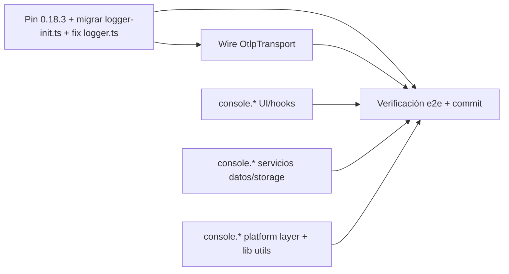

# Plan: TR-11 — Migrar a `@mks2508/better-logger@0.18.3` + wire OTel

## TL;DR

Pin exacto a `0.18.3` (el caret actual `^5.0.2` nunca resuelve ahí — reset de versión real,
confirmado). Migrar `logger-init.ts`/`logger.ts` a la API real de 0.18.3 verificada contra
**ground truth de dos fuentes**: doc viva (`llms.txt` + páginas API) y los `.d.ts` del tarball
publicado (`npm pack @mks2508/better-logger@0.18.3`, descomprimido en scratchpad) — el tarball
gana si hay discrepancia, no hubo ninguna. Wire `OtlpTransport` condicional a env vars nuevas
(`VITE_LOG_OTLP`/`VITE_LOG_OTLP_URL`), sin endpoint real hardcodeado. Auditar los console.*
sueltos de `src/`: de 78 matches de grep, solo **52 son migrables ahora** en 12 archivos — el
resto son 3 exenciones legítimas descubiertas por lectura completa de archivo (no solo grep) +
15 diferidos por overlap con TR-08 en vuelo. Nada de esto lo anticipaba el TR original al pie
de la letra; está documentado con evidencia en Contexto verificado.

## DAG de milestones



M3/M4/M5 tocan archivos disjuntos entre sí y respecto a M1/M2 (`createContextLogger` no cambia
de firma externa) — paralelizables. M2 depende de M1 por ser el mismo archivo
(`logger-init.ts`), edición secuencial para no pisar el diff.

## Contexto verificado

### Versión actual y peer dependency no documentada en el TR (gap nuevo)

- `package.json:59` → `"@mks2508/better-logger": "^5.0.2"`. `node_modules/@mks2508/better-logger/package.json` confirma que lo instalado HOY es literalmente `5.0.2` (API vieja pre-reset: `exports` solo tiene `.`, `./core`, `./cli` — sin `/transports`, `/hooks`, `/context`).
- **Gap no mencionado por el TR**: `bun.lock:215` — `@mks2508/shadcn-basecoat-theme-manager@4.3.2` declara `peerDependencies: { "@mks2508/better-logger": "^5.0.1" }`. Pinar a `0.18.3` deja ese peer insatisfecho (0.18.3 no matchea `^5.0.1` en semver). **Verificado que NO es un riesgo de runtime**: `grep -rl "better-logger" node_modules/@mks2508/shadcn-basecoat-theme-manager/dist/` solo encuentra el `package.json` (la declaración del peer), CERO referencias en `dist/index.js`/`dist/index.mjs`/`.d.ts` — el paquete no importa better-logger en su bundle, es un peer-dep declarado pero no consumido. Con `bunfig.toml` inexistente en el repo, Bun usa su comportamiento default: WARN en consola durante `bun install`, no ERROR. Riesgo bajo, documentado en Riesgos con plan B.

### API real de 0.18.3 (ground truth: doc viva + `.d.ts` del tarball, sin discrepancias)

Verificado con `npm pack @mks2508/better-logger@0.18.3` + lectura de `dist/Logger.d.ts`,
`dist/types/transports.d.ts`, `dist/transports/{Console,File,Http,Otlp}Transport.d.ts`,
`dist/index.d.ts`, `dist/transports-module.d.ts`:

- **Subpath breaking change confirmado**: `dist/index.d.ts` (root) **NO** exporta
  `ConsoleTransport`/`FileTransport`/`HttpTransport`/`OtlpTransport`/`TransportManager` (grep
  vacío). Esas 5 clases viven EXCLUSIVAMENTE en `@mks2508/better-logger/transports`
  (`dist/transports-module.d.ts:6-11`). El import actual de `logger-init.ts:21`
  (`import logger, { ConsoleTransport, FileTransport, HttpTransport, ... } from
  '@mks2508/better-logger'`) rompe en 0.18.3 — HAY que partirlo en 2 imports.
- **`LogLevel`/`TransportTarget` SÍ siguen en el root** (`dist/index.d.ts:54`, re-exportados
  desde `./types/index.js`) — no se mueven a un subpath, quedan igual que hoy.
- **Default export sigue existiendo**: `import logger from '@mks2508/better-logger'` resuelve a
  un `Proxy` lazy (`dist/Logger.d.ts:1207-1208`, `declare const loggerProxy: Logger; export
  default loggerProxy;`) — cero cambio en `main.tsx:1` ni en el import por defecto de
  `logger.ts:5`.
- **`addTransport(target: TransportTarget): string`** (`Logger.d.ts:641`) — `TransportTarget` es
  `{ target: string | ITransport; options?: TransportOptions; level?: LogLevel }`
  (`types/transports.d.ts:200-204`). El patrón actual `logger.addTransport({ target: new
  ConsoleTransport({level}), level } as TransportTarget)` sigue siendo **type-válido tal cual**
  en 0.18.3 — el cast `as TransportTarget` del commit `27b8e05` (tsgo strict en Windows, v5.0.2)
  no tiene contraparte documentada en el `.d.ts` de 0.18.3: `target`/`options`/`level` son 3
  props independientes, sin unión discriminada que fuerce ambigüedad. **M1 intenta SIN el
  cast**; si tsgo lo sigue pidiendo es una cuestión de inferencia local, no un requisito de la
  API — contingencia documentada en Riesgos, no bloqueante.
- **`FileTransport` sigue usando `destination`** (NO `path`) —
  `dist/transports/FileTransport.d.ts:19-33` (`FileTransportOptions.destination?: string`,
  default `'app.log'` Node / `'better-logger:default'` browser). Cero cambio en
  `logger-init.ts:69` más allá del import.
- **`HttpTransport`**: `{ url?, headers?, maxBufferSize?, maxRetries?=3, initialBackoffMs?=250,
  maxBackoffMs?=5000, fetchTimeoutMs?=10000, onError? } extends TransportOptions` —
  compatible con el uso actual (`{ level, url }`).
- **`OtlpTransport extends HttpTransport`**, constructor `OtlpTransportOptions` (REQUERIDOS:
  `endpoint: string`, `serviceName: string`; opcionales: `serviceVersion`, `environment`,
  `resourceAttributes`, `ingestKeyEnvVar`, `headers`, + los heredados de HttpTransport) —
  `dist/transports/OtlpTransport.d.ts:6-46`. POSTea a `<endpoint>/v1/logs`.
- **`logger.flushTransports()` y `logger.closeTransports()` existen en la clase `Logger`**
  (`Logger.d.ts:658,667`), no solo en `TransportManager` — confirma que si hubiera un hook de
  shutdown, el punto de enganche sería directo sobre el `logger` importado.
- **Firma real de `debug/info/warn/error/success/critical`**: `(...args: unknown[]):
  Promise<void>` en el `Logger` raíz (`Logger.d.ts:800-862`) — **NO existe** el overload
  `(context: string, message: string, meta?: object)` que usa HOY `logger.ts` (`logResultError`,
  `logSuccess`, `logDebug`, `logWarn`, y el `.error()` de `createContextLogger`) llamando
  directo sobre el logger raíz con 3 args posicionales. Eso era válido bajo v5.0.2 (API vieja,
  no documentada por la doc 0.18.x) pero en 0.18.3 el primer arg (`context`) se trataría como
  parte de `args` sin aplicar scoping real — **bug de comportamiento silencioso post-pin si no
  se arregla**, no solo un problema de tipos. Fix: rutear por `logger.scope(context)` (o
  `.component()`), que SÍ soporta `(msg, ...args)` — `ScopedLogger`/`ComponentLogger` (que
  `extends ScopedLogger`) tienen los mismos métodos pero retornan `void` síncrono, no
  `Promise<void>`.
- **`setVerbosity(level: Verbosity): void`** existe igual en `Logger` (`Logger.d.ts:156`) y
  como export standalone en root (`index.d.ts:46`). `Verbosity = LogLevel | 'silent'`
  (`types/core.d.ts:49`) — `logger.setVerbosity(logLevel)` (`logger-init.ts:59`, `logLevel:
  LogLevel`) sigue siendo type-válido sin cambios, `LogLevel` es subtipo de `Verbosity`.
- **`component(name)` vs `scope(name)`**: `component()` antepone un badge `[name]` con styling;
  `scope()` es la variante minimal, solo prefijo sin badge. `logger.ts` ya usa `component()`
  para los 6 loggers exportados (`auditLog`, `storeLog`, etc.) — se mantienen sin cambios,
  siguen existiendo igual en 0.18.3.

### Consumidores de `@mks2508/better-logger` (solo 3 archivos, confirmado)

`grep -rn "@mks2508/better-logger" src/` → únicamente `src/lib/logger.ts`,
`src/lib/logger-init.ts`, `src/main.tsx:1`. Ningún otro archivo importa el paquete directo.

### Patrón dominante de consumo interno (crítico para no romper 19 call sites)

`grep -rn "createContextLogger("` → **19 archivos** (`App.tsx`, `LicenseStatus.tsx`,
`LicenseDialog.tsx`, `ThemeSelector.tsx`, `LicenseSplashScreen.tsx`, `ErrorBoundary.tsx`,
`ScreenshotOverlay.tsx`, `OrderHistory.tsx`, `NewOrder.tsx`, `Products.tsx`, `useOnboarding.ts`,
`useScreenshot.ts`, `useStoreOperations.ts`, `SettingsPanel.tsx`, `useAEATSidecar.ts`,
`useAEAT.ts`, `useEmitInvoice.ts`, `useUpdater.ts`, `store-operations.ts`) usan
`const log = createContextLogger('X')`. Es el patrón real dominante del proyecto — NO los
loggers `component()` exportados de `logger.ts` (`auditLog`/`printerLog`/`aeatLog`/`authLog`:
0 usos fuera de su propia definición; `storeLog`: solo usado dentro de `store.ts`).
**Invariante de este plan**: la firma pública de `createContextLogger(context: string):
{info,warn,error,debug,success,resultError}` NO cambia — el fix de 0.18.x vive DENTRO de
`logger.ts` (M1), los 19 call sites quedan intocados.

### Auditoría real de `console.*` en `src/` — 78 grep matches, 52 migrables ahora

`grep -rln 'console\.\(log\|error\|warn\|debug\|info\)' src/` → 17 archivos, 78 líneas. El TR
estimaba "77 en 16 archivos" de memoria — el número real (verificado hoy) es 78 en 17, y de
esos, **3 exenciones legítimas nuevas** se descubrieron leyendo el archivo completo (no solo el
grep), no las anticipaba el TR:

| Archivo | Matches | Estado | Por qué |
|---|---|---|---|
| `src/components/ErrorBoundary.tsx:64-114` | 8 | **EXCLUIDO** | Monkey-patch dev-only de `console.log/warn/error/info` (guardado en `originalConsole`, reasignado con `capturedLogs.push(...)` + delegación al original) para el overlay de error-report. Necesita interceptar TODO output de consola, incluido el de libs de terceros — migrarlo a `logger.*` rompería su propósito. `isDev && typeof window !== 'undefined'` — no aplica en prod. |
| `src/lib/theme-utils.ts:75` | 1 | **EXCLUIDO** | `console.error` está DENTRO del string template que retorna `createAntiFlashScript()` (línea 54-79) — se inyecta como `<script>` inline crudo, PRE-module-graph (anti-FOUC). No es código TS ejecutado en el bundle de la app; el logger no puede importarse en ese contexto. Además `createAntiFlashScript` tiene 0 callers (`grep` vacío en `src/` e `index.html`) — dead export, fuera de scope quirúrgico limpiarlo. |
| `src/assets/utils/script.js:11` | 1 | **EXCLUIDO** | No importado por nada (`grep` vacío en `src/`, `index.html`). Usa imports CDN (`skypack.dev`) tipo playground/experimento gsap+tweakpane — fuera del bundle Vite, categoría "genuinamente playground" que el propio Acceptance del TR contempla como excepción. Gap para limpieza futura, no acción de este TR. |
| `src/services/thermal-printer.service.ts:93` | 1 | **NO ES UNA LLAMADA REAL** | El match es un comentario (`// servicio viejo (\`console.log(...)\`) NO se ...`), no código ejecutable. |
| `src/services/platform/TauriPlatformService.ts` | 15 | **DIFERIDO** | Ver overlap con TR-08 abajo. |
| **12 archivos restantes** | **52** | **MIGRAR EN M3-M5** | Ver tabla de milestones. |

### Overlap con TR-08 (en vuelo, uncommitted) — confirmado con `git status` + `git diff`

`git status --short` muestra `src/services/thermal-printer.service.ts`,
`src/models/ThermalPrinter.ts` Y `src/services/platform/TauriPlatformService.ts` como
modificados sin commitear. El TR-11 solo nombraba los 2 primeros como ejemplo de "archivos que
TR-08 esté reescribiendo" — verificado que la regla general también aplica a
`TauriPlatformService.ts`:

- `git diff --stat -- src/services/thermal-printer.service.ts src/models/ThermalPrinter.ts` →
  230/-327 líneas. El único match de `console.` en `thermal-printer.service.ts` (línea 93) es un
  comentario — CONFIRMADO limpio, no necesita nada de este TR (tal como predecía el TR-11).
  `ThermalPrinter.ts` → 0 matches.
- `git diff --stat -- src/services/platform/TauriPlatformService.ts` → 11/-56 líneas. El diff YA
  quita 2 `console.*` (`printTicket`/`printReceipt`, ver `docs/task-requests/TR-08-*.plan.md`
  M6) pero el archivo AÚN tiene **15 console.\* sin tocar** en el resto de sus métodos —
  confirmado con `grep -c` sobre el working tree actual. Ese archivo entra en la misma regla
  general del TR-11 ("no tocar archivos que TR-08 esté reescribiendo si sigue sin commitear") —
  se difiere completo, no solo las 2 líneas que TR-08 ya toca.

### `WebPlatformService.ts` — sin overlap, 19/52 calls migrables aquí

No aparece en `git status` (limpio, sin cambios de TR-08). Concentra más de un tercio de los
calls migrables — mismo patrón repetitivo `console.X('[WebPlatformService] mensaje', ...)` en
cada línea, mecánico y de bajo riesgo.

### Sin hook de shutdown en la app (confirmado, no se inventa uno)

`grep -rn 'onCloseRequested\|beforeunload\|CloseRequested\|SIGTERM\|SIGINT' src/ src-tauri/src/`
→ 0 resultados (el único match de "console window" en `main.rs:1` es un comentario de Windows
sin relación). El Acceptance checklist del TR pide "flushTransports wireado en shutdown SI el
proyecto tiene un hook de cierre" — no lo tiene, este ítem queda **N/A por evidencia**, no se
inventa un hook nuevo (el TR lo prohíbe explícitamente).

### `process.env` no funciona en el bundle de esta app (afecta `OtlpTransport.ingestKeyEnvVar`)

`vite.config.ts:35` → `define: { 'process.env': {} }` (reemplazo estático build-time).
`OtlpTransportOptions.ingestKeyEnvVar` lee `process.env[name]` en el constructor — en este
proyecto SIEMPRE resuelve a `undefined` (el propio `.d.ts` documenta que degrada
silenciosamente sin `process`). No es un problema para este TR (no hay key real que pasar), pero
queda documentado en Riesgos para cuando alguien conecte un SigNoz con auth.

## M1 — Pin `0.18.3` + migrar `logger-init.ts` (imports subpath) + fix routing interno de `logger.ts`

### Interfaces

```diff-signatures
- import logger, { ConsoleTransport, FileTransport, HttpTransport, type LogLevel, type TransportTarget } from '@mks2508/better-logger';
+ import logger, { type LogLevel, type TransportTarget } from '@mks2508/better-logger';
+ import { ConsoleTransport, FileTransport, HttpTransport } from '@mks2508/better-logger/transports';
```

```diff-signatures
- logger.error(context, `${operation} failed`, { code, message, cause? })   // logResultError — 3-arg sobre logger raíz, NO soportado en 0.18.3
+ logger.scope(context).error(`${operation} failed`, { code, message, cause? })   // scope() aplica el context como prefijo real
```

```diff-signatures
- error: (message, error?) => logger.error(context, message, error)   // createContextLogger — mismo bug
+ error: (message, error?) => logger.scope(context).error(message, error)
```

### Cambios

- `package.json:59` — `"@mks2508/better-logger": "^5.0.2"` → `"@mks2508/better-logger": "0.18.3"` (pin exacto, sin caret).
- `bun install` — regenera `bun.lock`. Verificar stderr: WARN de peer dep de
  `shadcn-basecoat-theme-manager` esperado y aceptado (ver Riesgos); si aparece un ERROR duro
  (no WARN), aplicar plan B antes de seguir.
- `src/lib/logger-init.ts:21` — split de import (ver Interfaces arriba). Quitar el `as
  TransportTarget` de las 3 líneas `logger.addTransport(...)` (líneas 63, 69, 81 en el archivo
  actual) — probar sin cast primero (ver Contexto verificado); si `bun run typecheck` falla con
  el mismo error de inferencia del commit `27b8e05`, reinstaurarlo.
- `src/lib/logger-init.ts:74,84` — los 2 `console.warn(...)` de fallback (File/Http transport
  unavailable) pasan a `logger.warn(...)`. Válido porque `ConsoleTransport` (si `enableConsole`,
  default `true`) ya se registró ANTES en el flujo — el warning tiene dónde imprimirse. Edge
  case documentado en Riesgos si `VITE_LOG_CONSOLE=false`.
- `src/lib/logger.ts:33-43` (`logResultError`) — internamente pasa de `logger.error(context,
  msg, meta)` a `logger.scope(context).error(msg, meta)`.
- `src/lib/logger.ts:52-58` (`logSuccess`) — de `logger.info(context, msg, meta)` a
  `logger.scope(context).info(msg, meta)`. **No** se cambia a `.success()` — sería un cambio de
  comportamiento/estilo no pedido por el TR, fuera de scope quirúrgico.
- `src/lib/logger.ts:67-69` (`logDebug`) — de `logger.debug(context, msg, meta)` a
  `logger.scope(context).debug(msg, meta)`.
- `src/lib/logger.ts:78-80` (`logWarn`) — de `logger.warn(context, msg, meta)` a
  `logger.scope(context).warn(msg, meta)`.
- `src/lib/logger.ts:94-106` (`createContextLogger`) — factoriza `const scoped =
  logger.scope(context)` una vez y reusa `scoped.info/warn/error/debug` en cada método del
  objeto retornado, en vez de llamar `logger.info(context, ...)` directo. Firma pública
  intacta. **`success` y `resultError` NO se tocan** — siguen delegando a `logSuccess(context,
  operation, meta)` / `logResultError(context, operation, error)` tal cual (que a su vez ya
  quedan arreglados por los 2 bullets anteriores). NO rewirear `success` a
  `scoped.success(...)` directo — perdería el sufijo `" succeeded"` del mensaje y cambiaría de
  método real invocado, es el mismo cambio de comportamiento no pedido que prohíbe la sección
  Prohibiciones para `logSuccess`.
- Líneas 9-24 de `logger.ts` (`auditLog`, `storeLog`, `storageLog`, `printerLog`, `aeatLog`,
  `authLog` vía `logger.component(...)`) — **sin cambios**, `component()` existe igual en
  0.18.3.

## M2 — Wire `OtlpTransport` condicional a env vars

*Depende de M1 (mismo archivo `logger-init.ts`, edición secuencial).*

### Interfaces

```diff-signatures
+ import { OtlpTransport } from '@mks2508/better-logger/transports';   // se agrega al import ya splitteado en M1
```

### Cambios

- `src/lib/logger-init.ts` — nuevas env vars leídas en `initializeLogger()`:
  `VITE_LOG_OTLP` (bool, default `false`), `VITE_LOG_OTLP_URL` (string, requerido si
  `VITE_LOG_OTLP=true`), `VITE_LOG_OTLP_ENV` (string opcional, default
  `import.meta.env.MODE`).
- Nuevo bloque condicional (mismo patrón que el bloque HTTP existente, líneas ~78-86):
  ```ts
  if (enableOtlp && otlpUrl) {
    try {
      logger.addTransport({
        target: new OtlpTransport({
          endpoint: otlpUrl,
          serviceName: 'tpv-haido',
          environment: otlpEnv,
        }),
        level: logLevel,
      });
    } catch (error) {
      const msg = error instanceof Error ? error.message : String(error);
      logger.warn(`[Logger] OTLP transport unavailable: ${msg}`);
    }
  }
  ```
  `serviceName: 'tpv-haido'` hardcodeado como identificador de servicio (NO es un endpoint, es
  metadata OTel — permitido; el TR solo prohíbe hardcodear el endpoint/key real).
- `transports` (array del log de inicialización, línea ~89-95) — agregar
  `enableOtlp && otlpUrl && \`otlp(${otlpUrl})\``.
- `.env.example` — agregar bloque:
  ```
  # Transport Configuration - OTLP (SigNoz / OTel collector)
  # Requires VITE_LOG_OTLP_URL to be set
  VITE_LOG_OTLP=false
  VITE_LOG_OTLP_URL=https://collector.example.com:4318
  VITE_LOG_OTLP_ENV=production
  ```
- Sin `ingestKeyEnvVar` wireado — `process.env` no funciona en este bundle (ver Contexto
  verificado), y no hay key real que pasar hoy. Si se necesita en el futuro, va por
  `headers: { 'signoz-ingestion-key': import.meta.env.VITE_LOG_OTLP_KEY }` manual, no por
  `ingestKeyEnvVar`.

## M3 — Migrar `console.*` — dominio UI/hooks (9 calls, 3 archivos)

Archivos: `src/components/PaymentModal.tsx` (2), `src/components/PWAStatus.tsx` (1),
`src/hooks/usePerformanceConfig.ts` (6).

### Criterio de migración (aplica también a M4/M5)

1. Cada archivo agrega `import { createContextLogger } from '@/lib/logger';` +
   `const log = createContextLogger('<Scope>');` cerca de los imports existentes — **salvo**
   que el módulo ya tenga un `component()` logger dedicado en `logger.ts` (caso único:
   `indexeddb-storage-adapter.ts` → reusa `storageLog`, ver M4).
2. Mapeo de nivel por método `console.*` original (no 1:1 mecánico ciego — juicio semántico
   documentado): `console.log` de inicio/fin de operación de negocio (migración, seed, sync,
   detección de update) → `.info()`; `console.log` de diagnóstico verboso/no accionable
   (device detection, config dumps) → `.debug()`; `console.warn` → `.warn()`; `console.error`
   → `.error()`.
3. Se elimina el prefijo literal `[Tag]`/`[ModuleName]` del mensaje — el scope del logger ya
   antepone el badge, mantenerlo duplicaría el tag.
4. Para `.error(message, err)`: si `err` viene de un `catch (error)` genérico (tipado
   `unknown` por TS), aplicar el guard `err instanceof Error ? err : undefined` (patrón ya
   usado en `src/main.tsx:49`, `swLog.error(...)`) — `createContextLogger().error` solo acepta
   `Error | ResultError<string>`. Si `err` ya es un `ResultError<string>` (viene de
   `@mks2508/no-throw`), pasar directo sin guard.
5. `usePerformanceConfig.ts` — los 6 `console.log` están gateados por `if (import.meta.env.DEV)`.
   **Mantener el guard tal cual**, solo reemplazar la llamada interna. `VITE_LOG_LEVEL=debug`
   por defecto en `.env` (dev y prod comparten el mismo `.env`, no hay `.env.production`) —
   quitar el guard cambiaría comportamiento en prod (estos logs pasarían a imprimirse ahí
   cuando hoy no lo hacen). No es parte de este TR.

### Ejemplos reales

`src/components/PaymentModal.tsx:73`:
```ts
// antes
console.log('handleConfirmPayment');
// después (con `const log = createContextLogger('PaymentModal');` agregado tras los imports)
log.debug('handleConfirmPayment');
```

`src/hooks/usePerformanceConfig.ts:170-176` (con `const perfLog = createContextLogger('PerformanceConfig');`):
```ts
// antes
if (import.meta.env.DEV) {
  console.log(
    'Performance Configuration: FORCED HIGH PERFORMANCE MODE (VITE_FORCE_HIGH_PERFORMANCE=true)'
  );
}
// después
if (import.meta.env.DEV) {
  perfLog.debug(
    'Performance Configuration: FORCED HIGH PERFORMANCE MODE (VITE_FORCE_HIGH_PERFORMANCE=true)'
  );
}
```

### Cambios (resto, mismo criterio, sin diff línea por línea)

- `PaymentModal.tsx:130` — `console.log('[PaymentModal] Auto-sending...')` → `log.info('Auto-sending invoice to AEAT...')`.
- `PWAStatus.tsx:62` — `console.log('[PWA] App installed')` → `log.info('App installed')` (con `const log = createContextLogger('PWAStatus');`).
- `usePerformanceConfig.ts:183,189,195,227,349` — mismo patrón que el ejemplo (guard DEV
  intacto, `.debug()` para todos — son diagnóstico de device detection, no eventos de negocio).

## M4 — Migrar `console.*` — dominio servicios de datos/storage (16 calls, 4 archivos)

Archivos: `src/services/data-migration.service.ts` (7), `src/services/demo-seed.service.ts`
(2), `src/services/indexeddb-storage-adapter.ts` (5, **reusa `storageLog`**),
`src/services/invoice-builder.service.ts` (2).

### Ejemplos reales

`src/services/data-migration.service.ts:16` (con `const log = createContextLogger('DataMigration');`):
```ts
// antes
console.log('[DataMigration] Starting HTTP to IndexedDB migration...');
// después
log.info('Starting HTTP to IndexedDB migration...');
```

`src/services/data-migration.service.ts:101`:
```ts
// antes
console.warn(`[DataMigration] Failed to create category: ${result.error.message}`);
// después
log.warn(`Failed to create category: ${result.error.message}`);
```

`src/services/indexeddb-storage-adapter.ts:33,86` (import nuevo:
`import { storageLog } from '@/lib/logger';` — **NO** `createContextLogger`, es EL caso de reuso
explícito que pide el TR, `storageLog` ya existe en `logger.ts:15` con badge `[StorageAdapter]`
y 0 usos hoy):
```ts
// antes
console.log('[IndexedDB] Back online, triggering sync...');
// ...
console.error('Error opening IndexedDB:', request.error);
// después
storageLog.info('Back online, triggering sync...');
// ...
storageLog.error('Error opening IndexedDB:', request.error);
```
(`request.error` es `DOMException | null` — `storageLog` es un `ComponentLogger` con
`.error(...args: unknown[])`, sin la restricción de tipo de `createContextLogger`, no necesita
guard.)

### Cambios (resto, mismo criterio)

- `data-migration.service.ts:52,72,109,117,121` — mismo patrón (`.info()` para
  inicio/fin de migración, `.warn()` para fallos de creación individual no fatales).
- `demo-seed.service.ts:45,71` — `console.error('[DemoSeed] ...', error)` → `log.error('...',
  error instanceof Error ? error : undefined)` (catch genérico, aplica guard #4 del criterio;
  `const log = createContextLogger('DemoSeed');`).
- `invoice-builder.service.ts:58,79` — `console.warn`/`console.error` con catch genérico →
  mismo guard, `const log = createContextLogger('InvoiceBuilder');`.

## M5 — Migrar `console.*` — dominio platform layer + lib utils (25 calls, 4 archivos)

Archivos: `src/services/platform/index.ts` (3), `src/services/platform/WebPlatformService.ts`
(19), `src/lib/onboarding-utils.ts` (1), `src/lib/setupNativeMenu.ts` (2).

**NO incluye** `src/lib/theme-utils.ts` (excluido, ver Contexto verificado) ni
`src/services/platform/TauriPlatformService.ts` (diferido, ver Contexto verificado).

### Ejemplos reales

`src/services/platform/index.ts:34-42` (con `const log = createContextLogger('PlatformFactory');`):
```ts
// antes
console.log(`[Platform Index] Detected environment: ${isTauriEnv ? 'Tauri' : 'PWA (Web)'}`);
if (isTauriEnv) {
  console.log('[Platform Index] Returning TauriPlatformService');
  return new TauriPlatformService();
} else {
  console.log('[Platform Index] Returning WebPlatformService');
  return new WebPlatformService();
}
// después
log.debug(`Detected environment: ${isTauriEnv ? 'Tauri' : 'PWA (Web)'}`);
if (isTauriEnv) {
  log.debug('Returning TauriPlatformService');
  return new TauriPlatformService();
} else {
  log.debug('Returning WebPlatformService');
  return new WebPlatformService();
}
```

`src/services/platform/WebPlatformService.ts:20-25` (con `const log =
createContextLogger('WebPlatformService');`):
```ts
// antes
console.log(`[WebPlatformService] Opening ticket URL: ${ticketUrl}`);
try {
  // ...
} catch (error) {
  console.error('[WebPlatformService] Failed to open ticket URL:', error);
}
// después
log.debug(`Opening ticket URL: ${ticketUrl}`);
try {
  // ...
} catch (error) {
  log.error('Failed to open ticket URL:', error instanceof Error ? error : undefined);
}
```

`src/lib/onboarding-utils.ts:119` (`result.error` ya es `ResultError<string>` — sin guard,
`const log = createContextLogger('Onboarding');` **reusando el mismo nombre de scope que
`useOnboarding.ts:32`**, no uno nuevo — mismo dominio):
```ts
// antes
console.error('[Onboarding] Failed to read file:', result.error);
// después
log.error('Failed to read file:', result.error);
```

### Cambios (resto, mismo criterio)

- `WebPlatformService.ts` — las 17 líneas restantes (32,45,54,60,68,77,83,100,101,115,120,145,149,163,175,187,191)
  siguen el mismo patrón mecánico: strip del prefijo `[WebPlatformService]`, `.debug()` para
  trazas informativas de PWA/no-op (mayoría del archivo — es un stub que solo loguea "not
  available in PWA"), `.warn()` para las 2 líneas que ya eran `console.warn` (32, 149),
  `.error()` con guard para las 3 que ya eran `console.error` (60, 83, 120).
- `setupNativeMenu.ts:42,44` — `console.log('✅ ...')`/`console.error('❌ ...', error)` →
  `log.info('Native menu setup complete')` / `log.error('Failed to setup native menu:', error
  instanceof Error ? error : undefined)` (`const log = createContextLogger('NativeMenu');`).
  Se puede conservar o quitar el emoji del mensaje — no es parte del criterio, mantenerlo si no
  estorba.

## Files

```files-tree
package.json                                    [edit] — pin exacto 0.18.3
bun.lock                                         [edit] — regenerado por `bun install`
.env.example                                     [edit] — bloque VITE_LOG_OTLP*
src/lib/
  logger.ts                                      [edit] — M1, routing interno scope()
  logger-init.ts                                 [edit] — M1 (imports) + M2 (OTLP)
  onboarding-utils.ts                             [edit] — M5
  setupNativeMenu.ts                              [edit] — M5
  theme-utils.ts                                  [read-only] — EXCLUIDO, ver Contexto
src/main.tsx                                      [read-only] — verificado, sin cambios
src/hooks/usePerformanceConfig.ts                  [edit] — M3
src/components/
  PaymentModal.tsx                                 [edit] — M3
  PWAStatus.tsx                                    [edit] — M3
  ErrorBoundary.tsx                                [read-only] — EXCLUIDO, ver Contexto
src/services/
  data-migration.service.ts                        [edit] — M4
  demo-seed.service.ts                             [edit] — M4
  indexeddb-storage-adapter.ts                      [edit] — M4 (reusa storageLog)
  invoice-builder.service.ts                        [edit] — M4
  thermal-printer.service.ts                        [read-only] — confirmado limpio (TR-08)
  platform/
    index.ts                                        [edit] — M5
    WebPlatformService.ts                            [edit] — M5
    TauriPlatformService.ts                          [read-only] — DIFERIDO, ver Contexto/M6
src/models/ThermalPrinter.ts                        [read-only] — confirmado limpio (TR-08)
src/assets/utils/script.js                          [read-only] — EXCLUIDO, gap dead-file
```

## Milestones (claude tasks)

| # | Subject | Estimate | addBlockedBy | role |
|---|---|---|---|---|
| M1 | Pin 0.18.3 + migrar logger-init.ts (imports subpath) + fix routing interno logger.ts | 40m | — | — |
| M2 | Wire OtlpTransport condicional a env vars + .env.example | 20m | M1 | — |
| M3 | Migrar console.* — UI/hooks (PaymentModal, PWAStatus, usePerformanceConfig) | 30m | — | — |
| M4 | Migrar console.* — servicios datos/storage (data-migration, demo-seed, indexeddb, invoice-builder) | 45m | — | — |
| M5 | Migrar console.* — platform layer + lib utils (platform/index, WebPlatformService, onboarding-utils, setupNativeMenu) | 55m | — | — |
| M6 | Verificación e2e (typecheck+lint+build+smoke) + residual check + commit | 25m | M1, M2, M3, M4, M5 | **canonical** |

**Metadata común a todas las milestones**:
- `roadmapItemId: "TR-11"`
- `phase: "unscoped"`
- `tags: ["TR-11", "milestone:M<n>", "phase:unscoped", "category:refactor"]`

**Metadata específica de M6**: `role: "canonical"` (commit-strategy: single).

## Git context

- Rama sugerida: `main` — este repo no usa feature branches (confirmado en `git log` y en
  planes previos TR-02/TR-03/TR-07/TR-09, todos `suggestedBranch: main`).
- Commit prefix: `feat-phase(unscoped)` — el TR llega sin `phase` numerada
  ("sin numerar todavía, candidato 0.6.0 u unscoped, decidir post ejecución, mismo criterio que
  TR-07"). No se fabrica un número de fase para rellenar el campo.
- Tag para hook: `[#TR-11]` — incluir en el commit final para que el hook
  `post-tool-use-bash` de `@mks-agentics/task-sync` popule `gitcommit`/`gitcommits`/
  `gitcommitscount` en TW (si dual mode activo).
- Estrategia: `single` (un commit al final, en M6).

## Riesgos / blockers

- **Peer dependency insatisfecho**: `@mks2508/shadcn-basecoat-theme-manager@4.3.2` declara
  `peerDependencies: { "@mks2508/better-logger": "^5.0.1" }` pero no lo importa en su `dist`
  (verificado). Sin `bunfig.toml`, Bun default → WARN en `bun install`, no ERROR. **Mitigación**:
  M1 corre `bun install` y revisa stderr explícitamente. Si escala a ERROR (comportamiento no
  documentado hoy), plan B: `"overrides": { "@mks2508/better-logger": "0.18.3" }` en
  `package.json` (Bun respeta `overrides` estilo npm) — no ejecutar el plan B preventivamente,
  solo si el WARN esperado no aparece como WARN.
- **Cast `as TransportTarget` puede seguir siendo necesario**: el `.d.ts` de 0.18.3 no muestra
  la ambigüedad de tipos que forzó el commit `27b8e05`, pero es tsgo (inferencia local en
  Windows vs Mac, ya documentado como discrepancia real) — M1 intenta sin cast, reinstaura si
  `bun run typecheck` falla igual que antes. No es un fallo del plan si hace falta reinstaurarlo.
- **Sin hook de shutdown**: confirmado por grep (`onCloseRequested`/`beforeunload`/`SIGTERM`/
  `SIGINT` → 0 resultados en `src/` y `src-tauri/src/*.rs`). Los transports Http/Otlp son
  buffereados (`batchSize`/`flushInterval`) — si el usuario cierra la ventana Tauri antes del
  próximo flush automático, esos records se pierden. El TR prohíbe inventar un hook nuevo →
  acceptance item queda **N/A por evidencia**, no es un bug de esta migración, es una limitación
  conocida del proyecto que este TR no resuelve (ni debe).
- **`ingestKeyEnvVar` es un no-op en este bundle**: `vite.config.ts:35` define
  `'process.env': {}` estáticamente — cualquier lectura de `process.env.X` en runtime del
  webview resuelve a `undefined`. Documentado en M2, no bloqueante hoy (no hay key real que
  pasar).
- **Residual de `console.*` tras esta TR**: quedan sin migrar 8 (ErrorBoundary, exención) + 1
  (theme-utils.ts, exención) + 1 (script.js, gap fuera de scope) + 1 (comentario en
  thermal-printer.service.ts) + 15 (TauriPlatformService.ts, diferido) = **26 matches
  residuales esperados** tras M5 (o **11** si M6 encuentra que TR-08 ya commiteó y migra esos
  15 también, ver M6/Verificación). El acceptance "0 console.\* en src/\*\*" del TR original NO
  se cumple al 100% — es una desviación consciente y documentada, no un olvido.
- **`WebPlatformService.ts` concentra 19/52 calls** — volumen alto pero mecánico/repetitivo
  (mismo patrón `[WebPlatformService] mensaje`), bajo riesgo real de introducir bugs.

## Prohibiciones

- NO tocar `apps/tpv-cloud/` ni `apps/haidodocs/` — fuera de scope, sub-proyectos aparte.
- NO tocar `src/services/thermal-printer.service.ts` ni `src/models/ThermalPrinter.ts` —
  confirmado limpios de `console.*` real (TR-08).
- NO tocar `src/services/platform/TauriPlatformService.ts` salvo que, al ejecutar M6,
  `git status`/`git log` confirmen que TR-08 YA commiteó. Si commiteó, migrar los `console.*`
  remanentes ahí mismo en M6 con el mismo criterio que `WebPlatformService.ts` (no crear un M7
  nuevo para 15 líneas). Si sigue sin commitear, dejarlo y reportar el residual de 15
  explícitamente en el report.
- NO tocar `src/components/ErrorBoundary.tsx:64-114` — interceptación de consola dev-only, no
  son llamadas de logging de aplicación.
- NO tocar `src/lib/theme-utils.ts:54-79` (`createAntiFlashScript`) — string-template de script
  inline pre-module-graph, el logger no puede importarse en ese contexto de ejecución.
- NO tocar `src/assets/utils/script.js` — dead file, no importado por nada, fuera del bundle.
  Flag para limpieza futura (borrar o documentar su propósito), no acción de este TR.
- NO tocar `roadmap.spec.yml`, `docs/progress-log.md`, ni el ticket `TKT-05` — doc sync
  diferido, mismo patrón que el resto de TRs de la sesión. Mencionar `TKT-05` como superseded
  por este TR en el report final, sin editar el archivo.
- NO inventar un hook de shutdown/`onCloseRequested` — confirmado que no existe (ver Riesgos).
- NO inventar un endpoint OTLP real ni una ingestion key hardcodeada.
- NO cambiar `logSuccess` de `.info()` a `.success()` — sería un cambio de estilo/comportamiento
  no pedido, fuera de scope quirúrgico (documentado como posible follow-up, no ejecutado aquí).

## Verificación

- M1: `bun install` (revisar stderr — WARN de peer dep esperado, ERROR no esperado) +
  `bun run typecheck` → 0 errores. `grep -n "from '@mks2508/better-logger/transports'"
  src/lib/logger-init.ts` → 1 match.
- M2: `grep -n "OtlpTransport" src/lib/logger-init.ts` → wireado condicional. Con
  `VITE_LOG_OTLP` sin setear (default), el log de inicialización (`logger.info('Logger
  initialized...')`) NO debe listar `otlp(...)` en el string de transports.
- M3/M4/M5: por archivo tocado, `grep -c 'console\.\(log\|error\|warn\|debug\|info\)'
  <archivo>` → `0`.
- M6 (e2e):
  - `bun run typecheck && bun run lint:fix && bun run build` — los 3 verdes (protocolo
    obligatorio CLAUDE.md).
  - `bun run tauri dev` bootea, logs aparecen en consola con badges de scope (`[PaymentModal]`,
    `[DataMigration]`, etc.).
  - `grep -rn 'console\.\(log\|error\|warn\|debug\|info\)' src/ | wc -l` → **26** (si
    `TauriPlatformService.ts` sigue diferido) o **11** (si M6 lo migró porque TR-08 ya
    commiteó). Cualquier otro número indica una migración incompleta o un archivo tocado que no
    debía tocarse.
  - Commit final con tag `[#TR-11]`, prefix `feat-phase(unscoped)`.
