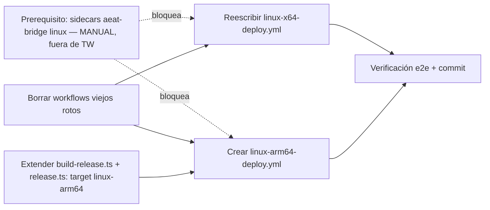

# Plan: TR-12 — Rebuild CI pipelines (Linux x64 + ARM64) → publish al release-hub

## TL;DR

Dos hallazgos gobiernan este plan, uno pedido por el TR (auth CI→hub) y otro
**nuevo, no anticipado por el TR, y bloqueante**:

1. **Auth CI→hub**: se investigaron las 3 opciones con evidencia primaria contra
   `desktop-release-hub` (clonado local en
   `/Volumes/KODAK1TB/REPOS y PROYECTOS/nodejs-bun/desktop-release-hub`). La tabla
   `api_keys` existe en el schema Drizzle pero **cero código de aplicación la usa**
   — `adminGuard` (`apps/server/src/lib/auth-guard.ts:29`) solo chequea
   `ctx.isAuthenticated` (sesión OIDC), ningún route lee `apiKeys`, no existe
   endpoint de issuance. Opción 1 es una feature real (~endpoint de issuance +
   middleware de hash + branch nuevo en `release.ts`), no una activación de algo
   medio-hecho — **se recomienda opción 3 para este TR y opción 1 como TR/ticket
   separado** (seed al final de este doc, §Opción 1 diferida).
2. **GAP NUEVO — sidecar AEAT ausente para Linux**: `tauri.conf.json:41-42`
   declara `externalBin: ["sidecars/aeat-bridge"]` **incondicional**. Solo existe
   `src-tauri/sidecars/aeat-bridge-aarch64-apple-darwin` (committed en git, 62MB).
   No hay build de `linux-x64` ni `linux-arm64` — ni local, ni en git, ni
   generable en CI (el repo fuente `tpv-soap-aeat` es **privado** y no está
   clonado en esta máquina en ninguna de las 2 rutas que `build-aeat-sidecar.ts`
   espera). **Sin resolver esto, `tauri build --target <linux-triple>` falla en
   CI determinísticamente** al resolver el sidecar — el Acceptance del TR
   ("workflows compilan verde") es inalcanzable hasta cerrar este gap. Es
   **prerequisito bloqueante fuera del scope del executor automatizado** (ver
   §Prerequisito antes de M3/M4).

Runners ARM64 hospedados por GitHub **sí existen y son gratis en repos
públicos** (`tpv-el-haido2` es público, confirmado `gh repo view`) —
label `ubuntu-24.04-arm`, sin self-hosted, sin RPi real necesaria para el build.
Deps de sistema Ubuntu 24.04 confirmadas contra doc oficial de Tauri v2
(`libayatana-appindicator3-dev`, no `libappindicator3-dev`). Los secrets
`TAURI_SIGNING_PRIVATE_KEY`/`_PASSWORD` ya existen en el repo (seteados
2026-01-27) — se reusan, pero su vigencia real contra la key actual
(`tauri-keys/tpv-el-haido.key`, pubkey confirmada
`RWTSIzayxELfO5VU3bpUnjiycxqhvdT3C95KUqkXKhogRtLKwuXgLZgt`) **no está
verificada** — M5 lo valida con evidencia (`minisign -Vm`), no lo asume.

## Prerequisito antes de M3/M4 (bloqueante, NO automatizable por el executor)

**Acción manual de waxin, fuera de las milestones de TW** — el `task-executor`
que corra este plan corre en un sandbox sin acceso al repo privado
`MKS2508/tpv-soap-aeat`, así que no puede resolver esto por su cuenta.

1. Clonar/localizar `tpv-soap-aeat` en `../../tpv-soap-aeat` (sibling de
   `tpv-el-haido2`) o `/Users/mks/tpv-soap-aeat` (rutas que
   `scripts/build-aeat-sidecar.ts:26-29` ya busca).
2. Cross-compilar los 2 binarios que faltan (Bun soporta cross-compile de
   `--compile` sin necesitar el OS destino — se puede correr esto en macOS):
   ```bash
   cd "/Volumes/KODAK1TB/REPOS y PROYECTOS/tauri/tpv-el-haido2"
   bun run scripts/build-aeat-sidecar.ts --target linux-x64
   bun run scripts/build-aeat-sidecar.ts --target linux-arm64
   ```
   Produce `src-tauri/sidecars/aeat-bridge-x86_64-unknown-linux-gnu` y
   `aeat-bridge-aarch64-unknown-linux-gnu` (mismo patrón que el binario darwin
   ya committed).
3. Commitear ambos binarios (mismo patrón que el darwin-aarch64 existente —
   **NO** están en la excepción de `.gitignore:49,53`, que solo excluye el
   `.exe` de Windows, así que `git add` los trackea sin flags extra).
4. Solo entonces desbloquear M3/M4.

**Alternativas descartadas** (documentadas, no ejecutadas en este TR):
- Clonar `tpv-soap-aeat` dentro de CI vía deploy-key/PAT secret nuevo y
  cross-compilar ahí mismo — más "correcto" a largo plazo (no depende de
  binarios committed que quedan stale), pero requiere provisionar un secret
  nuevo con acceso a un repo privado ajeno desde un repo público — mayor
  blast radius y fuera de lo que el TR pidió. Si se quiere esto, es su propio
  TR.
- Hacer `externalBin` condicional por plataforma (`tauri.linux.conf.json` sin
  el sidecar) — cambia comportamiento de producción (Linux/RPi perderían
  AEAT), no hay evidencia de que sea aceptable, no es una decisión de CI/CD.

## DAG de milestones



M1 y M2 tocan archivos disjuntos (workflows vs scripts) — paralelizables entre
sí. M3 no depende de M2 (linux-x64 ya existe en ambos scripts, confirmado). M4
sí depende de M2 (necesita el target `linux-arm64` recién añadido).

## Contexto verificado

### Workflows viejos — contenido real confirmado (no solo lo que dice el TR)

- `.github/workflows/linux-x64-deploy.yml` (202 líneas, leído completo):
  `FROM rust:1.83-bookworm` no está aquí (eso es del `Dockerfile` raíz, job
  `build-docker` separado) — el job principal `build-linux-x64` usa
  `dtolnay/rust-toolchain@stable` (correcto) pero `npm ci` + `setup-node@v4`
  (línea 43-50, no Bun), y publica con `softprops/action-gh-release@v1`
  (línea 127) + genera `latest-x64.json` apuntando a
  `github.com/${{ github.repository }}/releases/download/...` (línea 104) —
  exactamente lo prohibido por r1-D1.
- `.github/workflows/rpi-deploy.yml` (204 líneas, leído completo): `runs-on:
  ubuntu-latest-arm64` (línea 16, no existe/no registrado), `actions-rs/toolchain@v1`
  (línea 32, deprecada), `npm ci` con Node 18 (línea 41), también
  `softprops/action-gh-release@v1` (línea 169) + `latest.json` a github.com
  (línea 157).
- `Dockerfile` (raíz) es usado SOLO por el job `build-docker` de
  `linux-x64-deploy.yml` (grep confirma cero otras referencias fuera de
  `.github/` y una mención no funcional en `roadmap.spec.yml`) — al borrar el
  workflow, el `Dockerfile` queda huérfano. **No se borra en este TR** (el TR
  no lo pide en Acceptance, cambio quirúrgico) — ver Prohibiciones.

### `scripts/release.ts` — flujo real de auth (D12, PKCE loopback)

- `OIDC_ISSUER_URL = 'https://auth-provider.mks2508.systems'`, cliente público
  PKCE `70e7daf3-f393-4db9-b9e7-05e8775d7f6c`, callback
  `http://127.0.0.1:54321/callback` (release.ts:50-59) — requiere navegador +
  usuario interactivo, confirmado no-viable en runner headless.
- `readTokenCache()`/`writeTokenCache()` (release.ts:248-287) persisten
  `~/.config/release-hub/token.json` (chmod 0600) con `access_token`,
  `id_token`, `refresh_token`, `expires_at`.
- **No hay modo no-interactivo documentado ni oculto** — grepeado el archivo
  completo (1263 líneas), `publish()` (línea 1040) solo soporta
  `loadValidToken()` (PKCE cache + refresh) o `--dry-run` con token cacheado
  existente. No hay flag `--token`/`--api-key`.
- `mapTargetToServer` (release.ts:131-143) y `ALL_RELEASE_TARGETS`
  (release.ts:71) YA incluyen `linux-x64` (`serverTarget: 'linux', serverArch:
  'x86_64'`) — confirmado que TR-07 ya ejecutó esa adición. `linux-arm64` NO
  existe en ninguno de los dos mapas — falta añadirlo (M2).

### `desktop-release-hub` — estado real de auth (evidencia primaria, repo clonado)

Repo local: `/Volumes/KODAK1TB/REPOS y PROYECTOS/nodejs-bun/desktop-release-hub`
(HEAD `46e6c48`, commits hasta 0.4.1.C).

- `packages/shared/src/schema.ts:106-119` — tabla `apiKeys` (`hash`, `name`,
  `scopes text[]`, `projectId`) con comentario explícito: *"reserved for
  post-prod CI/CD key-based auth. Currently deferred (0.4.1.D-postprod)"*.
  Migración aplicada (tabla existe en Postgres), pero:
  - `apps/server/src/lib/auth-guard.ts:29-37` (`adminGuard`) solo lee
    `ctx.isAuthenticated` — **cero rama de código que lea `apiKeys`**.
  - `apps/server/src/routes/admin/releases.ts` (POST/GET/DELETE releases, las
    3 rutas admin) usan `{ beforeHandle: adminGuard }` — mismo guard único,
    mismo gap.
  - Grep de `api_keys|apiKeys|ApiKey` en `apps/server/src` + `packages/shared/src`:
    **solo** matchea el `schema.ts` (definición) — cero consumidores.
  - No existe endpoint de issuance (`POST .../api-keys` no existe en
    `apps/server/src/routes/`).
- **Conclusión con evidencia**: opción 1 requiere diseñar + implementar (a)
  endpoint de issuance admin-autenticado, (b) middleware que distinga
  `Authorization: Bearer <apikey-crudo>` de un JWT OIDC y compare hash
  sha256, (c) scoping por `projectId`, (d) un branch de auth nuevo en
  `release.ts publish` (`--api-key`/env var). No es "activar algo que ya
  está" — es una feature nueva de ~mismo tamaño que 0.4.1.C. **Se propone como
  TR separado** (seed abajo).

### Deps de sistema + runners ARM64 (verificado contra fuentes oficiales, agosto 2026)

- `ubuntu-latest` en GitHub Actions = **Ubuntu 24.04** (confirmado
  `actions/runner-images` README + `docs.github.com/.../github-hosted-runners-reference`).
- Deps oficiales Tauri v2 en Ubuntu 24.04
  (`v2.tauri.app/start/prerequisites/`): `libwebkit2gtk-4.1-dev`,
  `build-essential`, `curl`, `wget`, `file`, `libxdo-dev`, `libssl-dev`,
  `libayatana-appindicator3-dev`, `librsvg2-dev`. **`libxdo-dev` no estaba en
  el workflow viejo** — se añade. `libappindicator3-dev` (nombre v1) se
  descarta a favor de `libayatana-appindicator3-dev` (resuelve la duda del
  TR). `patchelf` se mantiene (necesario para el bundler AppImage, mismo
  hallazgo que TR-07 con pacman `patchelf`).
- **Runners ARM64 hospedados por GitHub existen y son gratis en repos
  públicos** — labels `ubuntu-24.04-arm` / `ubuntu-22.04-arm`, sin opt-in de
  org, hardware Cobalt 100 (Armv9-A). Fuentes:
  `github.blog/changelog/2025-01-16-linux-arm64-hosted-runners-now-available-for-free-in-public-repositories-public-preview/`
  + `docs.github.com/en/actions/reference/github-hosted-runners-reference`.
  `tpv-el-haido2` es público (`gh repo view` confirma `"visibility":"PUBLIC"`)
  — no aplica ninguna restricción. **No hace falta self-hosted runner en una
  RPi real** para compilar; el binario resultante corre en RPi igual
  (`aarch64-unknown-linux-gnu` es genérico, no específico de RPi).

### Signing keys — ya existen como secrets, vigencia sin verificar

- `gh secret list` confirma `TAURI_SIGNING_PRIVATE_KEY` +
  `TAURI_SIGNING_PRIVATE_KEY_PASSWORD` seteados **2026-01-27** — antes de que
  `scripts/build-release.ts` existiera (creado en `d65664e`, fase
  0.4.1.G-prep, muy posterior). Riesgo real de que el secret sea de un intento
  anterior/distinto (el propio `~/.tauri/` local tiene 5 variantes
  `.key`/`.key.clean`/`.key.pub.fixed`/`.pem` fechadas 29-ene, evidencia de
  fricción pasada con el formato — ver memoria de proyecto
  `project-release-tooling-conventions.md`).
- Pubkey embebida real: `tauri.conf.json:60` decodifica a
  `RWTSIzayxELfO5VU3bpUnjiycxqhvdT3C95KUqkXKhogRtLKwuXgLZgt`, y coincide
  exacto con `tauri-keys/tpv-el-haido.key.pub` local (confirmado byte a
  byte). Esa es la key "correcta" — el secret de GH puede o no coincidir. **No
  se puede leer el valor de un secret de GH** — M5 lo valida indirectamente
  verificando la firma real producida contra esa pubkey.
- **`scripts/release.ts`** (`readTokenCache`) cachea también `refresh_token`
  — si se hubiera considerado la opción 2 (token PKCE como GH Secret), ese
  refresh_token puede rotar en cada refresh silencioso
  (`refreshAccessToken`, release.ts:398-451) dejando el secret estático
  stale tras el primer uso — kill-argument mecánico adicional al filosófico
  de D12 para descartar la opción 2.

### Bug real encontrado en `build-release.ts` (flag correctamente, NO se arregla en este TR)

- `resolveArtifacts` (`build-release.ts:801-856`) exige el archivo `.sig`
  **incondicionalmente** (`SIG_NOT_FOUND` si falta), sin importar `noSign`.
- `buildTarget` (`build-release.ts:1102-1150`) llama `runTauriBuild` (línea
  1121) y luego `resolveArtifacts(target)` (línea 1127) sin ninguna
  bifurcación por `noSign`.
- Consecuencia: `--no-sign` **solo funciona si ya hay una key inyectada por
  fuera** (el propio help lo dice: *"Tauri will use env vars if already
  set"*) — con cero keys en absoluto, `--no-sign` rompe con `SIG_NOT_FOUND`,
  no produce un build sin firmar como cabría esperar del nombre del flag.
- **Mitigación de este plan**: los workflows nuevos firman SIEMPRE (push a
  main Y tags) — nunca se usa `--no-sign`, así se evita pisar este bug. Queda
  documentado como deuda técnica, no se toca el bug en este TR (fuera de
  scope quirúrgico).

## M1 — Borrar workflows viejos rotos

### Cambios

- `.github/workflows/linux-x64-deploy.yml` — **delete** (contenido roto
  confirmado arriba).
- `.github/workflows/rpi-deploy.yml` — **delete** (contenido roto confirmado
  arriba).

## M2 — Extender `scripts/build-release.ts` + `scripts/release.ts` con target `linux-arm64`

Mismo patrón exacto que TR-07 usó para añadir `linux-x64` (ya ejecutado y
presente en el código actual — se replica para `linux-arm64`).

### Interfaces

```diff-signatures
- export type ReleaseTarget = 'macos-arm64' | 'macos-x64' | 'windows-x64' | 'linux-x64';
+ export type ReleaseTarget = 'macos-arm64' | 'macos-x64' | 'windows-x64' | 'linux-x64' | 'linux-arm64';
```
(`scripts/build-release.ts:56`)

```diff-signatures
- const ALL_RELEASE_TARGETS = ['macos-arm64', 'macos-x64', 'windows-x64', 'linux-x64'] as const;
+ const ALL_RELEASE_TARGETS = ['macos-arm64', 'macos-x64', 'windows-x64', 'linux-x64', 'linux-arm64'] as const;
```
(`scripts/release.ts:71`)

### Cambios

- `scripts/build-release.ts:56` — añadir `'linux-arm64'` al union type.
- `scripts/build-release.ts:190` (justo antes del `} as const;` que cierra
  `BUILD_TARGETS`, después de la entrada `linux-x64`) — añadir:
  ```typescript
  'linux-arm64': {
    label: 'linux-arm64',
    triple: 'aarch64-unknown-linux-gnu',
    bundleSubdir: 'appimage',
    // Misma hipótesis sin confirmar que linux-x64 (ver comentario arriba,
    // build-release.ts:180-185) — mismo artifactExt hasta que un build real
    // en runner ubuntu-24.04-arm lo confirme (M4/M5 lo verifican).
    artifactExt: '.AppImage',
    updaterPlatformKey: 'linux-aarch64',
    installerSubdir: 'appimage',
    installerExt: '.AppImage',
  },
  ```
- `scripts/build-release.ts:214` — añadir `'linux-arm64'` a `ALL_TARGETS`.
- `scripts/build-release.ts:273` (help text, lista de Targets) — añadir línea
  `linux-arm64  Linux ARM64 / RPi (aarch64-unknown-linux-gnu)`.
- `scripts/build-release.ts:768-779` (`validateTargetForCurrentPlatform`) —
  añadir guard mirror para `linux-arm64`:
  ```typescript
  if (target.label === 'linux-arm64' && !isLinux) {
    return err(
      resultError(
        'CROSS_COMPILE_NOT_SUPPORTED',
        `Target "${target.label}" (${target.triple}) requires running on a Linux ARM64 host (e.g. GitHub Actions ubuntu-24.04-arm runner).`,
      ),
    );
  }
  ```
- `scripts/release.ts:71` — añadir `'linux-arm64'` a `ALL_RELEASE_TARGETS`.
- `scripts/release.ts:136` (`mapTargetToServer` tabla) — añadir:
  `'linux-arm64': { serverTarget: 'linux', serverArch: 'aarch64' },`
- `scripts/release.ts:165` (help text `--target`) — añadir `linux-arm64` a la
  lista.
- `scripts/release.ts:828` (`discoverArtifacts` mapa de extensiones) —
  añadir: `'linux-arm64': '.AppImage',` (debe coincidir con `artifactExt` de
  `BUILD_TARGETS['linux-arm64']` en `build-release.ts` — mismo footgun
  documentado en memoria de proyecto, ambos mapas están desacoplados a
  propósito, no se unifican en este TR).

### Verify

```bash
bun run scripts/build-release.ts --help | grep linux-arm64   # 1 línea
bun run scripts/release.ts --help | grep linux-arm64          # 1 línea
```

## M3 — Reescribir `.github/workflows/linux-x64-deploy.yml`

Requiere prerequisito (§Prerequisito) resuelto — el sidecar
`aeat-bridge-x86_64-unknown-linux-gnu` debe existir committed antes de correr
este workflow.

### Cambios

- `.github/workflows/linux-x64-deploy.yml` — **new content** (reemplaza el
  archivo borrado en M1):

```yaml
name: 🐧 Linux x64 Build

on:
  push:
    branches: [main]
    tags: ['v*']
  workflow_dispatch:

env:
  CARGO_TERM_COLOR: always
  APPIMAGE_EXTRACT_AND_RUN: '1'

jobs:
  build-linux-x64:
    name: Build Linux x64
    runs-on: ubuntu-latest
    steps:
      - name: Checkout
        uses: actions/checkout@v7

      - name: Install system dependencies
        run: |
          sudo apt-get update
          sudo apt-get install -y \
            libwebkit2gtk-4.1-dev \
            build-essential \
            curl \
            wget \
            file \
            libxdo-dev \
            libssl-dev \
            libayatana-appindicator3-dev \
            librsvg2-dev \
            patchelf \
            minisign

      - name: Install Rust toolchain
        uses: dtolnay/rust-toolchain@stable

      - name: Cache Rust dependencies
        uses: Swatinem/rust-cache@v2.9.2
        with:
          workspaces: src-tauri

      - name: Setup Bun
        uses: oven-sh/setup-bun@v2
        with:
          bun-version: latest

      - name: Install dependencies
        run: bun install --frozen-lockfile

      - name: Build + sign (linux-x64)
        env:
          TAURI_SIGNING_PRIVATE_KEY: ${{ secrets.TAURI_SIGNING_PRIVATE_KEY }}
          TAURI_SIGNING_PRIVATE_KEY_PASSWORD: ${{ secrets.TAURI_SIGNING_PRIVATE_KEY_PASSWORD }}
        run: bun run scripts/build-release.ts --target linux-x64

      - name: List bundle output (confirma artifactExt real)
        run: find src-tauri/target/x86_64-unknown-linux-gnu/release/bundle -maxdepth 2 -type f

      - name: Verify signature against embedded pubkey
        run: |
          ARTIFACT=$(find releases -path "*/linux-x64/*" -name "*.AppImage" -not -name "*.sig" | head -1)
          if [ -z "$ARTIFACT" ]; then echo "::error::No .AppImage artifact found under releases/"; exit 1; fi
          base64 -d "${ARTIFACT}.sig" > /tmp/artifact.minisig
          minisign -Vm "$ARTIFACT" -x /tmp/artifact.minisig \
            -P RWTSIzayxELfO5VU3bpUnjiycxqhvdT3C95KUqkXKhogRtLKwuXgLZgt

      - name: Upload release artifact
        if: startsWith(github.ref, 'refs/tags/')
        uses: actions/upload-artifact@v7
        with:
          name: linux-x64-release
          path: releases/*/linux-x64/**
          if-no-files-found: error
          retention-days: 30

      - name: Publish instructions (manual interim — TR-12 opción 3)
        if: startsWith(github.ref, 'refs/tags/')
        run: |
          {
            echo "## Publish al release-hub (manual, interim — TR-12 opción 3)"
            echo ""
            echo "1. Descargar el artifact \`linux-x64-release\` de este run."
            echo "2. Colocarlo en \`releases/<version>/linux-x64/\` en tu checkout local."
            echo "3. \`bun run scripts/release.ts auth login\` (si no hay sesión activa)."
            echo "4. \`bun run scripts/release.ts publish --target linux-x64 --slug haido --skip-build\`"
          } >> "$GITHUB_STEP_SUMMARY"
```

Nota de diseño (evita el bug de M-Contexto): se firma SIEMPRE (push y tag), no
se usa `--no-sign` en ningún branch — sortea el bug de `resolveArtifacts`
exigiendo `.sig` incondicionalmente. El paso de verificación de firma corre en
TODO push a `main`, no solo en tags — así el primer push ya expone si el
secret de enero está stale, sin esperar a un tag real.

### Verify

- Push a `main` (o `workflow_dispatch`) → job verde, step "Verify signature"
  pasa.
- `grep -c "softprops/action-gh-release\|releases/download\|actions-rs/toolchain" .github/workflows/linux-x64-deploy.yml` → `0`.

## M4 — Crear `.github/workflows/linux-arm64-deploy.yml`

Reemplaza `rpi-deploy.yml` (nombre nuevo — ya no es específico de una RPi
física, corre en runner ARM64 hospedado por GitHub; el binario resultante SÍ
corre en RPi, pero no se compila ahí). Requiere M2 (target `linux-arm64` en
los scripts) y el prerequisito del sidecar ARM64.

### Cambios

- `.github/workflows/linux-arm64-deploy.yml` — **new**:

```yaml
name: 🐧 Linux ARM64 Build

on:
  push:
    branches: [main]
    tags: ['v*']
  workflow_dispatch:

env:
  CARGO_TERM_COLOR: always
  APPIMAGE_EXTRACT_AND_RUN: '1'

jobs:
  build-linux-arm64:
    name: Build Linux ARM64
    runs-on: ubuntu-24.04-arm
    steps:
      - name: Checkout
        uses: actions/checkout@v7

      - name: Install system dependencies
        run: |
          sudo apt-get update
          sudo apt-get install -y \
            libwebkit2gtk-4.1-dev \
            build-essential \
            curl \
            wget \
            file \
            libxdo-dev \
            libssl-dev \
            libayatana-appindicator3-dev \
            librsvg2-dev \
            patchelf \
            minisign

      - name: Install Rust toolchain
        uses: dtolnay/rust-toolchain@stable

      - name: Cache Rust dependencies
        uses: Swatinem/rust-cache@v2.9.2
        with:
          workspaces: src-tauri

      - name: Setup Bun
        uses: oven-sh/setup-bun@v2
        with:
          bun-version: latest

      - name: Install dependencies
        run: bun install --frozen-lockfile

      - name: Build + sign (linux-arm64)
        env:
          TAURI_SIGNING_PRIVATE_KEY: ${{ secrets.TAURI_SIGNING_PRIVATE_KEY }}
          TAURI_SIGNING_PRIVATE_KEY_PASSWORD: ${{ secrets.TAURI_SIGNING_PRIVATE_KEY_PASSWORD }}
        run: bun run scripts/build-release.ts --target linux-arm64

      - name: List bundle output (confirma artifactExt real)
        run: find src-tauri/target/aarch64-unknown-linux-gnu/release/bundle -maxdepth 2 -type f

      - name: Verify signature against embedded pubkey
        run: |
          ARTIFACT=$(find releases -path "*/linux-arm64/*" -name "*.AppImage" -not -name "*.sig" | head -1)
          if [ -z "$ARTIFACT" ]; then echo "::error::No .AppImage artifact found under releases/"; exit 1; fi
          base64 -d "${ARTIFACT}.sig" > /tmp/artifact.minisig
          minisign -Vm "$ARTIFACT" -x /tmp/artifact.minisig \
            -P RWTSIzayxELfO5VU3bpUnjiycxqhvdT3C95KUqkXKhogRtLKwuXgLZgt

      - name: Upload release artifact
        if: startsWith(github.ref, 'refs/tags/')
        uses: actions/upload-artifact@v7
        with:
          name: linux-arm64-release
          path: releases/*/linux-arm64/**
          if-no-files-found: error
          retention-days: 30

      - name: Publish instructions (manual interim — TR-12 opción 3)
        if: startsWith(github.ref, 'refs/tags/')
        run: |
          {
            echo "## Publish al release-hub (manual, interim — TR-12 opción 3)"
            echo ""
            echo "1. Descargar el artifact \`linux-arm64-release\` de este run."
            echo "2. Colocarlo en \`releases/<version>/linux-arm64/\` en tu checkout local."
            echo "3. \`bun run scripts/release.ts auth login\` (si no hay sesión activa)."
            echo "4. \`bun run scripts/release.ts publish --target linux-arm64 --slug haido --skip-build\`"
          } >> "$GITHUB_STEP_SUMMARY"
```

### Verify

- Push a `main` (o `workflow_dispatch`) → job verde en runner
  `ubuntu-24.04-arm`, step "Verify signature" pasa.
- `grep -c "ubuntu-latest-arm64\|actions-rs/toolchain" .github/workflows/linux-arm64-deploy.yml` → `0`.

## M5 — Verificación e2e + commit

**role: canonical**

### Pasos

1. Confirmar prerequisito cerrado: `git log --oneline -- src-tauri/sidecars/ | head -5`
   debe mostrar el commit que añadió los binarios linux-x64/linux-arm64.
2. Push a `main` (o `gh workflow run` manual) → `gh run watch` en ambos
   workflows nuevos, confirmar verde.
3. Grep de prohibiciones sobre AMBOS workflows nuevos:
   ```bash
   grep -rn "softprops/action-gh-release\|releases/download\|actions-rs/toolchain\|ubuntu-latest-arm64\|npm ci" \
     .github/workflows/linux-x64-deploy.yml .github/workflows/linux-arm64-deploy.yml
   # ESPERADO: sin matches
   ```
4. **Opcional pero recomendado** (cierra los 4 riesgos que solo se ejercitan
   con un tag — ver Riesgos R1-R2): crear un tag descartable
   `v0.0.0-ci-test`, push, esperar el run de ambos workflows con
   `startsWith(github.ref, 'refs/tags/')` en true, confirmar que
   `upload-artifact` sube contenido real (`if-no-files-found: error` ya lo
   garantiza) y que el step summary imprime las instrucciones de publish
   correctamente. Borrar el tag después (`git push origin :refs/tags/v0.0.0-ci-test`
   + `git tag -d v0.0.0-ci-test`). Si waxin prefiere no gastar el ciclo de CI
   ahora, es una decisión válida — pero entonces esos 4 riesgos se difieren
   explícitamente a la primera release real (no un default silencioso).
5. Commit único con todos los cambios de M1-M4 (M0/prerequisito ya se
   commiteó aparte, fuera de este commit, en el paso previo).

### Commit sugerido

```
feat-phase(unscoped): rebuild CI pipelines for Linux x64 + ARM64 [#TR-12]

- Delete broken linux-x64-deploy.yml + rpi-deploy.yml (rust 1.83-bookworm
  edition2024 failure, ubuntu-latest-arm64 nonexistent runner, npm ci,
  actions-rs/toolchain deprecated, GitHub Releases publish against r1-D1)
- scripts/build-release.ts + scripts/release.ts: add 'linux-arm64' target
  (mirrors TR-07's linux-x64 addition)
- New .github/workflows/linux-x64-deploy.yml: ubuntu-latest, Bun + dtolnay
  rust-toolchain, always-signed build via build-release.ts, upload as GH
  Actions artifact on tags (no GitHub Releases), interim manual publish
  instructions via GITHUB_STEP_SUMMARY
- New .github/workflows/linux-arm64-deploy.yml: ubuntu-24.04-arm hosted
  runner (no self-hosted RPi needed), same pattern
```

### Verify

- `bun run scripts/build-release.ts --help` y `bun run scripts/release.ts --help`
  ambos listan `linux-arm64`.
- Ambos workflows verdes en el último run de `main`.
- Cero matches del grep de prohibiciones (paso 3).

## Files

```files-tree
.github/workflows/
  linux-x64-deploy.yml       [edit]  # rewrite completo
  rpi-deploy.yml              [delete]
  linux-arm64-deploy.yml      [new]
scripts/
  build-release.ts             [edit]  # +target linux-arm64
  release.ts                   [edit]  # +target linux-arm64
src-tauri/sidecars/
  aeat-bridge-x86_64-unknown-linux-gnu   [new — PREREQUISITO, fuera de M1-M5]
  aeat-bridge-aarch64-unknown-linux-gnu  [new — PREREQUISITO, fuera de M1-M5]
```

## Milestones (claude tasks)

Una `TaskCreate` por milestone. El executor las crea todas upfront con
metadata + `addBlockedBy`, luego itera `TaskUpdate(in_progress|completed)` en
orden topológico. El Prerequisito (sidecars AEAT) NO es una milestone de esta
tabla — es una acción manual de waxin fuera del executor automatizado; M3 y M4
deben tratarse como bloqueadas hasta que esté confirmado (ver Riesgos R-critico).

| # | Subject | Estimate | addBlockedBy | role |
|---|---|---|---|---|
| M1 | Borrar workflows viejos rotos (linux-x64-deploy.yml, rpi-deploy.yml) | 10m | — | — |
| M2 | Extender build-release.ts + release.ts con target linux-arm64 | 30m | — | — |
| M3 | Reescribir linux-x64-deploy.yml (build ubuntu-latest, always-sign, artifact GH) | 45m | M1 | — |
| M4 | Crear linux-arm64-deploy.yml (build ubuntu-24.04-arm, always-sign, artifact GH) | 45m | M1, M2 | — |
| M5 | Verificación e2e (push real + grep prohibiciones) + commit | 30m | M1, M2, M3, M4 | **canonical** |

**Metadata común a todas las milestones**:
- `roadmapItemId: "TR-12"`
- `phase: "unscoped"` (sin fase numerada todavía — mismo criterio que TR-07/TR-11)
- `tags: ["TR-12", "milestone:M<n>", "phase:unscoped", "category:refactor"]`

**Metadata específica de la canonical (M5)**:
- `role: "canonical"`

## Riesgos / blockers

| # | Riesgo | Mitigación |
|---|---|---|
| **R-crítico** | Sidecar AEAT ausente para linux-x64/linux-arm64 (`tauri.conf.json:41-42` `externalBin` incondicional) — sin resolver, CUALQUIER `tauri build` para Linux falla en CI determinísticamente | Prerequisito bloqueante documentado arriba, M3/M4 explícitamente gated a que esté cerrado |
| R1 | Secret `TAURI_SIGNING_PRIVATE_KEY` (seteado 2026-01-27, antes de que `build-release.ts` existiera) puede no coincidir con la key real project-pinned (`tauri-keys/tpv-el-haido.key`, pubkey confirmada) | M3/M4 step "Verify signature" corre en TODO push a main — falla rápido y visible, no silencioso |
| R2 | `artifactExt: '.AppImage'` es hipótesis sin confirmar con un build real (comentario `build-release.ts:180-185`) | Step "List bundle output" en M3/M4 + `resolveArtifacts`/`discoverArtifacts` fallan con error explícito (`ARTIFACT_NOT_FOUND`) si la extensión real difiere — no falla silencioso |
| R3 | Bug real: `resolveArtifacts` (build-release.ts:801-856) exige `.sig` incondicional, `--no-sign` real (sin ninguna key) rompe con `SIG_NOT_FOUND` | Este plan firma SIEMPRE (push y tag) — nunca usa `--no-sign`, sortea el bug. Deuda flagged, no se arregla aquí |
| R4 | FUSE no disponible en runners GH Actions → bundler AppImage (linuxdeploy/appimagetool) falla al montar | `APPIMAGE_EXTRACT_AND_RUN: '1'` a nivel de `env:` del job en ambos workflows — evita depender de `libfuse2t64` (nombre apt en Ubuntu 24.04 noble, no `libfuse2` ni `fuse2` que son nombres Arch/viejos) |
| R5 | PRs de forks en repo público no reciben `secrets.*` → cualquier trigger `pull_request` con always-sign rompería en todo PR externo | Ningún workflow nuevo tiene trigger `pull_request` (ver Prohibiciones) |
| R6 | `ubuntu-24.04-arm` podría no traer toolchain nativo aarch64 detectado correctamente por `dtolnay/rust-toolchain@stable` | Bajo riesgo (acción estándar, detecta host arch automáticamente) — si falla, M4 lo expone en el primer run, no local |
| R7 | Remediación si R1 confirma secret stale: requiere re-setear ambos secrets desde los archivos/BW reales, con cuidado de no re-quotear la passphrase (contiene `"` + U+00B7, ya rompió un build antes — ver memoria `project-release-tooling-conventions.md`) | Comando exacto sin capas de quoting: `gh secret set TAURI_SIGNING_PRIVATE_KEY < "tauri-keys/tpv-el-haido.key"` (redirect de archivo, no variable de shell) y para la passphrase, extraer de BW con `jq` y pipear directo a `gh secret set` sin variable intermedia — este paso es manual de waxin, NO parte de las milestones automatizadas |

## Prohibiciones

- **NO** implementar la opción 1 de auth (API key en `desktop-release-hub`)
  en este TR — es scope de un TR separado (seed abajo).
- **NO** tocar `desktop-release-hub` (repo externo) en absoluto en este TR.
- **NO** añadir trigger `pull_request` a ningún workflow nuevo (R5).
- **NO** arreglar el bug de `resolveArtifacts`/`.sig` incondicional en
  `build-release.ts` — flagged como deuda, fuera de scope quirúrgico de este TR.
- **NO** borrar `Dockerfile`/`Dockerfile.pwa` (raíz) — quedan huérfanos del
  job `build-docker` eliminado, pero el TR no pide borrarlos en Acceptance.
- **NO** regenerar la minisign key bajo ninguna circunstancia.
- **NO** tocar `roadmap.spec.yml` ni `docs/progress-log.md` — doc sync
  diferido, mismo patrón que el resto de la sesión.
- **NO** unificar los mapas de extensión duplicados entre `build-release.ts`
  y `release.ts` (footgun conocido, documentado, no forzar el refactor sin
  que el TR lo pida).

## Opción 1 diferida — seed para TR futuro (API key auth en desktop-release-hub)

No se crea el archivo de TR aquí (fuera del contrato de este decomposer — un
solo `.plan.md` por invocación). Contenido mínimo para que quien lo formalice
no arranque de cero:

- **Qué falta** (evidencia arriba, §Contexto verificado):
  1. Endpoint de issuance `POST /api/admin/projects/:slug/api-keys`
     (admin-autenticado vía sesión OIDC existente — bootstrap: solo un admin
     ya logueado puede crear la primera key) que genera key cruda + guarda
     `sha256(key)` en `apiKeys.hash`.
  2. Middleware/guard nuevo (paralelo a `adminGuard`) que acepte
     `Authorization: Bearer <apikey-cruda>`, la hashee, la busque en
     `apiKeys` por `hash`, valide `scopes` y `projectId` contra el `:slug` de
     la ruta, actualice `lastUsedAt`.
  3. Branch nuevo en `scripts/release.ts` `publish()`: si existe
     `RELEASE_HUB_API_KEY` env var, usar esa como `Authorization: Bearer`
     directo, saltando `loadValidToken()`/PKCE por completo — así el mismo
     script sirve para humano (PKCE) y CI (API key) sin duplicar código de
     upload.
  4. UX de revocación/rotación (mínimo: `DELETE /api-keys/:id`).
- **Por qué es su propio TR**: toca 2 repos (`desktop-release-hub` +
  `tpv-el-haido2`), añade superficie de auth nueva con implicaciones de
  seguridad (credencial long-lived aunque scoped), y el tamaño es comparable
  a 0.4.1.C completo (que fue su propia fase).

## Verificación

```bash
# Scripts extendidos
bun run scripts/build-release.ts --help | grep linux-arm64
bun run scripts/release.ts --help | grep linux-arm64

# Workflows viejos ausentes
test ! -f .github/workflows/rpi-deploy.yml && echo OK-deleted-rpi
git log -1 --format=%H -- .github/workflows/linux-x64-deploy.yml   # debe ser el commit de M5, no el histórico roto

# Prohibiciones (acceptance criteria del TR)
grep -rn "softprops/action-gh-release\|releases/download\|actions-rs/toolchain\|ubuntu-latest-arm64" \
  .github/workflows/linux-x64-deploy.yml .github/workflows/linux-arm64-deploy.yml
# ESPERADO: sin output

# CI real
gh run list --workflow=linux-x64-deploy.yml --limit 3
gh run list --workflow=linux-arm64-deploy.yml --limit 3
# ESPERADO: último run de cada uno = conclusion "success"
```

## Git context

- Rama sugerida: `main`
  (este repo no usa feature branches — confirmado en `git log` y en planes
  previos TR-02/TR-03/TR-07/TR-11, todos con `suggestedBranch: main`)
- Commit prefix: `feat-phase(unscoped)` (TR-12 no tiene `phase` numerada
  todavía — "candidato 0.4.2/0.6.0, decidir post-ejecución", mismo criterio
  que TR-07/TR-11 — no se inventa un número de fase)
- Tag para hook: `[#TR-12]` — incluir en TODOS los commits de este task para
  que el hook `post-tool-use-bash` linkee el commit a la UDA `gitcommit`
- Estrategia: `single` (un commit al final, M5 canonical). El commit del
  prerequisito de sidecars AEAT (fuera de las milestones de TW) puede ir
  separado, antes, con el mismo tag `[#TR-12]` si se quiere trazabilidad, o
  sin tag si se considera infraestructura previa — decisión de quien lo
  ejecute, no bloqueante.

> El hook `post-tool-use-bash` de `@mks-agentics/task-sync` lee el tag
> `[#TR-12]` del mensaje de commit y popula las UDAs `gitcommit` +
> `gitcommits` + `gitcommitscount` en TW (si dual mode activo en el repo). Si
> NO hay TW (FS only), el tag es noop — el commit sigue siendo válido.
