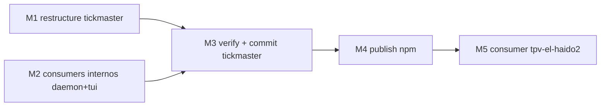

# Plan: TR-13 — Unificar tickmaster-core + tickmaster-sdk en `@mks2508/tickmaster`

## TL;DR

Plan cross-repo (2 repos git separados, sin `roadmapItemId` — TR-13 no lo declara, por eso
no hay sección `## Git context`, ver nota al final). En `/Users/mks/tickmaster`: mover
`packages/core/src` + `packages/sdk/src` a un nuevo workspace member `packages/tickmaster/`
(**NO el repo raíz** — corrección con evidencia empírica al snippet de la decisión r3, ver
Contexto verificado #1), publicar `@mks2508/tickmaster` a npm con exports `./core` + `./sdk`.
En `tpv-el-haido2`: bump de `package.json`, reescribir el import de
`thermal-printer.service.ts:8`, regenerar `bun.lock`, borrar symlinks huérfanos. **2 preguntas
abiertas bloquean el dispatch a partir de M3** (versión a publicar, y qué hacer con un diff sin
commitear en `packages/sdk` que ya encontré aplicado en el working tree) — ver "Preguntas
abiertas" antes de `status: ready`.

## DAG de milestones



M1 y M2 son disjuntos en archivos (M1 toca `packages/{core,sdk,tickmaster}`, M2 toca
`apps/daemon` + `tui`) — sin dependencia entre ellos, paralelizables. M2 solo necesita conocer
los paths nuevos (ya fijados en este plan), no que M1 haya corrido físicamente.

## Contexto verificado

**#1 — El snippet de r3 (root package.json como paquete publicable) no funciona en Bun,
verificado con spike aislado (scratchpad, revertido, no toca ningún repo real):**

```
$ cat package.json   # root, name=@scratch/root-pkg, workspaces=["apps/*"]
$ cat apps/child/package.json   # dependencies: {"@scratch/root-pkg":"workspace:*"}
$ bun install
error: Workspace dependency "@scratch/root-pkg" not found
error: @scratch/root-pkg@workspace:* failed to resolve
```

Probado también con `"."` explícito en el glob de `workspaces` — mismo error. Bun (v1.4.0)
**no permite que el propio root sea depended-upon vía `workspace:*`** por sus hijos. Control
test con `packages/tickmaster/` como member normal bajo `packages/*` (mismo `exports` map,
mismo import interno relativo sdk→core) — **resuelve limpio**, `bun install` linkea el
symlink, y `import { sdk } from '@mks2508/tickmaster/sdk'` desde el app hijo funciona end to
end (probado con `bun run`, valor real devuelto). Esto es load-bearing: `apps/daemon` depende
hoy de `@mks2508/tickmaster-core` como `workspace:*`, y `tui` de
`@mks2508/tickmaster-sdk` como `workspace:*` — si el paquete unificado vive en el root, esos
dos dejan de resolver en local dev. **Decisión de este plan: el paquete unificado vive en
`packages/tickmaster/`**, no en el root. El nombre (`@mks2508/tickmaster`), la versión y el
`exports` map (`./core`, `./sdk`) del lock de r3 quedan intactos — solo cambia el *dónde*.
Bonus: al no ser el root, `npm publish` empaqueta solo `packages/tickmaster/` por defecto, sin
arrastrar `tui/`, `apps/daemon/`, `asciis/`, `.claude/` del resto del monorepo (no hace falta
`files` para excluir eso, aunque igual se añade `files: ["src"]` como higiene mínima).

**#2 — Blast radius real de imports internos (grep completo, no solo el nombre del paquete):**

Import por **nombre de paquete** (`@mks2508/tickmaster-core` / `-sdk`):

| Repo | Ficheros | Detalle |
|---|---|---|
| `packages/sdk/src/*` | 6 | `errors.ts:2`, `client.ts:5`, `index.ts:20`, `resources/documents.resource.ts:5`, `resources/tickets.resource.ts:5`, `resources/printer.resource.ts:2` |
| `packages/sdk/test/*` | 3 | `errors.test.ts:2`, `resources.test.ts:5`, `helpers/in-process-gateway.ts:6` |
| `apps/daemon/src/*` | 6 | `config.ts:6`, `driver/printer.ts:2`, `driver/types.ts:1`, `driver/cache.ts:1`, `http/responses.ts:8`, `http/app.ts:12` |
| `apps/daemon/test/*` | 3 | `app.test.ts:11`, `fake-printer.ts:2`, `config.test.ts:2` |
| `tui/actions.ts` | 1 | línea 11 (import de `-sdk`, distinto del de core en línea 15 del mismo fichero) |

**Import por ruta relativa que salta el nombre del paquete** (bypass no detectado por el grep
de nombre — CLAUDE.md de tickmaster ya lo documentaba: *"El papel en vivo se renderiza local
con core... importado por ruta relativa porque no declara la dependencia"*):

| Fichero | Línea | Import actual |
|---|---|---|
| `tui/actions.ts` | 15 | `from '../packages/core/src/index.ts'` |
| `tui/paper.ts` | 3 | `from '../packages/core/src/index.ts'` |
| `tui/art.ts` | 3 | `from '../packages/core/src/index.ts'` |
| `tui/index.ts` | 19 | `from '../packages/core/src/index.ts'` |
| `tui/test/paper.test.ts` | 5 | `from '../../packages/core/src/index.ts'` |

`tui` no declara `@mks2508/tickmaster-core` como dependency hoy — estos 5 imports rompen sí o
sí con el move (la ruta relativa deja de existir), así que la corrección obligatoria es
redirigirlos al import de paquete correcto (`@mks2508/tickmaster/core`), lo que de paso arregla
la dependencia no declarada como efecto colateral del propio move (no es scope creep, es la
única forma correcta de arreglar una ruta que se rompe de todos modos).

**#3 — Imports internos DENTRO de core y DENTRO de sdk son 100% relativos y profundidad-estable**
(`../types/index.ts`, `./errors.ts`, etc.) — ninguno cruza la frontera del propio `src/`, así
que mover `packages/core/src` → `packages/tickmaster/src/core` intacto, y
`packages/sdk/src` → `packages/tickmaster/src/sdk` intacto, **no requiere tocar ni una línea
de import dentro de esos ficheros**. Verificado con grep exhaustivo de `from '\.\./'` y
`from '\./'` en ambos `src/`.

**#4 — Los `test/` SÍ cruzan la frontera** (`'../src/...'` desde `packages/core/test/*.test.ts`,
`'../../src/...'` desde `packages/sdk/test/{types,helpers}/*`, `'../../../apps/daemon/...'`
desde `packages/sdk/test/{resources,errors}.test.ts`). Regla mecánica de transformación al
mover `test/` un nivel más adentro (`packages/{core,sdk}/test/` → `packages/tickmaster/test/{core,sdk}/`):
**sumar un `../` extra y insertar `core/`/`sdk/` después de `src/`** en las rutas que apuntan a
`src/`; las rutas que ya salían del paquete hacia `apps/daemon/` (en `sdk/test/resources.test.ts`
y `sdk/test/errors.test.ts`) también suman un `../` extra. Ejemplos concretos (aplicar el mismo
patrón al resto, listado completo en M1):
- `packages/core/test/*.test.ts`: `'../src/document/index.ts'` → `'../../src/core/document/index.ts'`
- `packages/sdk/test/resources.test.ts`: `'../src/resources/documents.resource.ts'` →
  `'../../src/sdk/resources/documents.resource.ts'`; `'../../../apps/daemon/src/config.ts'` →
  `'../../../../apps/daemon/src/config.ts'`
- `packages/sdk/test/types/public-surface.test-d.ts`: `'../../src/index.ts'` →
  `'../../../src/sdk/index.ts'`

No hace falta listar las ~40 líneas una a una — la regla es mecánica y `tsc --noEmit` +
`vitest run` fallan inmediato en cualquier línea que se escape (feedback en segundos, riesgo
bajo de dejar algo roto en silencio).

**#5 — `check:declarations` (gate anti-leak, `packages/sdk/scripts/check-declarations.sh`):**
usa `cd "$(dirname "$0")/.."` + `tsc -p tsconfig.emit.json` para emitir `.d.ts` y grepear que
ninguno referencie `@tickmaster/daemon`/`tickmaster-daemon`. Mueve intacto a
`packages/tickmaster/scripts/`, sin cambios de contenido — la lógica relativa sigue siendo
válida tras el move. `tsconfig.emit.json` (`rootDir: "./src"`) ahora emite declarations para
`src/core` + `src/sdk` juntos bajo un único gate — correcto, es el mismo paquete publicado.

**#6 — No hay CI en tickmaster** (`find .github` vacío) ni `vitest.config`/`vite.config` en
todo el repo (`find` sin resultados) — `vitest run` desde la raíz descubre tests por convención
default (`**/*.{test,spec}.ts`, excluye `node_modules`), agnóstico de dónde vivan los ficheros.
No hay aliasing oculto que romper.

**#7 — Diff sin commit en `packages/sdk`, ya aplicado en el working tree** (confirmado con
`git status` + `git diff`, coincide exacto con lo que describe `HANDOFF.md` §4 "Avisos"):

```diff
--- packages/sdk/package.json
-    "@elysiajs/eden": "catalog:",
-    "@mks2508/tickmaster-core": "workspace:*",
-    "elysia": "catalog:"
+    "@elysiajs/eden": "1.4.9",
+    "@mks2508/tickmaster-core": "^0.3.0",
+    "elysia": "1.4.29"
   devDependencies:
-    "@tickmaster/daemon": "workspace:*",   # eliminada
```
```diff
--- packages/sdk/src/client.ts
-import type { TickmasterApp } from '@tickmaster/daemon/app'
-let cachedClient: Promise<ReturnType<typeof treaty<TickmasterApp>>> | null = null
+type LocalDaemonClient = { printer: { ... } }   // tipo estructural a mano, 5 rutas usadas
+let cachedClient: Promise<LocalDaemonClient> | null = null
+// treaty(baseUrl, {...}) as unknown as LocalDaemonClient
```

HANDOFF.md pide explícitamente **"preguntar a waxin de quién es antes de commitear o
revertir"** — no lo resuelvo por mi cuenta, va como pregunta abierta #2 más abajo, con mi
recomendación técnica adjunta.

**#8 — `CORE_VERSION`** (`packages/core/src/version.ts:11`, hoy `'0.3.0'`) se documenta a mano
"en sintonía con package.json" y se reporta en `/printer/info` (`apps/daemon/src/http/app.ts:204`).
Solo hay **una** aserción literal contra un string fijo: `packages/core/test/image.test.ts:186`
(`expect(CORE_VERSION).toBe('0.3.0')`) — las otras dos (`sdk/test/resources.test.ts:116`,
`daemon/test/app.test.ts:152`) comparan contra la constante importada, se autoajustan solas. No
encontré ninguna comparación automática de semver (ni `semver.gt` ni similar) contra este valor
en todo el repo — es puramente informativo para humanos vía el endpoint. Con todo, si se elige
`0.1.0`, el daemon pasaría a reportar `coreVersion: 0.1.0` mientras **la Pi desplegada hoy
reporta 0.2.1** (HANDOFF) — no rompe nada automatizado, pero es un downgrade óptico. Parte de
la pregunta abierta #1.

**#9 — Consumer `tpv-el-haido2`**: confirmado con grep — el único import real es
`src/services/thermal-printer.service.ts:8` (`ThermalPrinter.ts:1` es un comentario en prosa,
no import, no se toca). `package.json:64-65` tiene las 2 deps viejas. `bun.lock` tiene **cero
entradas tickmaster** (`grep tickmaster bun.lock` vacío) — coincide con el diagnóstico del TR:
CI falla en el 404 porque ni siquiera hay un lock previo que enmascare el problema.
`node_modules/@mks2508/tickmaster-{core,sdk}` son symlinks reales a
`/Users/mks/tickmaster/packages/{core,sdk}` (creados 2026-08-20 17:50, confirmado con `readlink`).

**#10 — Nombre libre en npm**: `npm view @mks2508/tickmaster versions` → `E404` (no existe, libre
para publicar). Auth ya configurado (`~/.npmrc` tiene `_authToken` para `registry.npmjs.org`,
mismo mecanismo que ya publica `@mks2508/no-throw`).

**#11 — Remoto git de `tickmaster`**: SÍ existe — `origin` → `https://github.com/MKS2508/tickmaster.git`
(confirmado con `git remote -v`). No hace falta crear repo nuevo en GitHub, contradice la
incertidumbre que el TR marcaba como "verificar al ejecutar". La rama local está **10 commits
por delante de `origin/master`** (sin push) — ver Riesgos.

## M1 — Restructure `tickmaster`: `packages/{core,sdk}` → `packages/tickmaster/`

### Interfaces

```diff-signatures
- import type { TickmasterApp } from '@tickmaster/daemon/app'
- let cachedClient: Promise<ReturnType<typeof treaty<TickmasterApp>>> | null
+ type LocalDaemonClient = { printer: { info: {...}, status: {...}, jobs: {...}, drawer: {...} } }
+ let cachedClient: Promise<LocalDaemonClient> | null
```

### Cambios

1. `mkdir -p packages/tickmaster/src packages/tickmaster/test`
2. `git mv packages/core/src packages/tickmaster/src/core`
3. `git mv packages/core/test packages/tickmaster/test/core`
4. `git mv packages/sdk/src packages/tickmaster/src/sdk`
5. `git mv packages/sdk/test packages/tickmaster/test/sdk`
6. `git mv packages/sdk/scripts packages/tickmaster/scripts`
7. **Absorber el diff sin commit de `packages/sdk`** (ya está en el working tree — es la
   versión de `client.ts` que hay que mover, NO el `HEAD` viejo con `treaty<TickmasterApp>`;
   un `git checkout --` accidental en `client.ts` antes del `git mv` revertiría el fix en
   silencio). El contenido de `client.ts` ya movido a `src/sdk/client.ts` es el que está en
   el working tree ahora mismo (con `LocalDaemonClient`), no hay que reescribirlo.
7bis. **Reescribir los imports de `sdk` hacia `core` — de nombre de paquete a ruta relativa**
   (decisión de este plan sobre el punto que r3 dejaba abierto: "relativos o
   self-referencing" — se elige **relativo**, cero dependencia de que el toolchain del
   consumer soporte self-name-resolution, tarball autocontenido, matchea el estilo interno ya
   usado dentro de `core`). Sin este paso, tras mover `packages/sdk` no queda ni workspace ni
   dependency que resuelva `@mks2508/tickmaster-core` — typecheck de M1 rompe, y de publicarse
   así el tarball tendría un import irresoluble (el mismo 404 que este TR existe para matar,
   un nivel más adentro):
   - `src/sdk/errors.ts:2`, `src/sdk/client.ts:5`, `src/sdk/index.ts:20` — `from '@mks2508/tickmaster-core'` → `from '../core/index.ts'`
   - `src/sdk/resources/{documents,tickets,printer}.resource.ts` — → `from '../../core/index.ts'`
   - `test/sdk/errors.test.ts`, `test/sdk/resources.test.ts` — → `from '../../src/core/index.ts'`
   - `test/sdk/helpers/in-process-gateway.ts` — → `from '../../../src/core/index.ts'`
8. `packages/tickmaster/package.json` — NUEVO (reemplaza los 2 viejos, con los pins del diff
   absorbido):
   ```jsonc
   {
     "name": "@mks2508/tickmaster",
     "version": "0.1.0",                 // ← pendiente confirmación, ver pregunta abierta #1
     "type": "module",
     "exports": {
       "./core": "./src/core/index.ts",
       "./sdk": "./src/sdk/index.ts"
     },
     "files": ["src"],
     "publishConfig": { "access": "public" },   // primer publish de scope → sin esto falla o sale restricted
     "scripts": {
       "typecheck": "tsc --noEmit",
       "check:declarations": "bash scripts/check-declarations.sh",
       "test": "vitest run"
     },
     "dependencies": {
       "@elysiajs/eden": "1.4.9",
       "@mks2508/no-throw": "^0.3.7",
       "elysia": "1.4.29"
     },
     "devDependencies": { "bun-types": "^1.3.14" }
   }
   ```
   Nota: sin `main`/`types` raíz (no hay export `.`, decisión explícita — ningún consumer
   actual lo necesita, YAGNI). `moduleResolution: bundler` (tickmaster y tpv-el-haido2 lo usan
   los dos) resuelve `exports` subpaths sin problema.
9. `git rm -f packages/core/package.json packages/core/tsconfig.json packages/sdk/package.json packages/sdk/tsconfig.json packages/sdk/tsconfig.emit.json`
   (`-f` necesario: `packages/sdk/package.json` tiene el diff sin commitear del punto 7, `git rm`
   sin `-f` rechaza borrar un fichero con modificaciones sin stagear)
10. `packages/tickmaster/tsconfig.json` — NUEVO, merge de ambos (idénticos salvo `types`; se
    toma el de sdk porque hace falta `bun-types` para los tests, no afecta la pureza isomórfica
    de `core` — son solo globals ambientales, no imports reales):
    ```jsonc
    {
      "compilerOptions": {
        "lib": ["ESNext"], "target": "ESNext", "module": "Preserve",
        "moduleResolution": "bundler", "allowImportingTsExtensions": true,
        "verbatimModuleSyntax": true, "noEmit": true, "strict": true,
        "noUncheckedIndexedAccess": true, "noImplicitOverride": true,
        "skipLibCheck": true, "types": ["bun-types"]
      },
      "include": ["src/**/*.ts", "test/**/*.ts"]
    }
    ```
11. `packages/tickmaster/tsconfig.emit.json` — NUEVO (idéntico al viejo de sdk, solo cambia de
    ubicación; `rootDir: "./src"` ahora cubre `src/core` + `src/sdk` en un único emit/gate).
12. `packages/tickmaster/test/core/*.test.ts` (6 ficheros) — aplicar regla de transformación
    de imports de Contexto verificado #4 (`'../src/` → `'../../src/core/`).
13. `packages/tickmaster/test/sdk/{*.test.ts, types/*, helpers/*}` — misma regla, con el caso
    extra de las rutas hacia `apps/daemon/` (sumar un `../`).
14. `packages/tickmaster/test/core/image.test.ts:186` — `toBe('0.3.0')` → `toBe('<versión elegida>')`
    (única aserción literal de `CORE_VERSION`, ver Contexto verificado #8).
15. `packages/tickmaster/src/core/version.ts:11` — `CORE_VERSION = '0.3.0'` → nueva versión
    elegida (mantener en sintonía con `package.json`, invariante ya documentado en el propio
    fichero).
16. `package.json:21` (root) — `typecheck` script:
    ```diff
    - "bun run --cwd packages/core typecheck && bun run --cwd apps/daemon typecheck && bun run --cwd tui typecheck && bun run --cwd packages/sdk typecheck"
    + "bun run --cwd packages/tickmaster typecheck && bun run --cwd apps/daemon typecheck && bun run --cwd tui typecheck"
    ```
17. `README.md:28-29` — tabla "## Paquetes": colapsar las 2 filas de `packages/core`/`packages/sdk`
    en 1 fila apuntando a `packages/tickmaster/` (consecuencia directa del move, no scope creep
    — dejar la tabla apuntando a carpetas que ya no existen sería documentación activamente
    falsa).
18. `CLAUDE.md:15,21,39-40` (tickmaster) — mismos ajustes de path (`packages/core`/`packages/sdk`
    → `packages/tickmaster`) en los comandos de ejemplo y la descripción de paquetes.
19. `rmdir packages/core packages/sdk` (deberían quedar vacíos tras los `git mv`/`git rm`; si
    queda algo sin trackear como `node_modules/` local de cada uno —gitignored—, `rm -rf` esos
    restos).

## M2 — Consumers internos: `apps/daemon` + `tui`

### Cambios

**`apps/daemon`** (10 ficheros):
- `apps/daemon/package.json` — dependency `"@mks2508/tickmaster-core": "workspace:*"` →
  `"@mks2508/tickmaster": "workspace:*"`.
- 6 ficheros de `src/` + 3 de `test/` (lista completa en Contexto verificado #2): reemplazar
  literal `from '@mks2508/tickmaster-core'` → `from '@mks2508/tickmaster/core'`. Mismos
  símbolos importados, solo cambia el specifier.

**`tui`** (6 ficheros):
- `tui/package.json` — dependency `"@mks2508/tickmaster-sdk": "workspace:*"` →
  `"@mks2508/tickmaster": "workspace:*"`.
- `tui/actions.ts:11` — `from '@mks2508/tickmaster-sdk'` → `from '@mks2508/tickmaster/sdk'`.
- `tui/actions.ts:15`, `tui/paper.ts:3`, `tui/art.ts:3`, `tui/index.ts:19`,
  `tui/test/paper.test.ts:5` — `from '../packages/core/src/index.ts'` (o `'../../packages/core/src/index.ts'`
  en el test) → `from '@mks2508/tickmaster/core'`. Efecto colateral correcto: `tui` pasa a
  declarar la dependencia que hoy usaba sin declarar (nota ya en `CLAUDE.md` de tickmaster).

## M3 — Verify + commit (`tickmaster`)

### Cambios

Ninguno — milestone de verificación pura + commit del restructure completo (M1+M2).

## M4 — Publish a npm

### Cambios

Ninguno de código — operación de publish. Comando exacto:
```bash
cd /Users/mks/tickmaster/packages/tickmaster && npm publish --access public
```
(el `publishConfig.access` del package.json ya lo cubre, `--access public` es cinturón y
tirantes en el primer publish de un scope).

## M5 — Consumer `tpv-el-haido2`: bump + import + lock

### Interfaces

```diff-signatures
- import { createTickmaster, type IPrinterStatus, type IPrintResult, type ITicket } from '@mks2508/tickmaster-sdk'
+ import { createTickmaster, type IPrinterStatus, type IPrintResult, type ITicket } from '@mks2508/tickmaster/sdk'
```

### Cambios

- `package.json:64-65`:
  ```diff
  -    "@mks2508/tickmaster-core": "^0.3.0",
  -    "@mks2508/tickmaster-sdk": "^0.2.0",
  +    "@mks2508/tickmaster": "^0.1.0",
  ```
  (versión exacta = la publicada en M4, ver pregunta abierta #1)
- `src/services/thermal-printer.service.ts:8` — ver diff-signatures arriba (único import real,
  confirmado con grep, `ThermalPrinter.ts:1` no se toca — es un comentario).
- `rm node_modules/@mks2508/tickmaster-core node_modules/@mks2508/tickmaster-sdk` — **antes**
  del `bun install`, explícito. Bun no poda de forma fiable entradas de `node_modules` que ya
  no están en el lock; dejarlos huérfanos puede enmascarar un fallo de resolución real durante
  el smoke normal (el smoke con `rm -rf node_modules` completo sí los limpia, pero el
  `bun install` de regeneración de lock por sí solo no).
- `bun install` (sin `--frozen-lockfile`) — regenera `bun.lock` con la entrada real de
  `@mks2508/tickmaster` resuelta contra el registry.

## Files

```files-tree
tickmaster/                              (repo: /Users/mks/tickmaster)
  packages/
    core/                    [delete]    (contenido movido)
    sdk/                     [delete]    (contenido movido)
    tickmaster/              [new]
      package.json           [new]
      tsconfig.json          [new]
      tsconfig.emit.json     [new]
      scripts/
        check-declarations.sh [edit]     (movido, sin cambio de contenido)
      src/
        core/                [edit]      (movido intacto desde packages/core/src)
        sdk/                 [edit]      (movido intacto desde packages/sdk/src, +client.ts del diff)
      test/
        core/                [edit]      (movido + rutas relativas ajustadas)
        sdk/                 [edit]      (movido + rutas relativas ajustadas)
  apps/daemon/
    package.json             [edit]
    src/config.ts            [edit]
    src/driver/{printer,types,cache}.ts  [edit]
    src/http/{responses,app}.ts          [edit]
    test/{app,config}.test.ts            [edit]
    test/fake-printer.ts                 [edit]
  tui/
    package.json             [edit]
    actions.ts                [edit]     (2 imports en el mismo fichero)
    paper.ts                 [edit]
    art.ts                   [edit]
    index.ts                 [edit]
    test/paper.test.ts       [edit]
  package.json                [edit]     (typecheck script)
  README.md                   [edit]     (tabla de paquetes)
  CLAUDE.md                   [edit]     (paths de comandos)
```

```files-tree
tpv-el-haido2/                           (repo actual)
  package.json                          [edit]
  src/services/thermal-printer.service.ts [edit]
  bun.lock                              [edit]    (regenerado por bun install)
  node_modules/@mks2508/tickmaster-{core,sdk}  [delete]  (symlinks huérfanos)
```

## Milestones (claude tasks)

| # | Subject | Estimate | addBlockedBy | role |
|---|---|---|---|---|
| M1 | Restructure tickmaster: packages/{core,sdk} → packages/tickmaster | 1h30m | — | — |
| M2 | Actualizar consumers internos (apps/daemon + tui) | 45m | — | — |
| M3 | Verify + commit tickmaster (typecheck, test, check:declarations) | 30m | M1, M2 | — |
| M4 | Publish @mks2508/tickmaster a npm | 15m | M3 | — |
| M5 | Consumer tpv-el-haido2: bump deps + import + lock + commit | 30m | M4 | — |

**Metadata común**: `tags: ["TR-13", "milestone:M<n>", "category:refactor"]` (sin
`roadmapItemId` — el TR no lo declara). Sin `role: "canonical"` — `commit-strategy: per-phase`
(aquí "phase" = repo: 1 commit en `tickmaster` al cierre de M3, 1 commit en `tpv-el-haido2` al
cierre de M5, cada uno con su propio tag `[#TR-13]`).

## Riesgos / blockers

- **10 commits locales sin push en `tickmaster`** (`origin/master` en `357a5be`, local 10
  commits por delante). `npm publish` no requiere push, así que M4 no está bloqueado por esto
  — pero la divergencia con origin sigue creciendo con los commits de M1-M3. Decisión de
  push antes/después ya la tenía abierta HANDOFF.md para waxin, este plan no la toca.
- **Publicar `.ts` crudo sin paso de build** (igual que hoy) — riesgo bajo: `tpv-el-haido2` ya
  typechecka verde contra estos mismos ficheros `.ts` vía symlink con `moduleResolution: bundler`,
  el cambio de symlink-a-npm-package no cambia qué es lo que TypeScript ve.
- **Footprint de `node_modules` en `tpv-el-haido2` crece**: `@elysiajs/eden` + `elysia` pasan a
  instalarse como transitivas reales (antes llegaban igual vía el symlink manual, pero sin
  entrada en el lock) — esperado, no es una regresión nueva de este plan.
- **`check:declarations` corre solo a mano** (no hay CI en tickmaster) — si M3 se salta ese
  paso, un leak de tipos privados podría publicarse sin que nada lo bloquee automáticamente.

## Prohibiciones

- NO tocar nada del roadmap propio de `tickmaster/` (TUI redesign, hostname/MagicDNS, discovery
  UDP F5 — `HANDOFF.md` secciones 1-3) — fuera de scope total de este TR.
- NO tocar `.claude/f3-sdk.plan.md` ni `.claude/agent-memory/` de tickmaster — registro
  histórico, sus referencias a paths viejos (`packages/sdk/...`) no son documentación viva, no
  hace falta mantenerlas en sync.
- NO incluir el fix del GitHub Secret `TAURI_SIGNING_PRIVATE_KEY` (blocker aparte de TR-12,
  acción directa de waxin) — cero relación con este TR.
- NO decidir versión de publish ni el destino del diff sin commit sin la confirmación de
  waxin (ver Preguntas abiertas) — M3 en adelante no se dispatchea sin esas 2 respuestas.
- NO publicar a npm (M4) hasta que M3 esté verde y commiteado — no empezar el ciclo de publish
  desde un working tree sucio.

## Preguntas abiertas — RESUELTAS (2026-08-21, AskUserQuestion + preview, waxin)

**#1 — Versión de publish**: **`0.1.0` fresh** (recomendación aceptada). M1 punto 8 y puntos
14-15 se ejecutan tal cual están escritos (sin cambio a `0.3.0`).

**#2 — Diff sin commit en `packages/sdk`**: **absorber en M1** (recomendación aceptada). M1
punto 7 se ejecuta tal cual — el contenido ya en el working tree de `client.ts` y
`package.json` es el que se mueve, no se reescribe ni se revierte.

Ambas confirmadas explícitamente por waxin — `status: ready`, M3 en adelante desbloqueado para
dispatch.

## Verificación

- M1: `cd /Users/mks/tickmaster/packages/tickmaster && bun run typecheck` → 0 errores.
- M2: `cd /Users/mks/tickmaster && bun run --cwd apps/daemon typecheck && bun run --cwd tui typecheck` → 0 errores.
- M3: `cd /Users/mks/tickmaster && bun install && bun run typecheck && bun run test && bash packages/tickmaster/scripts/check-declarations.sh` →
  typecheck 0 errores en las 3 rutas restantes (tickmaster, daemon, tui), test cuenta ≥153
  (no regresión sobre el número reportado en HANDOFF.md, contar antes/después explícito en el
  report), `check:declarations` imprime `OK: ningun .d.ts publico referencia @tickmaster/daemon`.
  Commit tickmaster: `git commit -m "refactor(packaging): unificar core+sdk en @mks2508/tickmaster [#TR-13]"`.
- M4: `npm publish --access public` (desde `packages/tickmaster/`) → `npm view @mks2508/tickmaster`
  resuelve con `./core` y `./sdk` en `exports`.
- M5: `cd "/Volumes/KODAK1TB/REPOS y PROYECTOS/tauri/tpv-el-haido2" && rm -rf node_modules && bun install --frozen-lockfile`
  → termina en verde (smoke de clean install, sin 404, sin drift de lock — el criterio de
  cierre literal del TR). `bun run typecheck` → 0 errores. Commit tpv-el-haido2 con tag
  `[#TR-13]`.
- e2e (fuera del control directo de este plan, deja constancia para el DoD del TR): re-run de
  `linux-x64-deploy.yml`/`linux-arm64-deploy.yml` en GitHub Actions tras pushear el commit de
  M5 — debe llegar más lejos que hoy en el step de `bun install --frozen-lockfile` (puede seguir
  fallando después, en el blocker #2 de TR-12, eso es explícitamente fuera de scope aquí).

---

**Nota de formato**: este TR no declara `roadmapItemId` en su frontmatter (usa formato prosa,
"Phase: sin numerar" en el cuerpo) — por regla de la spec de artefactos, se omite la sección
`## Git context`. Las 2 preguntas abiertas arriba cubren el equivalente de lo que esa sección
habría resuelto (versión/branching), más las decisiones específicas de este TR.
