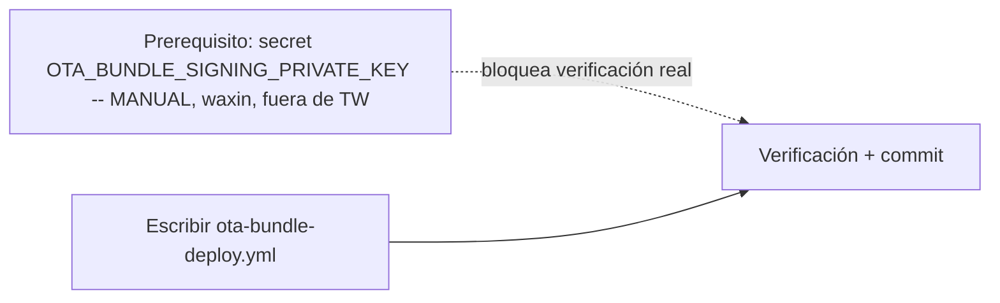

# Plan: TR-14 — Pipeline CI para el canal OTA parcial (bundles JS)

## TL;DR

Un solo archivo nuevo, `.github/workflows/ota-bundle-deploy.yml`: build+sign del
bundle JS vía `build-bundle.ts pack`, trigger dual (path-filter en push a `main`
+ `workflow_dispatch` con override de ventana de versión), verificación del
contrato del manifest, y publish al hub **manual** (incremento (a) del TR,
confirmado con evidencia nueva — ver abajo). Cero cambios a los pipelines
nativos, cero cambios a `desktop-release-hub`, cero código de auth nuevo.

**Dos correcciones al estado que asumía el TR** (verificadas contra código real,
no releídas de memoria):

1. **El bug 2.1 del hub YA ESTÁ ARREGLADO** — el TR pedía verificarlo "al
   ejecutar" sin asumir nada. Confirmado: `desktop-release-hub` commit
   `09cfa28` (`fix(server): maxNativeVersion pelada es cota superior inclusive`)
   + `bcda900` (`hardening del upload`, firma ed25519 + rechazo `||` +
   `index.html`). `withinWindow()` en `bundle.service.ts:55-71` usa `semver.lte`
   para una cota pelada, exactamente la regla del cliente. Verificado con un
   test diferencial de 14 casos documentado en
   `desktop-release-hub/docs/handoffs/smoke-coordinacion.md:120-131`. Esto NO
   cambia la recomendación de auth (ver punto 2) pero sí significa que el hub
   de producción ya no es un obstáculo técnico para publicar bundles reales
   manualmente — solo falta el mecanismo de auth para automatizar el publish.
2. **La recomendación (a) del TR sigue siendo la correcta, pero por el motivo
   correcto ya no es "el hub tiene un bug conocido"**, sino que el gap de auth
   CI→hub (mismo que TR-12 documentó) sigue abierto: `adminGuard`
   (`desktop-release-hub/apps/server/src/lib/auth-guard.ts:29-37`) solo
   comprueba `ctx.isAuthenticated` (sesión Pocket ID OIDC), y el análisis de
   TR-12 (`§Contexto verificado`, reusado aquí sin rehacer) ya confirmó que la
   tabla `apiKeys` existe en el schema pero cero código la consume — ningún
   endpoint de issuance, ningún middleware que lea `Authorization: Bearer
   <apikey>`. `POST /api/admin/projects/:slug/bundles`
   (`admin/bundles.ts:133-319`) usa el mismo `adminGuard` que
   `admin/releases.ts` — mismo gap exacto, sin excepción para bundles.

## DAG de milestones



Solo 2 milestones de TW — un único archivo nuevo, sin dependencias cruzadas de
código (no toca `src/`, no toca `scripts/`, no toca los workflows nativos). Forzar
una tercera milestone artificial dividiría un mismo archivo en cortes sin valor
de paralelización real.

## Contexto verificado

### El empaquetador — flags reales, no inventados

`scripts/build-bundle.ts pack` (leído completo):

- `--min <semver>` y `--max <semver|rango>` **obligatorios** (`arg('min')`,
  `arg('max')`, líneas 106-110) — fail-fast si faltan.
- `--build` (línea 120): corre `bunx vite build` (NO `bun run build`, NO
  incluye `tsgo --noEmit`). El workflow nuevo NO usa este flag — construye el
  frontend en un step separado con `bun run build` para heredar el typecheck
  (ver razón abajo) y llama a `pack` sin `--build`.
- `--dist <dir>` (línea 118): default `dist` — no hace falta pasarlo si el
  build ya dejó `dist/index.html` en su sitio (línea 126 lo exige o falla).
- `--version <id>` (línea 130): si se omite, `nextBundleVersion()` (líneas
  83-98) calcula `YYYY.MM.DD-N` mirando lo que ya exista en `releases/bundles/`
  **en disco**. En un checkout fresco de CI ese directorio no existe nunca
  (gitignored, `.gitignore:63`) → **siempre devolvería `-1`**, con lo que dos
  pushes el mismo día colisionarían en el mismo `bundleVersion` al intentar
  publicarlos (409 `BundleAlreadyExists`, `admin/bundles.ts:280-286`, unique
  violation real). El workflow pasa `--version` explícito construido con
  `github.run_number` (monotónico, único por run) para evitar esto — ver M1.
- Requiere el binario `zip` en PATH (línea 114-116, `fail()` explícito si
  falta) — parte del toolset por defecto de `ubuntu-latest` (no se instala
  aparte; si algún día deja de estarlo, el paso falla con el mensaje propio
  del script, no en silencio).
- Salida: `releases/bundles/<version>/{bundle.zip,manifest.json}` — el zip se
  crea con `cd dist && zip -r`, así que `index.html` queda en la raíz del
  archivo (línea 135-138, comentario explícito en el propio script).

### Clave de firma — ya generada, gitignored, secret de CI todavía no existe

- `tauri-keys/ota-bundle.key` existe localmente (`ls -la` confirma, 119 bytes,
  generada 2026-08-21 01:53) — PEM PKCS8 sin contraseña (`keygen()`,
  líneas 58-63, ningún `TAURI_SIGNING_PRIVATE_KEY_PASSWORD`-equivalente en
  este flujo, es una clave ed25519 propia, no la minisign de Tauri).
- `gh secret list --repo MKS2508/tpv-el-haido2` confirma que **solo** existen
  `TAURI_SIGNING_PRIVATE_KEY` y `TAURI_SIGNING_PRIVATE_KEY_PASSWORD` — el
  secret para esta clave (`OTA_BUNDLE_SIGNING_PRIVATE_KEY`, nombre elegido
  para este plan) **no existe todavía**. Es un prerequisito manual real, no
  una tarea del executor — el decomposer/executor no tiene ni debe tener
  acceso al contenido de la clave privada (regla anti-leak).
- `src-tauri/ota-bundle-pubkey.txt` (versionada) contiene
  `xIK/I9Xm75KrqnvGWRmYhYM3augM9oRLq70cdcqHYMc=`, que coincide byte a byte con
  la pública documentada en
  `desktop-release-hub/docs/handoffs/ota-bundles-js-hub-side.md:167` y en
  `smoke-coordinacion.md:44` — confirma que la clave local es la misma que el
  hub ya tiene cargada en `projects.bundle_pubkey` del proyecto `haido`. **No
  se regenera nada** (constraint del TR).

### Por qué el build usa `bun run build` y no `bunx vite build`

`src-tauri/tauri.conf.json:9` — `"beforeBuildCommand": "bun run build"` — el
pipeline nativo (`tauri build`) YA typechequea (`tsgo --noEmit && vite build`,
`package.json` script `build`) antes de bundlear. Para que el canal OTA no
publique un bundle que el canal nativo hubiera rechazado por un error de tipos,
el workflow nuevo usa el mismo `bun run build`, no `bunx vite build` a secas —
paridad con el pipeline existente, cero pasos nuevos añadidos (no hace falta un
step de `typecheck` aparte, ya viene incluido).

### Path filter — qué toca `dist/` de verdad

Vite (`vite.config.ts`) resuelve `@/` a `./src`, sirve `index.html` de la raíz
y `public/**` como estáticos. Nada bajo `src-tauri/**` ni `apps/**`
(license-server, haidodocs son subproyectos independientes) entra en el bundle
JS del TPV. Patrón de trigger:

```
src/**, public/**, index.html, vite.config.ts, tsconfig.json,
tsconfig.node.json, package.json, bun.lock
```

### Pipelines nativos — NO tienen path filter hoy (evidencia para la decisión de no tocarlos)

`.github/workflows/linux-x64-deploy.yml:3-7` y `linux-arm64-deploy.yml:3-7`:
`on: push: branches: [main]` **sin `paths:`** — disparan en CUALQUIER push a
`main`, JS-only incluido, desde antes de este TR. Este plan NO empeora ni
mejora ese coste de CI (ver `## Riesgos`, no se toca ninguno de los dos
archivos).

### Endpoint admin de bundles — contrato de subida confirmado en código real

`desktop-release-hub/apps/server/src/routes/admin/bundles.ts:133-319`
(`POST /api/admin/projects/:slug/bundles`, multipart): campos requeridos
`bundleVersion`, `minNativeVersion`, `maxNativeVersion`, `signature`, `bundle`
(fichero), `notes` opcional. Valida `validNativeWindowBounds` (rechaza `||`),
verifica firma ed25519 contra `project.bundlePubkey` (`bundle.service.ts:80-111`),
verifica `index.html` en la raíz del zip (`zipHasRootIndexHtml`), recalcula el
hash. Bajo `{ beforeHandle: adminGuard }` — mismo guard de sesión que el resto
de `/api/admin/*`, sin excepción para bundles. Esto confirma que **cualquier**
automatización de publish real necesita resolver el mismo gap de auth que
TR-12, no uno nuevo específico de bundles.

## Prerequisito (manual, waxin, fuera de las milestones de TW)

Bloquea el cierre real de M2 (el workflow puede escribirse sin esto, pero no
puede verificarse end-to-end en CI real sin el secret).

```bash
# Desde el privado ya generado, sin capas de quoting intermedias
# (mismo patrón que TR-12 R7 para evitar corromper el contenido)
gh secret set OTA_BUNDLE_SIGNING_PRIVATE_KEY --repo MKS2508/tpv-el-haido2 \
  < tauri-keys/ota-bundle.key

gh secret list --repo MKS2508/tpv-el-haido2 | grep OTA_BUNDLE_SIGNING_PRIVATE_KEY
```

## M1 — Escribir `.github/workflows/ota-bundle-deploy.yml`

### Cambios

- `.github/workflows/ota-bundle-deploy.yml` — **new**:

```yaml
name: 📦 OTA Bundle (JS partial channel)

on:
  push:
    branches: [main]
    paths:
      - 'src/**'
      - 'public/**'
      - 'index.html'
      - 'vite.config.ts'
      - 'tsconfig.json'
      - 'tsconfig.node.json'
      - 'package.json'
      - 'bun.lock'
  workflow_dispatch:
    inputs:
      min_native_version:
        description: 'minNativeVersion override (default: src-tauri/tauri.conf.json version)'
        required: false
        type: string
      max_native_version:
        description: 'maxNativeVersion override (default: same as min)'
        required: false
        type: string

jobs:
  build-ota-bundle:
    name: Build + sign OTA bundle
    runs-on: ubuntu-latest
    steps:
      - name: Checkout
        uses: actions/checkout@v7

      - name: Setup Bun
        uses: oven-sh/setup-bun@v2
        with:
          bun-version: latest

      - name: Install dependencies
        run: bun install --frozen-lockfile

      - name: Build frontend (typecheck + vite build)
        run: bun run build

      - name: Restore OTA signing key
        env:
          OTA_KEY: ${{ secrets.OTA_BUNDLE_SIGNING_PRIVATE_KEY }}
        run: |
          [ -n "$OTA_KEY" ] || { echo "::error::secret OTA_BUNDLE_SIGNING_PRIVATE_KEY no seteado"; exit 1; }
          mkdir -p tauri-keys
          printf '%s' "$OTA_KEY" > tauri-keys/ota-bundle.key
          chmod 600 tauri-keys/ota-bundle.key

      - name: Resolve version window + bundle id
        id: meta
        run: |
          DEFAULT_VERSION=$(jq -r '.version' src-tauri/tauri.conf.json)
          MIN="${{ inputs.min_native_version }}"
          MAX="${{ inputs.max_native_version }}"
          echo "min=${MIN:-$DEFAULT_VERSION}" >> "$GITHUB_OUTPUT"
          echo "max=${MAX:-$DEFAULT_VERSION}" >> "$GITHUB_OUTPUT"
          echo "version=$(date -u +%Y.%m.%d)-${{ github.run_number }}" >> "$GITHUB_OUTPUT"

      - name: Pack + sign bundle
        run: |
          bun run scripts/build-bundle.ts pack \
            --min "${{ steps.meta.outputs.min }}" \
            --max "${{ steps.meta.outputs.max }}" \
            --version "${{ steps.meta.outputs.version }}"

      - name: Verify contract (index.html root, manifest shape)
        run: |
          BUNDLE_DIR="releases/bundles/${{ steps.meta.outputs.version }}"
          MANIFEST="$BUNDLE_DIR/manifest.json"
          test -f "$MANIFEST" || { echo "::error::manifest.json not found in $BUNDLE_DIR"; exit 1; }
          unzip -l "$BUNDLE_DIR/bundle.zip" | awk '{print $NF}' | grep -qx 'index.html' \
            || { echo "::error::bundle.zip missing root index.html"; exit 1; }
          jq -e '.bundleVersion | test("^[0-9]{4}\\.[0-9]{2}\\.[0-9]{2}-[0-9]+$")' "$MANIFEST" > /dev/null \
            || { echo "::error::bundleVersion does not match contract"; exit 1; }
          jq -e '.hash | test("^sha256:[0-9a-f]{64}$")' "$MANIFEST" > /dev/null \
            || { echo "::error::hash does not match contract"; exit 1; }
          SIG_LEN=$(jq -r '.signature' "$MANIFEST" | base64 -d | wc -c)
          [ "$SIG_LEN" -eq 64 ] || { echo "::error::signature is $SIG_LEN bytes, expected 64"; exit 1; }
          echo "Contract OK: $MANIFEST"

      - name: Verify ed25519 signature against embedded pubkey
        run: |
          bun -e "
          (async () => {
            const fs = require('fs');
            const dir = 'releases/bundles/${{ steps.meta.outputs.version }}';
            const manifest = JSON.parse(fs.readFileSync(dir + '/manifest.json', 'utf-8'));
            const pubkeyB64 = fs.readFileSync('src-tauri/ota-bundle-pubkey.txt', 'utf-8').trim();
            const zipBytes = fs.readFileSync(dir + '/bundle.zip');
            const key = await crypto.subtle.importKey('raw', Buffer.from(pubkeyB64, 'base64'), { name: 'Ed25519' }, false, ['verify']);
            const ok = await crypto.subtle.verify('Ed25519', key, Buffer.from(manifest.signature, 'base64'), zipBytes);
            if (!ok) { console.error('ed25519 verification FAILED'); process.exit(1); }
            console.log('ed25519 verification OK');
          })();
          "

      - name: Upload artifact
        uses: actions/upload-artifact@v7
        with:
          name: ota-bundle-${{ steps.meta.outputs.version }}
          path: releases/bundles/${{ steps.meta.outputs.version }}/**
          if-no-files-found: error
          retention-days: 30

      - name: Publish instructions (manual interim -- incremento (a) de TR-14)
        run: |
          {
            echo "## Publish al hub (manual, interim -- incremento (a) de TR-14)"
            echo ""
            echo "1. Descargar el artifact \`ota-bundle-${{ steps.meta.outputs.version }}\` de este run."
            echo "2. Confirmar que el proyecto \`haido\` tiene \`bundle_pubkey\` cargada en el hub."
            echo "3. Subir a mano: POST /api/admin/projects/haido/bundles (multipart:"
            echo "   bundleVersion, minNativeVersion, maxNativeVersion, signature, bundle)."
            echo "   Requiere sesion Pocket ID en el navegador -- release.ts no cubre bundles todavia."
          } >> "$GITHUB_STEP_SUMMARY"
```

### Interfaces

```diff-signatures
+ .github/workflows/ota-bundle-deploy.yml   # nuevo, sin equivalente previo
```

### Decisiones de diseño documentadas (no re-litigar sin evidencia nueva)

**Ventana de versión por defecto — exact-pin, recomendado**: `--min` = `--max`
= la versión de `src-tauri/tauri.conf.json` en el momento del build (misma
fuente que usa el binario nativo, `package.json`/`tauri.conf.json:4` ambos en
`0.1.1` hoy). Coherente con el invariante propio del cliente documentado en
`docs/ota/canal-parcial.md:91-93` ("un cambio de binario nativo invalida el
slot") — un bundle pinneado a una sola versión nativa nunca se sirve a un
binario con el que no se probó. Alternativa descartada por defecto (rango de
minor tipo `X.Y.x`): asumiría sin verificarlo que ningún patch nativo dentro
del mismo minor rompe una firma de comando Rust que el JS invoca — no hay
evidencia de que eso sea cierto hoy. **Override disponible** vía los dos
inputs de `workflow_dispatch` cuando se sepa con certeza que un rango más
amplio es seguro (ej. tras verificar manualmente que un rango de parches no
tocó ninguna firma de comando).

**No tocar los workflows nativos — recomendado**: ambos ya disparan en
cualquier push a `main` sin `paths:` (confirmado arriba), así que este TR no
introduce coste de CI nuevo — el coste de rebuilds nativos en pushes JS-only
ya existía. Alternativa (espejo `paths-ignore` en los 2 workflows nativos para
saltar el build cuando el diff es 100% JS) reduciría ese coste preexistente,
pero: (a) toca 2 archivos fuera del footprint de este TR, (b) el filtro
`paths-ignore` de GitHub Actions es "salta si TODOS los ficheros cambiados
están ignorados" — en un push mixto (JS + nativo a la vez) el build nativo
igual dispara, así que la ganancia real es solo para pushes 100% JS puros, y
(c) un patrón mal escrito saltaría silenciosamente un build nativo real que sí
hacía falta — riesgo mayor que el ahorro de CI minutes. Queda como mejora
futura opcional, no parte de este plan.

### Verify

```bash
test -f .github/workflows/ota-bundle-deploy.yml && echo OK-created
grep -c "linux-x64-deploy.yml\|linux-arm64-deploy.yml" .github/workflows/ota-bundle-deploy.yml   # 0, ningún cambio a los nativos
```

## M2 — Verificación + commit

**role: canonical**

### Pasos

1. **Dry-run local** de los mismos comandos que correrá CI, sin tocar GitHub
   Actions (usa la clave privada ya presente en disco, `tauri-keys/ota-bundle.key`):
   ```bash
   bun install --frozen-lockfile
   bun run build
   bun run scripts/build-bundle.ts pack \
     --min "$(jq -r '.version' src-tauri/tauri.conf.json)" \
     --max "$(jq -r '.version' src-tauri/tauri.conf.json)" \
     --version "$(date -u +%Y.%m.%d)-99"
   ls releases/bundles/*-99/
   cat releases/bundles/*-99/manifest.json
   ```
   Confirmar `index.html` en la raíz del zip y que el `signature` decodifica a
   64 bytes (mismos checks que el step "Verify contract" del workflow).
2. **Opcional, cero costo (no requiere runner)**: si `actionlint` está
   disponible localmente (`brew install actionlint`), correr
   `actionlint .github/workflows/ota-bundle-deploy.yml` para atrapar errores
   de sintaxis/expresiones antes de empujar el YAML.
3. Commit + push a `main` — el propio archivo `.github/workflows/*.yml` no
   matchea el `paths:` del workflow nuevo (que solo mira `src/**` y afines),
   así que este push **no** dispara `ota-bundle-deploy.yml` automáticamente
   (esperado). Los workflows nativos SÍ dispararán (no tienen `paths:`, ver
   `## Contexto verificado`) — es el comportamiento preexistente del repo, no
   algo nuevo que introduzca este commit.
4. **Verificación real en CI, barata (sin Rust, segundos)**: requiere el
   Prerequisito (secret) cerrado.
   ```bash
   gh workflow run ota-bundle-deploy.yml --repo MKS2508/tpv-el-haido2
   gh run watch --repo MKS2508/tpv-el-haido2
   gh run list --workflow=ota-bundle-deploy.yml --repo MKS2508/tpv-el-haido2 --limit 1
   # ESPERADO: conclusion "success", step "Verify ed25519 signature" en verde
   ```
5. Confirmar el artifact subido:
   ```bash
   gh api repos/MKS2508/tpv-el-haido2/actions/artifacts --jq '.artifacts[0].name'
   # ESPERADO: ota-bundle-<fecha>-<run_number>
   ```
6. Grep de prohibiciones:
   ```bash
   grep -rn "softprops/action-gh-release\|releases/download\|latest.json" \
     .github/workflows/ota-bundle-deploy.yml
   # ESPERADO: sin output
   diff <(git show HEAD~1:.github/workflows/linux-x64-deploy.yml 2>/dev/null || cat .github/workflows/linux-x64-deploy.yml) \
        .github/workflows/linux-x64-deploy.yml
   # ESPERADO: sin diferencias -- confirma que este commit no tocó el workflow nativo
   ```

### Commit sugerido

```
feat-phase(unscoped): OTA bundle CI pipeline (build+sign+artifact) [#TR-14]

- New .github/workflows/ota-bundle-deploy.yml: dual trigger (paths filter on
  src/**/public/**/package.json push to main + workflow_dispatch with
  min/max native version override), typecheck+build via `bun run build`,
  pack+sign via build-bundle.ts pack, contract verification (root
  index.html, bundleVersion/hash/signature shape, ed25519 verify against
  embedded pubkey), upload as GitHub Actions artifact (no auto-publish to
  hub -- auth CI->hub gap same as TR-12, publish stays manual per TR-14
  option (a))
- Confirms desktop-release-hub bug 2.1 (maxNativeVersion bare bound) is
  already fixed (09cfa28, bcda900) -- no longer blocks manual publish
```

### Verify

- `gh run list --workflow=ota-bundle-deploy.yml --limit 1` → `success`.
- Artifact `ota-bundle-<version>` descargable y contiene `bundle.zip` +
  `manifest.json` válidos contra el contrato.
- Cero matches del grep de prohibiciones (paso 6).

## Files

```files-tree
.github/workflows/
  ota-bundle-deploy.yml   [new]
```

## Milestones (claude tasks)

Una `TaskCreate` por milestone. El executor las crea todas upfront con
metadata + `addBlockedBy`, luego itera `TaskUpdate(in_progress|completed)` en
orden topológico. El Prerequisito (secret) NO es una milestone de esta tabla
— es una acción manual de waxin fuera del executor automatizado; M2 debe
tratarse como bloqueada para su cierre real (paso 4 en adelante) hasta que
esté confirmado.

| # | Subject | Estimate | addBlockedBy | role |
|---|---|---|---|---|
| M1 | Escribir ota-bundle-deploy.yml (trigger dual + build+sign+verify+artifact) | 45m | — | — |
| M2 | Verificación (dry-run local + workflow_dispatch real) + commit | 30m | M1 | **canonical** |

**Metadata común a todas las milestones**:
- `roadmapItemId: "TR-14"`
- `phase: "unscoped"`
- `tags: ["TR-14", "milestone:M<n>", "phase:unscoped", "category:feature"]`

**Metadata específica de la canonical (M2)**:
- `role: "canonical"`

## Riesgos / blockers

| # | Riesgo | Mitigación |
|---|---|---|
| R1 | Secret `OTA_BUNDLE_SIGNING_PRIVATE_KEY` no existe todavía en GitHub (`gh secret list` confirmado) | Prerequisito manual explícito arriba, M2 gateado a que esté cerrado |
| R2 | `package.json` en el `paths:` filter: un bump de versión nativa (ej. `0.1.1` → `0.2.0`) dispara automáticamente un bundle pinneado a la versión NUEVA, antes de que el binario nativo correspondiente esté publicado/instalado en ningún dispositivo | Inofensivo — el workflow solo produce un artifact, el publish real sigue siendo manual (incremento (a)); documentado, no se excluye `package.json` del filtro porque también debe disparar cuando cambian dependencias JS reales |
| R3 | `zip`/`unzip`/`jq` se asumen preinstalados en `ubuntu-latest` (parte del toolset estándar de `runner-images`, no se instalan aparte) | Si algún día falta uno, el step correspondiente falla con mensaje explícito (`build-bundle.ts` ya tiene su propio `fail()` para `zip`) — no es un fallo silencioso; fallback documentado: añadir `sudo apt-get install -y zip unzip jq` al step "Install dependencies" si un run real lo confirma necesario |
| R4 | Colisión de `bundleVersion` en checkouts frescos de CI (`nextBundleVersion()` siempre devolvería `-1` sin estado previo en disco) | Resuelto en diseño: `--version` explícito con `github.run_number` (M1, step "Resolve version window + bundle id") — monotónico y único por run, sigue matcheando el contrato `^\d{4}\.\d{2}\.\d{2}-\d+$` |
| R5 | Los workflows nativos (`linux-x64-deploy.yml`/`linux-arm64-deploy.yml`) disparan en CUALQUIER push a `main`, incluido el commit de este propio TR (no tienen `paths:`) — coste de CI preexistente, no introducido por este plan | Documentado como decisión explícita de no tocarlos (ver M1, "Decisiones de diseño") — mejora futura opcional si waxin decide que vale la pena el `paths-ignore` espejo |
| R6 | Auth CI→hub sigue sin resolver (mismo gap que TR-12: `adminGuard` solo sesión OIDC, `apiKeys` sin consumidores) | Esperado y aceptado por el TR — publish real queda manual hasta que exista un TR de auth service-to-service separado (ya seedeado en TR-12, no se re-documenta aquí) |

## Prohibiciones

- **NO** tocar `linux-x64-deploy.yml`/`linux-arm64-deploy.yml`.
- **NO** implementar auth service-to-service (opción b) ni token PKCE cacheado
  como secret (opción c) — quedan documentadas como alternativas futuras, no
  se ejecutan en este TR.
- **NO** tocar `desktop-release-hub` en absoluto (repo externo).
- **NO** regenerar `tauri-keys/ota-bundle.key` ni `src-tauri/ota-bundle-pubkey.txt`.
- **NO** tocar `docs/ota/canal-parcial.md` ni
  `docs/handoffs/ota-bundles-js-hub-side.md` del hub (documentación de
  contrato ya estable, fuera del footprint de este TR).
- **NO** tocar `roadmap.spec.yml` ni `docs/progress-log.md` — doc sync
  diferido, mismo patrón que el resto de la sesión.
- **NO** añadir trigger `pull_request` al workflow nuevo (mismo motivo que
  TR-12 R5: PRs de forks en un repo público no reciben `secrets.*`, un always-
  sign en `pull_request` rompería en cualquier PR externo).

## Verificación

```bash
# Sintaxis (opcional, cero costo)
actionlint .github/workflows/ota-bundle-deploy.yml

# Dry-run local (M2 paso 1) -- sin tocar CI
bun run build && bun run scripts/build-bundle.ts pack \
  --min "$(jq -r '.version' src-tauri/tauri.conf.json)" \
  --max "$(jq -r '.version' src-tauri/tauri.conf.json)" \
  --version "$(date -u +%Y.%m.%d)-99"

# CI real, barato (sin Rust)
gh workflow run ota-bundle-deploy.yml --repo MKS2508/tpv-el-haido2
gh run watch --repo MKS2508/tpv-el-haido2

# Prohibiciones
grep -rln "softprops/action-gh-release\|releases/download\|latest.json" .github/workflows/ota-bundle-deploy.yml
# ESPERADO: sin output
```

## Git context

- Rama sugerida: `main`
  (repo sin feature branches — confirmado en planes previos TR-02/03/07/11/12,
  todos con `suggestedBranch: main`)
- Commit prefix: `feat-phase(unscoped)` (TR-14, igual que TR-12, no tiene
  `phase` numerada en `roadmap.spec.yml` todavía — no se inventa un número)
- Tag para hook: `[#TR-14]` — incluir en TODOS los commits de este task para
  que el hook `post-tool-use-bash` linkee el commit a la UDA `gitcommit`
- Estrategia: `single` (un commit al final, M2 canonical)

> El hook `post-tool-use-bash` de `@mks-agentics/task-sync` lee el tag
> `[#TR-14]` del mensaje de commit y popula las UDAs `gitcommit` +
> `gitcommits` + `gitcommitscount` en TW (si dual mode activo en el repo). Si
> NO hay TW (FS only), el tag es noop — el commit sigue siendo válido.
